# 테스트 대상을 Mocking

안녕하세요? Spy의 활용 사례 1번째를 소개드립니다.
모든 코드는 [Github](https://github.com/jojoldu/blog-code/tree/master/mockito-spy-usages)에 있기 때문에 함께 보시면 더 이해하기 쉬우실 것 같습니다.  
(공부한 내용을 정리하는 [Github](https://github.com/jojoldu/blog-code)와 세미나+책 후기를 정리하는 [Github](https://github.com/jojoldu/review), 이 모든 내용을 담고 있는 [블로그](http://jojoldu.tistory.com/)가 있습니다. )<br/>

이전 포스팅 [SpringBoot @MockBean, @SpyBean 소개](http://jojoldu.tistory.com/226) 을 보신분들께서 Mock은 어디에 써야할지 알겠는데, Spy는 언제 써야할지 감이 잡히지 않는다는 이야기를 해주셨습니다.  
그래서 어떻게 하면 좋을까 고민하다가 마침 회사 업무중에 적절한 사례를 찾게 되어 정리하게 되었습니다.  

## 상황

기본적인 프로젝트 구성은 SpringBoot에서 JUnit, Mockito, Spock을 모두 사용하겠습니다.  
사용할 프로젝트 코드들은 아래와 같습니다.

```java
@SpringBootApplication
public class Application {

	@Bean
	public RestTemplate restTemplate() {
		return new RestTemplate();
	}

	public static void main(String[] args) {
		SpringApplication.run(Application.class, args);
	}
}

public class EmptyFieldException extends RuntimeException {
}

public class PayFailException extends RuntimeException {
    public PayFailException(String message) {
        super(message);
    }
}
```

그리고 오늘의 문제가 될 2개의 클래스들입니다.

```java
@Getter
@NoArgsConstructor
public class RequestDto {

    private String name;
    private String serviceNo;

    public void verifyEmptyField(){
        if(StringUtils.isEmpty(this.name) || StringUtils.isEmpty(this.serviceNo)){
            throw new EmptyFieldException();
        }
    }
}
```

실제 테스트 대상인 Dto와 서비스 코드입니다.

```java
@Service
@AllArgsConstructor
public class CustomerService {

    public static final String ALARM_URL = "http://alarm.com";
    public static final String PAY_URL = "http://pay.com";

    private RestTemplate restTemplate;

    @Transactional
    public void pay(RequestDto requestDto){
        try{
            restTemplate.postForEntity(PAY_URL, requestDto, String.class);
        } catch (RestClientException e){
            alarm(requestDto);
            throw new PayFailException("결제가 실패하였습니다.");
        }
    }

    void alarm(RequestDto requestDto) {
        requestDto.verifyEmptyField();
        restTemplate.postForEntity(ALARM_URL, requestDto, String.class);
    }
}
```

오늘 테스트는 ```CustomerService.pay()```메소드에서 restTemplate 통신에 문제가 발생하여 ```RestClientException```이 발생하면 catch 하여 ```PayFailException```이 throw 되는지 검증하는 것입니다.  
  
자 그럼 한번 간단하게 테스트를 작성해보겠습니다.

### 테스트 코드의 문제

이걸 테스트하기 위해 Junit + Mockito로 테스트 코드를 작성해보겠습니다.  
restTemplate을 실제로 쏘는게 아니라, ```postForEntity```을 사용하면 ```RestClientException```을 발생하도록 하면 되겠죠?

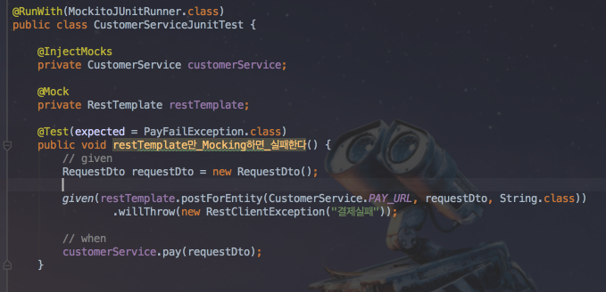

보시는 것처럼 ```willThrow```를 사용하여 Mocking 하였습니다.  
이 테스트 코드를 실행하겠습니다.

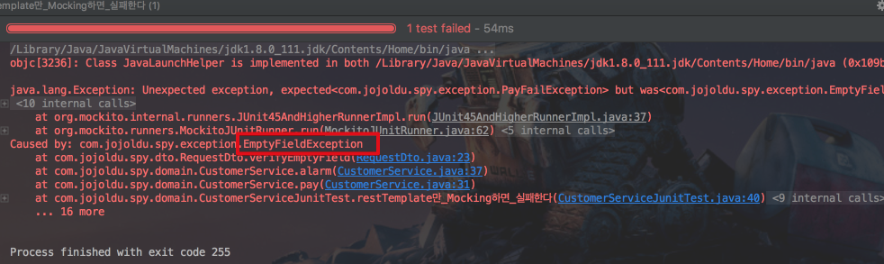

앗?  
 ```EmptyFieldException```이 발생하여 테스트가 실패했습니다.  
왜 이런 오류가 발생했나 서비스코드를 다시 확인하겠습니다.

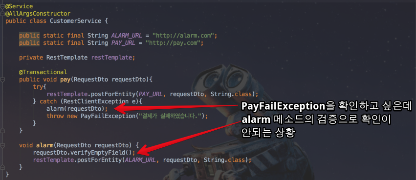

 ```RestClientException```이 발생하면 ```throw new PayFailException```이 전달되기전 ```alarm``` 메소드가 실행되는데, 이때 ```alarm``` 메소드에서 먼저 다른 에러가 발생한 것입니다.  

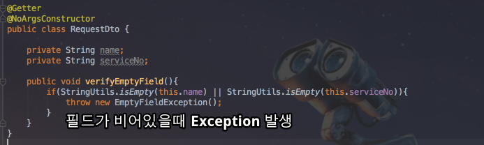

그래서 다시 이번엔 ```CustomerService```의 ```alarm``` 메소드를 Mocking 하여 호출시 아무런 액션도 하지 않도록 하겠습니다.

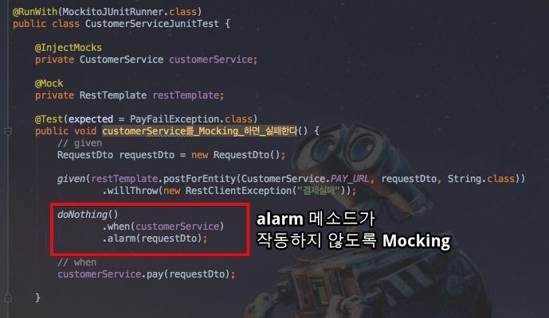

그리고 다시 테스트를 실행해보겠습니다.

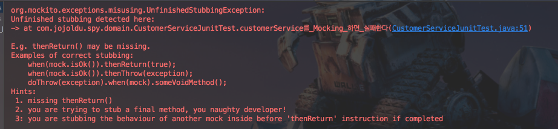

이번에도 또! 실패했습니다.  
에러 내용을 보시면 애초에 ```CustomerService.alarm```를 Mocking 못한다는 것을 알 수 있습니다.  
이제 어떻게 해야할까요? 

[[ad]]

## 해결

결국은 테스트 대상인 ```CustomerService.pay```를 온전히 테스트 하기 위해 **테스트 대상의 다른 메소드를 Mocking** 해야하는 상황입니다.  
즉, **테스트 대상의 일부분만 Mocking** 하는 것입니다.  
이 문장이 조금 친숙하지 않으신가요?  
지정한 기능들만 Mocking 하고, 나머지는 기존 기능 그대로 사용하는 방법  
바로 ```Spy``` 입니다.  
Spy를 사용하면 우리가 원하던 부분 Mocking이 가능합니다.  
각 테스트 프레임워크별로 코드를 작성하겠습니다.

### 1. Mockito+Junit

먼저 기존의 사용되었던 JUnit + Mockito 조합으로 테스트 코드를 작성하겠습니다.


기존 테스트 코드에서 ```@Spy```만 추가하시면 됩니다.  

> ```@InjectMocks```와 ```@Spy```는 같이 사용할 수 있습니다.

자 그럼 테스트를 실행해보시면!

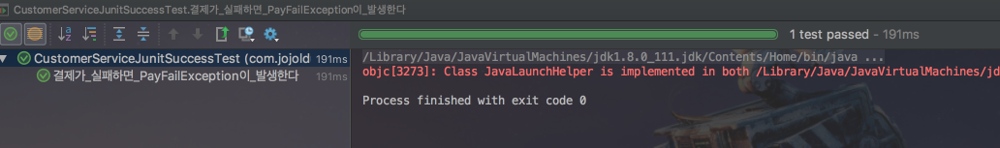

테스트가 잘 수행되었습니다!

### 2. Spock

두번째로는 Spock을 사용해서 테스트 코드를 작성하겠습니다.  
순수하게 Spock만 사용하여 Spring 의존성을 전혀 사용하지 않습니다.  
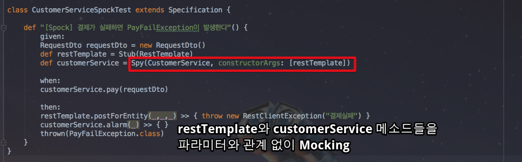

 ```Spy(CustomerService, constructorArgs: [restTemplate])```로 ```restTemplate```을 Spy CustomerService에 생성자 인잭션을 시켰습니다.  
  
> Spock은 Mockito의 ```any()```와 같이 파라미터와 무관하게 Mocking 할때는 ```_```를 사용합니다.

 ```customerService.alarm```은 아무런 행위도 하지 않도록 Mocking하기 위해 반환 형태를 공란```{}```으로 두었습니다.  
  
이 테스트 코드 역시!

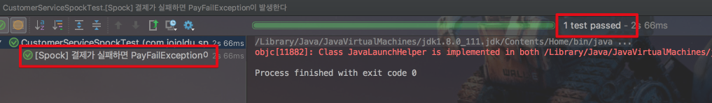

실패없이 통과하였습니다.

### 3. SpringBoot + Spock
 
마지막으로 SpringBoot 환경에서 사용하는 방법입니다.  
 ```@SpyBean```을 사용하면 굳이 ```@Spy```, ```@InjectMocks```을 사용할 필요가 없습니다.  
 ```@SpyBean```, ```@MockBean```을 사용할 것이기에 Mocking은 Mockito를 사용합니다.

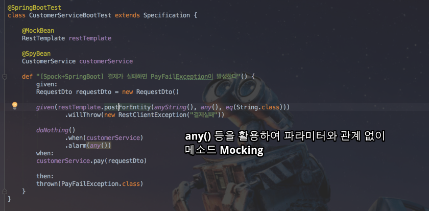

실행할 메소드들의 값은 꼭 맞춰야할 필요가 없기 때문에 ```any()```를 사용하여 파라미터 관계없이 Mocking 하였습니다.  
  
자 그럼 마지막 테스트도 실행하면!

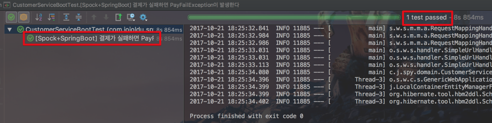

잘 통과함을 확인하였습니다

## 마무리

이처럼 테스트 대상의 몇몇 기능을 다시 Mocking 해야할 경우엔 ```Spy```를 사용하시면 됩니다.  
명확하게 메소드들이 분리되어 있어 테스트 하기가 쉽다면 좋겠지만, 현실은 수많은 레거시 코드들로 인해서 테스트 대상을 격리시키기가 참 어렵습니다.  
 ```Spy```를 사용하면 이런 문제점들을 해결하는데 도움이 될 것이라 생각합니다.  
또 다른 사례가 발견되면 정리해서 공유드리겠습니다.  
끝까지 읽어주셔서 감사합니다 