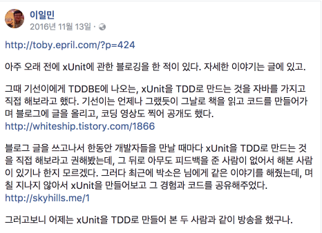
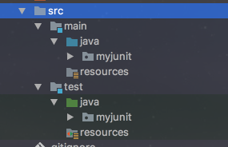
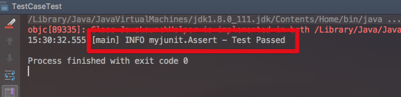
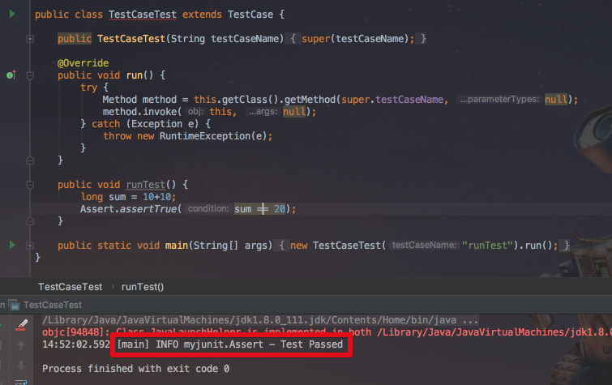
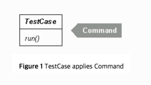
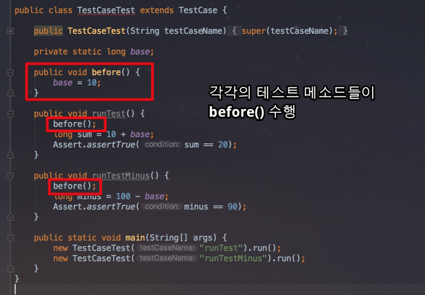
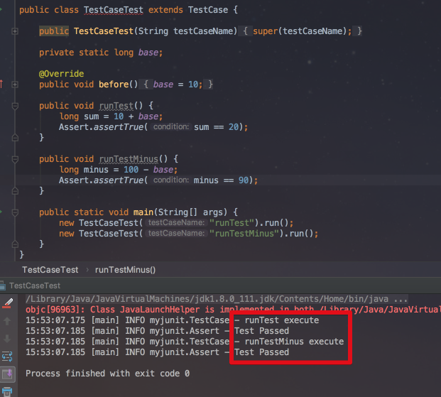
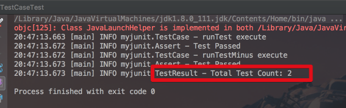

# my-junit

안녕하세요? 이번 시간엔 JUnit을 직접 만들어보는 시간을 가지려고 합니다.  
모든 코드는 [Github](https://github.com/jojoldu/blog-code/tree/master/my-junit)에 있기 때문에 함께 보시면 더 이해하기 쉬우실 것 같습니다.  
(공부한 내용을 정리하는 [Github](https://github.com/jojoldu/blog-code)와 세미나+책 후기를 정리하는 [Github](https://github.com/jojoldu/review), 이 모든 내용을 담고 있는 [블로그](http://jojoldu.tistory.com/)가 있습니다. )<br/>
 

## 계기

긴 추석연휴 기간동안 미뤄둔 포스팅 예정 글들을 정리했습니다.  
3개를 연달아 처리하고 뭐가 더 남았나 에버노트를 보다가 아주 예전에 메모해놓은 일감이 있었습니다.  
바로 **나만의 XUnit 만들기**입니다.  
  
토비님께서 올리신 글을 보고 일감 등록을 했었던 기억이 떠올랐습니다.  


(원분 : [페이스북링크](https://www.facebook.com/tobyilee/posts/10208774948625630))  
  
일단 회사에서 사용하는 기술들을 익히기에 급급해 계속 미루다가 이제야 다시 봤습니다.  
장기간 휴식이 또 언제 생길지 모르니 지금 당장 시작하기로 마음먹고 진행하게 되었습니다.  
(토비님의 블로그 글을 꼭 읽어보시면 큰 도움이 되실것 같습니다.)  
  
마침 [[번역]JUnit A Cook’s Tour](https://bluepoet.me/2016/12/03/%EB%B2%88%EC%97%ADjunit-a-cooks-tour/)도 있어 참고하며 진행할 예정입니다.

## 본문

빌드툴은 Gradle을 사용할 예정입니다.  
IDE는 IntelliJ 를 사용하는데, 스프링과 같은 웹 개발이 필요한 부분이 아니기 때문에 꼭 유료버전인 Ultimate이 아니더라도 무료 버전인 Community 버전을 사용하셔도 됩니다.  
(이클립스 쓰셔도 됩니다)  
  
build.gradle은 로그 관리를 위해 2개의 의존성을 먼저 추가하고 시작하겠습니다.  

build.gradle

```gradle
dependencies {
    compile group: 'org.slf4j', name: 'slf4j-api', version: '1.7.25' // log를 위해 slf4j 추가
    compile group: 'ch.qos.logback', name: 'logback-classic', version: '1.2.3' // log를 위해 logback 추가
}
```

혹시나 logback을 처음 접하신다면 [소내기님의 logback 튜토리얼](https://sonegy.wordpress.com/category/logback/)을 참고하시면 좋습니다.  
  
기본적인 디렉토리 구조는 다음과 같습니다.



src/main/java,resources & src/test/java,resources이며 기본 패키지는 myjunit입니다.  
  
자 그럼 첫번째 테스트 코드를 작성해보겠습니다.

### 1. 첫 테스트 코드

간단하게 테스트 코드를 작성하겠습니다.  
src/test/java/myjunit에 ```TestCaseTest.java```를 생성하고 아래의 코드를 추가하겠습니다.

```java
public class TestCaseTest {

    public static void main(String[] args) {
        new TestCaseTest().runTest();
    }

    public void runTest () {
        long sum = 10+10;
        Assert.assertTrue(sum == 20);
    }
}

```

현재 JUnit이 의존성으로 등록되어있지 않기 때문에 Assert 클래스가 존재하지 않습니다.  
이 테스트 코드를 수행하기 위해 ```Assert``` 클래스와 static Method인 ```assertTrue```를 생성하겠습니다.  

```java
public class Assert {
    private static final Logger logger = LoggerFactory.getLogger(Assert.class);

    private Assert() {} // 인스턴스 생성을 막기 위해 기본생성자 private 선언

    public static void assertTrue(boolean condition) {
        if(!condition){
            throw new AssertionFailedError();
        }

        logger.info("Test Passed");
    }
}
```

slf4j logger가 의존성으로 등록되어있기 때문에 logger는 sfl4j logger를 사용합니다.  
 ```assertTrue```는 단순합니다.  
파라미터로 넘겨진 boolean 값이 ```true```이면 Test는 성공이며(```logger.info("Test Passed")```), ```false```하면 ```throw new AssertionFailedError()```를 발생하여 테스트 실패를 알립니다.  
 ```AssertionFailedError```도 존재하지 않는 클래스이니 추가 생성합니다.

```java
public class AssertionFailedError extends Error {
    public AssertionFailedError() {}
}
```

자 이렇게 구성하고 ```TestCaseTest```의 main 메소드를 다시 실행해보겠습니다.



이렇게 첫번째 테스트가 성공되었음을 확인할 수 있습니다.

### 2. TestCase

현재 구조는 **테스트 프레임워크**라고 할수는 없습니다.  
결국 각각의 테스트 케이스 단위로 요청을 나눌수 있는 구조가 되어야 합니다.  
이런 의도에 가장 어울리는 것이 [커맨드패턴](http://javacan.tistory.com/entry/6)입니다.  
  
각각의 테스트 케이스를 Command로 보고, 이를 실행하는 것은 ```run```(보통은 ```execute```를 사용) 메소드가 담당하도록 합니다.  
  
이렇게 해서 만든 ```TestCase```의 코드는 아래와 같습니다.

```java
public abstract class TestCase {

    protected String testCaseName;

    public TestCase(String testCaseName) {
        this.testCaseName = testCaseName;
    }

    public abstract void run();
}
```

각각의 TestCase는 이름을 가져야 식별가능하기 때문에 생성자에서 이를 받도록 하였습니다.  
 ```TestCase```는 그 자체로 사용하기 보다는 이를 상속한 실제 테스트 케이스 클래스들을 사용할것이기 때문에 추상 클래스(```abstract class```)로 선언하였습니다.  
  
위 ```TestCase```클래스를 사용하여 ```TestCaseTest```코드를 수정하겠습니다.  

```java
public class TestCaseTest extends TestCase {

    public TestCaseTest(String testCaseName) {
        super(testCaseName);
    }

    @Override
    public void run() {
        try {
            Method method = this.getClass().getMethod(super.testCaseName, null);
            method.invoke(this, null);
        } catch (Exception e) {
            throw new RuntimeException(e);
        }
    }

    public void runTest() {
        long sum = 10+10;
        Assert.assertTrue(sum == 20);
    }

    public static void main(String[] args) {
        new TestCaseTest("runTest").run();
    }
}
```

> 왜 TestCase의 구현체인 TestCaseTest를 new로 인스턴스 생성해서 써야하는지 의문이실수 있습니다.  
**각각의 테스트가 독립적으로 실행**하기 위해 모든 테스트 케이스는 새로운 인스턴스에서 수행되도록 하였습니다.  
  
그리고 변경한 테스트 코드도 잘 성공되는지 테스트 해보겠습니다.  



이제는 테스트 케이스 메소드들을 하나만 생성하는 것이 아니라, 여러개를 생성하고 실제 main 메소드에선 해당 메소드들의 이름만 추가하면 테스트를 실행할수 있게 되었습니다.  

실제로 ```TestCaseTest```에 테스트 메소드를 하나더 추가해보겠습니다.

```java
    ... 
    private static final Logger logger = LoggerFactory.getLogger(TestCaseTest.class);

    ... 

    @Override
    public void run() {
        try {
            logger.info("{} execute ", testCaseName); // 테스트 케이스들 구별을 위해 name 출력 코드
            Method method = this.getClass().getMethod(super.testCaseName, null);
            method.invoke(this, null);
        } catch (Exception e) {
            throw new RuntimeException(e);
        }
    }

    ...
    
    public void runTestMinus() {
        long minus = 100-10;
        Assert.assertTrue(minus == 90);
    }

    public static void main(String[] args) {
        new TestCaseTest("runTest").run();
        new TestCaseTest("runTestMinus").run();
    }
```

 ```run``` 메소드에 실행한 테스트 메소드를 확인하기 위해 메소드명을 출력하도록 ```logger```를 추가하였습니다.  
 ```runTestMinus```를 추가하여 main 메소드에서 2개의 테스트 케이스를 실행하는데 파라미터만 변경하면 실행하는것을 확인할 수 있습니다.  

이 코드를 실제로 수행해보시면!


테스트가 잘 성공됨을 알 수 있습니다.  
이 코드를 보시면서 뭔가 리팩토링 할만한게 보이시지 않나요?  
  
오버라이딩 하고 있는 ```run``` 메소드는 ```TestCase``` 클래스를 상속하는 모든 하위 클래스들이 다시 구현해야하는데, 실제로 하는 일은 공통으로 뽑아도 무방한 일입니다.  
이런 코드는 부모인 ```TestCase```가 가지는게 좀 더 좋아보입니다.  
그래서 ```run``` 메소드를 ```TestCase```로 이동시키겠습니다.

```java
public abstract class TestCase {
    
    private static final Logger logger = LoggerFactory.getLogger(TestCase.class);

    protected String testCaseName;

    public TestCase(String testCaseName) {
        this.testCaseName = testCaseName;
    }

    public void run() {
        try {
            logger.info("{} execute ", testCaseName); // 테스트 케이스들 구별을 위해 name 출력 코드
            Method method = this.getClass().getMethod(testCaseName, null);
            method.invoke(this, null);
        } catch (Exception e) {
            throw new RuntimeException(e);
        }
    }
}
```

그리고 코드를 리팩토링했으니 다시한번 기존 테스트를 실행해보겠습니다.


 ```TestCaseTest``` **코드가 대폭 다이어트 되면서도 테스트 코드는 여전히 잘 수행**되었습니다.  
리팩토링이 잘된거라 볼수있겠죠?  
  
현재까지 상황을 다이어그램으로 표기하면 아래와 같습니다.



### 3. Fixture 메소드

현재까지 제작한 ```TestCase``` 클래스와 기존에 사용하던 JUnit 기능를 비교해서 빠진 기능이 뭐가 있을까요?  
가장 먼저 떠오르는 기능은 ```Fixture``` 메소드인것 같습니다.  
용어가 조금 어려운데 저희가 흔히 사용하는 ```@Before```, ```@After```와 같이 **각각의 테스트 케이스들에게 공통적으로 수행되는 메소드**를 얘기합니다.  
  
자 예를 들어 아래와 같이 ```TestCaseTest```를 수정해보겠습니다.



JUnit이였다면 이렇게 테스트 코드를 작성하지 않겠죠?  
각각의 테스트 케이스들 앞/뒤로 혹은 **특별한 시점에 공통적으로 코드를 수행**하고 싶다면 어떻게 해야할까요?  
  
[템플릿메소드 패턴](http://jdm.kr/blog/116)은 현재 상황에 적용할 수 있는 아주 적절한 디자인패턴입니다.  
  
템플릿 메소드 패턴을 적용하여 ```TestCase```를 수정해보겠습니다.

```java
public abstract class TestCase {

    private static final Logger logger = LoggerFactory.getLogger(TestCase.class);

    protected String testCaseName;

    public TestCase(String testCaseName) {
        this.testCaseName = testCaseName;
    }

    public void run(){
        before();
        runTestCase();
        after();
    }

    protected void before() {}

    private void runTestCase() {
        try {
            logger.info("{} execute ", testCaseName); // 테스트 케이스들 구별을 위해 name 출력 코드
            Method method = this.getClass().getMethod(testCaseName, null);
            method.invoke(this, null);
        } catch (Exception e) {
            throw new RuntimeException(e);
        }
    }

    protected void after() {}
}
```

> JUnit A Cook’s Tour에서는 ```setup```, ```tearDown```이라고 표현하지만 여기선 좀더 친숙하게 before, after로 표현하겠습니다.

기존의 ```run``` 메소드를 수정하여 ```before()``` -> ```runTestCase()``` -> ```after()``` 순으로 실행되도록 구조화시켰습니다.  
  
여기서 ```before()```와 ```after()```는 추상메소드가 아닙니다.  
**일반메소드이지만 구현부분이 없이** 생성하였습니다.  
추상메소드로 구현할 경우 상속받는 클래스들에선 무조건 오버라이딩 해야하는데, 이들은 **강제로 구현해야할 대상은 아니고 선택대상**이기 때문입니다.  
  
이제 이에 맞춰 테스트 클래스인 ```TestCaseTest``` 코드를 개선하고 다시 테스트를 실행해보겠습니다.



 ```before``` 메소드가 각각의 테스트 케이스마다 수행되어 ```base``` 변수에 10이 할당되어 테스트가 성공됨을 확인할 수 있습니다.  
  
자 여기까지 상황을 다이어그램으로 표현하면 아래와 같습니다.

  

### 4. TestResult

자 이제 이번에는 테스트 결과와 관련된 기능을 추가하겠습니다.  
테스트 코드를 수행하면 전체 테스트 케이스 몇개가 수행되었으며, 이들중 몇개가 테스트가 실패하고 몇개가 성공했는지 등등의 기능이 제공됩니다.  
  
현재는 이런 테스트 결과에 대한 레포팅을 할 수 없기 때문에 이 기능을 추가해보겠습니다.  
  
여러 테스트 메소드들, Fixture 메소드등으로 결과와 관련된 데이터들을 다 수집하기에 적절한 패턴은 [Collecting Parameter 패턴](http://www.javajigi.net/display/SWD/Move+Accumulation+to+Collecting+Parameter) 입니다.  
**메서드 파라미터에 결과를 수집할 객체를 전달**하는 방식으로 구현할 예정입니다.  
수집할 테스트 결과 객체의 클래스명은 ```TestResult```로 하겠습니다.  
현재 기능은 간단하게 수행된 테스트 개수만 담도록 하겠습니다.

```java
public class TestResult {
    private static final Logger logger = LoggerFactory.getLogger(TestResult.class);
    private int runTestCount;

    public TestResult() {
        this.runTestCount = 0;
    }

    /**
     synchronized: 하나의 TestResult 인스턴스를 여러 테스트 케이스에서 사용하게 될 경우
     쓰레드 동기화 문제가 발생하므로 여기선 synchronized로 간단하게 해결합니다.
     (테스트 케이스에서만 사용하므로 실시간 성능 이슈를 고려하지 않아도 되기 때문입니다)
     */
    public synchronized void startTest() {
        this.runTestCount++;
    }

    public void printCount(){
        logger.info("Total Test Count: {}", runTestCount);
    }
}
```

 ```startTest``` 메소드엔 ```synchronized```를 사용하였습니다.  
하나의 ```TestResult``` 인스턴스에 테스트 전체 결과에 대한 정보를 담으려면 여러 테스트 케이스가 사용하게되는데, 이때
쓰레드 동기화 문제가 발생하므로 여기선 synchronized로 간단하게 해결하였습니다.
(테스트 케이스에서만 사용하므로 실시간 성능 이슈를 고려하지 않아도 되기 때문입니다)  
  
자 그러면 이제 각 테스트 케이스마다 이 TestResult를 사용하도록 ```TestCase``` 클래스를 수정해보겠습니다.

```java
public abstract class TestCase {

    ...

    public TestResult run(){
        TestResult testResult = createTestResult();
        run(testResult);

        return testResult;
    }

    public void run(TestResult testResult){
        testResult.startTest();
        before();
        runTestCase();
        after();
    }

    private TestResult createTestResult() {
        return new TestResult();
    }
    ...
}

```

기존에 있던 ```run()``` 메소드는 ```TestResult```를 파라미터로 받아, ```startTest()```를 실행하는 메소드로 수정하였습니다.  
그리고 파라미터 없는 ```run()```를 다시 생성하여 ```TestResult```를 자체적으로 인스턴스 생성해서 파라미터 **있는** ```run``` 메소드를 호출하도록 하였습니다.  
이렇게 되면 어느 테이스 케이스든 ```run```를 호출할 경우 테스트 count가 1씩 증가하는 것을 체크할 수 있게 됩니다.  
  
그럼 ```TestCaseTest``` 코드를 다시 수정해서 기능을 확인해보겠습니다!

```java
public class TestCaseTest extends TestCase {
    ...
    public static void main(String[] args) {
        TestResult testResult = new TestResult();
        new TestCaseTest("runTest").run(testResult);
        new TestCaseTest("runTestMinus").run(testResult);
        testResult.printCount();
    }
}
```

main 메소드에서 ```TestResult```를 생성해서 각각의 테스트케이스에 파라미터로 전달합니다.  
이렇게 되면 테스트 케이스가 실행될때마다 카운트가 체크되니 전체 카운트를 확인할수 있습니다.  
마지막 ```printCount```를 통해 미리 선언된 방식으로 레포팅합니다.



> printCount를 assertTrue로 검증하지 않는 이유는, 이부분은 검증의 영역이 아닌 레포팅 영역이기 때문입니다.  
차후에 본인이 원하는 방식으로 레포팅 형태롤 변경하면 됩니다.  
(ex: HTML, JSON 등등)  
지금은 간단하게 console로 표현하였습니다.

테스트 결과를 담을 객체도 완성하였습니다!  
여기까지를 다이어그램으로 표현하면 아래와 같습니다.


### 5. Fail 처리

## 참고

### 계기

* [테스팅 프레임워크는 직접 만들어 써보자 - 토비님 블로그](http://toby.epril.com/?p=424)
* [[번역]JUnit A Cook’s Tour](https://bluepoet.me/2016/12/03/%EB%B2%88%EC%97%ADjunit-a-cooks-tour/)

### 사용한 패턴

* [Command 패턴](http://javacan.tistory.com/entry/6)
* [Template Method 패턴](http://jdm.kr/blog/116)
* [Collecting Parameter 패턴](http://www.javajigi.net/display/SWD/Move+Accumulation+to+Collecting+Parameter)
* [Composite 패턴](https://ko.wikipedia.org/wiki/%EC%BB%B4%ED%8F%AC%EC%A7%80%ED%8A%B8_%ED%8C%A8%ED%84%B4)