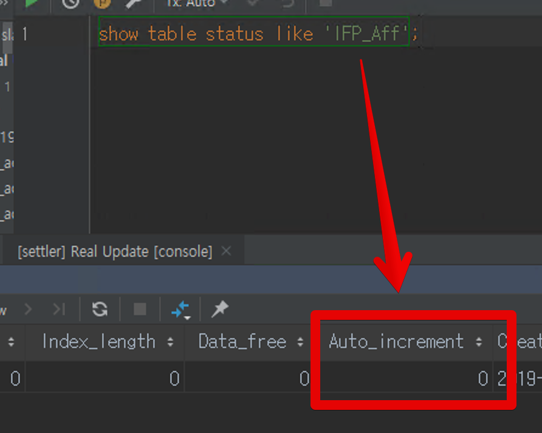
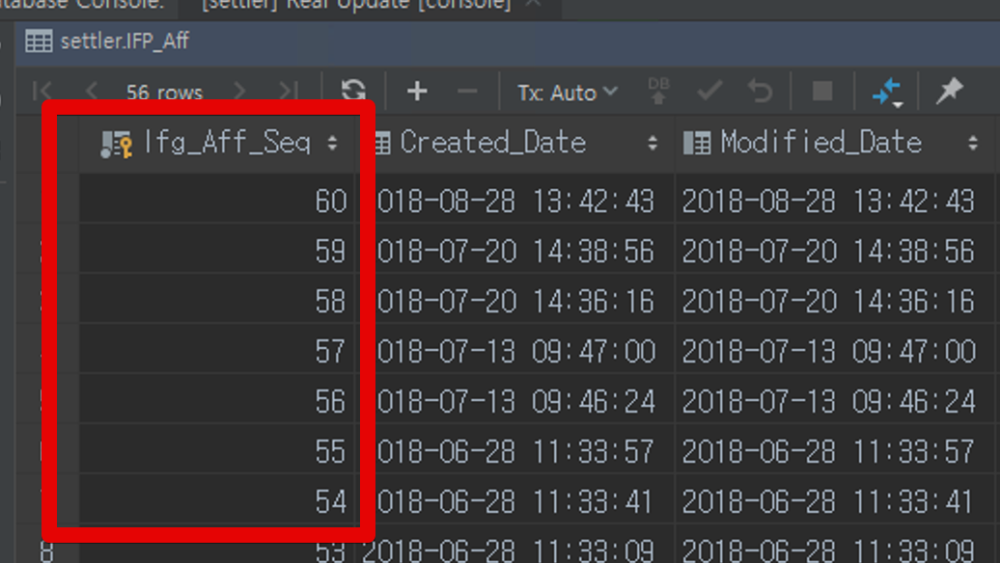
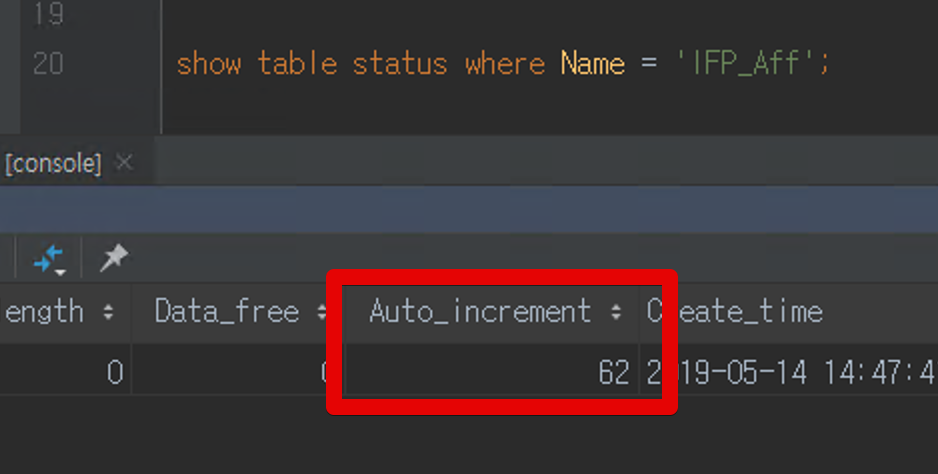

# Failed to read auto-increment value from storage engine

Mysql을 운영하다보면 아래와 같은 에러 메세지를 발견할 때가 있습니다.

```java
Caused by: java.sql.SQLException: Failed to read auto-increment value from storage engine
```

이는 Mysql 테이블의 상태값 중 auto-increment 에 문제가 발생했기 때문입니다.  
  
문제에 대한 확인은 아래 쿼리로 확인합니다.

```sql
show table status like '테이블명'
```

그럼 아래와 같이 **Auto_increment**필드가 이상함을 알수 있습니다.



실제로 이 테이블의 Auto_increment 최신값은 60이기 때문이죠.



그래서 새로 생성되어야할 값은 61인데, 실제 Status 테이블에는 0으로 되어있으니 오류가 발생하게 됩니다.  
  
해결책은 간단합니다.  
  
**강제로 최신 id값을 가진 row를 등록하여 status를 갱신**하는 것입니다.  
  
아래와 같이 insert 쿼리로 **강제로 id값을 심어** row를 등록합니다.

```sql
insert into table (pk필드) values (최신 PK +1)
```

> 물론 갱신용으로 넣은 row이니 **등록 즉시 삭제**해주세요.

그럼 아래와 같이 정상적으로 Status 테이블의 Auto_increment 가 갱신되었음을 확인할 수 있습니다.



이후에는 에러가 발생하지 않습니다.

