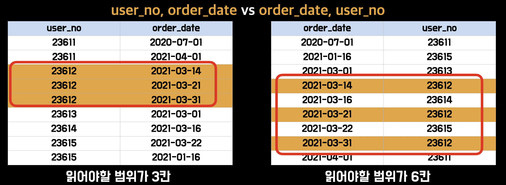
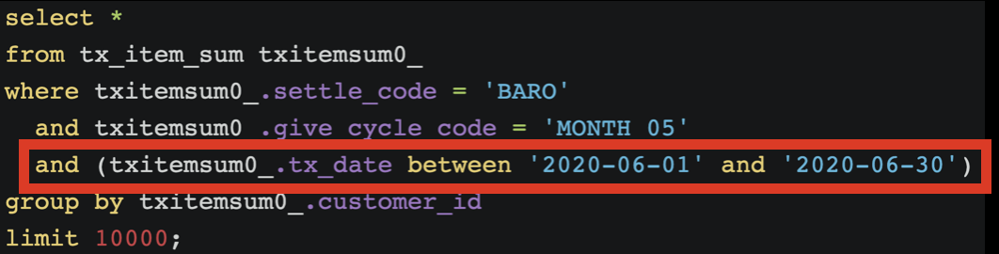
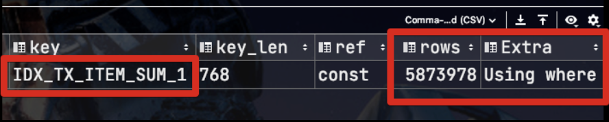
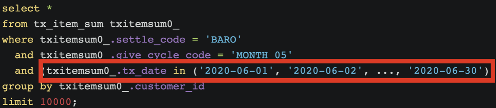
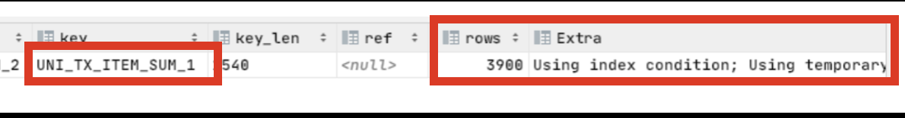
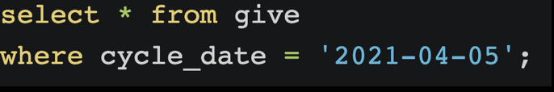
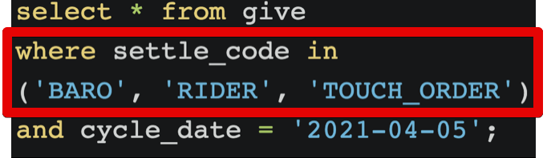
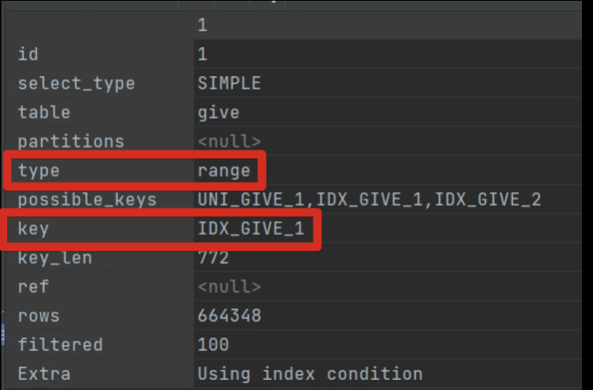

# MySQL IN절을 통한 성능 개선 방법

잘 사용되진 않는 범위 조건 중에 `IN` 이 있습니다.  
일반적으로 `BETWEEN`, `LIKE`, `<>` 에 비해서는 **하나씩 모든 Key를 입력**해야 되기 때문에 애플리케이션에서 작업양이 추가되어 선호되진 않는데요.  
  
이 `IN` 절을 통해 여러 성능 개선들이 가능해서 생각보다 활용하기에 따라 많은 성능 개선을 이룰 수 있습니다.  
  
이번 시간에는 `IN` 을 통한 2가지 개선 방법을 소개 드리겠습니다.

## 0. 소개

MySQL의 `IN` 절은 **UNION**으로 처리됩니다.  
즉, **eq 조건을 여러번 나눠서** 실행하는 것과 같은 효과를 가지는데요.  
  
이미 다들 아시겠지만 MySQL은 **범위 조건에서는 인덱스 효과를 제대로 보지 못합니다**.

* [MySQL 인덱스 정리 및 팁](https://jojoldu.tistory.com/243)

정확히는 **인덱스 앞의 컬럼을 범위 조건으로 사용하는 경우** 뒤의 인덱스 컬럼은 효과를 보지 못하는 것인데요.

제대로 효과를 보기 위해서는 **앞의 컬럼들은 모두 동등조건(eq)** 를 사용해야만 합니다.  
  
이러다보니 범위 조건이지만 `eq`를 여러번 사용하는 것과 같은 `IN`은 기존의 MySQL 이 가지고 있던 **범위 조건의 비효율**을 회피할 수 있습니다.  
  
자 그럼 하나씩 알아보겠습니다.

## 1. 범위 검색 개선

첫번째 `IN` 절을 통한 개선 사례는 서두에서 말씀드린것처럼 **범위 검색의 개선**입니다.  
  

### 1-1. 테스트

아래와 같이 2개의 인덱스가 잡혀있다고 가정해보겠습니다. 

* UNI_TX_ITEM_SUM_1: `tx_date, settle_code, give_cycle_code, customer_id`
* IDX_TX_ITEM_SUM_1: `settle_code, customer_id, tx_date`

인덱스 컬럼들과 순서를 주의깊게 봐주시면 됩니다.  
  
기존의 아래와 같은 쿼리를 실행해보면 **둘 중 어느 인덱스**를 사용할까요?  
  
잠깐 고민해보시고 결과를 보겠습니다.

아마 쉽게 생각하면 인덱스 컬럼이 모두 포함된 `UNI_TX_ITEM_SUM_1`를 사용하지 않을까 생각이 들텐데요.  
  
실제로는 **인덱스 효율이 떨어지는** `IDX_TX_ITEM_SUM_1` 를 선택하게 됩니다.

그래서 수행시간 **33분**의 비효율의 쿼리가 실행되게 됩니다.  
이유는 범위 검색인 `BETWEEN`을 최대한 효율적으로 사용하기 위해 

범위 검색 (BETWEEN) 의 비효율을 동등 비교 검색 (IN) 으로 개선하여 인덱스 최적화
결과) 33분 -> 0.1초로 개선

만약 `datetime`으로만 선언된 컬럼만 사용한다면 중복된 컬럼이라고 느껴지지만 `date`도 함께 사용하는것도 고려해보면 좋습니다.  

이럴 경우 `3/1 ~ 3/31` 까지 라는 조회 조건이 필요할 경우 `3/1 00:00:00 ~ 3/31 23:59:59.99999`  
## 2. Loose Index Scan

두번째 개선사례는 **Loose Index Scan** 입니다.  
MySQL은 B+Tree 인덱스를 기본으로 사용하는데요.  
이 인덱스 구조는 **첫번째 인덱스 컬럼이 사용되지 않으면 인덱스 사용이 불가능** 하다는 단점이 있는데요.  
  
만약 **첫번째 인덱스 컬럼이 불필요한 조회조건**에서는 어떻게 인덱스를 사용하도록 강제화할 수 있을까요?  
  
이때 `IN` 절을 한번 고려해보면 좋습니다.

* IDX_GIVE_1: settle_code, cycle_date

settle_code 조회 조건이 없어 
인덱스를 사용하지 못하고, 
테이블 풀 스캔 발생
settle_code에 전체 조건을 넣어 
index scan을 유도

## 3. 적정 개수

* [MySQL5.6 IN(val1, ..., valN) 를 index range scan 작동원리](http://small-dbtalk.blogspot.com/2016/02/)

`eq_range_index_dive_limit` 
IN의 적정 사이즈는 200이하이며, 
네트워크 비용까지 고려해도 500정도가 적당.
1000개 이상할 경우 범위 검색 (between, <>, like 등) 으로 인덱스가 작동될 수 있다.

### JPA & Batch

하이버네이트를 쓸 경우 hibernate.default_batch_fetch_size를 100~200정도로 지정한다.
스프링 배치를 쓸 경우 chunkSize를 100~200정도로 지정한다.

## 4. 5.7 업데이트시 주의사항

MySQL 5.6에서 5.7로 업데이트시 아래와 같이 IN절 개수에 따라 갑자기 테이블 풀 스캔이 될 수 있음을 주의해야 합니다.

https://jobc.tistory.com/216