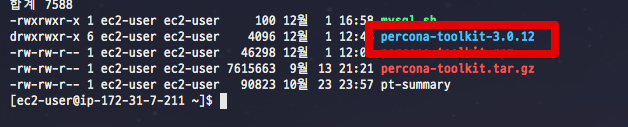
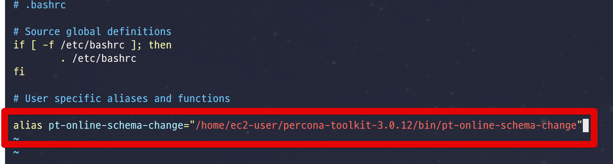
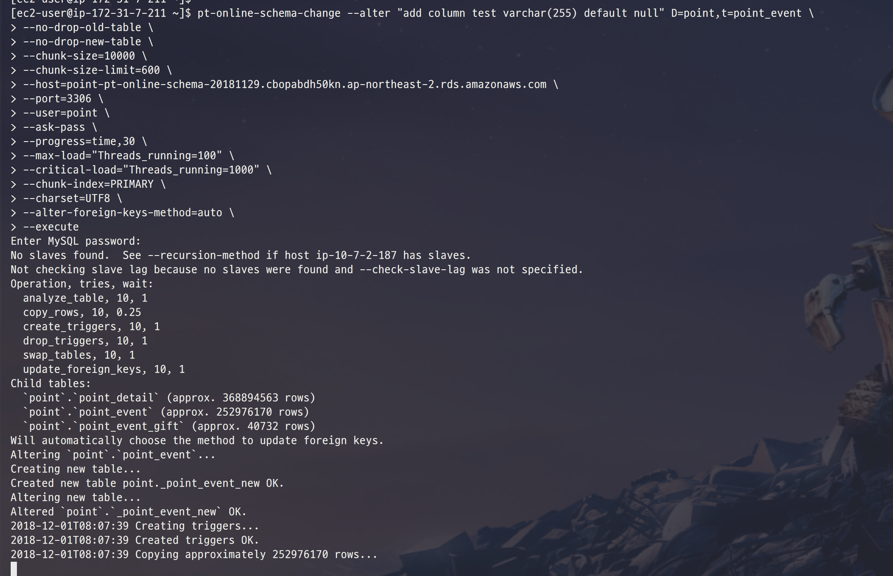
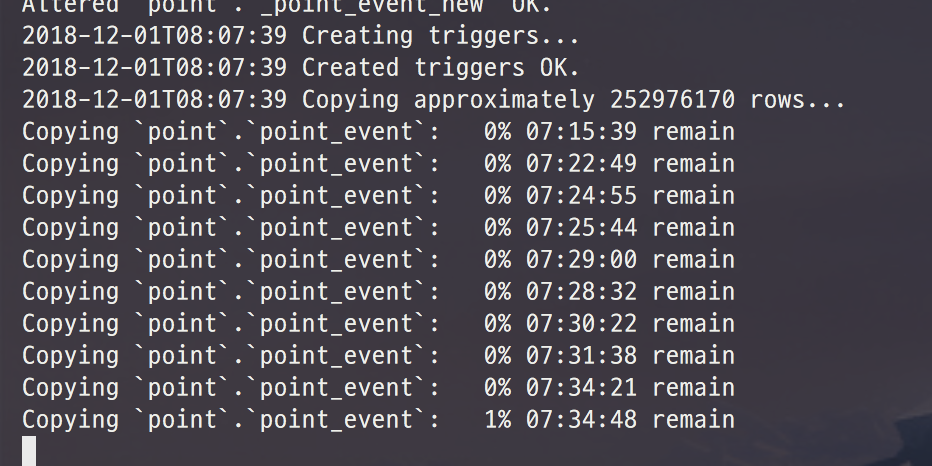
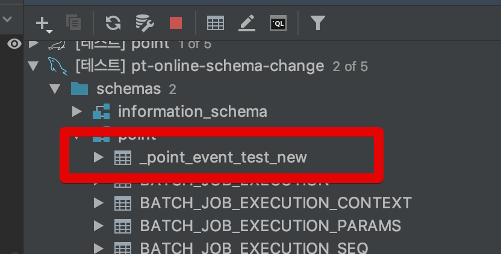
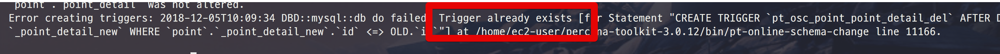
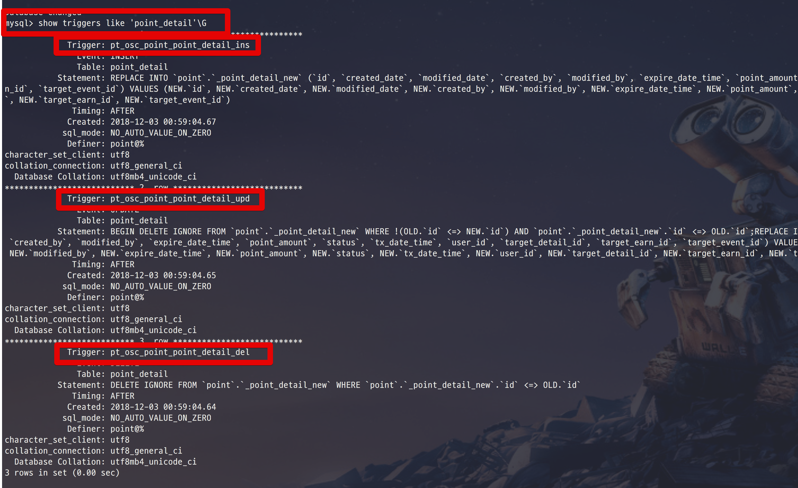
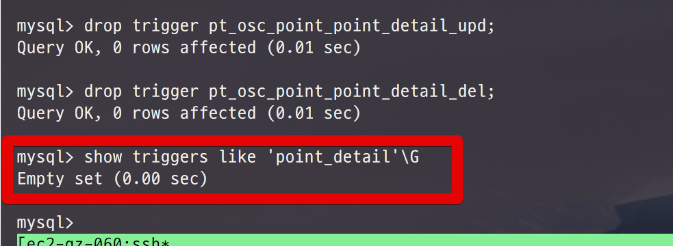
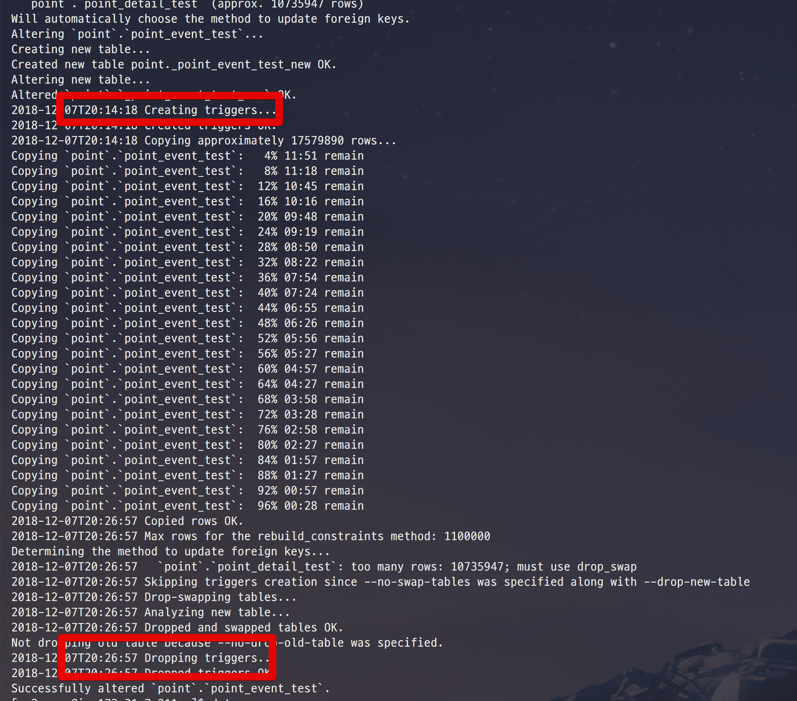
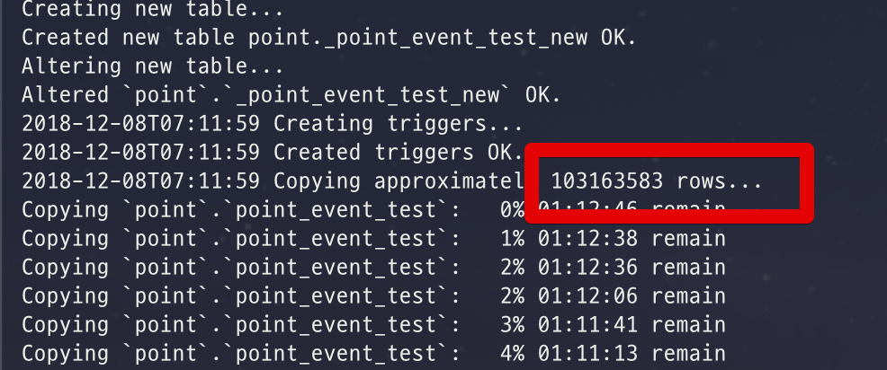

# Mysql Percona pt-online-schema-change

Mysql에서 몇억건 이상의 대량의 데이터를 갖고 있는 테이블을 ```update``` 하는것은 쉬운일이 아닙니다.  
단순히 ```alter table```을 해버리면 4시간, 5시간 이상 수행되기 떄문인데요.  
이를 해결 하기 위해 ```create select``` 방법을 사용하곤 합니다.  

> 참고: [MySQL 대용량 테이블 스키마 변경하기](https://jojoldu.tistory.com/244)

하지만 이 방법에는 큰 문제가 있는데요.  
FK (Foreign Key) 변경이 어렵습니다.  
**FK는 기존에 맺어져있던 테이블에 계속 유지**되기 떄문입니다.  
  
이외에도 여러 문제들이 있는데, 이를 해결하기 위해 percona의 pt-online-schema-change을 사용할때가 많습니다.  
이번 시간에는 이 pt-online-schema-change 사용법을 정리하겠습니다.

> percona는 XtraBackup 등 Mysql 을 운영하기 위한 여러 툴을 제공하는 회사입니다.  
[사이트](https://www.percona.com)


## 0. 소개

Percona의 pt-online-schema-change는 **트리거를 활용하여 테이블을 수정**하는 방법입니다.  
pt-online-schema-change 스크립트를 실행할 경우 아래와 같이 스크립트가 진행됩니다.

1. 대상 테이블을 복사하되, **변경할 스키마 내용이 적용된** 형태로 생성됩니다.
2. 지정한 chunk-size만큼 혹은 unique key 기준으로 데이터를 끊어 원본 테이블 데이터 전체를 신규 테이블로 복사합니다.
3. 데이터 복사가 끝나면 기존 테이블과 신규 테이블 이름을 변경하여 최종적으로 온라인 스키마 변경이 완료됩니다.

위 내용은 개발자가 직접 진행해도 됩니다만, Percona는 이미 이 모든 과정을 다 스크립트화 했으니 저희는 편하게 사용만 해보겠습니다.

## 1. 설치

pt-online-schema-change 스크립트는 공식 사이트에서 rpm 파일을 제공합니다.  
rpm으로 설치하면 아주 간편하겠지만, 가끔 rpm 파일이 설치가 안될 때가 있습니다.  
그럴때를 대비해 여기서는 ```tar.gz```로 설치하는 방법을 소개드리겠습니다.  
  
pt-online-schema-change의 스크립트는 **perl 기반**입니다.  
그래서 perl에 관련된 패키지들을 설치하겠습니다.  

### Perl 패키지 설치

아래 스크립트들을 차례로 실행하겠습니다.

```bash
sudo yum install perl-DBI
```

```bash
sudo yum install perl-DBD-MySQL
```

```bash
sudo yum install perl-TermReadKey
```

```bash
sudo yum install perl perl-IO-Socket-SSL perl-Time-HiRes
```

```bash
sudo yum install perl-devel
```

### percona-toolkit 설치

perl 관련 패키지들이 모두 설치되셨다면, percona-toolkit을 설치합니다.  
여러가지 도움이 되는 툴들이 많지만, 여기서는 pt-online-schema-change 을 실행할 스크립트를 설치한다고 보시면 됩니다.  
  
보통 ```.rpm```, ```.deb``` 파일을 받아서 즉시 설치하면 되지만, 이 글을 쓰는 시점에서 ```.rpm``` 설치가 안되어 ```tar.gz``` 파일로 대체해서 진행하겠습니다.  
  
먼저 tar 파일을 다운 받습니다.

```bash
wget percona.com/get/percona-toolkit.tar.gz
```

다은 받은 파일의 압축을 해제합니다.

```bash
tar xzvf percona-toolkit.tar.gz
```

압축이 해제된 폴더로 이동합니다.



```bash
cd percona-toolkit-3.0.12
```

그리고 아래 3개 스크립트로 install을 시작합니다.

```bash
perl ./Makefile.PL
make
sudo make install
```

대략 이런식의 설치 로그가 출력됩니다.

```bash
Installing /usr/local/share/man/man1/pt-config-diff.1p
Installing /usr/local/share/man/man1/pt-deadlock-logger.1p
Installing /usr/local/share/man/man1/pt-table-checksum.1p
Installing /usr/local/share/man/man1/pt-kill.1p
Installing /usr/local/share/man/man1/pt-duplicate-key-checker.1p
Installing /usr/local/share/man/man1/pt-summary.1p
Installing /usr/local/share/man/man1/pt-index-usage.1p
Installing /usr/local/share/man/man1/pt-visual-explain.1p
Installing /usr/local/share/man/man1/pt-sift.1p
Installing /usr/local/share/man/man1/pt-online-schema-change.1p
Installing /usr/local/share/man/man1/pt-slave-restart.1p
Installing /usr/local/share/man/man1/pt-show-grants.1p
Installing /usr/local/share/man/man1/pt-upgrade.1p
Installing /usr/local/bin/pt-mysql-summary
Installing /usr/local/bin/pt-variable-advisor
Installing /usr/local/bin/pt-table-checksum
Installing /usr/local/bin/pt-mongodb-summary
Installing /usr/local/bin/pt-slave-find
Installing /usr/local/bin/pt-pmp
Installing /usr/local/bin/pt-duplicate-key-checker
Installing /usr/local/bin/pt-index-usage
Installing /usr/local/bin/pt-diskstats
Installing /usr/local/bin/pt-mongodb-query-digest
Installing /usr/local/bin/pt-find
Installing /usr/local/bin/pt-upgrade
Installing /usr/local/bin/pt-config-diff
Installing /usr/local/bin/pt-slave-delay
Installing /usr/local/bin/pt-summary
Installing /usr/local/bin/pt-slave-restart
Installing /usr/local/bin/pt-stalk
Installing /usr/local/bin/pt-secure-collect
Installing /usr/local/bin/pt-fk-error-logger
Installing /usr/local/bin/pt-sift
Installing /usr/local/bin/pt-align
Installing /usr/local/bin/pt-table-sync
Installing /usr/local/bin/pt-query-digest
Installing /usr/local/bin/pt-online-schema-change
Installing /usr/local/bin/pt-mext
Installing /usr/local/bin/pt-visual-explain
Installing /usr/local/bin/pt-kill
Installing /usr/local/bin/pt-archiver
Installing /usr/local/bin/pt-fingerprint
Installing /usr/local/bin/pt-heartbeat
Installing /usr/local/bin/pt-fifo-split
Installing /usr/local/bin/pt-deadlock-logger
Installing /usr/local/bin/pt-table-usage
Installing /usr/local/bin/pt-ioprofile
Installing /usr/local/bin/pt-show-grants
Appending installation info to /usr/lib64/perl5/perllocal.pod
```

설치가 다 되셨다면, 전역에서 실행할 수 있게 ```.bashrc```에 등록하겠습니다.

```bash
# bashrc을 열어서
vim ~/.bashrc

# 아래 코드를 등록합니다.
alias pt-online-schema-change="/home/ec2-user/percona-toolkit-3.0.12/bin/pt-online-schema-change"
```



여기까지 하셨다면 모든 작업이 끝났습니다!

## 2. 사용

설치된 pt-online-schema-change은 아래의 명령어로 사용할 수 있습니다.

```bash
pt-online-schema-change --alter "변경할 Alter 정보" D=데이터베이스,t=테이블명 \
--no-drop-old-table \
--no-drop-new-table \
--chunk-size=500 \
--chunk-size-limit=600 \
--defaults-file=/etc/my.cnf \
--host=127.0.0.1 \
--port=3306 \
--user=root \
--ask-pass \
--progress=time,30 \
--max-load="Threads_running=100" \
--critical-load="Threads_running=1000" \
--chunk-index=PRIMARY \
--charset=UTF8 \
--alter-foreign-keys-method=auto \
--preserve-triggers
--execute
```

* ```--no-drop-old-table```
    * 마이그레이션 후, 기존 테이블을 삭제 하지 않겠다는 옵션 입니다.
* ```host, port, user```
    * 스크립트를 실행할 대상 DB 정보입니다.
* ```chunk-size```
    * 한번에 복사할 데이터양을 얘기합니다.
* ```--charset=UTF8```
    * 필수로 넣으셔야 합니다.
    * 안넣을 경우 한글명 데이터들이 이관하면서 깨지는 경우가 생깁니다.
* ```--alter-foreign-keys-method=auto```
    * FK도 복사할것인지 여부입니다.
    * 옵션값이 ```auto```일 경우 최적화된 방식으로 FK를 복사합니다.

옵션의 대부분은 이름만 보셔도 알 수 있는데요.  
좀 더 자세한 설명을 원하시면 [번역 percona toolkit - pt-online-schema-change 옵션 정리](http://notemusic.tistory.com/44)을 참고해보시면 됩니다.  
  
위 샘플을 토대로 진행해본다면 다음과 같이 실행해볼 수 있습니다.

```bash
pt-online-schema-change --alter "add column test varchar(255) default null" D=point,t=point_detail \
--no-drop-old-table \
--chunk-size=500 \
--chunk-size-limit=600 \
--host=point-pt-online-schema-20181129.cbopabdh50kn.ap-northeast-2.rds.amazonaws.com \
--port=3306 \
--user=point \
--ask-pass \
--progress=time,30 \
--charset=UTF8 \
--alter-foreign-keys-method=auto \
--preserve-triggers
--execute 
```

point라는 DB의 ```point_detail```에 ```add column test varchar(255) default null```스키마를 적용해본다는 내용입니다.  
  
이 스크립트를 실행해봅니다.



그러면 아래와 같이 % (진행율) 가 올라가는 로그를 보실 수 있습니다.



## 3. 삭제 및 재시작

스크립트 진행 도중 종료 되었다면, 재시작이 필욯바니다.  
다만, 트리거와 복사 테이블을 만들어 놓은 상태라, 바로 재시작을 하면 실패합니다.  
그래서 아래의 방법으로 재시작 환경을 만들어 놓습니다.  
  
먼저 새롭게 생성된 테이블들을 삭제합니다.  



(보통 ```_기존테이블명_new``` 형식으로 복사본 테이블이 생성됩니다.)  
  
추가로 트리거도 생성 되었기 때문에 아래와 같이 오류가 발생하면서 재실행이 안될것입니다.



이럴 경우 pt-online-schema-change로 생성된 트리거를 확인하고 **강제로 삭제**하면 됩니다.  
아래와 같이 트리거 목록을 확인하신 뒤,



```sql
show triggers like 'table이름'\G
```

prefix로 ```pt_```가 붙은 트리거들을 모두 삭제합니다.



```sql
drop trigger trigger이름;
```

해당 테이블에 더이상 트리거가 보이지 않는다면 다 삭제가 되었으니 다시 실행해보시면 됩니다.

## 속도

그럼 이 방식으로 진행할 경우 대략 얼만큼의 시간이 필요한지 한번 측정해봤습니다.  
테스트 환경은 다음과 같습니다.

* RDS r3.2xlarge
    * vCPU 8 core
    * RAM 61 GB
* EC2에서 RDS로 **remote**로 명령어 실행
    * 네트워크 통신을 통해 진행
    * MySQL **서버에서 직접 실행하는 것보다는 전반적으로 속도가 느림**
* chunk-size=1000 기준
* **Replication** 되어 있는 상태

### 1600만건 / FK X

* 약 12분 소요
* RDS CPU 약 17% 유지
  


### 1700만건 / FK O

* 약 12분 소요
* RDS CPU 약 20% 유지
  


### 1억건 / FK O

* 약 1시간 
* RDS CPU 약 20% 유지




## 참고

설정에 관한 자세한 내용은 이미 다른분께서 모든 옵션을 번역해주셨기 때문에 이를 참고하시는걸 추천드립니다.

* [소소한 데이터 이야기 – pt-online-schema-change 편](http://gywn.net/2017/08/small-talk-pt-osc/)