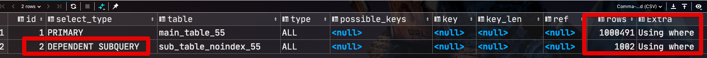
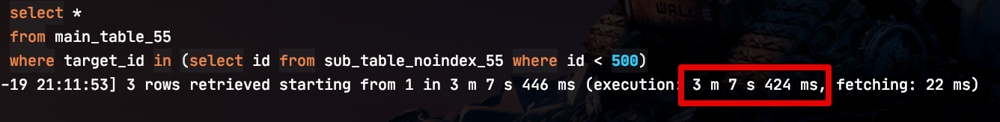
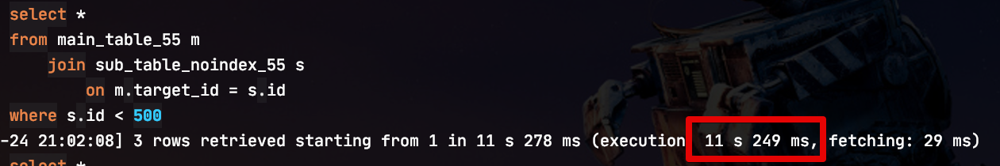
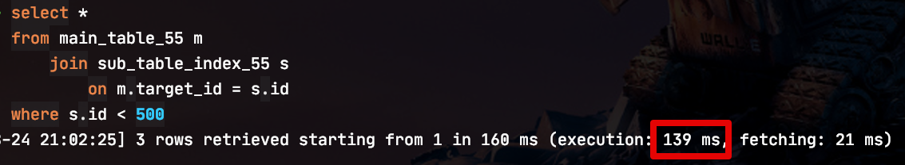
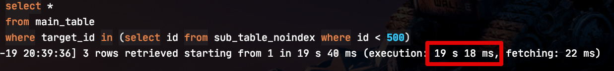
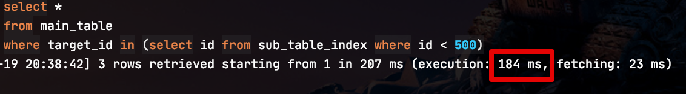

# MySQL Where 서브쿼리 vs 조인 조회 성능 비교 (Ver 5.5 & 5.6)

MySQL 5.5에서 5.6으로 업데이트가 되면서 서브쿼리(Subquery) 성능 개선이 많이 이루어졌습니다.  
  
이번 시간에는 MySQL 2개의 버전 (5.5, 5.6) 에서 서브쿼리를 통한 조회 (Select)와 Join에서의 조회간의 성능 차이를 비교해보겠습니다.  

> MySQL의 정석과도 같은 [Real MySQL](https://coupa.ng/bIKNBN) 책이 MySQL 5.5 버전을 기준으로 하다보니 5.6 변경분에 대해서 별도로 포스팅하게 되었습니다. 

## 0. 테스트 환경

테스트용 테이블은 3개를 만들었습니다.

* 메인 테이블 100만건
* 서브 테이블1 (인덱스 O) 1000건
* 서브 테이블2 (인덱스 X) 1000건

DDL 쿼리는 다음과 같습니다.  
  
**메인 테이블**

```sql
-- 업데이트 대상 테이블
create table main_table
(
    id int not null auto_increment,
    target_id int not NULL,
    primary key (id)
)ENGINE=InnoDB;
```

**서브 테이블1 (인덱스 O)**

```sql
-- 업데이트 조건 테이블 (인덱스 없음)
create table sub_table_noindex
(
    id int not null
)ENGINE=InnoDB;
```

**서브 테이블2 (인덱스 X)**

```sql
-- 업데이트 조건 테이블 (인덱스 있음)
create table sub_table_index
(
    id int not null ,
    primary key (id)
)ENGINE=InnoDB;
```

자 그럼 실험을 해보겠습니다.

## 1. MySQL 5.5

거의 대부분의 분들이 알고 계시듯이 MySQL 5.5에서는 서브쿼리 최적화가 많은 문제를 갖고 있었습니다.  
  
> MSSQL이나 Oracle 쓰다가 MySQL 5.5 버전을 쓰시게되면 못쓸정도라고 평가하실 정도였습니다.

일반적으로 생각했을때 아래의 서브쿼리는 1번 쿼리가 먼저 수행되고, 그 결과를 2번 쿼리에서 수행할 것처럼 보입니다.


하지만, MySQL 5.5 에서는 위에서 의도한것처럼 **서브쿼리가 수행되지 않습니다**.  
  
실제로 그런지 한번 확인해보겠습니다.

### 1-1. Subquery

테스트할 쿼리는 아래와 같습니다.

```sql
select * 
from main_table_55
where target_id in (
    select id 
    from sub_table_noindex_55 
    where id < 500
);
```

MySQL의 경우 Where절의 In 쿼리에 대해서는 **동등 비교와 똑같이 처리** 되기 떄문에 상당히 최적화 되어있는데요.  
반면에, 서브쿼리를 넣게 되면 위에서 언급한것처럼 처리방식이 달라집니다.  
  
그래서 어떻게 처리하는지 위 쿼리를 1) 인덱스가 **없는** 서브 테이블, 2) 인덱스가 **있는** 서브 테이블 각각에서 테스트해보겠습니다.  
  
첫번째로 볼 것은 서브쿼리 테이블에 인덱스가 없는 경우 입니다.  

#### 1-1-1. No Index

먼저 인덱스가 없는 테이블에서의 실행 계획은 다음과 같습니다.  
  
**실행계획**  
  


실행계획을 보신 분들은 느끼셨겠지만, **외부의 컬럼을 사용하지 않는 서브쿼리**인데 select type이 ```DEPENDENT SUBQUERY``` 입니다.  
  
이는 MySQL 5.5 옵티마이저가 최적화를 하면서 위 쿼리를 아래와 같이 변환되어 실행하기 때문인데요.  

```sql
select `jojoldu`.`main_table_55`.`id` AS `id`,
       `jojoldu`.`main_table_55`.`target_id` AS `target_id`
from `jojoldu`.`main_table_55`
where
    <in_optimizer
    >(`jojoldu`.`main_table_55`.`target_id`
    ,
    < exists
    >(select 1 from `jojoldu`.`sub_table_noindex_55` where ((`jojoldu`.`sub_table_noindex_55`.`id`
    < 500)
  and (
    < cache
    >(`jojoldu`.`main_table_55`.`target_id`) = `jojoldu`.`sub_table_noindex_55`.`id`))));
```

> 저의 경우 Jetbrains사의 DataGrip이라는 제품을 사용하고 있는데요.  
해당 제품에서 ```explain extended 실제쿼리``` 를 사용하면 아래와 같이 내부에서 수행된 쿼리를 확인할 수 있습니다.  
> MySQL CLI 로 실행하신다면 ```SHOW WARNING;``` 명령어를 사용하면 [옵티마이저가 분석해서 다시 재조합한 쿼리 문장을 확인](https://weicomes.tistory.com/154)할 수 있습니다.

이를 좀 더 보기좋게 정리하면 다음과 같습니다.

```sql
select main_table_55.id AS id,
       main_table_55.target_id AS target_id
from main_table_55
where (main_table_55.target_id,
   (select 1 
    from sub_table_noindex_55 
    where (
        (sub_table_noindex_55.id < 500) 
            and 
        (main_table_55.target_id) = sub_table_noindex_55.id))
);
```

위 실행 계획을 해석하면, 

* main_table을 풀스캔하면서 target_id 컬럼 값을 구해와서
* 그 target_id 값을 이용해 **서브쿼리를 한 건씩 체크 조건**으로 실행
* 해당 서브쿼리 역시 인덱스가 없어서 1000건을 다 체크

이 말은 전체 100만건의 main_table을 읽고, **서브 쿼리를 100만번 반복 실행**하면서 그 서브쿼리 조차도 인덱스가 없어 **1000건의 데이터를 일일이 체크**한 것입니다.  
  
특히 실행 계획에서 주의깊게 보셔야하는게 두 라인의 **id 값이 서로 다르다는 것**인데요.  
이는 두 쿼리 (메인과 서브쿼리)가 조인이 아닌 서브쿼리로 실행되었음을 의미합니다.

> 이 내용은 기억해주세요 5.6 버전에서 테스트할때 비교할 예정입니다.

그래서 실제로 수행시간을 보면?  
  
**수행시간**



총 **3분 7초**가 걸렸습니다.  
  
MySQL 5.5에서 서브쿼리 + No Index가 조합되면 100만건 & 1천건 정도의 조회도 3분이상이 소요되는 것을 확인하였습니다.  
  
자 그럼 서브 테이블에 인덱스가 있는 경우는 어떻게 되는지 확인해보겠습니다.  

#### 1-1-2. Index

서브 테이블에 인덱스가 있는 경우 실행 계획은 다음과 같습니다.  
  
**실행계획**


인덱스가 없을때와 비교해서는 기존의 상관 서브쿼리 형태는 그대로지만, 인덱스로 인해 **서브쿼리 자체의 실행이 개선**되었음을 확인할 수 있습니다.  
  
그래서 실제 수행시간도 대폭 개선되었습니다.  
  
**수행시간**


3분7초였던 쿼리에서 1.8초로 개선되었습니다.  
엄청 개선된 것 같지만!  
여기서 주의할것은, 이 쿼리는 원래 0.x초내로 끝났어야할 쿼리라는 것이죠.  
즉, 지금도 최적화가 된 형태는 아닙니다.  
그렇다면 위 쿼리를 Join으로 풀면 얼마나 성능 차이가 발생할까요?  

### 1-2. Join

MySQL 5.5 에서는 항상 **서브쿼리 대신에 Join을 사용하라고** 합니다.  
  
서브쿼리에서 Join으로 변경해서 비교해보겠습니다.  
  
위 서브쿼리를 Join쿼리로 아래와 같이 변경하여 테스트하였습니다.

```sql
select *
from main_table_55 m
    join sub_table_noindex_55 s
        on m.target_id = s.id
where s.id < 500;
```

#### 1-2-1. No Index

먼저 실행계획을 보겠습니다.

**실행계획**


**수행시간**



**인덱스가 없는 테이블임에도** 3분 7초에서 **11초**로 대폭 개선되었습니다.  

* 두 라인의 id값이 1로 동일한 것으로 Join이 잘 적용된 것을 알수 있습니다.  
* Extra 항목의 ```Using join buffer```의 경우 서브 테이블의 풀스캔을 피할 수 없어서 옵티마이저가 서브 테이블에서 읽은 값들을 **메모리에 캐시한뒤**, 이를 메인 테이블과 메모리 캐시를 조인한 형태입니다.

인덱스가 없는 서브테이블에서 이정도의 향상이 있었다면, 인덱스가 있는 테이블에서는 어떨까요?

#### 1-2-2. Index

**실행계획**


인덱스가 있기 때문에 메모리 캐시와의 조인 (```Using Join buffer```) 이 발생하지 않았습니다.  
  
**수행시간**



139ms 즉, 0.139초 만에 수행이 되었습니다.  
드디어 위 쿼리의 원하는 속도가 달성되었습니다.  
  
자 그럼 위의 실험들을 통해 MySQL 특정 버전 (5.5이하) 에서는 웬만해선 Where In (서브쿼리) 는 Join을 사용하는 것이 좋다는 것을 알 수 있는데요.  
  
5.6 버전에서는 이게 어떻게 개선되었는지 확인해보겠습니다.

## 2. MySQL 5.6

### 2-1. Subquery

5.6 버전에서는 서브쿼리가 어떻게 해석되는지 확인해보겠습니다.

#### 2-1-1. No Index

먼저 인덱스가 없는 테이블의 경우입니다.  

> 테스트 쿼리는 1과 동일합니다.

마찬가지로 ```explain extended 실제쿼리``` 를 통해 실제로 옵티마이저가 해석한 실행 계획을 보면!?


**Join이 들어간 것**을 볼 수 있습니다.  
  
즉, MySQL 5.6 부터는 **서브쿼리를 사용하면 내부적으로 Join으로 풀어서 실행**한다는 것을 알 수 있는데요.  
  
실제 실행 계획 내용도 함께 보겠습니다.  
  
**실행계획**


위 실행 계획을 통해 다음을 알 수 있습니다.

* 쿼리에서 사용되는 테이블은 2개인데, 실행 계획은 3개 라인이다?
  * 이 쿼리에서 임시 테이블이 생성되었음을 짐작
* 즉, 서브테이블을 읽는 **서브 쿼리가 먼저 실행 되어서 그 결과로 임시 테이블을 생성**한 것
  * 그리고 그 임시테이블과 메인테이블을 Join해서 결과를 반환한 것

실제로 위 실행계획에서 **1번째와 2번째 라인의 id가 1번으로 동일**합니다.  
즉, 임시테이블과 메인테이블간에 Join이 발생한 것을 바로 알 수가 있습니다.  

> 이와 같이 select type에 ```MATERIALZED``` 가 선언되어있다면 이는 **Semi-join Materializaion 최적화**가 되었다는 것을 의미합니다.  
> 좀 더 자세한 설명은 [구루비 커뮤니티의 글](http://www.gurubee.net/lecture/4199)을 참고하시면 좋습니다.

**수행시간**



기존 5.5버전에서 3분 7초가 걸렸던 쿼리가 5.6으로 버전업만 하였는데 **19초**로 대폭 개선되었습니다.  
아무래도 직접 조인을 수행한것은 아니고, 임시 테이블을 만들어 조인을 하다보니 직접 조인 보다는 성능이 덜 나오긴 하였습니다.

#### 2-1-2. Index

자 그럼 서브 테이블에 인덱스가 있는 경우도 확인해보겠습니다.  
  
옵티마이저가 해석한 쿼리는 **임시테이블 없이** 조인이 걸려있는 것을 확인할 수 있습니다.


실행 계획 역시 Join과 인덱스가 잘 걸려있음을 확인할 수 있습니다.  
  
**실행계획**


마지막으로 수행시간을 확인해보면!?  
  
**수행시간**



**0.18초**로 실제 의도한 속도로 수행된 것을 확인할 수 있습니다!

### 서브쿼리 최적화 요건

MySQL 5.6 에서 많은 서브쿼리가 최적화 되었지만, 그럼에도 불구하고 모든 서브쿼리가 최적화 된 것은 아닙니다.  
아래 조건들은 MySQL의 서브쿼리 최적화가 적용 안되는 조건들입니다.

* IN(subquery) 또는 = ANY(subquery) 형태
* UNION 없는 단일 SELECT
* 집계함수 와 HAVING 절을 가지지 말아야
* 서브쿼리의 WHERE 조건이 외부쿼리의 다른 조건과 AND 로 연결
* 조인을 사용한 UPDATE 나 DELETE 가 이니어야
* 미리 수립된 실행계획을 사용하지 않는 경우(PreparedStatement 사용시 실행계획 재사용됨)
* 외부쿼리와 서브쿼리가 실제 테이블 사용(가상 테이블 사용시 세* 미조인 최적화 안됨)
* 외부쿼리와 서브쿼리가 straight_join 힌트 미사용

## 결론

* MySQL 5.5 까지는 서브쿼리 최적화가 최악이라 웬만하면 Join으로 전환하자
  * 메인테이블의 row 수 만큼 서브 쿼리를 수행한다
* MySQL 5.6 에서 서브 쿼리가 대폭 최적화 되었다.
  * 다만 최적화가 적용 안되는 조건들이 다수 존재한다
* 버전/조건 관계 없이 좋은 성능을 내려면 **최대한 Join을 이용**하자
* Join을 사용하기가 너무 어렵다면 Subquery는 사용하되, MySQL 5.5 이하라면 절대 사용하지 않는다.
  * 차라리 **쿼리를 나눠서 2번 실행** (메인쿼리/서브쿼리)하고 애플리케이션에서 조립하는게 낫다.
