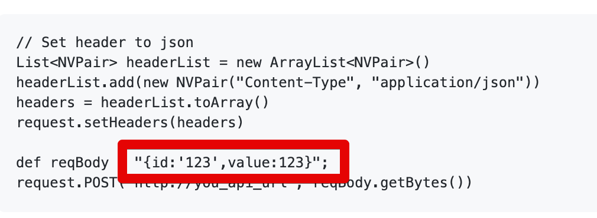
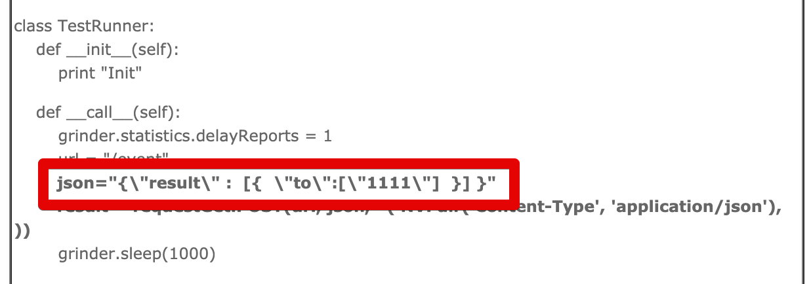

# Ngrinder 사용시 JSON을 Post로 요청하기

```groovy
@RunWith(GrinderRunner)
class TestRunner {

	public static GTest test
	public static HTTPRequest request
	public static NVPair[] headers = [
		new NVPair("Authorization", "인증헤더값"), // 필요하면 추가
		new NVPair("Content-Type", "application/json") // JSON 요청시 필수
	]

	@BeforeProcess
	public static void beforeProcess() { ... }

	@BeforeThread 
	public void beforeThread() { ... }
	
	@Before
	public void before() {
		request.setHeaders(headers) // Content-Type 할당
        ...
	}

	@Test
	public void test(){
		def reqBody = '{"code":"test", "name":"test", "business": "2020-09-28"}'; // json 객체 선언
		HTTPResponse result = request.POST("API 주소", reqBody.getBytes()) // getBytes()로 변경해서 할당

		if (result.statusCode == 301 || result.statusCode == 302) {
			grinder.logger.warn("Warning. The response may not be correct. The response code was {}.", result.statusCode); 
		} else {
			assertThat(result.statusCode, is(200));
		}
	}
}
```

[Github Issue](https://github.com/naver/ngrinder/issues/221) 에 올라온대로 아래와 같이 지정하면 400에러로 실패난다.





