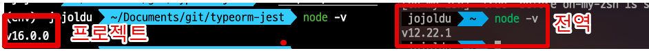
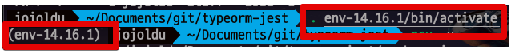
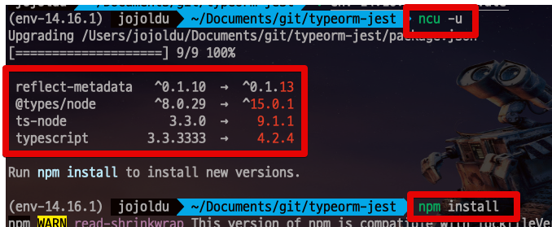
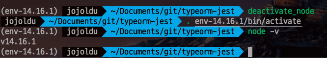

# nodeenv를 활용한 프로젝트별 node 가상 환경 관리

Node에는 [nvm](https://github.com/nvm-sh/nvm) 이나 [n](https://github.com/tj/n)을 통해 동적으로 로컬 PC의 Node 버전을 변경할 수 있는데요.  
다만 **애초에 여러 프로젝트를 서로 다른 버전으로 동시에 사용하는 경우**에는 매번 버전을 변경하는 것도 상당히 귀찮은 일입니다.  
이를테면 다음과 같은 경우입니다.

* 회사의 프로젝트는 node 12를 쓴다 
* 개인 프로젝트는 최신 버전인 node 16을 쓰고 싶다.
* 주말마다하는 사이드 프로젝트는 14를 쓰기로 했다.

이렇게 될 경우 매번 PC의 node 버전을 변경해야하는데요.

* 출근 전에는 node 16으로
* 출근 하면 node 12로
  * 행여나 회사내 node 프로젝트들도 버전이 서로 다르면 이때도 계속 프로젝트 실행때마다 `nvm` 이나 `n`으로 버전을 변경해야합니다. 
* 퇴근 하면 다시 node 16으로 
* 주말 에는 node 14로

만약 이렇게 다뤄야할 프로젝트가 다수이고, 매일 번갈아가면서 버전교체를 해야하는 개발자라면 정말 귀찮은 일입니다.  
  
그래서 매번 필요할때마다 버전 변경 하지 않고, **그 프로젝트의 디렉토리에서는 특정 버전이 고정으로 적용**되는 방법이 필요합니다.  
  
프로젝트 단위로 가상 환경이 구성되어, PC의 기본 node 버전과 무관하게 **특정 프로젝트 안에서는 지정된 하위 버전에서 작동**하는 것 말이죠.  
  
보통 파이썬이나 Java에서는 이런 문제를 가상환경 (virtual environment) 을 지원하는 도구를 통해 해결하는데요.  
Nodejs에서도 파이썬의 [virtualenv](https://github.com/pypa/virtualenv) 를 활용한 [nodeenv](https://github.com/ekalinin/nodeenv) 가 있어, 이를 사용하면 **프로젝트별 가상환경 구성**이 가능하게 됩니다.  
  
이번 시간에는 이 `nodeenv` 의 설치와 사용법을 배워보겠습니다.

> 테스트는 모두 Mac Bigsur (2019 Intel)에서 진행되었습니다.

## 1. 설치

Mac에서 설치법은 아주 간단합니다.

```bash
sudo easy_install nodeenv
```

> 그 외에도 `sudo pip install nodeenv` 등으로도 설치 가능하니 다른 방식의 설치가 필요하면 [공식문서](https://github.com/ekalinin/nodeenv#install)를 참고해보세요.

설치가 다되셨으면 아래 명령어로 버전체크를 통해 잘 설치되었는지 확인해봅니다.

```bash
nodeenv --version
```

그럼 아래와 같이 정상적으로 버전이 노출됩니다.

```bash
1.6.0
```

이렇게 설치가 되셨으면 바로 한번 실제 프로젝트에 적용해보겠습니다.

## 2. 사용법

먼저 터미널을 열어 가상환경에서 작동시킬 프로젝트 디렉토리로 이동합니다.  
그리고 본인이 구성하고 싶은 node 버전에 맞게 아래 방법을 사용합니다.
  
### 2-1. 최신 버전 사용하고 싶을때

만약 구성하고 싶은 가상환경의 Node버전을 현재 최신 (v16) 으로 하고 싶으시다면 아래 명령어를 실행합니다.

```bash
nodeenv env
```

그럼 Node 16버전의 가상환경이 구성되는 로그를 볼 수 있습니다.

```bash
* Install prebuilt node (16.0.0) ..... done.
```

그럼 현재 위치의 디렉토리에 아래와 같이 `env` 디렉토리가 생성된 것을 볼 수 있는데요.

```bash
-rw-r--r--    1 jojoldu  staff   172B  5  1 21:49 README.md
drwxr-xr-x    7 jojoldu  staff   224B  5  1 22:59 env
drwxr-xr-x  438 jojoldu  staff    14K  5  1 22:19 node_modules
-rw-r--r--    1 jojoldu  staff   477B  5  1 21:50 ormconfig.json
-rw-r--r--    1 jojoldu  staff   485K  5  1 22:19 package-lock.json
-rw-r--r--    1 jojoldu  staff   491B  5  1 21:52 package.json
drwxr-xr-x    5 jojoldu  staff   160B  5  1 21:49 src
-rw-r--r--    1 jojoldu  staff   298B  5  1 21:49 tsconfig.json
```

이 `env` 디렉토리에 Node16 버전을 담고 있는 가상환경이 구성되어있습니다.  
그래서 이 디렉토리의 가상환경 접속을 할때는 `env` 디렉토리를 통해서 한다고 보시면 됩니다.  
  
가상 환경 구성이 되었으니, 아래 명령어를 통해 가상 환경 활성화를 해보겠습니다.

```bash
. env/bin/activate
```

그럼 아래와 같이 가상 환경 모드로 쉘 모드가 전환되는 것을 볼 수 있습니다.

```bash
(env)  jojoldu  ~/Documents/git/typeorm-jest
```

이렇게 앞에 `(env)` 가 들어간 명령어 모드가 되면 가상환경으로 작동되는 것이고, **이때 명령어들은 모두 가상환경 node 버전**으로 진행 됩니다.  
  
예를 들어 node 버전을 확인해보시면?

```bash
node -v
```



PC 전체의 전역 Node 버전과 가상환경내 버전이 서로 다른 것을 확인할 수 있습니다.

### 2-2. 특정 버전을 사용하고 싶을때

만약 최신 버전이 아닌 특정 버전을 사용한다면 다음과 같이 할 수 있습니다.  
  
예를 들어 현재 LTS인 `node: 14.16.1`, `npm: 6.14.12` 를 설치한다고 하면 다음과 같이 가능합니다.

```bash
nodeenv --node=14.16.1 --npm=6.14.12 env-14.16.1
```

* `env-14.16.1`
  * 2-1 에서 `env` 디렉토리처럼 가상환경이 설치될 디렉토리명을 지정합니다.
  * 지정된 이름으로 디렉토리가 생성됩니다.

그럼 아래와 같이 `env-14.16.1` 이름의 디렉토리가 생성된 것을 볼 수 있습니다.

```bash
-rw-r--r--    1 jojoldu  staff   172B  5  1 21:49 README.md
drwxr-xr-x    7 jojoldu  staff   224B  5  1 22:59 env-14.16.1
drwxr-xr-x  438 jojoldu  staff    14K  5  1 22:19 node_modules
-rw-r--r--    1 jojoldu  staff   477B  5  1 21:50 ormconfig.json
-rw-r--r--    1 jojoldu  staff   485K  5  1 22:19 package-lock.json
-rw-r--r--    1 jojoldu  staff   491B  5  1 21:52 package.json
drwxr-xr-x    5 jojoldu  staff   160B  5  1 21:49 src
-rw-r--r--    1 jojoldu  staff   298B  5  1 21:49 tsconfig.json
```

그리고 이 가상환경을 활성화 하시면 됩니다.

```bash
. env-14.16.1/bin/activate
```



### 2-3. 가상 환경 내부에서 활동

2-1 ~ 2-2를 통해 가상 환경을 활성화 한 상태라면 **패키지 업데이트**등을 진행하시면 됩니다.  
  
기존 Node 12버전의 PC에서는 업데이트 할 것이 없었지만, 14로 업데이트 하고 나서는 패키지 업데이트 대상이 많아진 것을 볼 수 있습니다.



### 2-4. Deactivate & Reactive

이 가상화 활성화에서 나가고 싶으실때는 아래 명령어로 나가시면 됩니다.

```bash
deactivate_node
```

마찬가지로 다시 접속하고 싶으실때는 `. env디렉토리명/bin/activate` 를 입력하시면 됩니다.



## 3. 주의 사항

nodeenv를 통해 생성된 `env-xxx` 디렉토리는 `.gitignore` 에 등록하여 Git history 대상으로 관리하지 않도록 합니다.  
디렉토리 안에 너무 파일들이 많으며, 필요하면 프로젝트 담당자들이 직접 가상환경 구성을 하면 되기 때문에 Git History 대상에는 제외하고 사용합니다.

## 4. 마무리

nvm이나 n은 분명 좋은 도구임에 분명하나, 여러 버전을 산발적으로 다뤄야할때는 개발자에겐 귀찮은 일이 됩니다.  
이때에는 `nodeenv`를 통해 **매번 PC의 Node버전 변경 없이** 각 프로젝트에 맞는 버전을 편하게 사용한다면 더욱 편하게 개발이 가능할 것 같습니다.