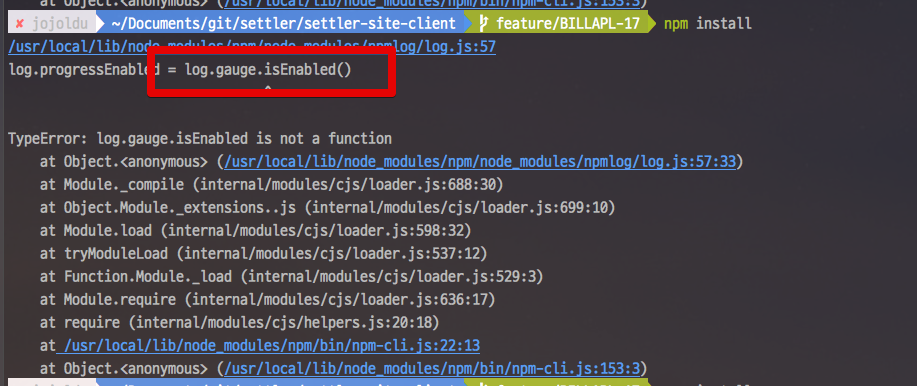
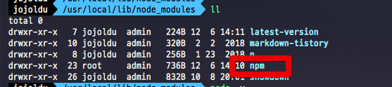
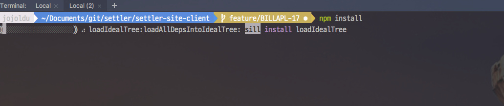

# Nodejs 버전업시 log.gauge.isEnabled 문제 발생할 경우

Vuejs, React, Angular 등의 프로젝트를 이용하다보면 npm 을 통한 패키지 관리는 필수입니다.  
이때 최신 Nodejs를 사용하기 위해 버전업을 할 경우 Npm이 반영되지 않아 문제가 될 경우가 종종 있습니다.  
  
구 버전의 Nodejs 프로젝트에서 Nodejs 버전을 업데이트 한 후에 ```npm install```을 진행하시면 아래와 같이 ```log.gauge.isEnabled()``` 오류가 발생할 수 있습니다.  
  
저의 경우 6.9.2 -> 10.14.1 로 업데이트 한 후에 발생했는데요.  



이럴 경우엔 **기존의 npm을 삭제하고 최신 버전으로 설치**하시면 문제를 쉽게 해결할 수 있습니다.  
  
하나씩 진행해보겠습니다.  
일단 기존 버전의 npm을 삭제합니다.



```bash
cd /usr/local/lib/node_modules
sudo rm -r npm
```

npm이 삭제되었습니다.  
삭제된 후에 최신 버전의 npm을 설치해야하는데, 여기서 한단계 문제가 있습니다.  
**npm은 npm을 통해서만 설치가 된다**는 것입니다.  
  
대신 새 Nodejs 버전을 설치할 경우 npm이 자동 설치 된다는 점을 이용해서 최신 버전을 설치를 진행합니다.  
  
기존 npm이 삭제 되셨다면 최신버 전외에 다른 버전의 nodejs 버전을 선택합니다.  
  
> Nodejs 버전의 경우 일반적으로 [nvm](https://github.com/creationix/nvm) 혹은 [n](https://github.com/tj/n)을 이용합니다.  

저의 경우 10.14.0 버전 (최신 버전 보다 한단계 아래) 으로 n을 통해 전환했습니다.  

```bash
n 10.14.0
```

자동 설치된 npm을 통해 최신 버전의 npm을 설치합니다.

```bash
npm install latest-version
```

변경 하신 후, nodejs 버전을 다시 최신 버전으로 돌아갑니다.

```bash
n 10.14.1
```

그리고 다시 ```npm install```을 진행해보시면!



더이상 오류 없이 실행되는 것을 확인할 수 있습니다.