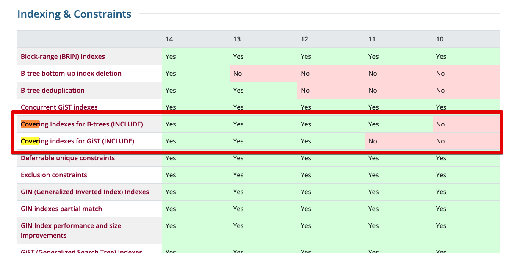
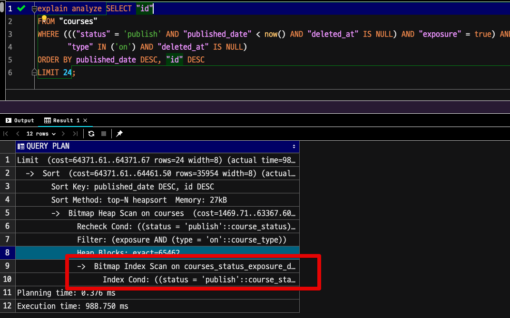
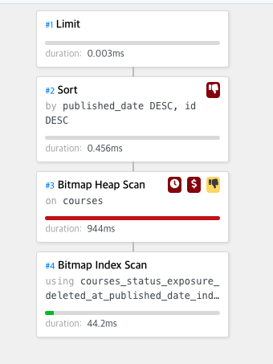
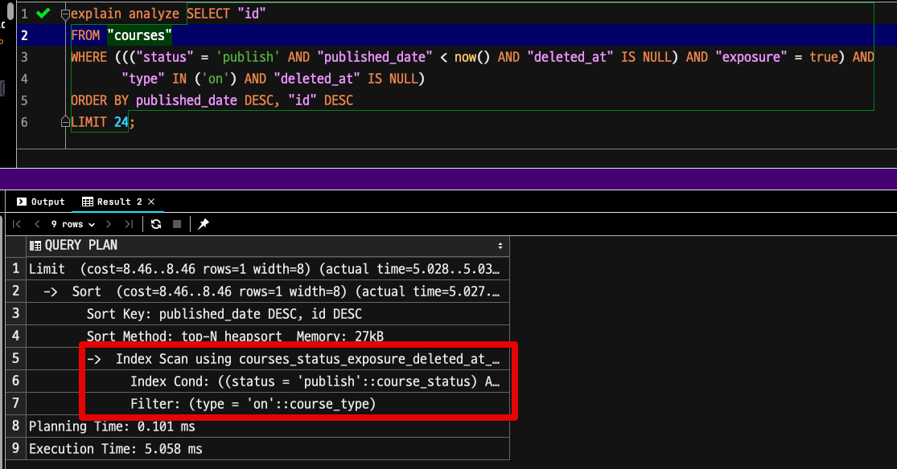
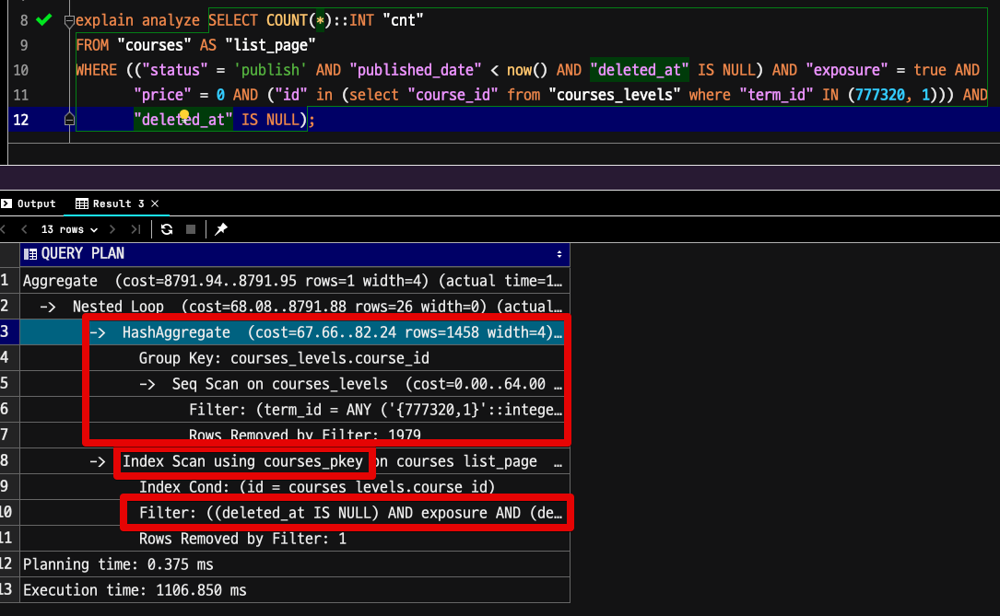
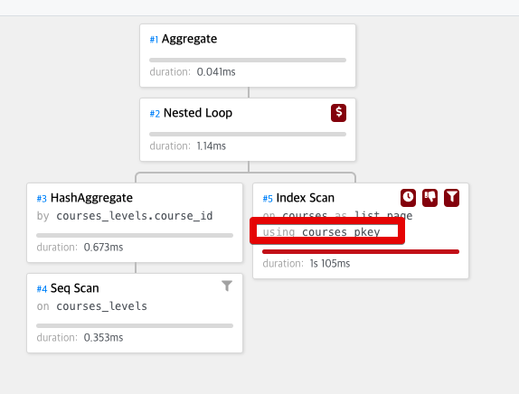
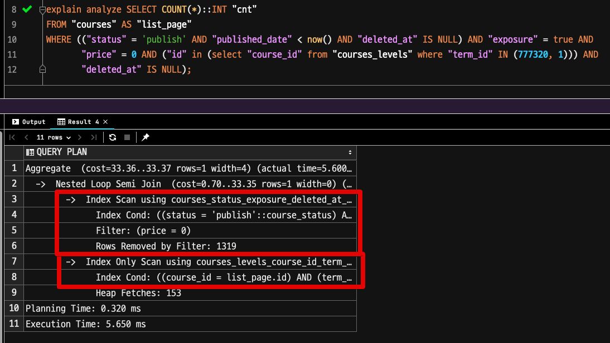
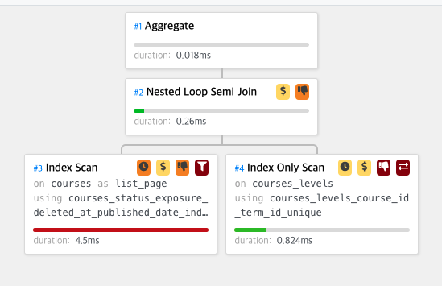
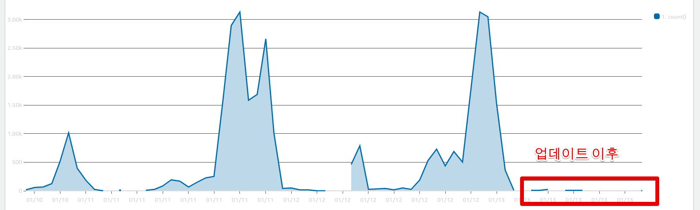

# PostgreSQL (Aurora) 10 vs 11 버전 성능 비교

PostgreSQL은 버전별로 굉장히 많은 개선이 있다.  
2022년 1월 13일 현재, AWS RDS Aurora는 PostgreSQL 버전을 10, 11, 12, 13까지 지원하고 있다.  

> 실제 PostgreSQL은 14까지 나와있으며, 현재 Aurora가 아닌 RDS는 [14 RC1](https://aws.amazon.com/ko/about-aws/whats-new/2021/10/postgresql-14-rc-1-amazon-rds-database-preview-environment/) 까지 준비되었다.

10 버전이 이미 출시된지 4년 이상 지났고, 현재까지 메이저 14버전까지 출시되면서 **성능/자원관리/기능등 여러 개선**이 있었다.  
  
특히나 인덱스가 10.x에서 비효율적으로 작동하는 부분이 굉장히 크기 때문에 이를 버전 업그레이드를 통해 성능개선 효과를 볼 필요가 있다.

## 10 vs 11 비교 

PostgreSQL의 10 ~ 14버전 간 여러 기능 비교 중, 인덱스 & 제약조건에 관한 비교를 본다.



* [PostgreSQL feature Matrix](https://www.postgresql.org/about/featurematrix/)


10버전대에서 두드러지는 인덱스 단점은 

* B-tree 커버링 인덱스 미지원
* PK 인덱스 우선
  
등이 있다.  
  
그러다보니 **커버링 인덱스를 생성해도 제대로 효과를 못본다**.  

> [커버링 인덱스란?](https://jojoldu.tistory.com/476)

11버전으로 업데이트만 되어도 얼마나 큰 성능효과가 있는지 살펴보자.  
  
> 아래 모든 쿼리는 **성능 차이가 심하게 나는 쿼리들을 위주로** 선택했다.  
> 모든 쿼리에서 성능향상이 더 있다는 것을 의미하진 않는다.  
> 다만, 성능이 더 떨어지진 않는다.

## Case1

예제 쿼리

```sql
SELECT "id"
FROM "courses"
WHERE ((("status" = 'publish' AND "published_date" < now() AND "deleted_at" IS NULL) AND "exposure" = true) AND
       "type" IN ('on') AND "deleted_at" IS NULL)
ORDER BY published_date DESC, "id" DESC
LIMIT 24;
```

### 10.x



* **Bitmap Index Scan만 적용**되는 것을 볼 수 있다.
* 총 수행시간도 988ms (약 **1초**)



### 11.x 

동일한 쿼리를 11버전에서 수행해본다.



* **Btree 인덱스가 제대로 적용**된 것을 볼 수 있다.
* 총 수행시간도 **5ms** (기존 대비 약 200배 성능 향상)

> 쿼리 캐시로 인해 실험 결과 오염이 될 수 있어서, **아예 DB를 10버전과 11버전으로 2대를 새로 만들어서** 수행했다. 

 

## Case2

예제 쿼리

```sql
explain analyze SELECT COUNT(*)::INT "cnt"
FROM "courses" AS "list_page"
WHERE (("status" = 'publish' AND "published_date" < now() AND "deleted_at" IS NULL) AND "exposure" = true AND
       "price" = 0 AND ("id" in (select "course_id" from "courses_levels" where "term_id" IN (777320, 1))) AND
       "deleted_at" IS NULL);
```

### 10.x



* PK 인덱스가 선적용되어서 실제 더 좋은 효율을 자랑하는 다른 인덱스를 선택하지 못했다.
  * 조회 조건에 `"id" in (select "course_id" from "courses_levels" where "term_id" IN (777320, 1))` 가 있기 때문이다.
* 총 수행시간은 **1.1초**



### 11.x



* PK 인덱스가 아닌 courses_status_exposure_deleted_at 이라는 조회조건의 대부분이 포함된 인덱스를 선택했다
* 총 수행시간은 **5ms** (약 **220배** 성능 향상)



## 결론

11버전으로 업데이트 이후, 2초이상의 쿼리들이 거의 대부분 사라졌다.  



PostgreSQL은 11, 12, 13, 14오면서 굉장한 성능 향상과 효율작업이 있었다.  

비교한 2개의 쿼리는 실제 운영중인 쿼리들이기 때문에 언제든 실제 업무에서 만나볼 수 있다.  
실험 결과만 본다면 비슷한 유형의 쿼리에서 200배의 성능향상을 볼 수 있었다.  
  
아무런 **트래픽이 없을때도 1초가 넘는 쿼리**들은 1) 트래픽이 몰리거나 2) 데이터가 더 적재되기 시작하면 언제든지 3초, 5초 이상의 롱쿼리가 될 수 있다.  
  
현재 Aurora에서는 10버전에서 13버전으로 한번에 올릴수있는 방법은 없다.
10 -> 11, 11 -> 12, 12 -> 13과 같이 1단계 업데이트만 가능한데,  
긴 일정을 잡고 버전업을 계속해서 진행하는 것이 **동일한 하드웨어 스펙으로 성능 개선 효과**를 볼 수 있는 방법 중 하나라고 생각한다.