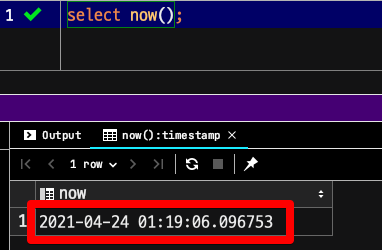
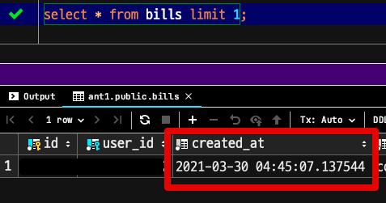
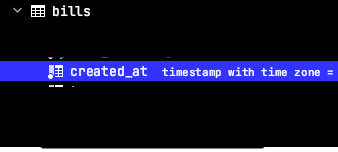
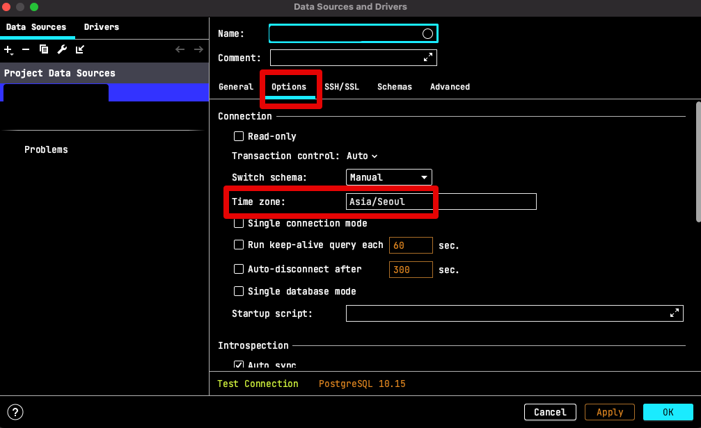
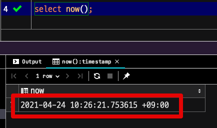
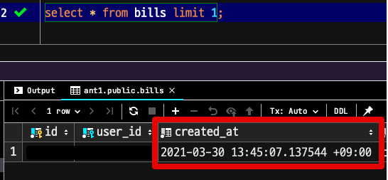

# PostgreSQL 데이터 Client에서 KST로 확인하기 (feat. DataGrip)

PostgreSQL에서는 보편적으로 UTC로 시간 데이터를 저장후, 애플리케이션 / Gui Client에서의 타임존에 맞춰 노출시키는 방식을 선택하는데요. 

> 해당 컬럼의 타입이 `timestamp with time zone` 로 되어있어야만 합니다.

Client Timezone에 따라 자동 전환이 되다보니 서버 애플리케이션에서 접속 하게 되면 UTC가 KST로 잘 전환이되어 노출 되는데요.  
반면에 DB Gui Client로 접근할 경우 Client Timezone을 기본값으로 세팅하면 KST 전환이 안되는데요.  
    
그래서 JetBrains사의 데이터 전문 도구인 DataGrip 혹은 IntelliJ의 Database Client에서 Client Timezone을 설정하는 방법을 소개드립니다.

## as-is

먼저 

```sql
select now();
```

> 





## 설정





## to-be



