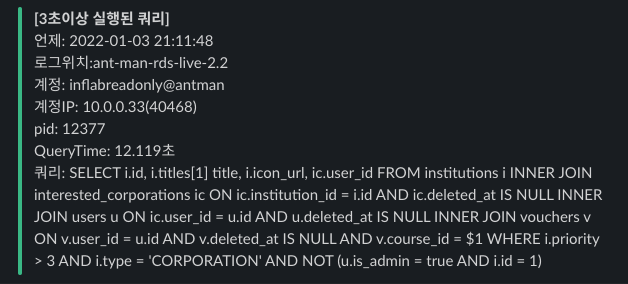
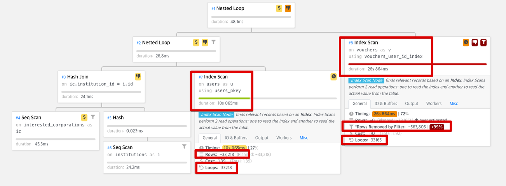
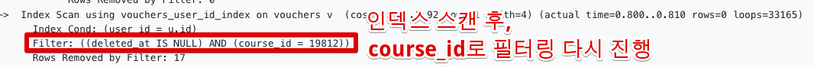
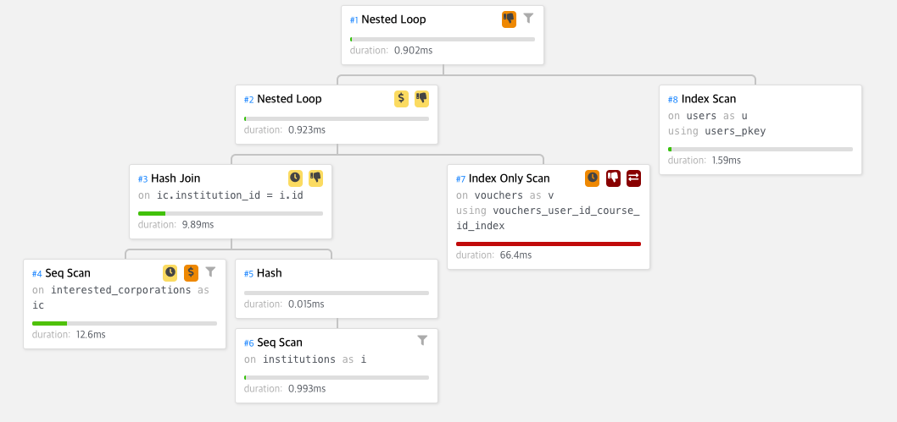
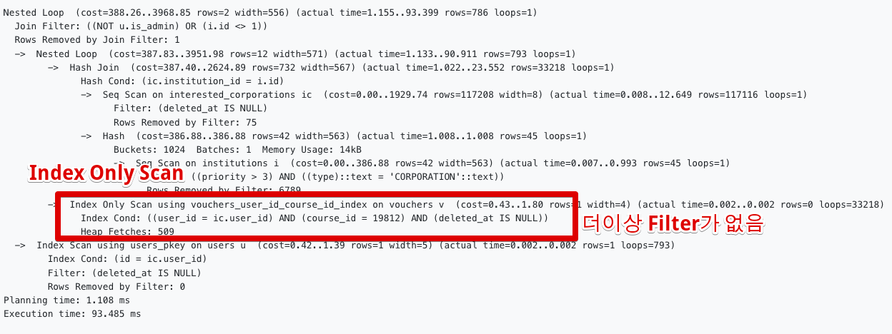

# 여러컬럼으로 Join 맺어야할 경우 인덱스 설계



실제 발생했던 쿼리)

 ```sql
SELECT i.id, i.titles[1] title, i.icon_url, ic.user_id
FROM institutions i
         INNER JOIN interested_corporations ic ON ic.institution_id = i.id AND ic.deleted_at IS NULL
         INNER JOIN users u ON ic.user_id = u.id AND u.deleted_at IS NULL
         INNER JOIN vouchers v ON v.user_id = u.id AND v.deleted_at IS NULL AND v.course_id = ?
WHERE i.priority > ?
  AND i.type = ?
  AND NOT (u.is_admin = true AND i.id = ?);
 ```

## 실행 계획

실행 계획을 돌려보면 다음과 같은 결과가 나온다

```sql
Nested Loop  (cost=388.26..5059.62 rows=2 width=556) (actual time=296.998..37097.171 rows=786 loops=1)
  Join Filter: (ic.user_id = v.user_id)
  ->  Nested Loop  (cost=387.82..3653.85 rows=726 width=571) (actual time=28.904..10185.405 rows=33165 loops=1)
        Join Filter: ((NOT u.is_admin) OR (i.id <> 1))
        Rows Removed by Join Filter: 9
        ->  Hash Join  (cost=387.40..2624.89 rows=732 width=567) (actual time=25.787..93.559 rows=33218 loops=1)
              Hash Cond: (ic.institution_id = i.id)
              ->  Seq Scan on interested_corporations ic  (cost=0.00..1929.74 rows=117208 width=8) (actual time=1.511..45.261 rows=117116 loops=1)
                    Filter: (deleted_at IS NULL)
                    Rows Removed by Filter: 75
              ->  Hash  (cost=386.88..386.88 rows=42 width=563) (actual time=24.243..24.244 rows=45 loops=1)
                    Buckets: 1024  Batches: 1  Memory Usage: 14kB
                    ->  Seq Scan on institutions i  (cost=0.00..386.88 rows=42 width=563) (actual time=2.377..24.221 rows=45 loops=1)
                          Filter: ((priority > 3) AND ((type)::text = 'CORPORATION'::text))
                          Rows Removed by Filter: 6789
        ->  Index Scan using users_pkey on users u  (cost=0.42..1.39 rows=1 width=5) (actual time=0.302..0.303 rows=1 loops=33218)
              Index Cond: (id = ic.user_id)
              Filter: (deleted_at IS NULL)
              Rows Removed by Filter: 0
  ->  Index Scan using vouchers_user_id_index on vouchers v  (cost=0.43..1.92 rows=1 width=4) (actual time=0.800..0.810 rows=0 loops=33165)
        Index Cond: (user_id = u.id)
        Filter: ((deleted_at IS NULL) AND (course_id = 19812))
        Rows Removed by Filter: 17
Planning time: 92.381 ms
Execution time: 37097.408 ms
```

총 37초가 수행되었다.

상세하게 보면, 테이블: `vouchers` 에서 **27초**, `users` 에서 **10초**가 수행되었다.



근데 여기서 그래프를 보면 vouchers는 **인덱스 스캔 인데도 28초**나 걸렸다.  
왜그럴까?  
이유는 **인덱스로 걸러지고 추가로 필터링 해야할 데이터가 아직도 많기 때문**이다.



문제가 되는 쿼리는 아래 1줄 영역이다

```sql
INNER JOIN vouchers v ON v.user_id = u.id AND v.deleted_at IS NULL AND v.course_id = ?
```

살펴보면 user_id 인덱스 (`vouchers_user_id_index`) 만 적용되었다.  
그래서 user_id 인덱스로 적용되어 나온 결과물을 **1건씩 filter 처리하면서 걸러내는 작업**을 하다보니 수십초가 걸렸다

## 해결책

RDBMS는 쿼리 사용시 **한 테이블에는 1개의 인덱스만 적용** 된다.  
즉, course_id 인덱스와 user_id 인덱스가 각각 있을 경우 **그 중에서 가장 효율적인 인덱스 1개만 적용** 된다.  
  
이럴 경우 **복합 컬럼 인덱스**를 잡아야 한다.  
복합컬럼의 경우 **조인 컬럼 -> 조건별 컬럼**으로 생성한다.  
현재의 경우 조인 컬럼 (`user_id`) → 조건컬럼 (`course_id, deleted_at`)으로 잡는다.

즉, 신규 인덱스는 다음과 같이 생성된다.

```sql
create index vouchers_user_id_course_id_index 
on vouchers (user_id, course_id, deleted_at);
```

이후 다시 쿼리를 수행하고 실행계획을 보면?





총 수행시간이 **0.093초** (93.ms)로 단축된 것을 확인할 수 있다. 