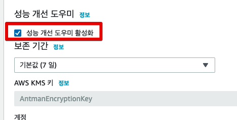
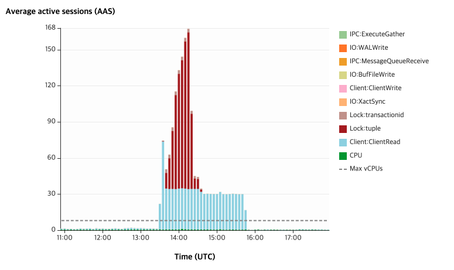
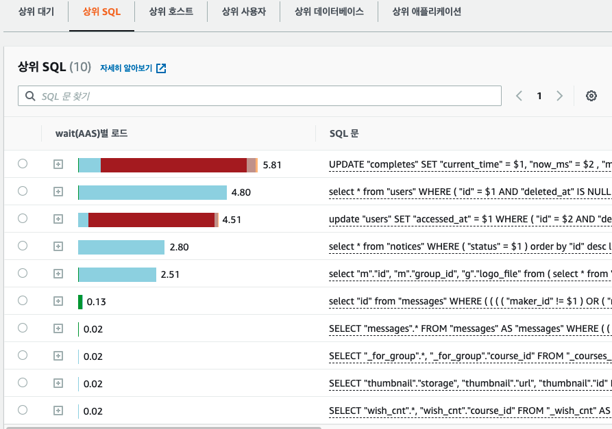
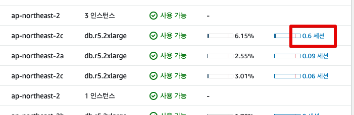
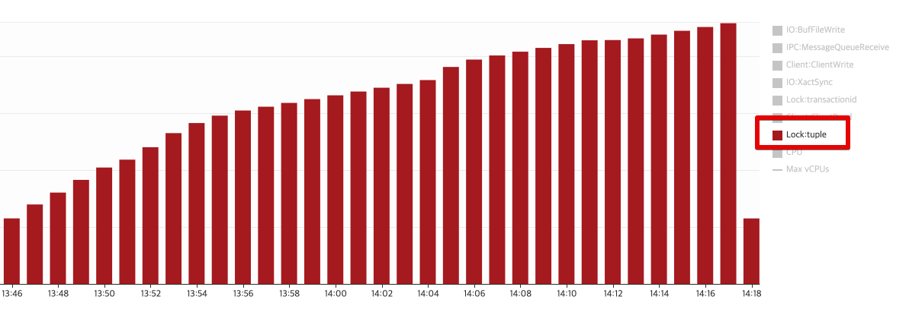
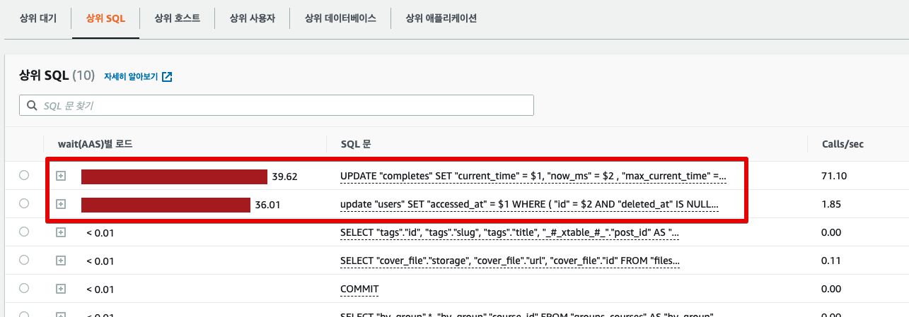
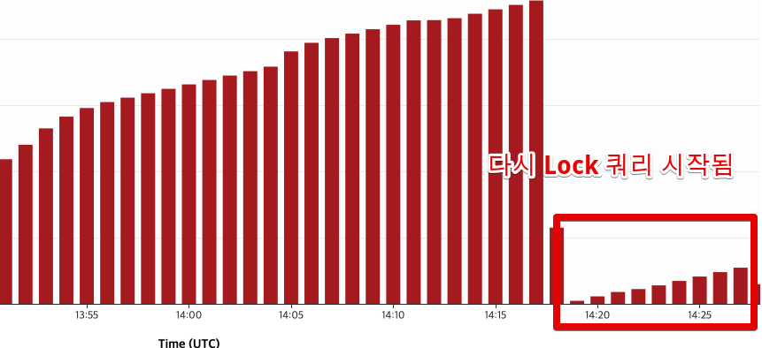
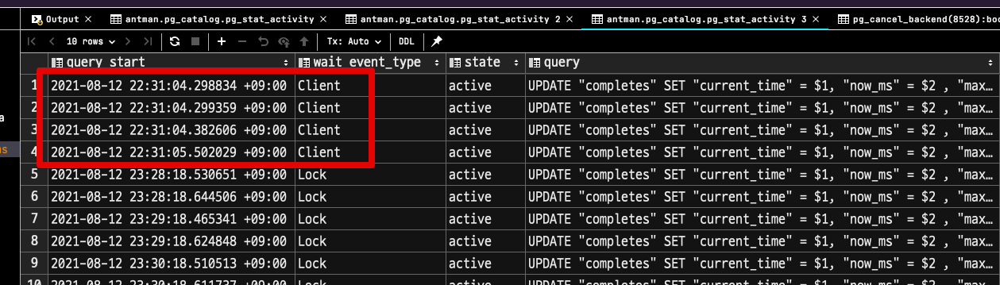
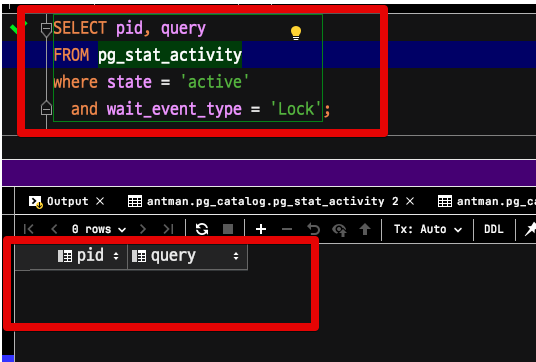

# (AWS Aurora) PostgreSQL에서 Lock 쿼리 확인하고 원인 종료하기

RDBMS를 사용하다보면 Lock 쿼리를 종종 만나게 되는데요.  
(AWS Aurora) PostgreSQL에서는 어떻게 Lock 쿼리를 모니터링하고, 처리하는지 알아보겠습니다.

> 기존의 온프레미스 환경에 익숙하시다면 그 방식을 그대로 선택하시면 되고, 여기서는 AWS Aurora 환경을 기반으로 진행합니다.

## 1. 성능 개선 도우미 설정

AWS RDS를 사용하면 [성능 개선 도우미](https://aws.amazon.com/ko/rds/performance-insights/)를 통한 모니터링을 지원 받을 수 있는데요.  
  
아래와 같이 처음 RDS 생성시 혹은 수정을 통해 설정이 가능합니다.



이렇게 성능 개선 도우미를 활성화시키면 성능과 관련된 여러가지 지표들을 손쉽게 모니터링할 수 있습니다.





(이번에 이야기할 Lock 쿼리 역시 성능 개선 도우미를 통해 확인이 가능하기 때문에, 이를 기반으로 설명할 예정입니다.) 
  
성능 개선 도우미의 경우 테스트 결과 대략 8~10%의 성능 하락이 있다는 테스트 결과가 있는데요. 

* [우아한형제들 기술 블로그 - Performance Insight 써도 돼요?](https://techblog.woowahan.com/2593/)

다만, 이런 성능 모니터링의 경우 다른 모니터링을 쓴다하더라도, 이정도의 상세한 지표를 보려면 비슷한 성능하락이 있기 때문에 충분히 감안할만한 트레이드 오프라고 생각합니다.  
  
성능 개선 도우미를 활성화시켰다면 아래와 같이 RDS 데이터베이스 목록에서 **세션**에 해당하는 항목을 클릭해서 성능 개선 도우미 모니터링 화면으로 이동 가능합니다.



## 2. Lock 쿼리 확인

Lock 쿼리가 진행중이라면, 성능 개선 도우미에서 아래와 같이 Lock 지표가 계속해서 올라가는 것을 볼 수 있습니다.



그리고 해당 Lock 쿼리들이 무엇인지 역시 확인할 수 있습니다.



이렇게 Lock 쿼리들을 찾아냈다면 **해당 쿼리들을 종료만 시키면 될 것 같습니다**.

## 3. Lock 쿼리 종료

해당 쿼리들의 Process ID (pid) 를 확인 하기 위해 다음과 같이 쿼리로 확인해봅니다.

```sql
SELECT pid, query
FROM pg_stat_activity
where state = 'active'
  and wait_event_type = 'Lock';
```

여기서 출력된 `pid`를 아래 쿼리를 통해 **취소**시킬 수 있는데요.

```sql
SELECT pg_cancel_backend(pg_stat_activity.pid)
```

이번처럼 수십개 ~ 수백개의 Lock 쿼리들이 진행중이라면 **하나씩 종료하기에는 어렵습니다**.  
그래서 아래처럼 쿼리를 작성하시면 현재 Lock 쿼리들을 모두다 취소시킬 수 있습니다.

```sql
SELECT pg_cancel_backend(pg_stat_activity.pid)
FROM pg_stat_activity
WHERE state = 'active'
  and wait_event_type = 'Lock'
  AND pid <> pg_backend_pid();
```

그렇지만,  
이렇게 Lock 쿼리들을 취소시켜도 그 순간만 줄어들뿐 **다시 Lock쿼리들이 증가**하는데요.



이는 Lock의 원인이 되는 **근본 쿼리는 여전히 남아 있기 때문**입니다.

### 3-1. 근본 원인 쿼리 Kill

위 Lock쿼리들과 **동일한 형태의 쿼리**들을 다 조회해봅니다.  
(즉, Lock 상태 뿐만 아니라 활성화만 되어있으면 모두 다 대상으로)

```sql
SELECT query_start, wait_event_type, state, query
FROM pg_stat_activity
where state = 'active' and query like 'UPDATE \"completes\"%'
order by query_start;
```

그럼 아래와 같이 **Lock외에 다른 쿼리가 있음**을 알 수 있는데요.



위 쿼리 확인 시간은 **23:30분**이였으니, 위 4개 쿼리는 **1시간째 Lock의 원인이 되어 실행중인 상태**였습니다.  
  
저 4개의 쿼리가 끝나지 않아, 계속해서 동일한 테이블을 쓰는 쿼리들이 전부 Lock이 되고 있었습니다.  
  
근본 원인을 알게 됐으니 해당 쿼리들만 빠르게 취소시켜봅니다.  
  
만약 **취소가 안되어서 강제종료**라도 해야한다면 아래의 쿼리로 진행하시면 됩니다.

```sql
select pg_terminate_backend(pid);
```

이후 다시 Lock 쿼리들을 조회해보시면 더이상 Lock 쿼리는 없는 것을 볼 수 있습니다.



성능 개성 도우미 지표 역시 더이상 Lock 지표가 나오지 않는 것을 확인할 수 있습니다.

