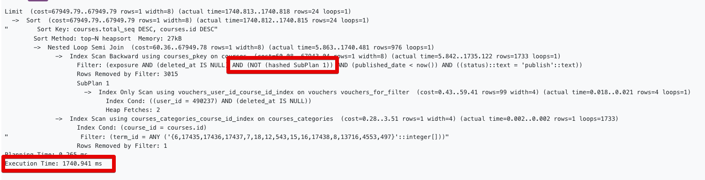
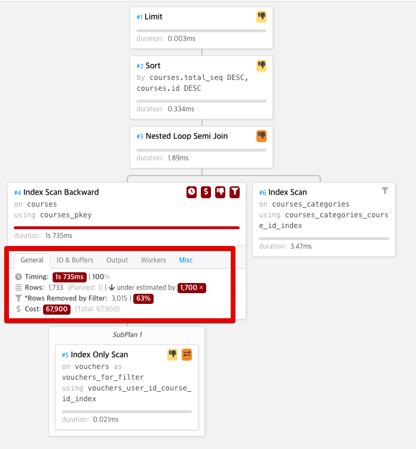
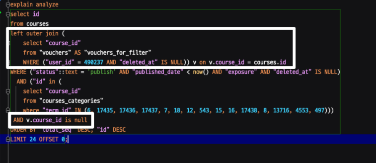
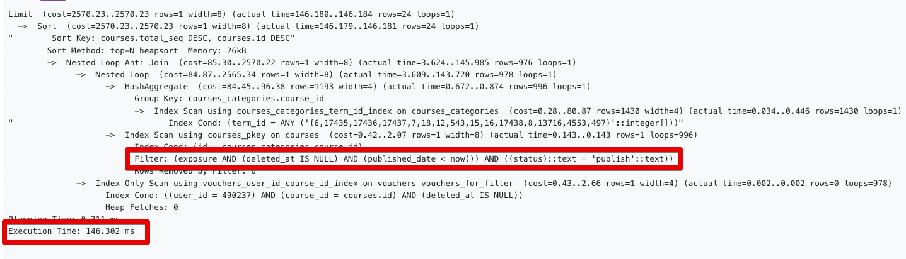
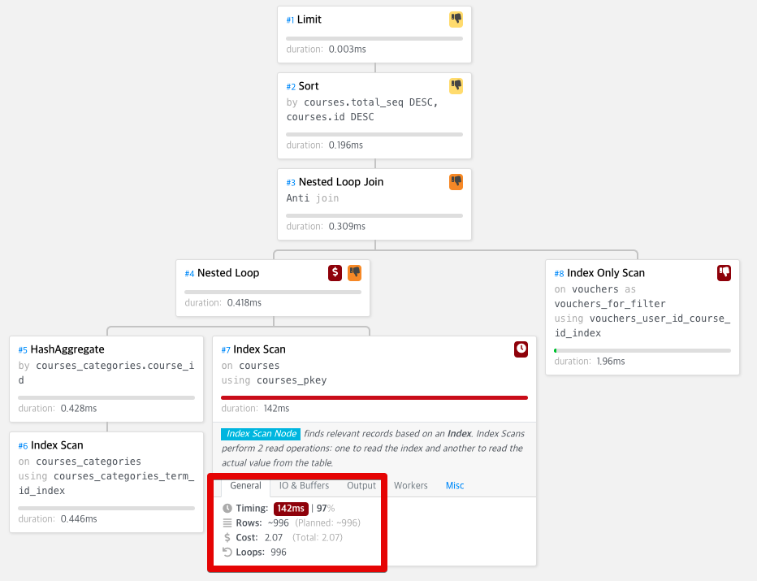
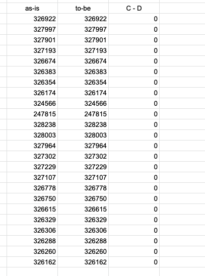

# NOT IN 쿼리 성능 개선하기 (PostgreSQL)

일반적으로 모든 RDBMS에서 부정조건 (`not in`, `!=` 등) 은 인덱스를 선택하지 못한다.  
이는 부정조건이 그 조건 외 나머지 모두를 뜻하기 때문인데, 지정된 대상을 빨리 찾는것이 인덱스임을 고려하면 그것 외 나머지라는 것 자체가 전체를 읽어야만 알 수 있는 정보이기 때문이다.  
  
이럴때 가장 효율적인 해결 방법은 `not in` 을 없애는 것이다.  
가장 대표적으로는 `left outer join` 이 있다.

# 예시1)

## as-is)

아래의 쿼리는 현재 거의 2초에 가까운 시간이 소요되는 쿼리이다.

```sql
select id
from courses
WHERE ("status"::text = 'publish' AND "published_date" < now() AND "exposure" AND "deleted_at" IS NULL)
  AND ("id" in (
    select "course_id"
    from "courses_categories"
    where "term_id" IN (6, 17435, 17436, 17437, 7, 18, 12, 543, 15, 16, 17438, 8, 13716, 4553, 497)))
  AND "id" NOT IN (
    select "course_id"
    from "vouchers" AS "vouchers_for_filter"
    WHERE ("user_id" = 490237 AND "deleted_at" IS NULL))
ORDER BY "total_seq" DESC, "id" DESC
LIMIT 24 OFFSET 0;
```

실행계획을 보면 `NOT SubQuery` 로 인해 지연이 발생한다는 것을 알 수 있다.

위 쿼리에서는 이 조건절 때문이다.

```sql
"id" NOT IN (
    select "course_id"
    from "vouchers" AS "vouchers_for_filter"
    WHERE ("user_id" = 490237 AND "deleted_at" IS NULL))
```



<br/><br/>




이 `not in` 을 `left outer join` 으로 풀어보자

## to-be)

지연이 발생했던 `not in (서브쿼리)` 조건을 `left outer join (서브쿼리)` 로 변경했다. 

```sql
select id
from courses
left outer join (
    select "course_id"
    from "vouchers" AS "vouchers_for_filter"
    WHERE ("user_id" = 490237 AND "deleted_at" IS NULL)) v on v.course_id = courses.id
WHERE ("status"::text = 'publish' AND "published_date" < now() AND "exposure" AND "deleted_at" IS NULL)
  AND ("id" in (
    select "course_id"
    from "courses_categories"
    where "term_id" IN (6, 17435, 17436, 17437, 7, 18, 12, 543, 15, 16, 17438, 8, 13716, 4553, 497)))
 AND v.course_id is null
ORDER BY "total_seq" DESC, "id" DESC
LIMIT 24 OFFSET 0;
```

추가된 쿼리는 다음과 같다.




* 조건절에 해당하는 데이터를 임시 테이블로 뽑아 `left outer join` 으로 처리한 뒤,
* **매칭되지 않는 경우엔 우측 테이블의 값이 null** 인것을 노린 쿼리이다.  
  * `not in`과 동일한 효과  
  
실제 수행해보면



<br/><br/>




실행 결과와 성능이 준수하게 나오는 것을 볼 수 있다.  
기존 1.7 ~ 2초였던 쿼리가 **0.146초**로 **약 10배이상** 성능 향상이 된 것을 확인할 수 있다.  
  
혹시나 쿼리문 자체가 변경되어서 결과가 다를수 있기 때문에 결과 역시 검증해본다



결과 역시 동일한 것을 확인할 수 있다.
