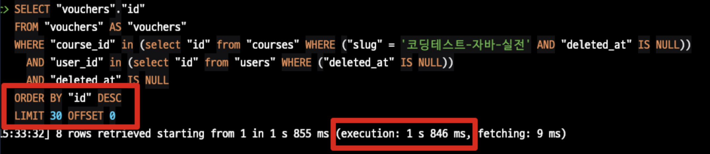
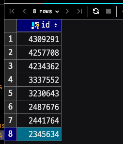
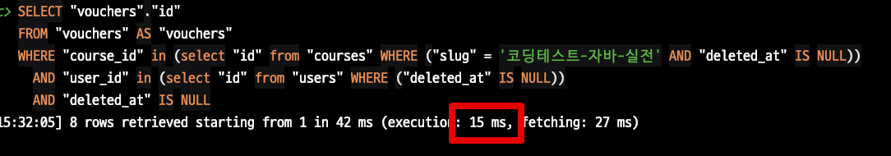
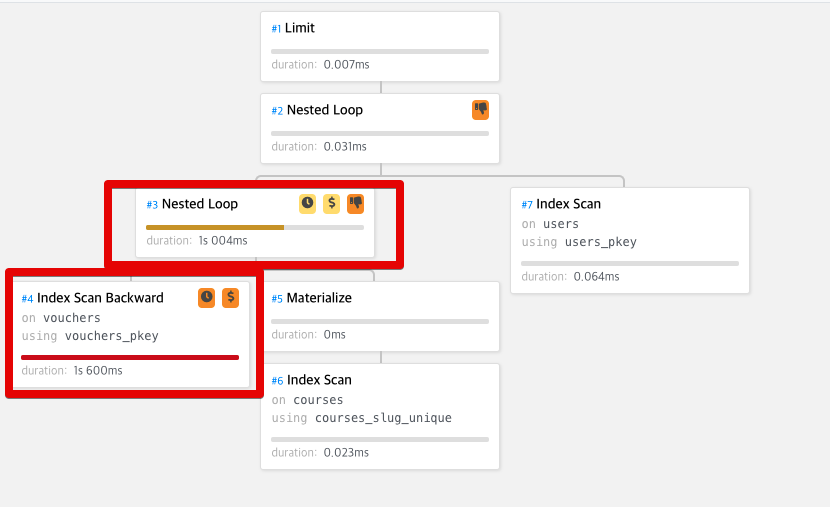
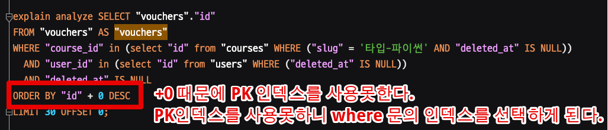
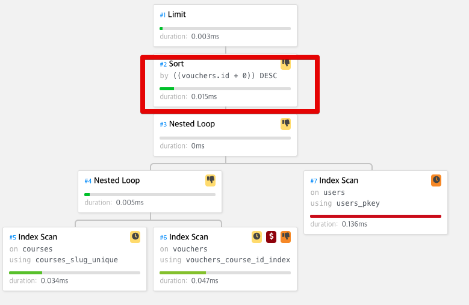
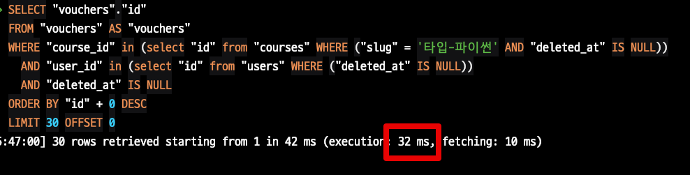

# PostgreSQL에서 Order By가 선적용되는 슬로우 쿼리 해결책

PostgreSQL 10.x 를 사용하다보면 간혹 옵티마이저가 잘못된 판단을 할때가 있습니다.  
이번 경우에는 `Order By` 가 선 적용되는 실행계획을 어떻게 개선할지 알아보겠습니다.

## 1. 문제 상황

이를 테면 아래 쿼리의 경우 보통 1~5초 정도 수행됩니다.

```sql
SELECT "vouchers"."id"
FROM "vouchers" AS "vouchers"
WHERE "course_id" in (select "id" from "courses" WHERE ("slug" = '코딩테스트-자바-실전' AND "deleted_at" IS NULL))
  AND "user_id" in (select "id" from "users" WHERE ("deleted_at" IS NULL))
  AND "deleted_at" IS NULL
ORDER BY "id" DESC
LIMIT 30 OFFSET 0;
```



쿼리 자체가 복잡하고, 대상이 되는 테이블들의 데이터가 많아서 그런게 아닐까 싶지만 실제로는 `course` 를 지정해서 진행하기 때문에 전체 조회 결과는 10~100건 사이입니다.



(Limit 없이 전체 조회시 결과는 **총 8건**뿐)  
  
그래서 `order by` 만 빼고 다시 수행해보면 **0.015초** 라는 기존 3~4초에 비해서는 **200~300배** 향상된 성능을 보여줍니다.



## 2. 문제 분석

**order by를 뺐더니 0.015초, order by를 넣으면 1~5초** 가 걸리는 이유는 무엇일까요?  
  
쉽게 짐작할 수 있겠지만, 실행계획을 보면 **선 정렬 -> 후 필터**를 하기 때문입니다.



즉, **400만건이 넘는 voucher를 id로 먼저 desc 정렬**시킨후, 그 뒤에 where 문을 적용해서 걸러내기 때문입니다.  
  
이렇게 정렬을 먼저 하는 이유는 **옵티마이저가 PK 인덱스를 기준으로 읽으면서 조건을 검증**하는 것이 조건으로 먼저 걸러내고 후정렬 하는것보다 빠르다고 판단했기 때문입니다.

## 3. 해결 방법

명백히 옵티마이저가 잘못 선택했기 때문에 옵티마이저가 잘 선택할 수 있도록 가이드가 필요합니다.  
  
보통 2가지 방법이 있는데,

* 어느 인덱스를 선택할지 인덱스를 강제화하던가
* 옵티마이저가 원하는 인덱스를 선택하도록 쿼리문을 개조하던가

일반적으로는 인덱스를 강제화하는건 조건문 변경 / 인덱스 변경 / 인덱스 추가 / DB 버전 변경으로 인한 인덱스 작동방식 변경 등에 대해서 대처하기가 어렵습니다.  
  
그래서 2번째 방법인 **옵티마이저가 좋은 인덱스를 타도록 쿼리문을 개조**하는 방식을 선택합니다.  
  
여기서는 **PK인덱스로 정렬에 대한 우선 순위를 낮추도록** 쿼리를 변경합니다.



```sql
select "vouchers"."id"
FROM "vouchers" AS "vouchers"
WHERE "course_id" in (select "id" from "courses" WHERE ("slug" = '타입-파이썬' AND "deleted_at" IS NULL))
  AND "user_id" in (select "id" from "users" WHERE ("deleted_at" IS NULL))
  AND "deleted_at" IS NULL
ORDER BY "id" + 0 DESC
LIMIT 30 OFFSET 0;
```

실제 실행계획을 보면



Sort가 거의 마지막에 수행됩니다.  
(Limit이 마지막, Sort는 마지막 바로 직전)  
  
수행해보면 Order by 없을때와 마찬가지로 0.0X초만에 결과가 출력됩니다.




