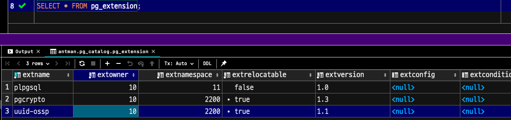
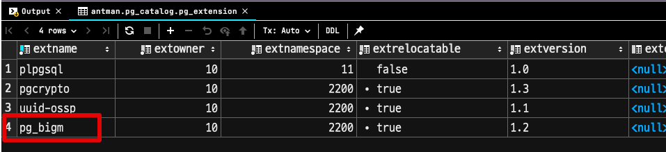
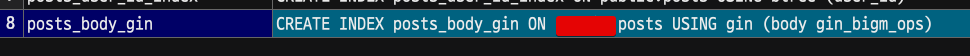
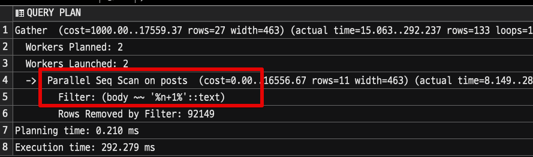

# Amazon Aurora PostgreSQL 에서 pg_bigm 확장 사용하기


2021.06.17 드디어 Amazon Aurora PostgreSQL 에서 [pg_bigm](https://pgbigm.osdn.jp/pg_bigm_en-1-2.html)을 지원하게 되었습니다.

* [release notes](https://aws.amazon.com/ko/about-aws/whats-new/2021/06/amazon-aurora-postgresql-supports-pg-bigm-extension-for-faster-full-text-search/)

기존까지는 Aurora가 11.9 / 12.4 까지만 지원하여서 `pg_bigm` 을 쓰려면 **PostgreSQL Amazon RDS** 를 사용해야만 했는데요.  
  
Aurora PostgreSQL 버전이 업데이트 되면서 (11.11 / 12.6 / 13.2) 가 드디어 Aurora에서도 `pg_bigm` 를 쓸 수 있게 되었습니다.

## 1. 지원 대상

모든 Aurora PostgreSQL에서 `pg_bigm`을 사용할 수 있는것은 아닙니다.  
아래 PostgreSQL 호환 버전에서만 가능한데요.

* PostgreSQL 13 : PostgreSQL 13.2 이상
* PostgreSQL 12 : PostgreSQL 12.6 이상
* PostgreSQL 11 : PostgreSQL 11.11 이상
* PostgreSQL 10.x : 지원 X
* PostgreSQL 9.x  : 지원 X

현재는 **각 메이저의 가장 최신 버전** Aurora에서만 사용할 수 있습니다.  

## 2. pg_bigm?

이를테면 아래와 같은 쿼리는 일반적인 RDBMS에서 **인덱스를 사용할 수 없습니다**.  

```sql
select *
from posts
where body like '%튜닝%'
```

일반적인 B-Tree 인덱스의 경우, `LIKE` 를 통한 검색은 `검색어%`만 인덱스를 탈 수 있습니다.  
이유는 인덱스가 **LEFT-TO-RIGHT** 방식이기 때문인데요.  
지금처럼 검색어 (`튜닝`) 앞에 `%`가 붙은 경우에는 인덱스를 사용할 수가 없게 됩니다.  
  
뿐만 아니라 B-Tree 인덱스는 **짧은 문자열 혹은 숫자** 타입의 컬럼에서 효과적인데, 대량의 문자열이 있는 (`TEXT`)의 경우에 B-Tree 인덱스는 효과적이지 못합니다.  
  
그래서 기존 하위 버전에서는 이 문제를 `pg_trgm`을 통해 해결하곤 했는데요.  


### pg_tram vs pg_bigm


pg_bigm 모듈은 PostgreSQL 에서 전체 텍스트 검색 기능을 제공 합니다.  
이 모듈을 사용하면 더 빠른 전체 텍스트 검색 을 위해 2그램 (빅 그램 ) 인덱스 를 만들 수 있습니다.  

pg_bigm을 사용하면 2그램(바이그램) 인덱스를 생성하여 다중 바이트 문자로 인코딩된 텍스트의 전체 텍스트 검색 속도를 개선할 수 있습니다.

## 3. 설치

```sql
SELECT * FROM pg_extension;
```



```sql
CREATE EXTENSION pg_bigm;
```

```sql
SELECT * FROM pg_extension;
```




## 4. 사용법

```sql
CREATE INDEX posts_body_gin ON posts USING gin (body gin_bigm_ops);
```

```sql
SELECT indexname, indexdef
  FROM pg_indexes
 WHERE tablename = 'posts';
```






