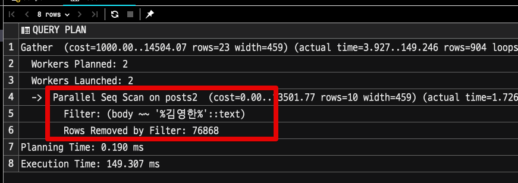
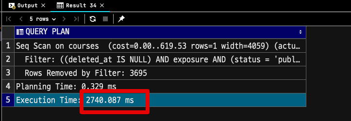
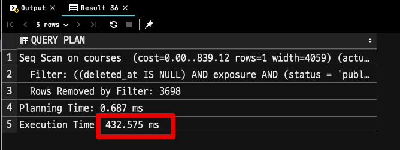
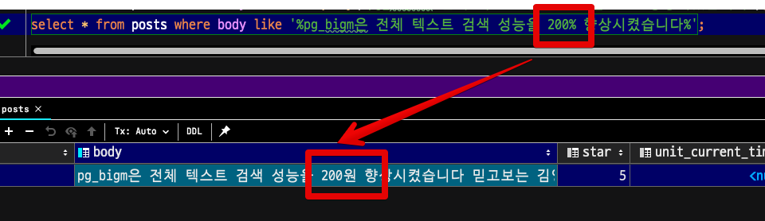
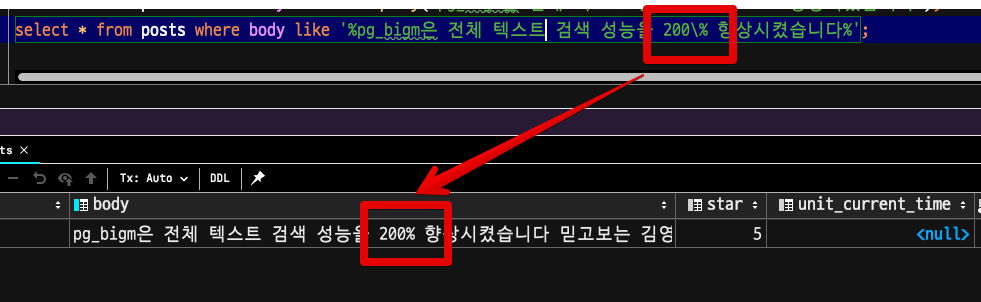
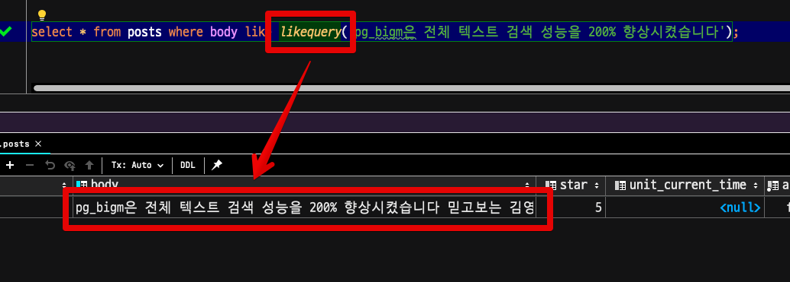

# Amazon Aurora PostgreSQL 에서 pg_bigm 확장 사용하기


2021.06.17 드디어 Amazon Aurora PostgreSQL 에서 [pg_bigm](https://pgbigm.osdn.jp/pg_bigm_en-1-2.html)을 지원하게 되었습니다.

* [release notes](https://aws.amazon.com/ko/about-aws/whats-new/2021/06/amazon-aurora-postgresql-supports-pg-bigm-extension-for-faster-full-text-search/)

기존까지는 Aurora가 11.9 / 12.4 까지만 지원해서 `pg_bigm` 을 쓰려면 **PostgreSQL Amazon RDS** 를 사용해야만 했는데요.  
  
Aurora PostgreSQL 버전이 업데이트 되면서 (11.11 / 12.6 / 13.2) 가 드디어 Aurora에서도 `pg_bigm` 를 쓸 수 있게 되었습니다.  
  
그래 이번 시간에는 Amazon Aurora PostgreSQL 에서의 `pg_bigm`에 대해서 소개드리겠습니다. 

## 1. 지원 대상

업데이트가 되었다고해서 모든 Aurora PostgreSQL에서 `pg_bigm`을 사용할 수 있는것은 아닙니다.  
아래 PostgreSQL 호환 버전에서만 `pg_bigm`를 사용할 수 있는데요.

* PostgreSQL 13 : PostgreSQL 13.2 이상
* PostgreSQL 12 : PostgreSQL 12.6 이상
* PostgreSQL 11 : PostgreSQL 11.11 이상
* PostgreSQL 10.x : 지원 X
* PostgreSQL 9.x  : 지원 X

현재 (2021.08.08) 는 **각 메이저의 가장 최신 버전** Aurora에서만 사용할 수 있습니다.  

## 2. pg_bigm?

pg_bigm 모듈은 PostgreSQL 에서 **전체 텍스트 검색 기능** (full text search) 를 제공 합니다.  
이 모듈을 사용하면 더 빠른 전체 텍스트 검색 을 위해 `2-gram` 인덱스를 만들 수 있는데요.  
여기서 `2-gram` 인덱스라는 것은 문자열의 **연속된 2개 문자마다 인덱스 항목을 만드는 것**을 의미합니다.  

> `bigm` 은 `bi-gram` 의 약자 입니다.

즉, 대량의 텍스트의 **중간 일치 검색** (`like %검색어%`)에 사용할 GIN 방식의 인덱스를 제공하는 모듈을 이야기 합니다.  
  
이를테면 아래와 같은 쿼리는 일반적인 RDBMS에서 **인덱스를 사용할 수 없습니다**.  

```sql
select *
from posts
where body like '%튜닝%'
```

대부분의 RDBMS의 기본 인덱스인 B-Tree 인덱스의 경우, `LIKE` 를 통한 검색은 `검색어%`만 인덱스를 탈 수 있습니다.  
이유는 B-Tree 인덱스가 **LEFT-TO-RIGHT** 방식이기 때문인데요.  
  
지금처럼 검색어 (`튜닝`) 앞에 `%`가 붙은 경우에는 인덱스를 사용할 수가 없게 됩니다.  
  
뿐만 아니라 B-Tree 인덱스는 **짧은 문자열 혹은 숫자** 타입의 컬럼에서 효과적인데, 대량의 문자열이 있는 (`TEXT`)의 경우에 B-Tree 인덱스는 효과적이지 못합니다.  
(이를테면 블로그의 본문에서 `like` 검색을 해야한다면 **HTML과 텍스트가 섞여있다**보니 엄청나게 많은 문자열이 있는 컬럼을 인덱스에 담아야하고, 이 인덱스 안에서 탐색을 해야하는것이죠.)  
  
그래서 기존 하위 버전에서는 이 문제를 `pg_trgm`을 통해 전체 텍스트 검색 기능에 대한 성능 문제와 인덱스 문제를 해결하곤 했는데요.  
  
그럼 이번 버전부터 사용가능한 `pg_bigm`과 기존에도 사용가능했던 `pg_trgm` 는 어떤 차이가 있을까요?

### 2-1. pg_trgm vs pg_bigm

3-gram(trigram) 모델을 이용한 전체 텍스트 검색 기능을 제공 하는 `pg_trgm` 과 이를 기반으로 하는 `pg_bigm`은 다음과 같은 차이점이 있습니다.


| 기능                                   | `pg_trgm`       | `pg_bigm`       |
| -------------------------------------- | --------------- | --------------- |
| 전체 텍스트 검색에 필요한 최소 단어수  | 3단어           | 2단어           |
| 사용 가능한 인덱스                     | `GIN`,  `GiST`  | `GIN`           |
| 사용 가능한 검색 연산자                | `like`, `ilike` | `like`          |
| 한국어 지원 여부                       | X               | O               |
| 1-2자 키워드로 전체 텍스트 검색시 성능 | 느림            | 빠름            |
| 유사성 검색                            | O               | O (1.1버전부터) |
| 최대 인덱스 컬럼 사이즈                | ~228MB          | ~102MB          |

여러가지 차이가 있지만, 실질적으로 **한국어 인덱스를 지원한다는 것**입니다.  
기존의 `pg_trgm` 은 **한국어가 지원 안되었습니다**.  
  
그래서 한글 텍스트가 포함된 컬럼의 전체 텍스트 검색 성능 향상을 위해서는 `pg_bigm`을 사용해야만 하는데요.  
  
다만 가장 큰 단점으로는 `pg_bigm` 은 알파벳의 **대/소문자를 동일하게 보지 못합니다**.  
즉, `ilike`로 대/소문자를 모두 묶어서 검색하던 방식으로는 `pg_bigm`을 사용할 수는 없습니다.  

## 3. 설치

Aurora PostgreSQL 최신 버전에서는 아래와 같은 방법으로 바로 `pg_bigm` 모듈을 사용할 수 있습니다.  
  
먼저 현재 사용 중인 모듈을 확인해봅니다.

```sql
SELECT * FROM pg_extension;
```

기본값으로는 `pg_bigm` 가 없는 것을 볼 수 있는데요.


아래 명령어로 모듈을 활성화시킵니다.

```sql
CREATE EXTENSION pg_bigm;
```

그리고 다시 확인해보시면

```sql
SELECT * FROM pg_extension;
```

모듈이 활성화 된 것을 볼 수 있습니다.


이렇게만 하시면 이제 `pg_bigm`을 사용할 수 있습니다.

## 4. 사용법

이제 `pg_bigm` 을 사용할 수 있는 `gin` 인덱스를 만들어봅니다.

```sql
CREATE INDEX posts_body_gin ON posts USING gin (body gin_bigm_ops);
```

* 기존 `gin` 인덱스 생성 방식에서 `gin_bigm_ops`로 변경만 해주시면 됩니다.

해당 인덱스가 잘 생성되었는지 확인해봅니다.

```sql
SELECT indexname, indexdef
  FROM pg_indexes
 WHERE tablename = 'posts';
```


자 그리고 이제 해당 인덱스가 잘 적용되는지 보겠습니다.  
  
동일한 데이터를 가진 복사된 테이블 2개를 가지고 테스트해볼건데요.  
  
먼저 `body` 컬럼에 **일반 인덱스가 적용된 테이블**에서 검색할 경우 입니다.

```sql
select * from posts2 where body like '%김영한%';
```

인덱스를 전혀 활용하지 못하는 것을 볼 수 있습니다.



그리고 `pg_bigm` (`gin`) 인덱스가 적용된 테이블에서의 조회 쿼리 실행계획을 봅니다.

```sql
select * from posts where body like '%김영한%';
```


보시는것처럼 `Bitmap Index Scan`이 적용되는 것을 볼 수 있습니다.

### 4-1. 성능

자 그럼 실제 드라마틱한 성능 차이가 발생하도록 대량의 데이터를 추가한 후 성능 테스트를 해보겠습니다.  
  
**일반 인덱스가 적용된 경우**



**pg_bigm 인덱스가 적용된 경우**



2.7초 vs 0.4초로 대략 6배의 성능 차이가 발생했는데요.  
아마도 더 많은 양의 텍스트와 Row를 등록했다면 더 많은 차이가 발생했을것으로 보입니다.

### 4-2. likequery

중간 문자열 검색 (`like %검색어%` 검색)을 하다보면 다음과 같이 **애플리케이션에서 항상 조치해야하는** 불편함이 있습니다.

* 매번 앞뒤로 `%`를 붙여야만 합니다.
* `%`에 `escapes`가 필요한 경우 검색어에 포함된 `%`를 찾아내 `escapes`를  붙여야만 합니다.

예를 들어 다음과 같이 `pg_bigm은 전체 텍스트 검색 성능을 200% 향상시켰습니다` 가 포함된 모든 텍스트 컬럼을 찾고 싶을 경우가 있습니다.

```sql
select * from posts where body like '%pg_bigm은 전체 텍스트 검색 성능을 200% 향상시켰습니다%';
```

이때 `성능을 200%` 에서 `%`는 `like` 검색의 `%`가 아니라 실제 문자 `%`로 작동해야하는데요.  
escapes하지 않으면 다음과 같이 `like` 검색의 `%` 로 작동하게 됩니다.



그래서 매번 아래와 같이 `escapes` 처리 (`\%`)를 합니다.

```sql
select * from posts where body like '%pg_bigm은 전체 텍스트 검색 성능을 200\% 향상시켰습니다%';
```



물론 중간 문자열 검색이니 **앞뒤로는 % 추가를 잊지말아야 하구요**.  
  
이런 작업을 매번 애플리케이션 레벨에서 해줘야하는 불편함을 해소해줄 `pg_bigm`의 `Function`으로 `likequery`가 있습니다.  
  
위에서 언급했던 

* 매번 앞뒤로 `%`를 붙여야 하는 것
* `%`에 `escapes`가 필요한 경우 검색어에 포함된 `%`를 찾아내 `escapes`를  붙여야하는 것

모두를 `likequery` 로 한번에 해결할 수 있습니다.

```sql
select * from posts where body like likequery('pg_bigm은 전체 텍스트 검색 성능을 200% 향상시켰습니다');
```



## 5. 마무리

전체 텍스트 검색에 있어서 `pg_bigm`을 도입하여 효과를 보려면 컬럼에 포함된 텍스트의 양이 많거나 자주 액세스가 있어 한번의 검색당 처리량을 줄이는 데 의미가있는 경우라고 할 수 있습니다.  
  
대량의 데이터가 인덱스로 만들어지기 때문에 이 인덱스로 인해서 해당 테이블의 `INSERT` 또는 `UPDATE` 에는 인덱스 업데이트 처리가 추가되므로 무작정 도입하기 보다는 테스트를 해보고 결정하시는 것을 추천드립니다.

## 참고

* [pg_bigm 1.2 공식 문서](https://pgbigm.osdn.jp/pg_bigm_en-1-2.html)
