# PostgreSQL RDS Slow log Slack으로 알람 보내기

서비스를 운영하다보면 여러가지 이유로 서버 장애가 발생합니다.  
그 중 가장 빈도수가 높은 원인은 **DB의 슬로우쿼리**일텐데요.  
어떤 쿼리가 언제, 얼마나 긴시간동안 수행되었는지에 대해 알람을 받거나 모니터링이 되어야 서비스에 이슈가 될만한 쿼리들을 지속적으로 탐지하고 개선이 가능하기 때문입니다.  
  
이번 시간에는 **AWS RDS PostgreSQL**에서 슬로우 쿼리에 대한 로그를 남기고 이에 대해 슬랙 알람을 보내도록 설정하는 방법을 진행하겠습니다.  

> 이번 시간에는 **PostgreSQL**로 진행하지만 MySQL도 DB 파라미터 설정등에 차이가 있지만, 전체 Flow는 거의 흡사하니 참고해서 진행 가능하실것 같습니다.

전체적인 구조는 다음과 같습니다.

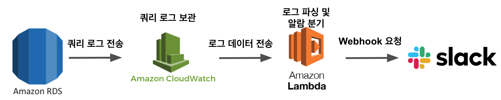

> 한번 이렇게 구성하고 나면 이후에 CloudWatch에 적재된 슬로우 쿼리를 ElasticSearch로 보내어 대시보드를 통한 슬로우쿼리 모니터링 시스템도 쉽게 구축할 수 있게 됩니다.  
> 이건 다음 시간에 소개드리겠습니다.

자 그럼 하나씩 진행해보겠습니다.

## 1. Slow Log 남기기

제일 먼저 할 것은 현재 RDS PostgreSQL에 슬로우 쿼리 로그를 남기는 것입니다.  
  
### 1-1. 파라미터 그룹 설정

사용하시는 RDS PostgreSQL의 **파라미터 그룹**에 접속해서 아래 2개 파라미터 변경을 해주시면 되는데요.

* `log_statement`
  * 총 4개의 상태값을 가질 수 있음
    * `none`, `ddl`, `mod`, `all`
  * DML (SELECT, UPDATE, DELETE, INSERT 등) 에 대한 로그만 남기고 싶다면 `mod`를 선택
* log_min_duration_statement
  * **지정된 시간 이상** 쿼리가 수행되면 로그를 남긴다
  * 단위는 ms / 즉, 1000로 지정할 경우 1초
  * 1000으로 할 경우 **1초이상 수행된 쿼리들은 모두 로그**로 남게된다.

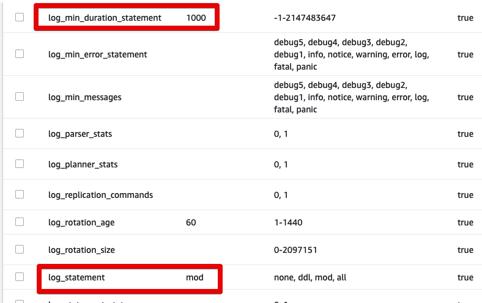

이렇게 하시고 나서 최종 저장을 하시면 **DB의 재시작**과 함께 적용됩니다.

> 주의하실 점은 RDS의 파라미터를 변경하게 되면 적용하기 위해서 **자동으로 DB가 재시작**됩니다.  
> HA가 되어있지 않고 단일 DB만 사용하신다면, **재부팅되는 동안 서비스 전체가 정지**될 수 있으니, 주의가 필요합니다.

DB의 재시작이 끝나시면 아래처럼 구성 -> 게시된 로그 -> `Postgresql` 항목으로 들어가서 로그를 볼 수 있습니다.

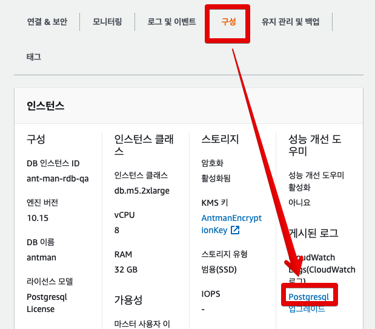

확인이 되셨으면 실제 로그가 남는지 확인해보겠습니다.

### 1-2. 슬로우 쿼리 테스트

해당 RDS를 접속하여서 아래와 같이 슬로우 쿼리를 실행해봅니다.

```sql
SELECT pg_sleep(2);
```

* `pg_sleep`: **지정된 초만큼** sleep을 수행합니다.

여기서는 `pg_sleep(2)` 을 했기 때문에 쿼리가 2초간 수행됩니다.  
수행하시고 나면 1-1에서 언급한것처럼 

* 구성 -> 게시된 로그 -> `Postgresql` 
* 혹은 Cloudwatch의 로그그룹에서 `/aws/rds/instance/{RDS이름}/postgresql`  그룹에 들어가서 볼 수 있습니다.

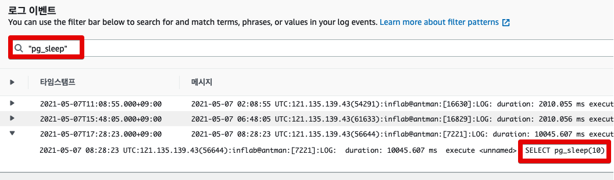

이번 시간에는 슬로우쿼리 조건을 1초로 두고, **1초 이상은 모두 로그를 남기도록** 하였습니다.  
상황에 따라 1초 보다 더 높은 값을 둬도되겠으나, 1초이상이면 충분히 슬로우 쿼리로 판단됩니다.  
그래서 1초이상의 쿼리를 다 남긴 뒤, 상황에 따라 Lambda에서 `if`문을 통해 별도의 슬랙 알람발송 조건(5초이상인 경우 등)을 두는게 낫다고 봅니다.  

> 이렇게 로그를 남겨야 이후에 ELK나 기타 다른 모니터링 도구에서 상세 분석이 가능하기 때문입니다.

쿼리 로그가 남는 것이 확인되셨다면, 이제 Lambda 함수를 만들어보겠습니다.

## 2. Lambda

이번에 만들 Lambda 함수는 **Cloudwatch에서 실시간으로 보내주는 로그를 파싱해서 슬랙으로 보내주는**역할을 합니다.  
  
실제로는 Cloudwatch 연동까지 해야 기능이 작동하지만, 그전에 미리 Lambda를 만들어놓고 Cloudwatch 설정을 진행할 예정입니다.

> 지정된 슬랙 알람 채널로 메세지를 보낼 Slack Webhook을 아직 생성하지 않으셨다면 [기존 포스팅-Slack Webhook API 생성하기](https://jojoldu.tistory.com/552)을 참고해서 만들어주세요.

### 2-1. Lambda 함수 생성

먼저 아래와 같이 간단하게 Lambda 함수를 생성합니다.

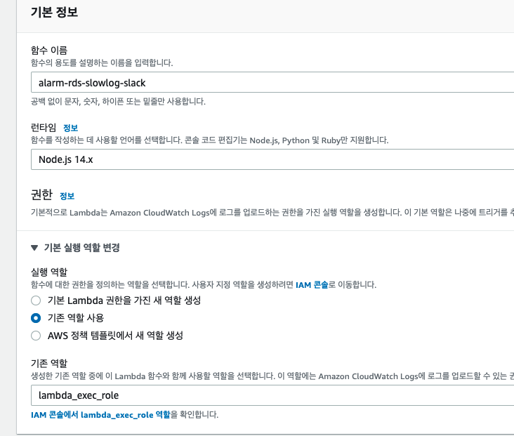

함수 코드는 간단하게 CloudWatch에서 넘어오는 데이터만 확인하기 위해 아래와 같이 작성합니다.

```javascript
var zlib = require('zlib');
exports.handler = function(input, context) {
    var payload = Buffer.from(input.awslogs.data, 'base64');
    zlib.gunzip(payload, function(e, result) {
        if (e) { 
            context.fail(e);
        } else {
            result = JSON.parse(result.toString('ascii'));
            console.log("Event Data:", JSON.stringify(result, null, 2));
            context.succeed();
        }
    });
};
```

* `zlib`, ` Buffer.from(input.awslogs.data, 'base64')`
  * CloudWatch의 구독 기능을 통해 전송 되는 로그는 1) **Base64로 인코딩**되고 2) **gzip 형식으로 압축**되어 있습니다.
  * 그래서 이걸 풀어서 볼때는 역순으로 1) gzip 압축을 풀고 2) Base64로 디코딩을 해야만 합니다.

나머지 코드는 풀어진 JSON 데이터를 그대로 console에 출력하는것 뿐입니다.  
  
이 코드가 작동하는지 검증하기 위해 테스트를 수행해봅니다.

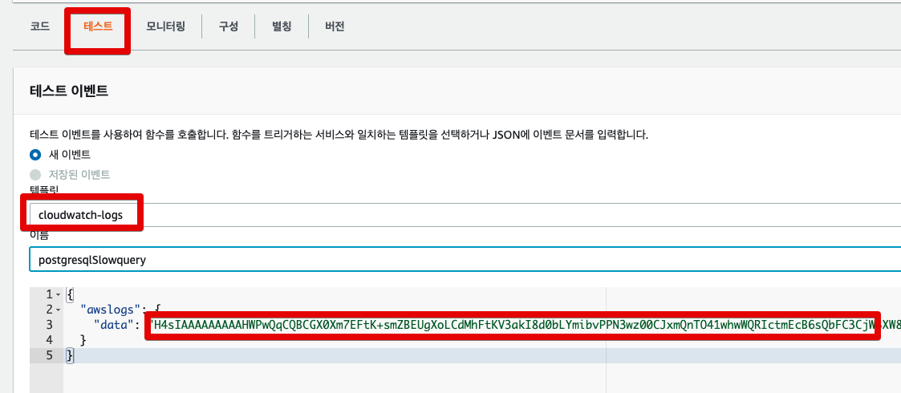

* 템플릿을 `cloudwatch-logs` 하셔야만 Base64인코딩 + gzip 되어있는 테스트용 데이터가 만들어집니다.

수행해보시면 CloudWatch에서 로그를 어떤 JSON 형태로 전달해주는지 확인해볼 수 있습니다.

```json
{
  "messageType": "DATA_MESSAGE",
  "owner": "123456789123",
  "logGroup": "testLogGroup",
  "logStream": "testLogStream",
  "subscriptionFilters": [
    "testFilter"
  ],
  "logEvents": [
    {
      "id": "eventId1",
      "timestamp": 1440442987000,
      "message": "[ERROR] First test message"
    },
    {
      "id": "eventId2",
      "timestamp": 1440442987001,
      "message": "[ERROR] Second test message"
    }
  ]
}
```

자 그럼 이제 이렇게 넘어오는 데이터를 **PostgreSQL 로그** 형태로 변경해서 빠른 테스트와 Lambda 함수 코드를 작성해보겠습니다.

### 2-2. PostgreSQL 테스트 로그 생성

Lambda에서 기본으로 제공하는 CloudWatch 테스트 데이터를 **PostgreSQL 로그 데이터가 아닙니다**.  
그래서 PostgreSQL 의 쿼리 로그 형태로 테스트 데이터를 변경해주어야 하는데요.  
RDS PostgreSQL의 쿼리 로그는 아래와 같은 형태로 전달됩니다.

```bash
2021-05-07 08:28:23 UTC:127.0.0.1(56644):test@test:[7221]:LOG:  duration: 10045.607 ms  execute <unnamed>: SELECT pg_sleep(10)
```

로그가 육안으로 보기에는 좋으나, **파싱해서 사용하기에는 불편합니다**.  
하지만, 아쉽게도 **RDS PostgreSQL에서는 이 로그 포맷을 변경할 수는 없습니다**

> PostgreSQL을 설치해서 쓴다면 변경 가능하나, 관리형 서비스인 RDS에서는 해당 설정에 대해서는 변경을 못하도록 막아두었습니다.

여튼 위 로그 데이터를 테스트 데이터에 넣어서 Gzip압축을 해야하는데요.  
  
압축 전 JSON 형태는 다음과 같습니다.

```json
{"messageType":"DATA_MESSAGE","owner":"123456789123","logGroup":"testLogGroup","logStream":"testLogStream","subscriptionFilters":["testFilter"],"logEvents":[{"id":"eventId1","timestamp":1440442987000,"message":"2021-05-07 08:28:23 UTC:127.0.0.1(56644):test@test:[7221]:LOG:  duration: 10045.607 ms  execute <unnamed>: SELECT pg_sleep(10)"}]}
```

* 기존 메세지 포맷에서 `logEvents.[].message`에만 PostgreSQL 로그를 넣은 형태입니다.

이 JSON을 [온라인 gzip 압축](https://www.multiutil.com/text-to-gzip-compress/) 사이트에서 압축하시면 테스트 데이터를 얻을 수 있습니다.

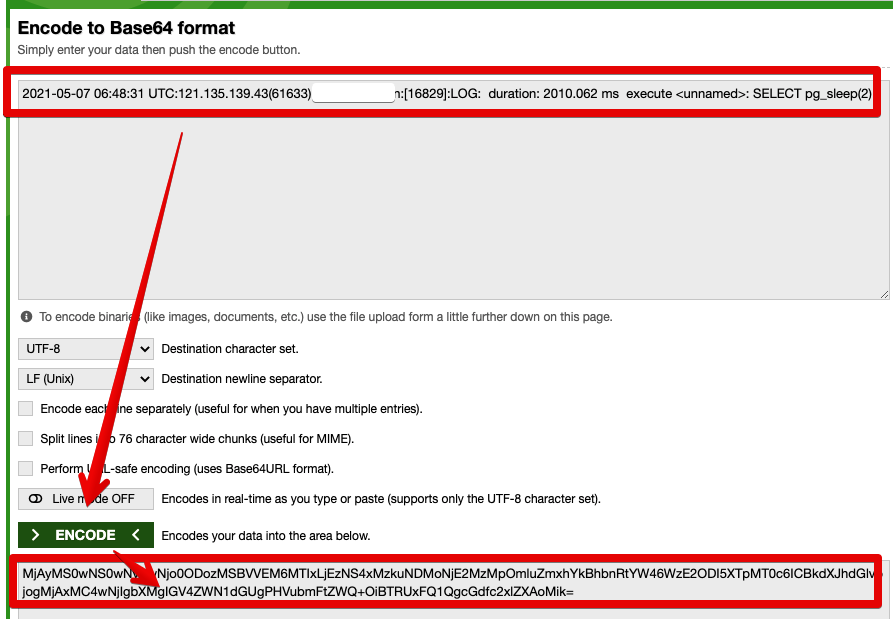

만약 이 과정이 귀찮다면 (혹은 **추가 가공 없이 그대로 쓰고싶다면**) 아래 JSON을 복사해서 그대로 테스트 데이터로 쓰시면 됩니다.
```bash
{
  "awslogs": {
    "data": "H4sIAAAAAAAACkVP22rDMAz9FeOnFtIiu86lZoyFLguDjD0keyqhZI0IgdyInV0o/fcp2cqQEDo6hyPpwls0pqgw+x6Qa/4YZuHpJUrTMI64w/vPDkcaC7lTrucHe2po3PRVPPbTQIxFY5MbXJjUjli0/9QfdriZ3s15rAdb991T3VgcDdfHRfYLeb4YRB/Y2Zm68LokH5zxcynIwtZ0ri1a2iyUAqXkPvABwLm9QXIJUmzA3YDPINCScsfesoMW0t8ChVi5nqfUWs+LH+aij76UItfJa6wZK6exmE/UTAAod+uRUWsYwy88TxbZ3dR1RYvlvWZplESHjA3VyTSIw0rAml/z6w+YOKmEVQEAAA=="
  }
}
```

변경된 테스트 데이터도 잘 노출되는지 확인해봅니다.  
  
Lambda 콘솔에서도 결과를 바로 볼 수도 있지만 **CloudWatch에서 Lambda 로그를 보고 싶으시면** 아래와 같이 확인해보실 수 도 있습니다.


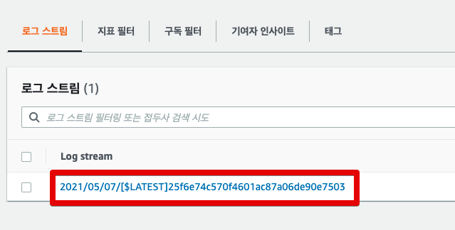

> CloudWatch -> 로그 -> 로그그룹 -> `/aws/lambda/{Lambda명}` 으로 이동해서 볼 수도 있습니다.

로그를 확인해보시면 다음과 같은 데이터를 볼 수 있습니다.

```json
2021-05-07T07:38:30.496Z	2ebb61a4-12cd-4adc-9d60-2fdef3c2bfca	INFO	Event Data: {
    "messageType": "DATA_MESSAGE",
    "owner": "owner명",
    "logGroup": "RDS슬로우쿼리로그위치",
    "logStream": "로그스트림위치",
    "subscriptionFilters": [
        "postgresql slow query"
    ],
    "logEvents": [
        {
            "id": "id명",
            "timestamp": 1620373109000,
            "message": "2021-05-07 07:38:29 UTC:127.0.0.1(56644):계정:[7221]:LOG:  duration: 2010.073 ms  execute <unnamed>: SELECT pg_sleep(2)"
        }
    ]
}
```

자 그럼 테스트 데이터도 생성되었으니, 바로 이 데이터를 통해 **슬랙 발송 함수**를 만들어보겠습니다.

### 2-3. Lambda 함수 코드 작성

Lambda 함수의 전체 코드는 다음과 같습니다.

```javascript
const https = require('https');
const zlib = require('zlib');
const SLOW_TIME_LIMIT = 3; // 3초이상일 경우 슬랙 발송
const SLACK_URL = '슬랙 Webhook URL';

exports.handler = (input, context) => {
    var payload = Buffer.from(input.awslogs.data, 'base64');
    
    zlib.gunzip(payload, async(e, result) => {
        if (e) { 
            context.fail(e);
        } 
        
        result = JSON.parse(result.toString('ascii'));
        const logJson = toJson(result.logEvents[0], result.logStream);
        const message = slackMessage(logJson);
        console.log(`slackMessage = ${JSON.stringify(message)}`);
                
        if(logJson.queryTime > SLOW_TIME_LIMIT) {
            await exports.postSlack(message, SLACK_URL);
        }
    });
};

function toJson(logEvent, logLocation) {
    const message = logEvent.message;
    const currentTime = toYyyymmddhhmmss(logEvent.timestamp);
    const dateTimeRegex = new RegExp('(\\d{4})-(\\d{2})-(\\d{2}) (\\d{2}):(\\d{2}):(\\d{2}) UTC:');
    const matchArray = message.match(dateTimeRegex);
    const removedUtcMessage = message.replace(matchArray[0], '');
    const messages = removedUtcMessage.split(':');
    const timeSplit = messages[5].trim().split(' ');
    
    return {
        "currentTime": currentTime,
        "logLocation": logLocation,
        "userIp": messages[0].trim(),
        "user": messages[1].trim(),
        "pid": messages[2].trim().replace('[', '').replace(']', ''),
        "queryTime": (Number(timeSplit[0]) / 1000).toFixed(3),
        "query": messages[6].trim()
    }
}

// 타임존 UTC -> KST
function toYyyymmddhhmmss(timestamp) {

    if(!timestamp){
        return '';
    }

    function pad2(n) { return n < 10 ? '0' + n : n }

    var kstDate = new Date(timestamp + 32400000);
    return kstDate.getFullYear().toString()
        + '-'+ pad2(kstDate.getMonth() + 1)
        + '-'+ pad2(kstDate.getDate())
        + ' '+ pad2(kstDate.getHours())
        + ':'+ pad2(kstDate.getMinutes())
        + ':'+ pad2(kstDate.getSeconds());
}

function slackMessage(messageJson) {
    const title = `[${SLOW_TIME_LIMIT}초이상 실행된 쿼리]`;
    const message = `언제: ${messageJson.currentTime}\n로그위치:${messageJson.logLocation}\n계정: ${messageJson.user}\n계정IP: ${messageJson.userIp}\npid: ${messageJson.pid}\nQueryTime: ${messageJson.queryTime}초\n쿼리: ${messageJson.query}`;
    
    return {
        attachments: [
            {
                color: '#2eb886',
                title: `${title}`,
                fields: [
                    {
                        value: message,
                        short: false
                    }
                ]
            }
        ]
    };
}

exports.postSlack = async (message, slackUrl) => {
    return await request(exports.options(slackUrl), message);
}

exports.options = (slackUrl) => {
    const {host, pathname} = new URL(slackUrl);
    return {
        hostname: host,
        path: pathname,
        method: 'POST',
        headers: {
            'Content-Type': 'application/json'
        },
    };
}

function request(options, data) {

    return new Promise((resolve, reject) => {
        const req = https.request(options, (res) => {
            res.setEncoding('utf8');
            let responseBody = '';

            res.on('data', (chunk) => {
                responseBody += chunk;
            });

            res.on('end', () => {
                resolve(responseBody);
            });
        });

        req.on('error', (err) => {
            console.error(err);
            reject(err);
        });

        req.write(JSON.stringify(data));
        req.end();
    });
}
```

각각의 function들은 다음과 같은 역할을 합니다.

* `toJson`
  * CloudWatch에서 넘겨준 Log 데이터를 가공하기 쉽도록 JSON으로 파싱하는 역할을 합니다.
  * PostgreSQL 로그가 한줄의 text로 나열된 형태라서 `:`를 구분자로 두어 불필요한 데이터는 버리고 필요한 데이터만 가공합니다.
* `toYyyymmddhhmmss`
  * UTC 시간 데이터를 식별가능한 KST로 전환합니다.
* `slackMessage`
  * `toJson` 을 통해 받은 JSON 데이터를 Slack 노출용 메세지로 변환합니다.
* `postSlack`
  * `request` function을 통해 Slack으로 메세지를 발송합니다.
* `options`
  * `https` 모듈에서 인식 가능한 HTTP Options을 만들어줍니다.
* `request`
  * callback만 지원하는 `https` 모듈을 `async/await`를 사용할 수 있도록 Promise 객체로 만들어줍니다.

> 코드 중간중간 function 중에는 `exports` 되어있는 것들이 있습니다.  
> 이들은 제가 테스트 코드로 해당 function만 테스트하기 위해 `exports`를 한것이라 **기능 자체는 일반 function과 차이가 없습니다**

이렇게 Lambda 함수가 생성되었다면, Slack까지 잘 전송되는지 한번 테스트를 해봅니다.  
위의 테스트 데이터를 사용해서 그대로 다시 테스트를 수행하시면?  
아래와 같이 테스트용 데이터를 기반으로 한 슬랙 메세지가 오는 것을 볼 수 있습니다.

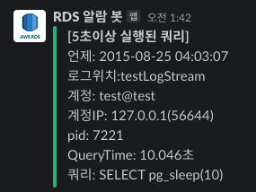

여기까지 하셨다면 거의다 하셨습니다!  
바로 CloudWatch 연동을 진행해보겠습니다.

## 3. CloudWatch & Lambda 연동

CloudWatch와 Lambda 연동은 쉽습니다.  
이미 구독기능이 AWS에서는 지원하기 때문인데요.  
  
먼저 RDS PostgreSQL의 로그 그룹으로 이동해서 해당 로그그룹 선택 -> 작업 -> 구독필터 -> Lambda 구독 필터 생성 을 차례로 선택합니다.

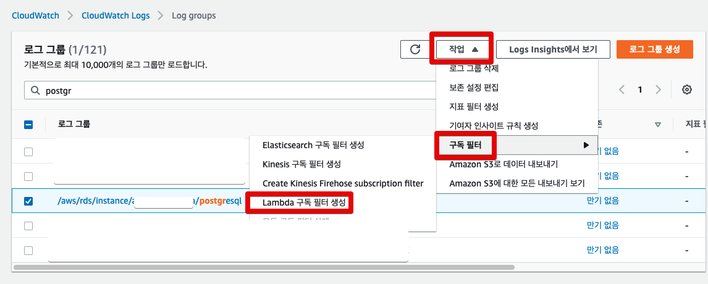

구독 필터 생성 화면에 들어가시게 되면, 2-1에서 만든 Lambda 함수를 대상에 등록합니다.

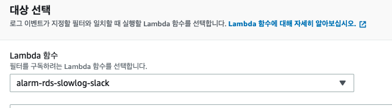

아래로 내려가보시면 로그형식이 나오는데, 여기서 로그형식은 기타를 선택합니다.  
  
구독 필터 퍁너의 경우 **정규표현식이 아직 미지원**하여서 사용하지 않습니다.  
  
구독 필터 이름이 없을 경우 생성이 불가능하니 꼭 식별 가능한 이름으로 입력합니다.

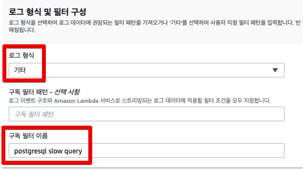

기존의 데이터에 대한 패턴 테스트까지 끝나셨다면 **스트리밍 시작** 버튼을 클릭하여 구독을 활성화 시킵니다.

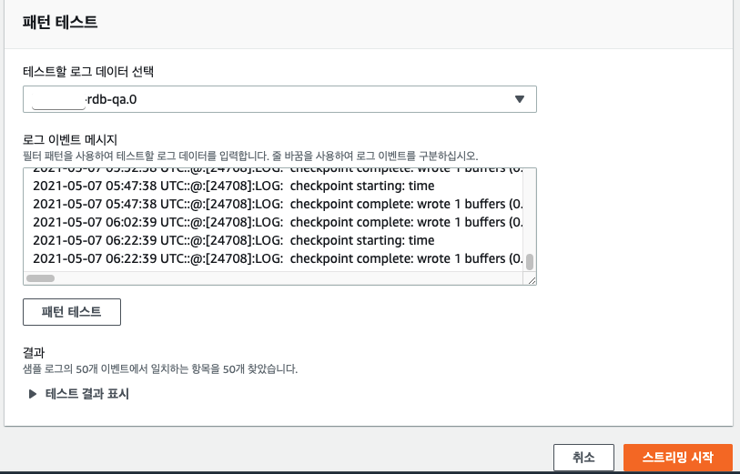

그럼 아래와 같이 로그그룹의 구독 필터에 1개의 구독이 추가된 것을 볼 수 있습니다.

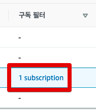

모든 설정이 끝났습니다.  
이제 전체 테스트를 한번 해보겠습니다.  
Database 도구를 통해 아래 쿼리로 슬로우 쿼리를 강제로 발생시켜봅니다.

```sql
SELECT pg_sleep(5);
```

그럼 아래와 같이 슬랙 채널에 정식 알람이 오는 것을 확인할 수 있습니다.

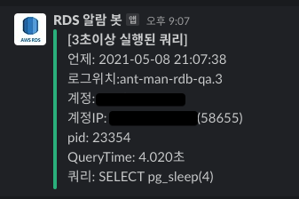