# CloudWatch를 이용한 RDS (PostgreSQL) 스케줄링 시작/종료

운영되는 환경 (live, production, real 등) 외에, 테스트 용도로 사용되는 환경(dev, qa)은 꼭 24시간 무중단으로 서비스를 할 필요가 없습니다.  
그래서 실제 업무시간을 제외하고는 해당 서비스를 종료하여 **비용을 절감할 필요**가 있습니다.  
(굳이 사용하지 않는 시간대에 비용을 낭비할 필요는 없겠죠?)  
  
그래서 이번 시간의 목표는 다음과 같습니다.  
  
CloudWatch Event를 이용하여

* 매주 월~금 오전 09:00 에 RDS가 재시작 되도록 스케줄링 한다
* 매주 월~금 오후 08:00 에 RDS가 정지 되도록 스케줄링 한다.
  * 금요일 오후 8시에 종료되고 월요일 오전 9시에 시작이기 때문에 **주말 동안은 계속 종료 상태를 유지**합니다.

전체 구조는 다음과 같습니다.

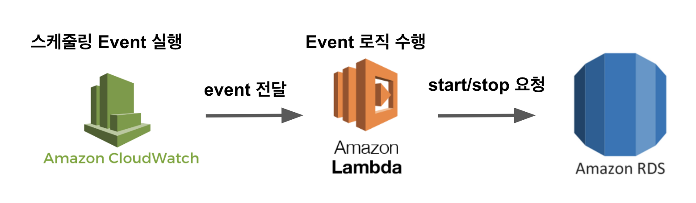

자 그럼 바로 시작해보겠습니다.

## 1. IAM Role (역할) 생성

가장 먼저 할 것은 **Lambda가 RDS를 시작/종료할 수 있도록** IAM Role (역할)을 만들어보겠습니다.

## 1-1. Policy (정책) 생성

Role (역할)을 생성하기 전에 Role이 사용할 Policy(정책)을 먼저 만들겠습니다.  
  
IAM -> 정책 -> 정책 생성으로 차례로 이동하신뒤,

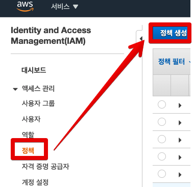

JSON 탭을 클릭해 아래 정책들을 그대로 사용합니다.

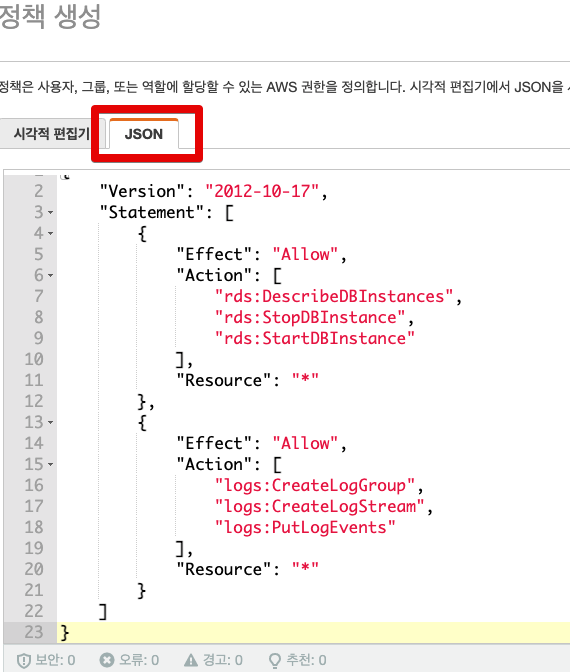

```javascript
{
    "Version": "2012-10-17",
    "Statement": [
        {
            "Effect": "Allow",
            "Action": [
                "rds:DescribeDBInstances",
                "rds:StopDBInstance",
                "rds:StartDBInstance"
            ],
            "Resource": "*"
        },
        {
            "Effect": "Allow",
            "Action": [
                "logs:CreateLogGroup",
                "logs:CreateLogStream",
                "logs:PutLogEvents"
            ],
            "Resource": "*"
        }
    ]
}
```

RDS의 시작/종료와 Lambda 로그를 남기는 것외에는 아무런 정책이 들어가있지 않기 때문에 딱 RDS를 시작/종료하는 용도로만 사용할 수 있습니다.  

## 1-2. Role (역할) 생성

위에서 생성한 정책을 사용해서 Lambda가 사용할 역할을 생성합니다.  

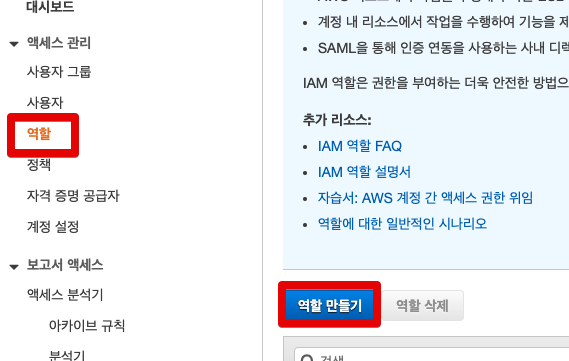

Lambda를 선택하신뒤,

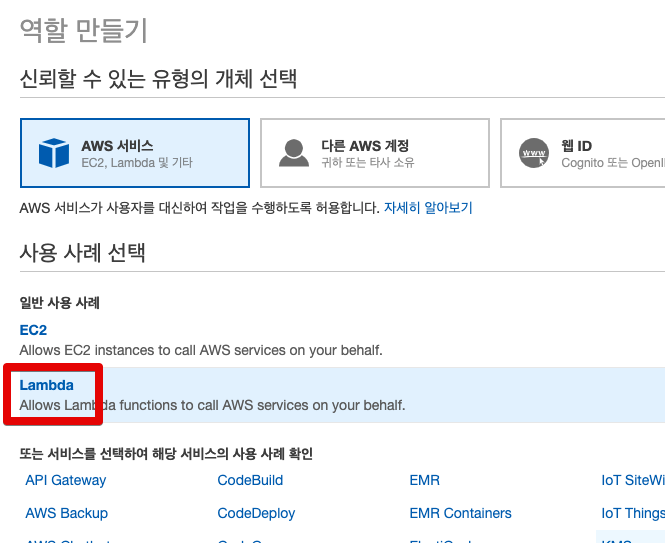

1-1에서 만든 역할을 검색해서 선택합니다.

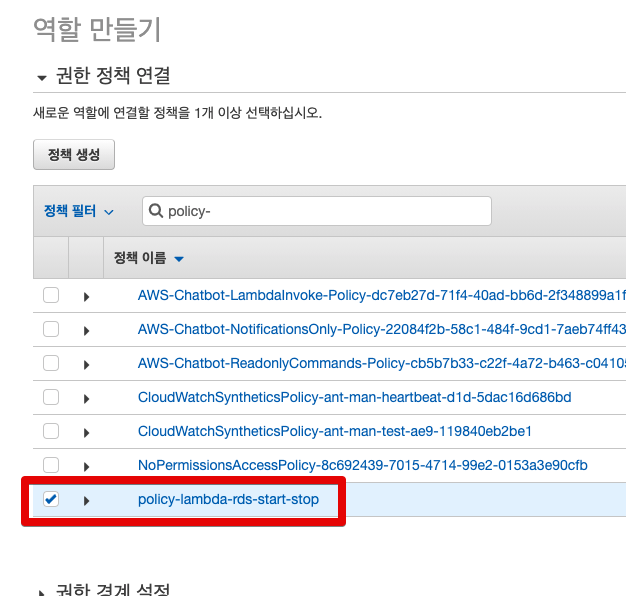

이렇게 역할을 만드셨다면, 이젠 바로 Lambda를 생성할 수 있습니다.

## 2. Lambda 함수 생성 및 테스트

만들어진 역할을 기반으로 RDS를 시작/종료 시킬 수 있는 Lambda 함수를 만들어보겠습니다.  
  
## 2-1. Lambda 함수 생성

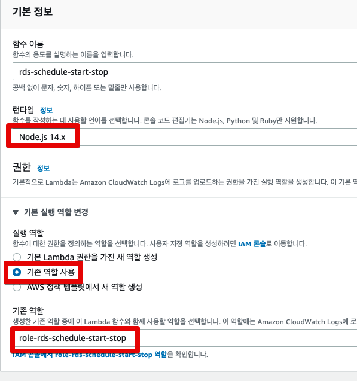

* 기존 역할에서 1-2에서 만든 역할을 선택하시면 됩니다.

Lambda 코드는 다음과 같습니다.  
  
```javascript
const AWS = require('aws-sdk');

exports.handler = (event, context, callback) => {
    console.log(JSON.stringify(event));
    const instances = event.instances;
    instances.forEach((instance) => {
        switch (event.action) {
            case 'stop':
                console.log(`Stopping instance '${instance}'...`);
                stop(instance);
                break;
            case 'start':
                console.log(`Starting instance '${instance}'...`);
                start(instance);
                break;
            default:
                throw `Invalid action ${event.action}`;
        }
    })
    callback(null, 'Done!');
};

function stop (instanceId) {
  var rds = new AWS.RDS();
  var today = new Date();
  var params = {
    DBInstanceIdentifier: instanceId,
    DBSnapshotIdentifier: `${instanceId}-${today.getDate()}-${today.getMonth() + 1}-${today.getFullYear()}-${today.getTime()}`
  };
  rds.stopDBInstance(params, (err, data) => {
    if (err) {
      console.log(err, err.stack);
    } else { 
      console.log(data);
    }
  });
};


function start (instanceId) {
  var rds = new AWS.RDS();
  var params = {
    DBInstanceIdentifier: instanceId
  };
  rds.startDBInstance(params, function (err, data) {
    if (err) {
      console.log(err, err.stack);
    } else { 
      console.log(data);
    }
  });
};
```

코드 자체는 크게 어려울 것은 없습니다.

* `event.instances`에서 넘어온 instance들을 대상으로
* `event.action` 상태에 따라 start / stop을 진행합니다.
* `stop` function의 `DBSnapshotIdentifier`는 DB가 stop되는 시점에 만들 스냅샷의 ID를 의미합니다.

Lambda 함수가 생성되었으면, 해당 Lambda 함수가 잘 작동하는지 **Lambda 함수만 테스트**를 진행해보겠습니다.
(CloudWatch 연동전에 Lambda 함수 코드가 잘 작동하는지 격리화된 검증을 위해서입니다.)

### 2-2. Lambda 함수 테스트

Lambda의 테스트 탭으로 이동하신 뒤, 아래와 같이 JSON 데이터를 생성해봅니다.

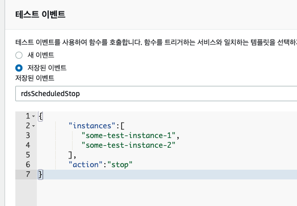

```javascript
{  
   "instances":[  
      "some-test-instance-1",
      "some-test-instance-2"
   ],
   "action":"stop"
}
```

여기서 `instances`에는 실제 본인이 테스트해볼 **현재 실행중인 테스트용 RDS** 인스턴스명을 작성해주시면 됩니다.  
  
저 같은 경우 아래 `ant-man-rdb-qa` DB를 대상으로 하기 때문에 `instances` 배열에는 `ant-man-rdb-qa` 를 사용합니다.

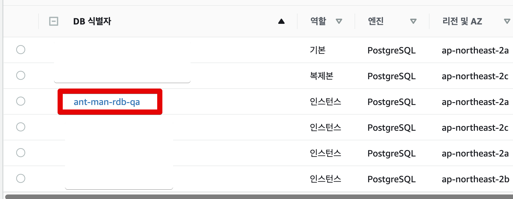

**action** 에는 다음의 값을 선택적으로 넣어서 실행해보시면 됩니다.

* 현재 실행중인 테스트 RDS를 중지하고 싶을때:  `stop`
* 현재 종료된 테스트 RDS를 실행하고 싶을때: `start`

테스트 해보신뒤, Lambda가 잘 작동하는게 확인되셨다면 트리거 역할을 할 CloudWatch Rule(규칙)을 만들어보겠습니다.

## 3. Cloud Watch Rule (규칙) 추가

CloudWatch Rule(규칙) 은 총 2개가 만들어질 예정입니다.

* `stop` (평일 오후 8시에 실행될)
* `start` (평일 오전 9시에 실행될)

## 3-1. Stop Rule

CloudWatch의 이벤트 -> 규칙 탭으로 이동합니다.

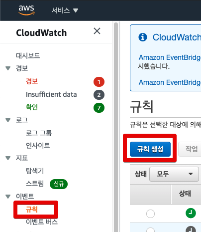

여기서 **일정**을 체크하여 Cron 표현식과 Lambda 함수를 작성합니다.

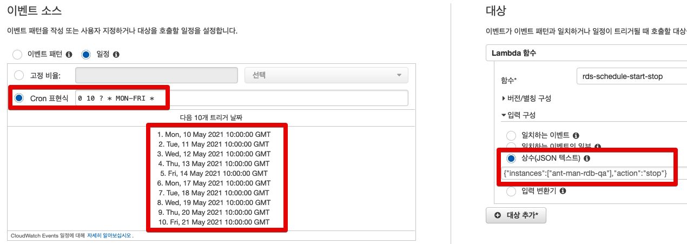

cron 표현식의 규칙은 다음과 같은데요.

```bash
cron(Minutes Hours Day-of-month Month Day-of-week Year)
```

AWS 공식 문서에서 제공하는 샘플을 보시면서 원하는 스케줄을 작성하시면 됩니다.

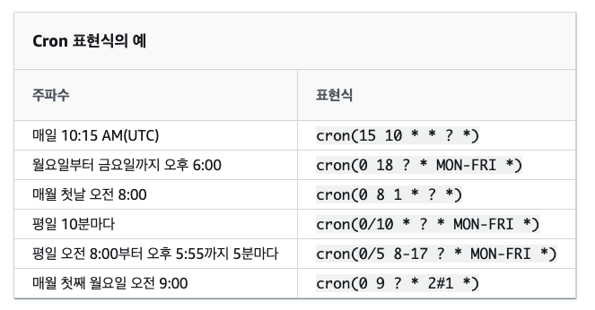

* day-of-month 또는 day-of-week 값 중 하나는 반드시 물음표(?)여야 합니다.

여기서 주의하실 점은 **KST가 아닌 UTC로 cron이 적용된다**는 것입니다.  
그래서 시간을 정하실때는 **UTC 기반으로 변경**해서 등록하셔야 합니다.  
  
저 같은 경우 [UTC-KST online converter](https://savvytime.com/converter/kst-to-utc)를 이용하곤합니다.

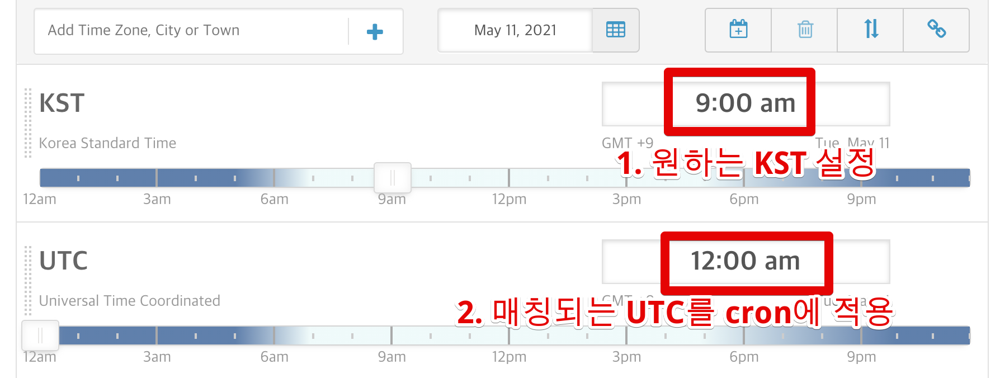

위 내용대로 **평일 20:00마다 실행**을 cron 표현식으로 작성하면 다음과 같습니다.

```bash
0 10 ? * MON-FRI *
```

이렇게 cron 등록후 다음으로는 Lambda 함수를 선택하시고 입력 구성을 하셔야하는데요.  
입력 구성은 **상수(JSON텍스트)** 를 체크하시고 **Lambda함수 테스트에 사용했던 JSON**을 그대로 입력하시면 됩니다.  
(JSON을 compress해서 한줄로 만들어서 넣어주세요.)

```javascript
{ "instances":[ "some-test-instance-1", "some-test-instance-2" ], "action":"stop" }
```

마지막으로 규칙 이름등을 입력해주시면 됩니다.

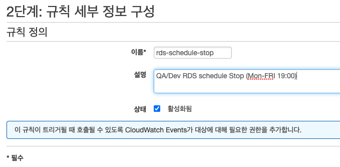

생성이 되시면 아래와 같이 신규 규칙이 추가된 것을 볼 수 있습니다.

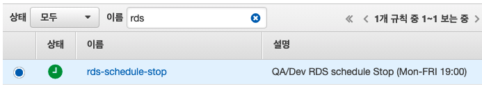

## 3-2. Start Rule

종료 규칙을 생성했다면, 동일한 방식으로 start 규칙 역시 생성합니다.
  
start 규칙의 cron은 다음과 같습니다.

```bash
0 0 ? * MON-FRI *
```

대상의 입력 JSON은 다음과 같습니다.

```javascript
{ "instances":[ "some-test-instance-1", "some-test-instance-2" ], "action":"start" }
```

## 4. 전체 테스트

이제는 실제 해당 CloudWatch -> Lambda -> RDS까지 잘 이어지는지 최종 테스트만 진행하면 됩니다.  
최종 테스트는 간단합니다.  
CloudWatch의 cron을 잠깐 수정하여 **현재시간보다 2~3분뒤**에 실행되도록 한뒤, stop 혹은 start가 잘 수행되는지 검증하면 됩니다.  
  
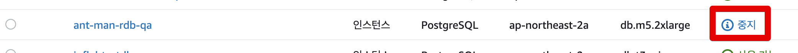


