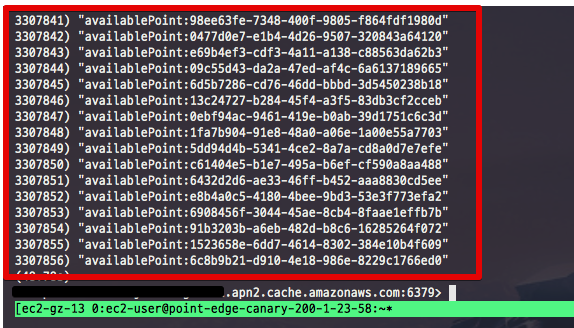
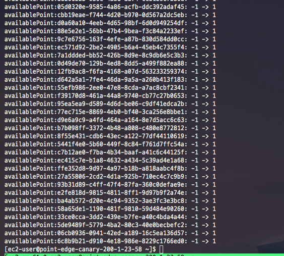
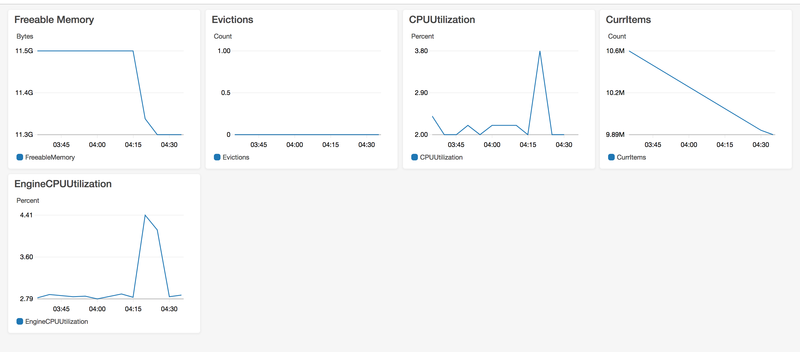

# Redis 대량 TTL 적용하기

성능 테스트나 실수로 Redis의 데이터들이 잘못 들어간 경우가 있을 수 있습니다.
이때 **대량의 데이터를 패턴으로 걸러내어 삭제**하려면 어떻게 해야할까요?  
  
## 문제 상황

예를 들어 임의의 키 값을 생성하기 위해 uuid로 키를 대량으로 생성했다고 가정하겠습니다.  
실제 데이터도 다음과 같이 등록된 상태입니다.



이 상황에서 ```availablePoint:uuid``` 로 되어 있는 key들을 모두 삭제하고 싶습니다.  
이 패턴의 key를 전부 TTL 1초로 만들면 되겠죠?  
  
자 그럼 어떻게 하면 **특정 패턴의 Key들을 모두 TTL 1초로** 지정할 수 있을까요?  

## 해결책

레디스에서는 전체 key를 볼 수 있는 ```keys``` 명령어가 있습니다.  
해당 명령어는 부하가 심하여 **운영 중인 서비스에서는 절대 사용하면 안되는 명령어** 인데요.  
이를 대체하기 위해 ```scan```이랑 명령어가 추가 되었습니다.  

> 레디스 컨트리뷰터인 강대명님의 [글]((http://tech.kakao.com/2016/03/11/redis-scan/))을 참고하시면 더욱 자세하게 알 수 있습니다.

보통은 아래와 같이 조회하는데 사용됩니다.


이 ```scan```을 통해 삭제해보겠습니다.  
  
먼저 아래와 같이 쉘 파일을 하나 만듭니다.

```bash
sudo vim redis-expire.sh
```


그리고 아래 코드를 그대로 작성합니다.

```bash

#!/bin/bash

cursor=-1
keys=""
ttl=0
host=레디스주소
pattern="$1"
expire="$2"

while [ $cursor -ne 0 ]; do
  if [ $cursor -eq -1 ]
  then
    cursor=0
  fi

  reply=`redis-cli -h $host SCAN $cursor MATCH $pattern`
  cursor=`expr "$reply" : '\([0-9]*[0-9 ]\)'`
  keys=`echo $reply | cut -d' ' -f2-`

  for key in ${keys// / } ; do
    ttl=`redis-cli -h $host TTL $key`
    act=""

    if [ $ttl -eq -1 ]
    then
      result=`redis-cli -h $host EXPIRE $key $expire`
      act=" -> $expire"
    fi

    echo "$key: $ttl$act"
  done
done
```


위 코드는 패턴과 TTL 시간을 인자로 넘겨주면 전체 데이터를 Scan하며 변경해주는 스크립트입니다.  

사용법은 다음과 같이 사용하면 됩니다.

```bash
./redis-expire.sh 패턴 TTL시간
```

여기서는 다음과 같이 되겠죠?

```bash
./redis-expire.sh *-* 1
```

* ```*-*```
  * uuid가 ```-```가 중간에 들어가는 것을 고려해서 ```-```가 포함된 모든 키를 찾습니다
  * 나머지 데이터들이 전부 숫자로만 이루어졌기 때문에 이렇게 진행하며, 그게 아니라면 좀 더 정확한 패턴을 사용하시면 됩니다.
* ```1``` 
  * TTL시간을 1초로 등록합니다.

자 이제 스크립트를 실행해보시면 아래와 같이 TTL이 -1 -> 1로 변하는 것을 확인할 수 있습니다.



해당 스크립트를 실행하는 동안 Elastic Cache의 리소스도 양호하게 운영되고 있는 것을 확인할 수 있습니다.



모든 작업이 끝나서 Key를 검색해보시면 해당 데이터가 전혀 없음을 알 수 있습니다.


## 참고

* [https://gist.github.com/fieg/e3b74fe9bed6ec1f2a1c](https://gist.github.com/fieg/e3b74fe9bed6ec1f2a1c)