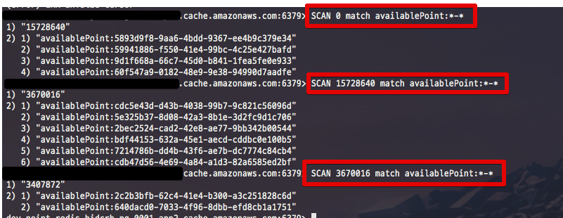
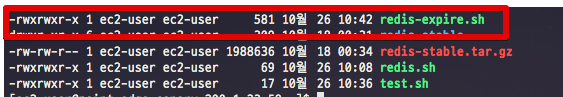

# Redis 대량 TTL 적용하기






```bash
#!/bin/bash

cursor=-1
keys=""
ttl=0
host=레디스주소
pattern="$1"
expire="$2"

while [ $cursor -ne 0 ]; do
  if [ $cursor -eq -1 ]
  then
    cursor=0
  fi

  reply=`redis-cli -h $host SCAN $cursor MATCH $pattern`
  cursor=`expr "$reply" : '\([0-9]*[0-9 ]\)'`
  keys=`echo $reply | cut -d' ' -f2-`

  for key in ${keys// / } ; do
    ttl=`redis-cli -h $host TTL $key`
    act=""

    if [ $ttl -eq -1 ]
    then
      result=`redis-cli -h $host EXPIRE $key $expire`
      act=" -> $expire"
    fi

    echo "$key: $ttl$act"
  done
done
```


* [https://gist.github.com/fieg/e3b74fe9bed6ec1f2a1c](https://gist.github.com/fieg/e3b74fe9bed6ec1f2a1c)