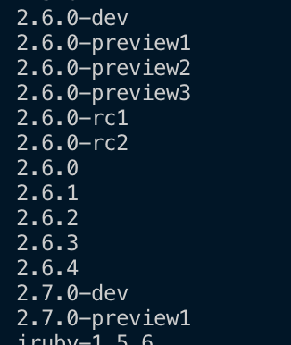

# Mac에서 Gem::FilePermissionError 에러 발생시 해결 방법 

Mac에서 Ruby의 패키지 매니저인 gem을 통해 설치를 진행하다 다음과 같은 에러를 만납니다.

```bash
$ gem install bundler
ERROR:  While executing gem ... (Gem::FilePermissionError)
    You don't have write permissions for the /Library/Ruby/Gems/2.3.0 directory.
```

결론부터 말하면, 시스템 ruby를 이용하고 있기 때문에 권한이 없어 gem 설치가 안된 것입니다.  
  
sudo를 통해 root 권한으로 실행하면 설치가 가능하지만, 보안상 이유로 **권장하지 않는 설치법**입니다.  
  
그래서 rbenv를 통해 문제를 해결해보겠습니다.

## 문제 해결

먼저 ```brew```를 통해 rbenv 를 설치합니다.

```bash
brew update
brew install rbenv ruby-build
```

rbenv 가 잘 설치되었는지 확인해봅니다.

```bash
$ rbenv versions
* system (set by /Users/idong-uk/.rbenv/version)
```

저 같은 경우 현재 Ruby가 ```system``` Ruby를 쓰고 있다는 것을 알 수 있습니다.  
  
rbenv로 관리되는 Ruby를 설치해야 됩니다.  
설치할 수 Ruby 버전은 다음 명령으로 확인할 수 있습니다.

```bash
$ rbenv install -l
```

아래와 같이 설치 가능한 Ruby 버전들이 나오는데 현재 (2019.09.13) 기준 최신 버전인 2.6.4 버전을 선택해서 설치합니다.



```bash
$ rbenv install 2.6.4
ruby-build: using openssl from homebrew
Downloading ruby-2.6.4.tar.bz2...
-> https://cache.ruby-lang.org/pub/ruby/2.6/ruby-2.6.4.tar.bz2
Installing ruby-2.6.4...
Installed ruby-2.6.4 to /Users/idong-uk/.rbenv/versions/2.6.4
```

```bash
vim ~/.zsrhc
```

```bash
vim ~/.bash_profile
```

```bash
[[ -d ~/.rbenv  ]] && \
  export PATH=${HOME}/.rbenv/bin:${PATH} && \
  eval "$(rbenv init -)"
```

```bash
source ~/.zshrc
```

그리고 다시 실행해보시면 아래와 같이 정상적으로 실행되는 것을 확인할 수 있습니다.

```bash
$ gem install bundler
Fetching bundler-2.0.2.gem
Successfully installed bundler-2.0.2
Parsing documentation for bundler-2.0.2
Installing ri documentation for bundler-2.0.2
Done installing documentation for bundler after 2 seconds
1 gem installed
```