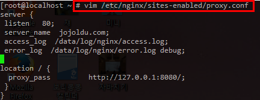

# Nginx 리버스 프록시
일정 수준 이상의 규모를 가진 웹 사이트에서는 웹 서버(Nginx)와 웹 어플리케이션 서버 (Tomcat)를 분리하여 웹 서버를 리버스 프록시 서버(Reverse Proxy Server)로 사용합니다.<br/>
예를 들어 zum.com이란 도메인의 요청이 오게되면 리버스 프록시 서버(Nginx)에서 해당 요청을 받아 이를 Tomcat에 처리를 의뢰 하는 것을 얘기합니다.
여기서 얘기하는 리버스는 **역전** 이란 뜻이 아닌 **뒷쪽** 이란 뜻으로 사용됩니다. <br/>
자세한 내용은 [joinc님의 포스팅](http://www.joinc.co.kr/w/man/12/proxy)을 참조하시면 더욱 이해하기 쉬울것 같습니다. <br/>

## Nginx 캐시 문제
아래에서 사용한 예제 코드의 경우 모두 [Github]()에서 확인할 수 있습니다. <br/>
예제를 실행하기 위해선 Java8, Nginx, CentOS가 설치되어 있어야만 합니다. <br/>
혹시나 Nginx가 설치되어있는지 확인이 필요하다면 아래와 같은 명령어로 확인이 가능합니다. <br/>

**Nginx 실행여부 확인**
```
ps auxww |grep nginx
```


위와 같이 master process와 worker process가 표시된다면 현재 nginx가 서버에서 구동중입니다. 구동중인 nginx 프로세스가 없다면 설치를 하시면 됩니다.
<br/><br/>
아래의 모든 예제는 실제 서비스와 유사한 형태의 코드로 작성하였습니다. <br/>
문제 자체를 이해하는데는 오히려 실제 서비스 코드보다는 이러한 간략화된 예제코드가 더 쉽게 이해될것 같습니다. <br/>
하나하나 문제가 되었던 사건들을 소개하겠습니다. <br/>

### 캐시 파라미터 문제
최근 zum.com에서는 두들 캠페인을 진행하였습니다. <br/>


(화면 좌측의 더 넓은 검색 부분입니다.) <br/>
사용자가 zum.com을 방문시 gif 파일을 통해 메세지 애니메이션이 시작하도록 하는 캠페인이였습니다. <br/>
기능에 대한 상세 기능은 아래와 같습니다.

* 사용자가 방문할때마다 애니메이션이 **새로** 시작되어야 한다.
* 애니메이션이 끝나면 **새로고침 해야만** 다시 애니메이션이 시작되어야 한다.

보기엔 크게 문제가 없어보이는 기능이라, 코드는 아래와 같이 작성하였습니다. <br/>


어려울것 하나 없는 기능이기에 바로 코드를 수정하고 개발서버에서 테스트를 진행하는데,
**새로고침하면 gif가 시작하지 않았습니다**


(엉엉 ㅠㅠㅠ)<br/>
이유를 찾아보니 gif의 경우 웹 브라우저에 **캐시 된 이후에는 애니메이션의 마지막 이미지만** 볼 수 있던 것입니다. <br/>
1회성 애니메이션은 기획상 안됐기에, 결국 **새로고침 할때마다 gif를 새로 부르는 수밖에** 없다는 결론을 내렸습니다. <br/>
그래서 아주 간단하게 다음과 같이 호출 시간을 파라미터로 하도록 코드를 수정하였습니다.


현재시간을 파라미터 t에 할당하여 호출하도록 하였습니다. <br/>
이렇게 될 경우 매번 호출때마다 현재 시간이 다르기 때문에 파라미터가 달라져 브라우저 캐시를 회피할 수 있으며, 계속해서 새롭게 gif 파일을 호출할 수 있습니다. <br/>
기능 작동과 QA서버 테스트를 마치고 실서버 배포후 가벼운 마음으로 퇴근한 저는 3시간만에 다시 회사로 복귀하게 되었습니다.<br/>
어떤 문제 때문에 저녁에 다시 출근하게 된 것일까요?<br/>
<br/>
웹 서버를 조금이라도 운영해보신 분들은 현재 저 코드가 어마어마한 문제를 안고 있다는 것을 알고 계실것입니다. <br/>

일반적으로 웹 사이트는 성능상 이점을 얻기 위해 gif/image/css/js 등과 같은 **정적 자원(static resource)들은 Nginx와 같은 웹 서버에서 캐시** 하여 Tomcat의 부담을 줄이고 있습니다. <br/>



(일반적인 Nginx 캐시 설정) <br/>
이렇게 설정되었을 경우 Nginx에서는 css,js,gif,png,jpg,jpeg파일은 **전부 캐시를 하게 됩니다.** <br/>
저 전부라는 표현이 중요합니다. <br/>
즉, 바뀐 **파라미터에 따라 다 캐시하게 됩니다.** <br/>
한번 확인을 해보겠습니다. <br/>
서버의 ```/etc/nginx/nginx.conf``` 혹은 ```/etc/nginx/conf.d/proxy.conf``` 와 같이 설정파일을 열어 캐시 디렉토리 위치를 확인 후,


(여기 예제에서는 nginx.conf에 설정해두었습니다.) <br/>
캐시 파일 저장소로 지정된 ```/data/cache/nginx/cache```를 확인해보겠습니다. <br/>

```
grep -rnw '찾고자하는 디렉토리 위치' -e "찾는 텍스트명"
```


doodle.gif파일만 조회하였는데 여러개가 매치된 것을 확인할 수 있습니다. <br/>
좀 더 극적으로 확인하기 위해 해당 프로젝트를 새로고침을 좀 더 해보겠습니다. <br/>
몇 번의 새로고침 후에 다시 조회 명령어를 입력하면! <br/>


훨씬 더 많은 캐시파일이 만들어진 것을 확인할 수 있습니다. <br/>
해당 파일들을 하나하나 열어보시면 각 파일들의 key가 파라미터에 따라 다르다는 것을 확인할 수 있습니다. <br/>


일반적으로 웹 사이트에서는 들은 브라우저 캐시를 통해 트래픽의 부담을 줄이고 사이트의 성능도 향상시킬 수 있습니다. <br/>
헌데, 위 제시한 방법처럼 페이지 reload가 있을때마다 gif를 다시 부르는 방법은 이러한 브라우저 캐시를 포기하는 것이기 때문에 일반적인 상황이라면 절대 사용해서는 안됩니다. <br/>


### 404 캐시 문제

### 설치 및 설정관련
[Virtual box에 centos설치하기](http://webdevnovice.tistory.com/2) <br/>
이거 최고다 전부 따라가면서 설치하면 된다. <br/>

[Nginx 캐시 설명](http://www.joinc.co.kr/w/man/12/nginx/static) <br/>


80, 8080포트를 오픈하자


