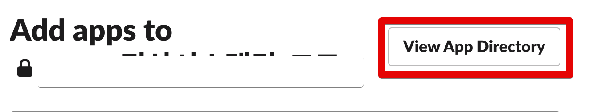
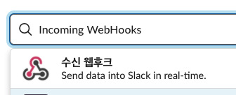
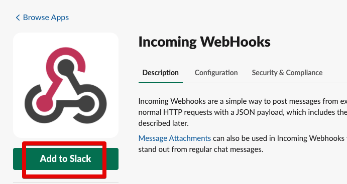
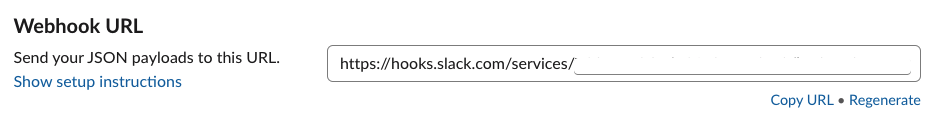

# Slack Webhook API 생성하기












```js
{
    attachments: [
        {
            color: '#2eb886',
            title: `${title}`,
            fields: [
                {
                    value: `<${upsourceHost}/${projectId}/review/${reviewId}|${reviewId}> Report By ${user}`,
                    short: false
                }
            ]
        }
    ]
}
```