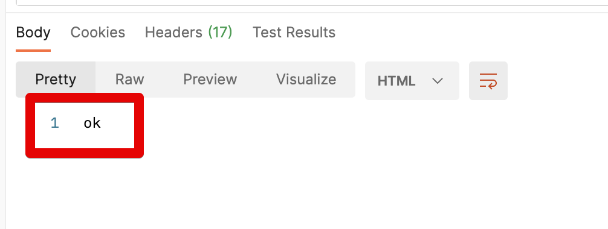
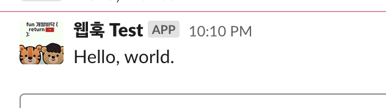

# Slack Webhook API 생성하기

요즘 대부분의 개발도구들은 Slack과의 통합 (Integration)을 지원하지만, 여전히 미지원 하는 도구들도 많습니다.  
  
이런 미지원 도구들을 Slack에 연동할때 Slack Webhook을 사용합니다.  
  
저도 종종 사용하고, 앞으로도 자주 사용할 것 같아 정리 합니다.

## 1. Webhook 생성

먼저 본인의 슬랙 서비스를 실행해서 웹훅으로 알람을 받을 채널로 이동합니다.  
채널의 화면 상단을 보시면 느낌표 (```!```) 가 보이실텐데요.  

> 해당 채널에 대한 여러 설정들을 보여주는 버튼입니다.

아래와 같이 **Add apps** 를 클릭합니다.


여러 앱들이 나올텐데, 웹훅 App이 안나올 수 있으니, View App Directory를 클릭해서 App 검색 페이지로 이동합니다.


웹 페이지가 새로 열리는데요.  
해당 웹 페이지의 검색창에 ```Incoming WebHooks```를 검색합니다.

> 한글 슬랙을 쓰신다면 아래와 같이 웹훅이 **수신 웹후크**로 나오는데, 이를 선택하시면 됩니다.


웹훅 앱 서비스 상세로 들어가면 **Add to Slack**을 클릭합니다.


웹훅으로 알람을 받고 싶은 채널을 선택하신 뒤, **Add Incoming WebHooks integration**을 클릭합니다.


여기서 나오는 Webhook URL을 복사해놓습니다.  
이후 앞으로 지금 만든 웹훅을 쓰기 위해서는 이 URL을 사용한다고 보시면 됩니다.


만약 나만의 알람처럼 꾸미고 싶다면, 아래와 같이 Customize Name과 Icon을 수정하시면 됩니다.

> 저는 코드리뷰와 커밋 알람을 받기 위해 아래와 같이 꾸몄습니다.


여기까지 하셨으면 이제 웹훅 앱은 등록완료입니다.  
Postman을 통해서 테스트를 해보겠습니다.

## 2. Postman으로 발송하기

Postman의 사용법은 [NHN Toast 기술블로그](https://meetup.toast.com/posts/107)에 이미 너무 잘 소개되고 있어서 생략하고 바로 테스트로 가겠습니다.  
  
POST를 선택하고, 복사한 웹훅 URL을 등록합니다.  
  
그리고 Headers에 ```Content-type: application/json```을 등록합니다.


보낼 메세지를 아래와 같이 **Body** -> **raw** 로 가서 아래와 같이 JSON 데이터를 만듭니다.


```js
{
    "text": "Hello, world."
}
```

다 생성되어 한번 실행해보시면?  
아래와 같이 Postman에서 OK 응답이 옵니다.



이제 해당 슬랙 채널로 가보시면 정상적으로 메세지가 전송되는 것을 볼 수 있습니다.



