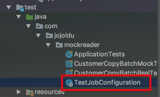
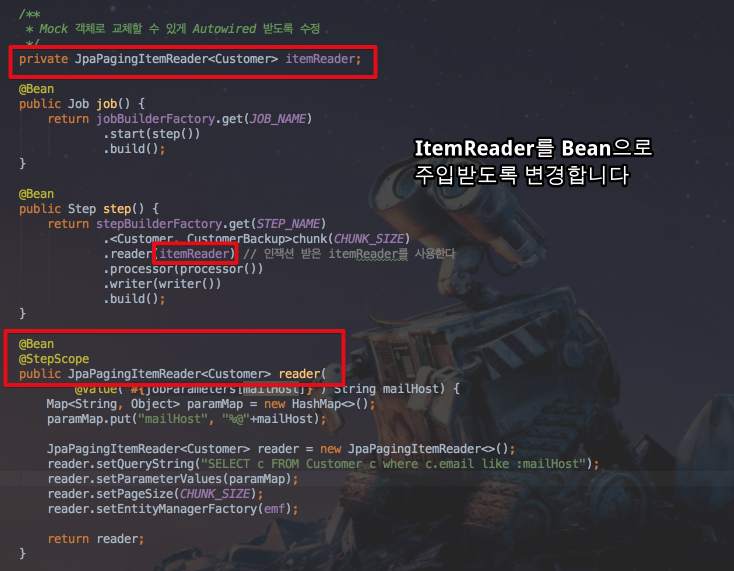
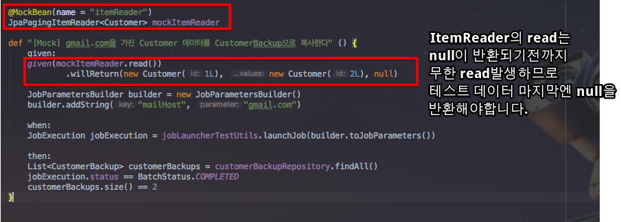
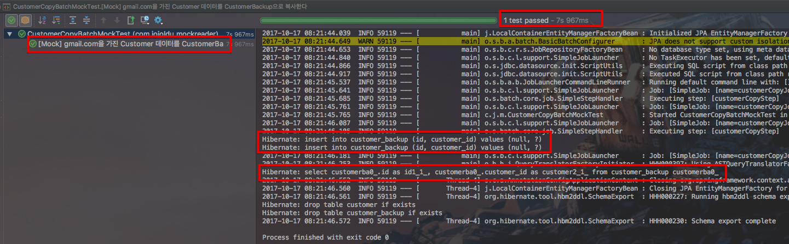

# SpringBatch에서 ItemReader를 Mock객체로 교체하기

안녕하세요? 이번 시간엔 SpringBatch에서 ItemReader를 Mock객체로 교체하는 예제를 진행해보려고 합니다.  
모든 코드는 [Github](https://github.com/jojoldu/blog-code/tree/master/spring-batch-mock-reader)에 있기 때문에 함께 보시면 더 이해하기 쉬우실 것 같습니다.  
(공부한 내용을 정리하는 [Github](https://github.com/jojoldu/blog-code)와 세미나+책 후기를 정리하는 [Github](https://github.com/jojoldu/review), 이 모든 내용을 담고 있는 [블로그](http://jojoldu.tistory.com/)가 있습니다. )<br/>

## 발단

스프링 배치로 테스트 코드를 짜다보면 정말 하기 싫은것이 **ItemReader로 읽어올 데이터를 만드는 것**입니다.  
특히나 실제 업무에서 쓰다보면 **수많은 필수값들과 엔티티 관계들로 인해 만들어야할 데이터가 많을 경우** 더 그렇습니다.  
이렇게 테스트 환경 구축이 힘들때는 역시나! Mock을 활용하면 좋다고 생각했습니다.  
ItemReader를 어떻게 Mocking할지 고민하다 팀내 주임님의 코드로 힌트를 얻어 Mocking 할수있게되어 정리하게 되었습니다.

## 본문

### 기본 프로젝트 구성

스프링부트배치+Spock+Lombok으로 구성할 예정입니다.  
  
**build.gradle**

```gradle
apply plugin: 'java'
apply plugin: 'groovy'
apply plugin: 'eclipse'
apply plugin: 'org.springframework.boot'

dependencies {
	compile('org.springframework.boot:spring-boot-starter-batch')
	compile('org.springframework.boot:spring-boot-starter-data-jpa')
	runtime('com.h2database:h2')
	compileOnly('org.projectlombok:lombok')
	testCompile('org.springframework.boot:spring-boot-starter-test')
	testCompile('org.springframework.batch:spring-batch-test')
	testCompile('org.spockframework:spock-core:1.1-groovy-2.4')
	testCompile('org.spockframework:spock-spring:1.1-groovy-2.4')
}
```

스프링배치를 사용하기 위해 ```Application.java```에 ```@EnableBatchProcessing```을 선언합니다.

```java
@SpringBootApplication
@EnableBatchProcessing
public class Application {

	public static void main(String[] args) {
		SpringApplication.run(Application.class, args);
	}
}

```

사용할 엔티티 클래스들과 레파지토리는 다음과 같습니다.

```java
@Entity
@Getter
@NoArgsConstructor
public class Customer {
    @Id
    @GeneratedValue
    private Long id;

    private String name;
    private String email;

    public Customer(Long id) {
        this.id = id;
    }

    public Customer(String name, String email) {
        this.name = name;
        this.email = email;
    }
}

public interface CustomerRepository extends JpaRepository<Customer, Long> {
}

@Entity
@Getter
@NoArgsConstructor
public class CustomerBackup {

    @Id
    @GeneratedValue
    private Long id;

    private Long customerId;

    public CustomerBackup(Long customerId) {
        this.customerId = customerId;
    }
}

public interface CustomerBackupRepository extends JpaRepository<CustomerBackup, Long> {
}

```

기본적인 클래스 생성은 끝났습니다.  
다음은 테스트 환경을 구축하겠습니다.

### 테스트 환경

src/test/groovy 혹은 src/test/java에 본인의 패키지를 생성하고 테스트 환경 설정 파일을 생성합니다.  
여기서는 ```TestJobConfiguration```란 이름으로 생성하였습니다.

```java
@EnableBatchProcessing
@Configuration
@EnableAutoConfiguration
@ComponentScan
public class TestJobConfiguration {

    @Bean
    public JobLauncherTestUtils jobLauncherTestUtils() {
        return new JobLauncherTestUtils();
    }
}
```



테스트 환경에서 실행되는 쿼리를 보고 싶다면 src/**test**/resources/application.yml에 다음과 같이 설정값을 추가합니다.

```yml
spring:
  jpa:
    show-sql: true
```

자 테스트 환경도 이제 끝났습니다.  
본격적으로 배치 코드를 작성해보겠습니다.

### 스프링 배치 코드

저희가 만들 스프링 배치 기능은 간단합니다.  
조건에 맞는 ```Customer```를 조회해 ```CustomerBackup```으로 복사하는 것입니다.  
클래스명은 ```CustomerCopyBatchConfiguration```로 하겠습니다.

```java
import static com.jojoldu.mockreader.batch.CustomerCopyBatchConfiguration.JOB_NAME;

@AllArgsConstructor
@Configuration
@ConditionalOnProperty(name = "job.name", havingValue = JOB_NAME)
public class CustomerCopyBatchConfiguration {
    public static final String JOB_NAME = "customerCopyJob";
    private static final String STEP_NAME = "customerCopyStep";
    private static final int CHUNK_SIZE = 100;

    private JobBuilderFactory jobBuilderFactory;
    private StepBuilderFactory stepBuilderFactory;
    private EntityManagerFactory emf;

    /**
     * Mock 객체로 교체할 수 있게 Autowired 받도록 수정
     */
    private JpaPagingItemReader<Customer> itemReader;

    @Bean
    public Job job() {
        return jobBuilderFactory.get(JOB_NAME)
                .start(step())
                .build();
    }

    @Bean
    public Step step() {
        return stepBuilderFactory.get(STEP_NAME)
                .<Customer, CustomerBackup>chunk(CHUNK_SIZE)
                .reader(itemReader) // 인잭션 받은 itemReader를 사용한다
                .processor(processor())
                .writer(writer())
                .build();
    }

    @Bean
    @StepScope
    public JpaPagingItemReader<Customer> reader(
            @Value("#{jobParameters[mailHost]}") String mailHost) {
        Map<String, Object> paramMap = new HashMap<>();
        paramMap.put("mailHost", "%@"+mailHost);

        JpaPagingItemReader<Customer> reader = new JpaPagingItemReader<>();
        reader.setQueryString("SELECT c FROM Customer c where c.email like :mailHost");
        reader.setParameterValues(paramMap);
        reader.setPageSize(CHUNK_SIZE);
        reader.setEntityManagerFactory(emf);

        return reader;
    }

    @Bean
    public ItemProcessor<Customer, CustomerBackup> processor() {
        return item -> new CustomerBackup(item.getId());
    }

    @Bean
    public JpaItemWriter<CustomerBackup> writer() {
        final JpaItemWriter<CustomerBackup> itemWriter = new JpaItemWriter<>();
        itemWriter.setEntityManagerFactory(emf);
        return itemWriter;
    }
}
```

여기서 눈여겨 보실점은 바로 ItemReader를 받는 부분입니다.



(```itemReader```는 ```@AllArgsConstructor```으로 생성자 인잭션을 받았습니다.  
쉽게 얘기해서 ```@Autowired```가 된 상태라고 보시면 됩니다.)  
  
기존에 processor나 writer와 달리 reader는 Bean으로 입력받도록 합니다.  
이렇게 하면 실제 구동 환경에선 ```@Bean```으로 지정된 reader 메소드의 결과값을 받아 쓰지만,  
테스트 환경에선 언제든지 가짜 Bean으로 교체할 수 있는 구성이 된것입니다.  

> 반대로 processor나 writer를 Mocking 하고 싶다면 이들을 Bean으로 입력받도록 하면 되겠죠?

자 그럼 실제로 이 코드가 잘 수행되는지 테스트 해보겠습니다.

### 테스트 코드

제일 먼저 시도해볼 것은 실제로 배치 코드가 잘 돌아가는 것인지 테스트하는 것입니다.  


```groovy
@TestPropertySource(properties = "job.name=customerCopyJob")
@SpringBootTest
class CustomerCopyBatchRealTest extends Specification {

    @Autowired
    JobLauncherTestUtils jobLauncherTestUtils

    @Autowired
    CustomerRepository customerRepository

    def "[Real] gmail.com을 가진 Customer 데이터를 CustomerBackup으로 복사한다" () {
        given:
        customerRepository.save(new Customer("jojoldu", "jojoldu@gmail.com"))
        customerRepository.save(new Customer("jojoldu1", "jojoldu@naver.com"))

        JobParametersBuilder builder = new JobParametersBuilder()
        builder.addString("mailHost", "gmail.com")

        when:
        JobExecution jobExecution = jobLauncherTestUtils.launchJob(builder.toJobParameters())

        then:
        jobExecution.status == BatchStatus.COMPLETED
    }
}
```

Spock으로 작성한 배치 테스트 코드입니다.  
Junit과 크게 다르지 않아서 보시는데 어려움은 없으실것 같습니다.  
테스트 코드를 실행해보면!


이렇게 Bean으로 ItemReader를 잘 받아서 수행했음을 확인하였습니다.  
자! 그럼 대망의 Mock Bean으로 ItemReader를 교체한 테스트 코드를 작성하겠습니다.

```groovy
@TestPropertySource(properties = "job.name=customerCopyJob")
@SpringBootTest
class CustomerCopyBatchMockTest extends Specification {

    @Autowired
    JobLauncherTestUtils jobLauncherTestUtils

    @Autowired
    CustomerBackupRepository customerBackupRepository

    @MockBean(name = "itemReader")
    JpaPagingItemReader<Customer> mockItemReader

    def "[Mock] gmail.com을 가진 Customer 데이터를 CustomerBackup으로 복사한다" () {
        given:
        given(mockItemReader.read())
                .willReturn(new Customer(1L), new Customer(2L), null)

        JobParametersBuilder builder = new JobParametersBuilder()
        builder.addString("mailHost", "gmail.com")

        when:
        JobExecution jobExecution = jobLauncherTestUtils.launchJob(builder.toJobParameters())

        then:
        List<CustomerBackup> customerBackups = customerBackupRepository.findAll()
        jobExecution.status == BatchStatus.COMPLETED
        customerBackups.size() == 2
    }
}
```

좀전에 작성한 테스트 코드와 거의 흡사한 형태입니다.  
(참고로 ```given().willReturn```은 모두 Spock이 아닌 Spring-starter-test에 있는 의존성들입니다.  
Junit에서도 동일하게 사용하실수 있습니다.)  
  
여기서 주의하실 점은 ```.willReturn```에서 반환하는 값들입니다.  



여기선 **배열을 리턴하는 것이 아닙니다**.  
Mocking 메소드 (여기서는 ```mockItemReader.read()```) 가 수행될때마다 반환될 값들을 순차적으로 작성한 것입니다.  
그래서 처음 read가 수행되면 ```new Customer(1L)```가, 두번째 수행될땐 ```new Customer(2L)```, 마지막으로 3번째로 수행될땐 ```null```가 반환되도록 한것입니다.  
배열로 작성하면 배열 자체가 리턴되니 오류가 발생합니다.  
read 메소드는 더이상 읽지 않겠다의 판단을 **마지막으로 읽은 값이 ```null```이냐 아니냐로 판단**하기 때문입니다.  
  
자 그럼 Mock 테스트도 한번 실행해보겠습니다.



보시는 것처럼 ```Customer```를 조회하는 부분은 전혀 없지만 (사진속 select는 검증을 위한 ```CustomerBackup```조회 쿼리입니다.) 테스트 코드가 통과됨을 알 수 있습니다.  
만약 MockBean이 아닌 실제 Bean을 사용했다면 읽을 데이터가 없어 2개의 Insert가 발생할수 없었겠죠?  
정말 쉽게 ItemReader를 Mocking 할수 있게 되었습니다.
  

## 마무리

스프링부트 1.4부터 정말 테스트하기가 좋은 환경이 된것 같습니다.  
더 다양한 환경에서 테스트와 Mocking 하는 사례를 계속 공유하겠습니다.  
끝까지 읽어주셔서 감사합니다!

