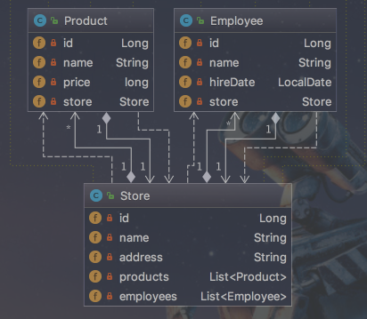
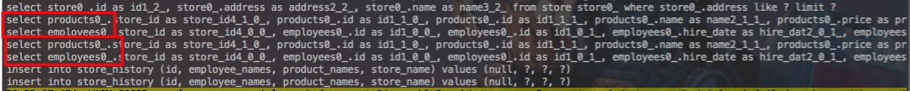
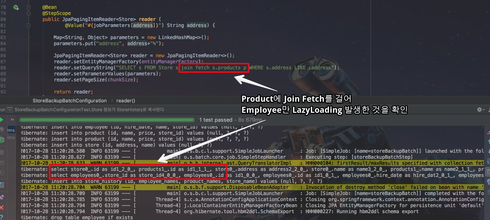
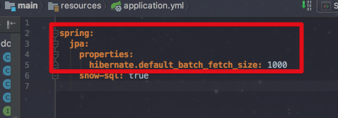

# Spring batch에서 N+1 문제 해결

안녕하세요? 이번 시간엔 Spring batch에서 N+1 문제 해결을 진행해보려고 합니다.  
모든 코드는 [Github](https://github.com/jojoldu/blog-code/tree/master/spring-batch-n1)에 있기 때문에 함께 보시면 더 이해하기 쉬우실 것 같습니다.  
(공부한 내용을 정리하는 [Github](https://github.com/jojoldu/blog-code)와 세미나+책 후기를 정리하는 [Github](https://github.com/jojoldu/review), 이 모든 내용을 담고 있는 [블로그](http://jojoldu.tistory.com/)가 있습니다. )<br/>
  
## 문제

프로젝트는 SpringBoot Batch + Lombok + Spock으로 구성됩니다.  

```groovy
dependencies {
	compile('org.springframework.boot:spring-boot-starter-data-jpa')
	compile('org.springframework.boot:spring-boot-starter-batch')

	runtime('com.h2database:h2')
	compileOnly('org.projectlombok:lombok')

	testCompile('org.springframework.batch:spring-batch-test')
	testCompile('org.springframework.boot:spring-boot-starter-test')
	testCompile('org.spockframework:spock-core:1.1-groovy-2.4')
	testCompile('org.spockframework:spock-spring:1.1-groovy-2.4')
}
```
해당 기술들이 처음이셔도 코드가 크게 어렵지 않기 때문에 보시는데 어려움이 없으실 것 같습니다.  
  
다음은 기본적인 엔티티와 Repository를 생성하겠습니다.  
엔티티는 총 4개로 구성됩니다.  



```java
@NoArgsConstructor
@Getter
@Entity
public class Store {

    @Id
    @GeneratedValue
    private Long id;

    private String name;
    private String address;

    @OneToMany(mappedBy = "store", cascade = ALL)
    private List<Product> products = new ArrayList<>();

    @OneToMany(mappedBy = "store", cascade = ALL)
    private List<Employee> employees = new ArrayList<>();

    public Store(String name, String address) {
        this.name = name;
        this.address = address;
    }

    public void addProduct(Product product){
        this.products.add(product);
        product.updateStore(this);
    }

    public void addEmployee(Employee employee){
        this.employees.add(employee);
        employee.updateStore(this);
    }
}
```

```java
public interface StoreRepository extends JpaRepository<Store, Long> {
}

```

```java
@NoArgsConstructor
@Getter
@Entity
public class Product {

    @Id
    @GeneratedValue
    private Long id;

    private String name;
    private long price;

    @ManyToOne
    @JoinColumn(name = "store_id", foreignKey = @ForeignKey(name = "FK_PRODUCT_STORE"))
    private Store store;

    public Product(String name, long price) {
        this.name = name;
        this.price = price;
    }

    public void updateStore(Store store){
        this.store = store;
    }
}
```

```java
@NoArgsConstructor
@Getter
@Entity
public class Employee {

    @Id
    @GeneratedValue
    private Long id;

    private String name;
    private LocalDate hireDate;

    @ManyToOne
    @JoinColumn(name = "store_id", foreignKey = @ForeignKey(name = "FK_EMPLOYEE_STORE"))
    private Store store;

    public Employee(String name, LocalDate hireDate) {
        this.name = name;
        this.hireDate = hireDate;
    }

    public void updateStore(Store store){
        this.store = store;
    }
}
```

여기서 배치의 Writer로 사용될 ```StoreHistory```를 생성합니다.

```java
@NoArgsConstructor
@Getter
@Entity
public class StoreHistory {

    @Id
    @GeneratedValue
    private Long id;

    private String storeName;
    private String productNames;
    private String employeeNames;

    public StoreHistory(Store store, List<Product> products, List<Employee> employees) {
        this.storeName = store.getName();
        this.productNames = products.stream()
                .map(Product::getName)
                .collect(Collectors.joining( "," ));

        this.employeeNames = employees.stream()
                .map(Employee::getName)
                .collect(Collectors.joining( "," ));
    }
}

```

```java
public interface StoreHistoryRepository extends JpaRepository<StoreHistory, Long> {
}
```

자 그리고 실제 수행해볼 배치 코드를 작성하겠습니다.

```java
@Configuration
@ConditionalOnProperty(name = "job.name", havingValue = JOB_NAME)
public class StoreBackupBatchConfiguration {

    public static final String JOB_NAME = "storeBackupBatch";
    private static final String STEP_NAME = JOB_NAME+"Step";

    private EntityManagerFactory entityManagerFactory;
    private JobBuilderFactory jobBuilderFactory;
    private StepBuilderFactory stepBuilderFactory;

    public StoreBackupBatchConfiguration(EntityManagerFactory entityManagerFactory, JobBuilderFactory jobBuilderFactory, StepBuilderFactory stepBuilderFactory) {
        this.entityManagerFactory = entityManagerFactory;
        this.jobBuilderFactory = jobBuilderFactory;
        this.stepBuilderFactory = stepBuilderFactory;
    }

    @Value("${chunkSize:1000}")
    private int chunkSize; // Parameter로 chunkSize를 던지면 해당 값으로, 없으면 1000을 기본으로

    private static String ADDRESS_PARAM = null;

    @Bean
    public Job job() {
        return jobBuilderFactory.get(JOB_NAME)
                .start(step())
                .build();
    }

    @Bean
    @JobScope
    public Step step() {
        return stepBuilderFactory.get(STEP_NAME)
                .<Store, StoreHistory>chunk(chunkSize)
                .reader(reader(ADDRESS_PARAM))
                .processor(processor())
                .writer(writer())
                .build();
    }

    @Bean
    @StepScope
    public JpaPagingItemReader<Store> reader (
            @Value("#{jobParameters[address]}") String address) {

        Map<String, Object> parameters = new LinkedHashMap<>();
        parameters.put("address", address+"%");

        JpaPagingItemReader<Store> reader = new JpaPagingItemReader<>();
        reader.setEntityManagerFactory(entityManagerFactory);
        reader.setQueryString("select s From Store s where s.address like :address");
        reader.setParameterValues(parameters);
        reader.setPageSize(chunkSize);

        return reader;
    }

    public ItemProcessor<Store, StoreHistory> processor() {
        return item -> new StoreHistory(item, item.getProducts(), item.getEmployees());
    }

    public JpaItemWriter<StoreHistory> writer() {
        JpaItemWriter<StoreHistory> writer = new JpaItemWriter<>();
        writer.setEntityManagerFactory(entityManagerFactory);
        return writer;
    }

}

```

조건(```like %address```)에 맞는 ```Store```를 조회하여 ```StoreHistory```로 복사하는 단순한 배치 프로그램입니다.  
자 그럼 이 배치 프로그램을 테스트할 테스트코드를 작성하겠습니다.  
  
먼저 스프링배치 테스트 환경을 위해 설정파일을 하나 생성합니다. 

```java
@EnableBatchProcessing
@Configuration
@EnableAutoConfiguration
@ComponentScan
public class TestJobConfiguration {

    @Bean
    public JobLauncherTestUtils jobLauncherTestUtils() {
        return new JobLauncherTestUtils();
    }
}
```

이를 기반으로 테스트 클래스를 추가합니다.

```groovy
@SpringBootTest
@TestPropertySource(properties = "job.name=storeBackupBatch")
class StoreBackupBatchConfigurationTest extends Specification {

    @Autowired
    JobLauncherTestUtils jobLauncherTestUtils

    @Autowired
    StoreRepository storeRepository

    @Autowired
    StoreHistoryRepository storeHistoryRepository

    def "Store 정보가 StoreHistory로 복사된다" () {
        given:
        Store store1 = new Store("서점", "서울시 강남구")
        store1.addProduct(new Product("책1_1", 10000L))
        store1.addProduct(new Product("책1_2", 20000L))
        store1.addEmployee(new Employee("직원1", LocalDate.now()))
        storeRepository.save(store1)

        Store store2 = new Store("서점2", "서울시 강남구")
        store1.addProduct(new Product("책2_1", 10000L))
        store1.addProduct(new Product("책2_2", 20000L))
        store1.addEmployee(new Employee("직원2", LocalDate.now()))
        storeRepository.save(store2)

        JobParameters jobParameters = new JobParametersBuilder()
                .addString("address", "서울")
                .toJobParameters()
        when:
        JobExecution jobExecution = jobLauncherTestUtils.launchJob(jobParameters)

        then:
        jobExecution.status == BatchStatus.COMPLETED
    }
}
```

그럼 이제 테스트를 실행해보겠습니다.  
테스트는 성공적으로 통과하지만, 로그에 문제가 있어 보입니다.  



 ```Store```와 ```Product```, ```Employee```가 1대다 관계다보니 ```reader.read()```과정에서 자연스레 JPA N+1 문제가 발생했습니다.  

> JPA N+1 문제란?  
 ```@OneToMany``` 등에서 하위 엔티티들을 Lazy Loading으로 가져올때마다 조회 쿼리가 추가로 발생하는 이슈 ([참고](http://jojoldu.tistory.com/165))

이 문제를 해결하기 위해 ```join fetch```를 추가하겠습니다.  
먼저 ```Product``` 만 걸어보겠습니다.



이 쿼리를 자세히 확인해보면

```sql
select store0_.id as id1_2_0_, products1_.id as id1_1_1_, store0_.address as address2_2_0_, store0_.name as name3_2_0_, products1_.name as name2_1_1_, products1_.price as price3_1_1_, products1_.store_id as store_id4_1_1_, products1_.store_id as store_id4_1_0__, products1_.id as id1_1_0__ 
from store store0_ 
inner join product products1_ on store0_.id=products1_.store_id 
where store0_.address like ?
```

한번의 ```join```이 발생한것을 알 수 있습니다.  
  
자 그럼 여기서 추가로 ```Employee```에도 ```join fetch```를 걸어보겠습니다.  
그리고 테스트를 수행해보면!


예상치 못한 ```MultipleBagFetchException```을 만나게 됩니다.  
즉, 한번에 너무 많은 ```join fetch```을 사용할 수 없어 문제가 발생하였습니다.  
  
이 문제는 꼭 ```join fetch```에서만 발생하진 않습니다.  
엔티티 클래스의 ```FetchType```을 ```Eager```로 두고 있어도 발생할 수 있습니다.  
가장 편한 해결책은 Lazy Loading 하는 것이지만, 앞에서 보신것처럼  JPA N+1 문제가 발생해서 성능상 큰 문제가 발생합니다.  
이러지도 저러지도 못하는 상황에서 해결할 수 있는 방법이 없을까요?

## 해결

[vladmihalcea.com](https://vladmihalcea.com/2013/10/22/hibernate-facts-multi-level-fetching/)에서 ```EntityGraphBuilder```, ```EntityVisitor```로 이를 해결하는 방법이 소개되었지만 개인적으로는 복잡하단 생각에 좀 더 쉬운 방법이 필요했습니다.  
  
다행히도 해결책을 찾을 수 있었습니다.  
  
application.yml에 다음과 같은 옵션을 추가합니다.  



```yml
spring:
  jpa:
    properties:
      hibernate.default_batch_fetch_size: 1000
```

이 **```batch-size``` 옵션은 하위 엔티티를 로딩할때 한번에 상위 엔티티 ID를 지정한 숫자만큼 ```in Query```로 로딩**해줍니다.  
현재 프로젝트를 예로 들면 ```batch-size:1000```으로 되어있으면, 상위 엔티티인 ```Store```의 id 1000개를 ```in Query```로 ```Product``` 와 ```Employee```를 조회하게 됩니다.  
그럼 실제로 수행해보겠습니다.  


## 참고

* [7 tips-to-boost-your-hibernate-performance/](http://www.thoughts-on-java.org/tips-to-boost-your-hibernate-performance/)

* [hibernate-facts-multi-level-fetching](https://vladmihalcea.com/2013/10/22/hibernate-facts-multi-level-fetching/)

* [권남 위키](http://kwonnam.pe.kr/wiki/java/hibernate/performance)

