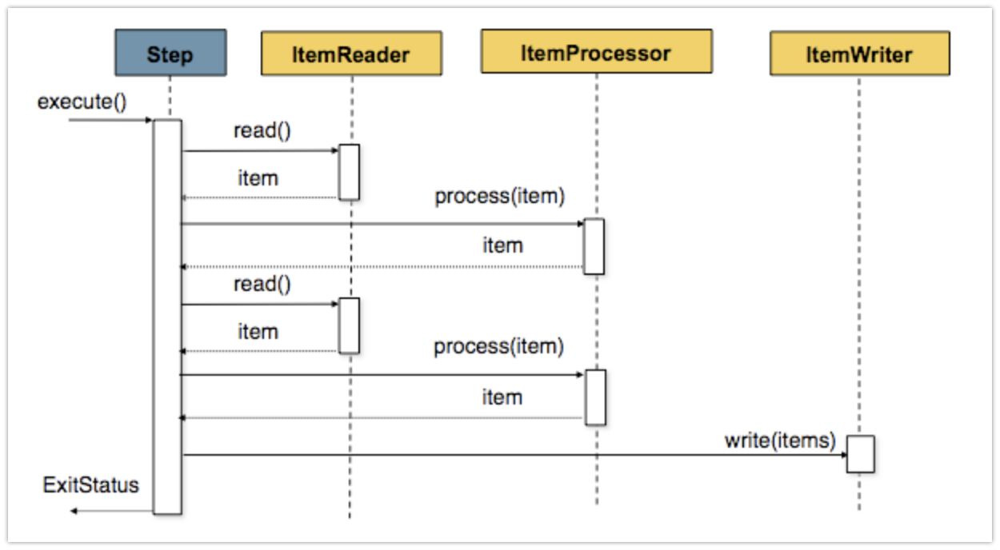

# SAP 연동 시스템 개편기

안녕하세요?  
작년에 [회사 블로그 글](http://woowabros.github.io/tools/2017/07/10/java-enum-uses.html)을 쓰고나서 "좀 더 잘 쓸수있었을텐데.." 라는 아쉬움이 있었습니다.  
그래서 올해 블로그를 작성할때는 좀 더 욕심을 내보려고 했습니다.

(올해도 에피타이저였습니다)  
  
다시 내년을 기약하며!  

## 0. 들어가며

작년 하반기에 SAP 연동 시스템 개편을 진행했습니다.  
기존 DB to DB 방식에서 API통신으로 개편하는 과정이였는데요.  
좀 더 다양한 데이터를 모두 취합하기 위해 단순히 통신 프로토콜만 변경한게 아닌, **인터페이스 스펙이 전부 변경**되는 큰 작업이였습니다.  
  
신규 연동 시스템 구축을 진행하면서 Spring Batch로 어떻게 문제들을 해결했는지를 소개드리겠습니다.  

> 회사 코드를 공개할 수 없어서 간소화한 샘플 코드임을 먼저 말씀드립니다.  

## 1. Spring Batch 소개

신규 연동 시스템의 메인 기술은 Spring Batch입니다.  

## 2. Enum으로 다양한 API 스펙 관리하기

### 2-1. Reader & Processor 동적으로 사용하기

### 2-2. Writer 동적으로 사용하기

## 3. Custom Batch 모듈 사용하기

### 3-1. Querydsl

### 3-2. JpaItemListWriter

## 4. Mockito로 테스트 코드 간소화하기

### 4-1. Reader Mocking

### 4-2. API 통신 Mocking

## 5. 젠킨스로 Batch 관리하기

Spring Batch의 실행을 관리하는 방법은 크게 2가지가 있습니다.  

* [Quartz](http://www.quartz-scheduler.org/)로 Admin 페이지 만들어 사용하기
* [젠킨스](https://jenkins.io/) Job으로 사용하기

> Spring Quartz와 Spring Batch는 그 용도가 서로 다릅니다.  
인터넷 검색을 하다보면 Quartz가 Batch보다 낫다 아니다를 이야기하는 글을 보게 되는데요.  
바다코끼리와 코끼리처럼 둘은 완전히 목적이 다른 모듈들입니다.  
Quartz는 특정 
