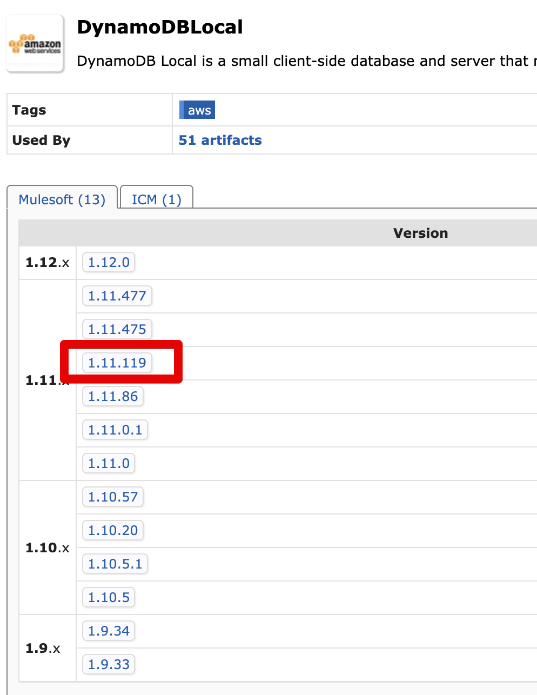
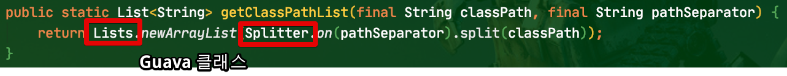
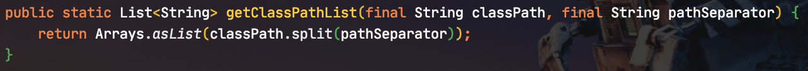
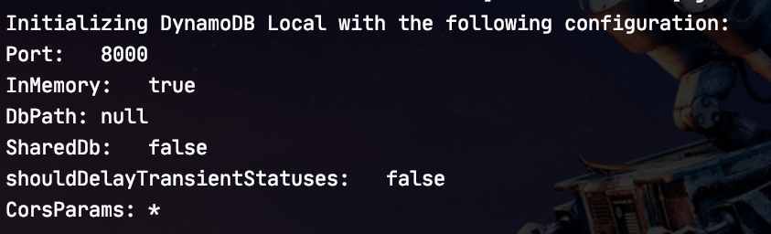
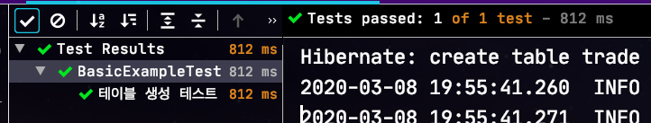
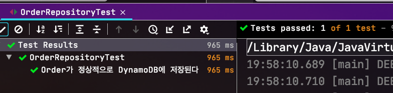

# Spring Data DynamoDB와 Embedded 개발 환경 구축하기

> 모든 코드는 [Github](https://github.com/jojoldu/blog-code/tree/master/spring-boot-dynamodb)에 있습니다.

이번 시간엔 로컬 개발 환경에서 DynamoDB를 Embedded로 활용하는 방법에 대해서 알아보겠습니다.  
  
이미 도커를 적극적으로 테스트와 개발에 사용하고 계신 분들이라면 LocalStack 으로 구성하셔도 무방합니다.  

> 참고: [LocalStack을 활용한 Integration Test 환경 만들기](https://woowabros.github.io/tools/2019/07/18/localstack-integration.html)

다만 아직 도커를 사용하고 있지 않거나, 굳이 도커 설치해서 매번 테스트를 돌릴때마다 도커를 실행하는게 귀찮다고 생각하시는 분들은 한번 고려해보셔도 좋을것 같습니다.  
  
## 0. 들어가며

사용한 의존성은 다음과 같습니다.

* Spring Boot: 2.2.5
  * Spring Cloud AWS: 2.2.1
  * Spring Cloud Dependencies: Hoxton.SR3
* Spring Data DynamoDB: 5.2.3
  * 기존의 다른 Spring Data 프로젝트들 처럼 Data Layer의 추상화된 클래스들을 제공합니다.
  * 하지만 (2020.03.08 기준) Spring Data팀이 **공식 지원하는 프로젝트가 없습니다**
  * 그래서 개인이 만든 프로젝트를 사용합니다.
    * 사용할 프로젝트는 [boostchicken/spring-data-dynamodb](https://github.com/boostchicken/spring-data-dynamodb) 입니다.
    * ```derjust/spring-data-dynamodb``` 프로젝트는 Spring Boot 2.1.x까지만 지원하기 때문에 최신의 Spring Boot 프로젝트에서는 사용할 수가 없습니다.
* AWS Dynamodb SDK
  * 원래는 별도로 의존성을 지정해주어야 하나 Spring Data DynamoDB 가 이미 해당 의존성을 갖고 있어 별도로 등록하진 않습니다.
* DynamoDBLocal:1.11.119
  * 이번 포스팅에서 사용할 Embedded DynamoDB 의존성입니다.
  * AWS에서 공식 지원하고 있어 지속적으로 버전관리가 되고 있습니다.

이렇게 해서 ```build.gradle``` 의 전체 본문은 다음과 같습니다.

```groovy
plugins {
    id 'org.springframework.boot' version '2.2.5.RELEASE' apply false
    id 'io.spring.dependency-management' version '1.0.9.RELEASE'
    id 'java'
}

group = 'com.jojoldu.blogcode'
version = '0.0.1-SNAPSHOT'
sourceCompatibility = '1.8'

configurations {
    compileOnly {
        extendsFrom annotationProcessor
    }
}

repositories {
    mavenCentral()
    maven { url 'https://s3-us-west-2.amazonaws.com/dynamodb-local/release' } // for DynamoDBLocal Lib
}

dependencies {
    implementation 'org.springframework.cloud:spring-cloud-starter-aws'
    implementation 'io.github.boostchicken:spring-data-dynamodb:5.2.3'
    implementation 'com.amazonaws:DynamoDBLocal:1.11.119'

    implementation 'org.springframework.boot:spring-boot-starter-data-jpa'
    implementation 'org.springframework.boot:spring-boot-starter-web'
    compile 'com.h2database:h2'

    annotationProcessor 'org.projectlombok:lombok'
    implementation 'org.projectlombok:lombok'
    testAnnotationProcessor 'org.projectlombok:lombok'
    testImplementation 'org.projectlombok:lombok'

    testImplementation('org.springframework.boot:spring-boot-starter-test') {
        exclude group: 'org.junit.vintage', module: 'junit-vintage-engine'
    }
}

test {
    useJUnitPlatform()
}

dependencyManagement {
    imports {
        mavenBom org.springframework.boot.gradle.plugin.SpringBootPlugin.BOM_COORDINATES
        mavenBom 'org.springframework.cloud:spring-cloud-dependencies:Hoxton.SR3'
    }
}
```

(Gradle은 5버전을 사용합니다.)  
  
여기서 DynamoDBLocal의 버전을 ```1.11.119``` 로 강제 명시한것에 대해 의문이 있는 분들이 계실텐데요.  
  
기존에 [AWS 공식 문서](https://docs.aws.amazon.com/ko_kr/amazondynamodb/latest/developerguide/DynamoDBLocal.Maven.html) 를 참고하시다보면 다음과 같이 버전이 지정된 것을 확인할 수 있습니다.  

```groovy
<version>[1.11,2.0)</version>
```

* 위 버전 명시 문법은 다음과 같습니다.
  * 대괄호 (```[]```) 는 해당 버전을 포함 그 이상 혹은 그 이하
  * 괄호 (```()```) 는 해당 버전 보다 크거나 작은 버전
* 즉, 위 버전은 ```1.11 ~ 2 미만```의 버전을 사용합니다.
* 좀 더 자세한 내용은 [Maven Range 의존성 문서](http://www.mojohaus.org/versions-maven-plugin/examples/resolve-ranges.html) 를 참고해보세요

현재 DynamoDB Local의 버전은 1.12.0 버전인데요.  
해당 버전과 Spring Cloud AWS 2.2.1 을 사용하면 다음과 같이 DynamoDBLocal 을 실행하기 위한 몇몇 **클래스가 없다는 에러 메세지**를 만나게 됩니다.


```java
BeanCreationException: Error creating bean with name 'embeddedDynamoDbConfig': Invocation of init method failed; nested exception is java.lang.NoClassDefFoundError: com/amazonaws/services/dynamodbv2/model/CancellationReason
```

현재 (2020.03.08) 최신 Spring Cloud AWS 버전인 2.2.1 에서 사용하는 AWS SDK 버전은 ```1.11.415``` 입니다.  
Dynamodb SDK 는 Spring Cloud AWS 에 포함되진 않지만, 마찬가지로 ```1.11.415``` 버전을 사용합니다.  
Dynamodb SDK ```1.11.415``` 버전에 호환 가능한 DynamoDBLocal 버전 중 가장 최신은 ```1.11.119``` 입니다.



그래서 현재는 DynamoDBLocal의 버전을 ```1.11.119``` 로 고정하여 사용합니다.

## 1. 기본 환경 구성

위와 같이 Gradle 설정 후 이제 하나씩 Config 클래스들을 추가하겠습니다.  
  
**EmbeddedDynamoDbConfig**

```java
import com.amazonaws.services.dynamodbv2.local.main.ServerRunner;
import com.amazonaws.services.dynamodbv2.local.server.DynamoDBProxyServer;
import lombok.RequiredArgsConstructor;
import lombok.extern.slf4j.Slf4j;
import org.springframework.boot.autoconfigure.condition.ConditionalOnProperty;
import org.springframework.context.annotation.Configuration;
import org.springframework.context.annotation.Profile;

import javax.annotation.PostConstruct;
import javax.annotation.PreDestroy;

@Slf4j
@RequiredArgsConstructor
@Configuration
@Profile("local") // (1)
@ConditionalOnProperty(name = "embedded-dynamodb.use", havingValue = "true") // (2)
public class EmbeddedDynamoDbConfig {

    private DynamoDBProxyServer server;

    @PostConstruct
    public void start() {
        if (server != null) {
            return;
        }

        try {
            AwsDynamoDbLocalTestUtils.initSqLite(); // (3)
            server = ServerRunner.createServerFromCommandLineArgs(new String[]{"-inMemory"});
            server.start();
            log.info("Start Embedded DynamoDB");
        } catch (Exception e) {
            throw new IllegalStateException("Fail Start Embedded DynamoDB", e);
        }
    }

    @PreDestroy
    public void stop() {
        if (server == null) {
            return;
        }

        try {
            log.info("Stop Embedded DynamoDB");
            server.stop();
        } catch (Exception e) {
            throw new IllegalStateException("Fail Stop Embedded DynamoDB", e);
        }
    }
}
```

(1) ```@Profile("local")```

* profile이 ```local```일때만 활성화합니다.
* dev, prod 와 같은 환경에서는 실제 DynamoDB를 사용하면 되니 local에서만 활성화시킵니다.

(2) ```@ConditionalOnProperty(name = "embedded-dynamodb.use", havingValue = "true")```

* ```embedded-dynamodb.use=true``` 로 properties가 지정된 경우에만 DynamoDBLocal을 실행하게 하여 굳이 DynamoDB를 사용하지 않는 경우엔 실행시키지 않도록 합니다.

(3) ```AwsDynamoDbLocalTestUtils.initSqLite();```

* 자세한 내용은 해당 클래스 코드와 함께 소개드리겠습니다.

**AwsDynamoDbLocalTestUtils**

```java
import lombok.NoArgsConstructor;

import java.io.File;
import java.util.ArrayList;
import java.util.Arrays;
import java.util.List;
import java.util.Locale;
import java.util.function.Supplier;

import static lombok.AccessLevel.PRIVATE;
/**
 * Helper class for initializing AWS DynamoDB to run with sqlite4java for local testing.
 *
 * Copied from: https://github.com/redskap/aws-dynamodb-java-example-local-testing
 */
@NoArgsConstructor(access = PRIVATE)
public abstract class AwsDynamoDbLocalTestUtils {
    private static final String BASE_LIBRARY_NAME = "sqlite4java";

    /**
     * Sets the sqlite4java library path system parameter if it is not set already.
     */
    public static void initSqLite() {
        initSqLite(() -> {
            final List<String> classPath = getClassPathList(System.getProperty("java.class.path"), File.pathSeparator);

            return getLibPath(
                    System.getProperty("os.name"),
                    System.getProperty("java.runtime.name"),
                    System.getProperty("os.arch"),
                    classPath);
        });
    }

    /**
     * Sets the sqlite4java library path system parameter if it is not set already.
     *
     * @param libPathSupplier Calculates lib path for sqlite4java.
     */
    public static void initSqLite(Supplier<String> libPathSupplier) {
        if (System.getProperty("sqlite4java.library.path") == null) {
            System.setProperty("sqlite4java.library.path", libPathSupplier.get());
        }
    }

    /**
     * Calculates the possible Library Names for finding the proper sqlite4j native library and returns the directory with the most specific matching library.
     *
     * @param osName      The value of <code>"os.name"</code> system property (<code>System.getProperty("os.name")</code>).
     * @param runtimeName The value of <code>"java.runtime.name"</code> system property (<code>System.getProperty("java.runtime.name")</code>).
     * @param osArch      The value of <code>"os.arch"</code> system property (<code>System.getProperty("os.arch")</code>).
     * @param osArch      The classpath split into strings by path separator. Value of <code>"java.class.path"</code> system property
     *                    (<code>System.getProperty("os.arch")</code>) split by <code>File.pathSeparator</code>.
     * @return
     */
    public static String getLibPath(final String osName, final String runtimeName, final String osArch, final List<String> classPath) {
        final String os = getOs(osName, runtimeName);
        final List<String> libNames = getLibNames(os, getArch(os, osArch));

        for (final String libName : libNames) {
            for (final String classPathLib : classPath) {
                if (classPathLib.contains(libName)) {
                    return new File(classPathLib).getParent();
                }
            }
        }

        throw new IllegalStateException("SQLite library \"" + libNames + "\" is missing from classpath");
    }

    /**
     * Calculates the possible Library Names for finding the proper sqlite4java native library.
     *
     * Based on the internal calculation of the sqlite4java wrapper <a href="https://bitbucket
     * .org/almworks/sqlite4java/src/fa4bb0fe7319a5f1afe008284146ac83e027de60/java/com/almworks/sqlite4java/Internal
     * .java?at=master&fileviewer=file-view-default#Internal.java-160">Internal
     * class</a>.
     *
     * @param os   Operating System Name used by sqlite4java to get native library.
     * @param arch Operating System Architecture used by sqlite4java to get native library.
     * @return Possible Library Names used by sqlite4java to get native library.
     */
    public static List<String> getLibNames(final String os, final String arch) {
        List<String> result = new ArrayList<>();

        final String base = BASE_LIBRARY_NAME + "-" + os;

        result.add(base + "-" + arch);

        if (arch.equals("x86_64") || arch.equals("x64")) {
            result.add(base + "-amd64");
        } else if (arch.equals("x86")) {
            result.add(base + "-i386");
        } else if (arch.equals("i386")) {
            result.add(base + "-x86");
        } else if (arch.startsWith("arm") && arch.length() > 3) {
            if (arch.length() > 5 && arch.startsWith("armv") && Character.isDigit(arch.charAt(4))) {
                result.add(base + "-" + arch.substring(0, 5));
            }
            result.add(base + "-arm");
        }

        result.add(base);
        result.add(BASE_LIBRARY_NAME);

        return result;
    }

    /**
     * Calculates the Operating System Architecture for finding the proper sqlite4java native library.
     *
     * Based on the internal calculation of the sqlite4java wrapper <a href="https://bitbucket
     * .org/almworks/sqlite4java/src/fa4bb0fe7319a5f1afe008284146ac83e027de60/java/com/almworks/sqlite4java/Internal
     * .java?at=master&fileviewer=file-view-default#Internal.java-204">Internal
     * class</a>.
     *
     * @param osArch The value of <code>"os.arch"</code> system property (<code>System.getProperty("os.arch")</code>).
     * @param os     Operating System Name used by sqlite4java to get native library.
     * @return Operating System Architecture used by sqlite4java to get native library.
     */
    public static String getArch(final String os, final String osArch) {
        String result;

        if (osArch == null) {
            result = "x86";
        } else {
            final String loweCaseOsArch = osArch.toLowerCase(Locale.US);
            result = loweCaseOsArch;
            if ("win32".equals(os) && "amd64".equals(loweCaseOsArch)) {
                result = "x64";
            }
        }

        return result;
    }

    /**
     * Calculates the Operating System Name for finding the proper sqlite4java native library.
     *
     * Based on the internal calculation of the sqlite4java wrapper <a href="https://bitbucket
     * .org/almworks/sqlite4java/src/fa4bb0fe7319a5f1afe008284146ac83e027de60/java/com/almworks/sqlite4java/Internal
     * .java?at=master&fileviewer=file-view-default#Internal.java-219">Internal
     * class</a>.*
     *
     * @param osName      The value of <code>"os.name"</code> system property (<code>System.getProperty("os.name")</code>).
     * @param runtimeName The value of <code>"java.runtime.name"</code> system property (<code>System.getProperty("java.runtime.name")</code>).
     * @return Operating System Name used by sqlite4java to get native library.
     */
    public static String getOs(final String osName, final String runtimeName) {

        String result;
        if (osName == null) {
            result = "linux";
        } else {
            final String loweCaseOsName = osName.toLowerCase(Locale.US);
            if (loweCaseOsName.startsWith("mac") || loweCaseOsName.startsWith("darwin") || loweCaseOsName.startsWith("os x")) {
                result = "osx";
            } else if (loweCaseOsName.startsWith("windows")) {
                result = "win32";
            } else {
                if (runtimeName != null && runtimeName.toLowerCase(Locale.US).contains("android")) {
                    result = "android";
                } else {
                    result = "linux";
                }
            }
        }

        return result;
    }

    /**
     * Splits classpath string by path separator value.
     *
     * @param classPath     Value of <code>"java.class.path"</code> system property (<code>System.getProperty("os.arch")</code>).
     * @param pathSeparator Value of path separator (<code>File.pathSeparator</code>).
     * @return The list of each classpath elements.
     */
    public static List<String> getClassPathList(final String classPath, final String pathSeparator) {
        return Arrays.asList(classPath.split(pathSeparator));
    }
}
```

> 이 클래스는 [redskap/aws-dynamodb-java-example-local-testing](https://github.com/redskap/aws-dynamodb-java-example-local-testing) 에서 가져왔기 때문에 주석을 그대로 두었습니다.  

굳이 이렇게 별도의 유틸 클래스가 필요한 이유는 DynamoDBLocal 에서 사용하는 ```sqlite4java``` 라이브러리 때문입니다.  
  
공식 예제에서는 Maven으로 설정하는 방법이 나와있으나, Gradle 혹은 IntelliJ IDEA에서 실행하면 sqlite4java 라이브러리를 사용할 수 없어 DynamoDBLocal이 실행되지 않습니다.  
  
DynamoDbLocal 의 기본 의존성에 ```sqlite4java```가 포함되지만, 이를 IntelliJ IDEA나 Gradle에서 가져오지 못하여 발생한 이슈인데요.  
  
굳이 유틸 클래스로 빼지 않고, Gradle Task로 가능하나, 이렇게 할 경우 IntelliJ IDEA에서 안되어 추가적인 작업이 또 필요합니다.  
  
Gradle로 깔끔하게 해결되지 않기 때문에 [redskap](https://github.com/redskap/aws-dynamodb-java-example-local-testing) 님이 작성하신 유틸 클래스를 사용하는게 가장 깔끔합니다.  
  
해당 유틸 클래스의 사용법은 간단합니다.  
DynamoDbLocal를 생성하기 전에 사용하기 전에 ```AwsDynamoDbLocalTestUtils.initSqLite()``` 만 호출하면 됩니다.  
  
(이미 initSqLite 가 호출되었다면 이후 호출은 초기화 작업을 건너뜁니다.)  
  
원본 코드와 조금 다른점이 있는데, 이는 기존엔 아래와 같이 Guava에서 지원하는 클래스들을 사용하는 코드들을 순수 Java 코드로 변경한것입니다.



굳이 Guava 의존성까지 추가할 필요는 없어 순수 Java 클래스들만으로 수정하였습니다.




**AwsDynamoDbConfig**

```java
import com.amazonaws.auth.AWSStaticCredentialsProvider;
import com.amazonaws.auth.BasicAWSCredentials;
import com.amazonaws.auth.InstanceProfileCredentialsProvider;
import com.amazonaws.client.builder.AwsClientBuilder;
import com.amazonaws.regions.Regions;
import com.amazonaws.services.dynamodbv2.AmazonDynamoDB;
import com.amazonaws.services.dynamodbv2.AmazonDynamoDBClientBuilder;
import com.amazonaws.services.dynamodbv2.datamodeling.DynamoDBMapper;
import com.amazonaws.services.dynamodbv2.datamodeling.DynamoDBMapperConfig;
import lombok.extern.slf4j.Slf4j;
import org.socialsignin.spring.data.dynamodb.repository.config.EnableDynamoDBRepositories;
import org.springframework.context.annotation.Bean;
import org.springframework.context.annotation.Configuration;
import org.springframework.context.annotation.Primary;
import org.springframework.context.annotation.Profile;

@Slf4j
@Configuration
@EnableDynamoDBRepositories(basePackages = {"com.jojoldu.blogcode.dynamodb"}) // (1)
public class AwsDynamoDbConfig {

    @Bean
    @Primary
    public DynamoDBMapperConfig dynamoDBMapperConfig() {
        return DynamoDBMapperConfig.DEFAULT;
    }

    @Profile({"!local"}) // (2)
    @Bean
    @Primary
    public AmazonDynamoDB amazonDynamoDB() {
        log.info("Start AWS Amazon DynamoDB Client");
        return AmazonDynamoDBClientBuilder.standard()
                .withCredentials(InstanceProfileCredentialsProvider.getInstance()) // (3) 
                .withRegion(Regions.AP_NORTHEAST_2)
                .build();
    }

    @Profile({"local"}) // (4)
    @Bean(name = "amazonDynamoDB")
    @Primary
    public AmazonDynamoDB localAmazonDynamoDB() {
        log.info("Start Local Amazon DynamoDB Client");
        BasicAWSCredentials basicAWSCredentials = new BasicAWSCredentials("test", "test");
        return AmazonDynamoDBClientBuilder.standard()
                .withCredentials(new AWSStaticCredentialsProvider(basicAWSCredentials)) // (5)
                .withEndpointConfiguration(new AwsClientBuilder.EndpointConfiguration("http://localhost:8000", Regions.AP_NORTHEAST_2.getName())) // (6)
                .build();
    }

    @Bean
    @Primary
    public DynamoDBMapper dynamoDBMapper(AmazonDynamoDB amazonDynamoDB, DynamoDBMapperConfig config) {
        return new DynamoDBMapper(amazonDynamoDB, config);
    }
}
```

(1) ```@EnableDynamoDBRepositories```

* DynamoDB Repository들이 있는 패키지 위치를 지정합니다.
* 지정된 패키지에 포함된 클래스들만이 DynamoDB Repository Bean으로 등록되니 필수로 등록해주셔야 합니다.
  
(2) ```@Profile({"!local"})```

* **Profile이 local이 아닐때만** 해당 Bean이 생성되도록 지정합니다.

(3) ```InstanceProfileCredentialsProvider.getInstance()```

* IAM Role 기반의 인증을 사용합니다.
* 보통 AWS EC2 에서 실행되는 경우 IAM Role 지정이 가능하기 때문에 많이들 사용하는 방법들입니다.
* 만약 AWS 서비스가 아닌 일반적인 물리 서버에서 DynamoDB를 접근해야한다면 accessKey 기반의 인증을 사용하시면 됩니다.

(4) ```@Profile({"local"})```

* Profile이 local일때만 해당 Bean이 생성되도록 지정합니다.

(5) ```new AWSStaticCredentialsProvider(basicAWSCredentials)```

* DynamoDBLocal의 경우 별도로 인증이 필요 없기 때문에 임의 Key를 가진 인증을 사용합니다.

(6) ```new AwsClientBuilder.EndpointConfiguration("http://localhost:8000", Regions.AP_NORTHEAST_2.getName()```

* DynamoDBLocal의 기본 주소가 ```localhost:8080```이기 때문에 end Point로 지정합니다.

이제 설정은 모두 끝났습니다!  
설정들이 모두 잘되었는지 테스트 코드로 검증해보겠습니다.

## 2. 테스트 코드로 검증하기

테스트 코드는 DynamoDB 기본 기능 -> Spring Data DynamoDB 기능 순으로 검증해보겠습니다.

### 2-1. DynamoDB 기본 기능 테스트하기

DynamoDB Local 실행과 설정된 Config 클래스들이 잘 연동되는지 확인하기 위한 테스트 코드입니다.

```java
import com.amazonaws.services.dynamodbv2.AmazonDynamoDB;
import com.amazonaws.services.dynamodbv2.model.AttributeDefinition;
import com.amazonaws.services.dynamodbv2.model.CreateTableRequest;
import com.amazonaws.services.dynamodbv2.model.CreateTableResult;
import com.amazonaws.services.dynamodbv2.model.KeySchemaElement;
import com.amazonaws.services.dynamodbv2.model.KeyType;
import com.amazonaws.services.dynamodbv2.model.ProvisionedThroughput;
import com.amazonaws.services.dynamodbv2.model.ScalarAttributeType;
import com.amazonaws.services.dynamodbv2.model.TableDescription;
import org.junit.jupiter.api.DisplayName;
import org.junit.jupiter.api.Test;
import org.junit.jupiter.api.extension.ExtendWith;
import org.springframework.beans.factory.annotation.Autowired;
import org.springframework.boot.test.context.SpringBootTest;
import org.springframework.test.context.TestPropertySource;
import org.springframework.test.context.junit.jupiter.SpringExtension;

import java.util.ArrayList;
import java.util.List;

import static org.assertj.core.api.Assertions.assertThat;

@ExtendWith(SpringExtension.class)
@SpringBootTest
@TestPropertySource(properties = "embedded-dynamodb.use=true")
public class BasicExampleTest {

    @Autowired
    private AmazonDynamoDB dynamoDB;

    @Test
    @DisplayName("테이블 생성 테스트")
    void test_createTable() throws Exception {
        //given
        String tableName = "Movie";
        String hashKeyName = "film_id";

        //when
        CreateTableResult res = createTable(tableName, hashKeyName);

        //then
        TableDescription tableDesc = res.getTableDescription();
        assertThat(tableDesc.getTableName()).isEqualTo(tableName);
        assertThat(tableDesc.getKeySchema().toString()).isEqualTo("[{AttributeName: " + hashKeyName + ",KeyType: HASH}]");
        assertThat(tableDesc.getAttributeDefinitions().toString()).isEqualTo("[{AttributeName: " + hashKeyName + ",AttributeType: S}]");
        assertThat(tableDesc.getProvisionedThroughput().getReadCapacityUnits()).isEqualTo(1000L);
        assertThat(tableDesc.getProvisionedThroughput().getWriteCapacityUnits()).isEqualTo(1000L);
        assertThat(tableDesc.getTableStatus()).isEqualTo("ACTIVE");
        assertThat(tableDesc.getTableArn()).isEqualTo("arn:aws:dynamodb:ddblocal:000000000000:table/Movie");
        assertThat(dynamoDB.listTables().getTableNames()).hasSizeGreaterThanOrEqualTo(1);
    }

    private CreateTableResult createTable(String tableName, String hashKeyName) {
        List<AttributeDefinition> attributeDefinitions = new ArrayList<>();
        attributeDefinitions.add(new AttributeDefinition(hashKeyName, ScalarAttributeType.S));

        List<KeySchemaElement> ks = new ArrayList<>();
        ks.add(new KeySchemaElement(hashKeyName, KeyType.HASH));

        ProvisionedThroughput provisionedthroughput = new ProvisionedThroughput(1000L, 1000L);

        CreateTableRequest request = new CreateTableRequest()
                        .withTableName(tableName)
                        .withAttributeDefinitions(attributeDefinitions)
                        .withKeySchema(ks)
                        .withProvisionedThroughput(provisionedthroughput);

        return dynamoDB.createTable(request);
    }
}
```

이 테스트 코드는 DynamoDBLocal이 실행된 상태에서 **테이블 생성 명령**을 실행하고 실제로 원하는 형태로 테이블이 잘 생성되었는지 검증합니다.  
  
테스트를 실행해보시면 아래와 같이 8000 포트로 DynamoDBLocal이 잘 실행되었음을 확인할 수 있습니다.



실제 테스트 결과도 성공합니다.



### 2-2. Spring Data DynamoDB 기능 테스트하기

두번째 테스트는 Spring Data DynamoDB 기능이 잘되는지 검증해봅니다.  
  
먼저 DynamoDB Table 클래스와 Repository를 생성합니다.  
  
**Order**

```java
import com.amazonaws.services.dynamodbv2.datamodeling.DynamoDBAttribute;
import com.amazonaws.services.dynamodbv2.datamodeling.DynamoDBHashKey;
import com.amazonaws.services.dynamodbv2.datamodeling.DynamoDBTable;
import lombok.Builder;
import lombok.Getter;
import lombok.NoArgsConstructor;
import lombok.Setter;

import javax.persistence.Id;

import static com.jojoldu.blogcode.dynamodb.Order.DYNAMO_TABLE_NAME;

@Getter
@Setter
@NoArgsConstructor
@DynamoDBTable(tableName = DYNAMO_TABLE_NAME)
public class Order {
    public static final String DYNAMO_TABLE_NAME = "Order";

    @Id
    @DynamoDBHashKey
    private String orderNo;

    @DynamoDBAttribute
    private Long orderAmount;

    @Builder
    public Order(String orderNo, Long orderAmount) {
        this.orderNo = orderNo;
        this.orderAmount = orderAmount;
    }
}
```

**OrderRepository**

```java
import org.socialsignin.spring.data.dynamodb.repository.EnableScan;
import org.springframework.data.repository.CrudRepository;

@EnableScan
public interface OrderRepository extends CrudRepository<Order, String> {
}
```

Table 클래스와 Repository 가 모두 생성 되었으니 바로 테스트 코드를 생성합니다.

```java
import com.amazonaws.services.dynamodbv2.AmazonDynamoDB;
import com.amazonaws.services.dynamodbv2.datamodeling.DynamoDBMapper;
import com.amazonaws.services.dynamodbv2.model.CreateTableRequest;
import com.amazonaws.services.dynamodbv2.model.ProvisionedThroughput;
import com.amazonaws.services.dynamodbv2.util.TableUtils;
import lombok.extern.slf4j.Slf4j;
import org.junit.jupiter.api.AfterEach;
import org.junit.jupiter.api.BeforeEach;
import org.junit.jupiter.api.DisplayName;
import org.junit.jupiter.api.Test;
import org.junit.jupiter.api.extension.ExtendWith;
import org.springframework.beans.factory.annotation.Autowired;
import org.springframework.boot.test.context.SpringBootTest;
import org.springframework.test.context.TestPropertySource;
import org.springframework.test.context.junit.jupiter.SpringExtension;

import static org.assertj.core.api.Assertions.assertThat;

@Slf4j
@ExtendWith(SpringExtension.class)
@SpringBootTest
@TestPropertySource(properties = "embedded-dynamodb.use=true")
public class OrderRepositoryTest {

    @Autowired
    private AmazonDynamoDB dynamoDB;

    @Autowired
    private DynamoDBMapper dynamoDbMapper;

    @Autowired
    private OrderRepository orderRepository;

    @BeforeEach
    void setup() {
        CreateTableRequest createTableRequest = dynamoDbMapper.generateCreateTableRequest(Order.class)
                .withProvisionedThroughput(new ProvisionedThroughput(1L, 1L));

        TableUtils.createTableIfNotExists(dynamoDB, createTableRequest);
    }

    /**
     * DynamoDB에선 테이블 row를 날리는게 더 비용이 커서 테이블을 그냥 다시 만든다
     */
    @AfterEach
    void after() {
        TableUtils.deleteTableIfExists(dynamoDB, dynamoDbMapper.generateDeleteTableRequest(Order.class));
    }

    @Test
    @DisplayName("Order가 정상적으로 DynamoDB에 저장된다")
    void test_save() {
        //given
        String orderNo = "orderNo";
        long orderAmount = 1000L;

        //when
        orderRepository.save(Order.builder()
                .orderNo(orderNo)
                .orderAmount(orderAmount)
                .build());

        //then
        Order savedOrder = orderRepository.findAll().iterator().next();
        assertThat(savedOrder.getOrderNo()).isEqualTo(orderNo);
        assertThat(savedOrder.getOrderAmount()).isEqualTo(orderAmount);
    }
}
```

DynamoDB Repository 기능 중 ```save``` 와 ```findAll``` 을 같이 검증 합니다.  
  
해당 테스트 역시 실행해보시면?



성공적으로 통과하는 것을 확인할 수 있습니다.  
  

