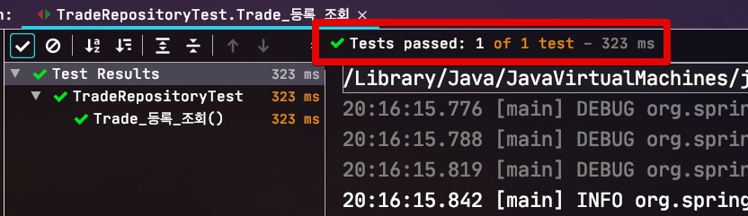
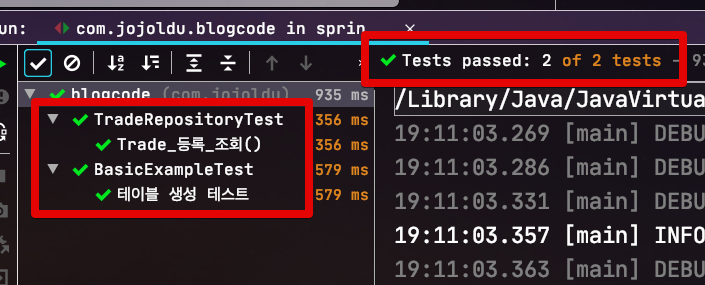
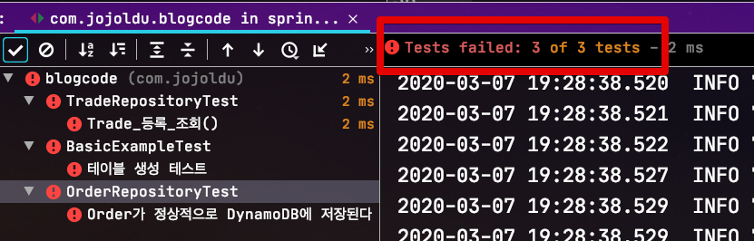
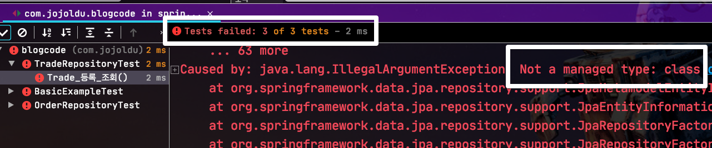
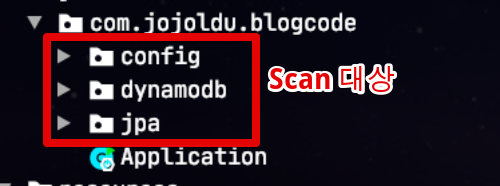
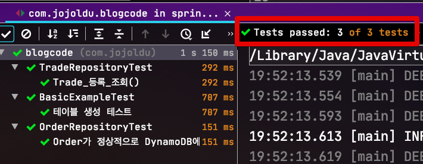

# Spring Data DynamoDB와 JPA 함께 적용후 문제 발생시 해결방법

> 모든 코드는 [Github](https://github.com/jojoldu/blog-code/tree/master/spring-boot-dynamodb)에 있습니다.

Spring Data JPA를 사용중인 기존 프로젝트에 Spring Data DynamoDB 를 바로 적용하면 아래와 같은 문제들이 발생할때가 있습니다.

```java
Caused by: java.lang.IllegalArgumentException: Not a managed type: class XXX
```

혹은

```java
BeanDefinitionOverrideException: Invalid bean definition with name 'XXXRepository' defined in null: Cannot register bean definition
```

어떨때 이런 문제가 발생하는지, 어떻게 해결하는지 빠르게 확인해보겠습니다.

## 1. 문제 상황

먼저 JPA만 프로젝트에 추가해서 테스트를 진행해보겠습니다.

```groovy
dependencies {
    implementation 'org.springframework.boot:spring-boot-starter-data-jpa'
    compile 'com.h2database:h2'
    ...
}
```

다음과 같이 JPA 엔티티도 추가합니다.

```java
@Getter
@NoArgsConstructor
@Entity
public class Trade {

    @Id
    @GeneratedValue(strategy = GenerationType.IDENTITY)
    private Long id;

    private long amount;
    private String tradeName;

    @Builder
    public Trade(long amount, String tradeName) {
        this.amount = amount;
        this.tradeName = tradeName;
    }
}
```

```java
public interface TradeRepository extends JpaRepository<Trade, Long> {
}
```

자 마지막으로 정상적으로 기능이 작동하는지 확인하기 위한 테스트 코드를 추가하고 실행해보겠습니다.

```java
@ExtendWith(SpringExtension.class)
@SpringBootTest
public class TradeRepositoryTest {

    @Autowired
    private TradeRepository tradeRepository;

    @Test
    void Trade_등록_조회() throws Exception {
        //given
        long amount = 1000L;
        String tradeName = "tradeName";

        //when
        tradeRepository.save(new Trade(amount, tradeName));
        Trade trade = tradeRepository.findAll().get(0);

        //then
        assertThat(trade.getAmount()).isEqualTo(amount);
        assertThat(trade.getTradeName()).isEqualTo(tradeName);
    }
}
```

테스트를 실행해보면 정상적으로 기능이 작동되는 것을 확인할 수 있습니다.



### 1-1. DynamoDB 적용

JPA만 있는 상태에서 테스트가 잘 되는 것을 확인하였습니다.  
이번엔 **Spring Data DynamoDB 없이**, 순수 DynamoDB SDK만 적용해서 테스트 해보겠습니다.  
  
의존성은 아래의 것들이 추가 됩니다.

```groovy
dependencies {
    implementation 'org.springframework.cloud:spring-cloud-starter-aws'
    implementation 'com.amazonaws:aws-java-sdk-dynamodb:[1.11,2.0)' // aws-java-sdk-dynamodb:1.11.415 (spring-cloud-starter-aws 2.1.1 기준)
    implementation 'com.amazonaws:DynamoDBLocal:1.11.119' // aws-java-sdk-dynamodb:1.11.415 에 호환가능한 버전 (이 다음버전부터는 에러발생)
}
```

Dynamo 테이블은 아래와 같습니다.

```java
@Getter
@Setter
@NoArgsConstructor
@DynamoDBTable(tableName = DYNAMO_TABLE_NAME)
public class Order {
    public static final String DYNAMO_TABLE_NAME = "Order";

    @DynamoDBHashKey
    private String orderNo;

    @DynamoDBAttribute
    private Long orderAmount;

    @Builder
    public Order(String orderNo, Long orderAmount) {
        this.orderNo = orderNo;
        this.orderAmount = orderAmount;
    }

}
```

> DynamoDB 로컬 테스트 환경은 Embedded로 구축하였습니다.  
> 참고: [aws-dynamodb-java-example-local-testing](https://github.com/redskap/aws-dynamodb-java-example-local-testing)  
> 위 링크만으로 구축이 어려우신 분들을 위해 이후에 블로그에 Embedded 환경 구축 방법을 정리해놓겠습니다.

DynamoDB 적용이 잘 되었는지도 한번 테스트 코드로 확인해보겠습니다.

```java
@ExtendWith(SpringExtension.class)
@SpringBootTest
@TestPropertySource(properties = "embedded-dynamodb.use=true")
public class BasicExampleTest {

    @Autowired
    private AmazonDynamoDB dynamoDB;

    @Test
    @DisplayName("테이블 생성 테스트")
    void test_createTable() throws Exception {
        //given
        String tableName = "Movie";
        String hashKeyName = "film_id";

        //when
        CreateTableResult res = createTable(tableName, hashKeyName);

        //then
        TableDescription tableDesc = res.getTableDescription();
        assertThat(tableDesc.getTableName()).isEqualTo(tableName);
        assertThat(tableDesc.getKeySchema().toString()).isEqualTo("[{AttributeName: " + hashKeyName + ",KeyType: HASH}]");
        assertThat(tableDesc.getAttributeDefinitions().toString()).isEqualTo("[{AttributeName: " + hashKeyName + ",AttributeType: S}]");
        assertThat(tableDesc.getProvisionedThroughput().getReadCapacityUnits()).isEqualTo(1000L);
        assertThat(tableDesc.getProvisionedThroughput().getWriteCapacityUnits()).isEqualTo(1000L);
        assertThat(tableDesc.getTableStatus()).isEqualTo("ACTIVE");
        assertThat(tableDesc.getTableArn()).isEqualTo("arn:aws:dynamodb:ddblocal:000000000000:table/Movie");
        assertThat(dynamoDB.listTables().getTableNames()).hasSizeGreaterThanOrEqualTo(1);
    }

    private CreateTableResult createTable(String tableName, String hashKeyName) {
        List<AttributeDefinition> attributeDefinitions = new ArrayList<>();
        attributeDefinitions.add(new AttributeDefinition(hashKeyName, ScalarAttributeType.S));

        List<KeySchemaElement> ks = new ArrayList<>();
        ks.add(new KeySchemaElement(hashKeyName, KeyType.HASH));

        ProvisionedThroughput provisionedthroughput = new ProvisionedThroughput(1000L, 1000L);

        CreateTableRequest request = new CreateTableRequest()
                        .withTableName(tableName)
                        .withAttributeDefinitions(attributeDefinitions)
                        .withKeySchema(ks)
                        .withProvisionedThroughput(provisionedthroughput);

        return dynamoDB.createTable(request);
    }
}
```

기존의 JPA 테스트도 함께 실행해 2개 기능 모두 잘 되는지 확인합니다.



자 JPA 테스트와 DynamoDB 테스트도 모두다 성공하였습니다.

### 1-2. Spring Data DynamoDB 적용

마지막으로 Spring Data DynamoDB 를 적용해보겠습니다.  
먼저 Spring Data DynamoDB 의존성을 추가합니다.

```groovy
dependencies {
    implementation 'io.github.boostchicken:spring-data-dynamodb:5.2.3'
}
```

* Spring Boot 2.2.x 를 사용하기 위해서는 ```boostchicken/spring-data-dynamodb``` 를 사용해야 합니다.
  * 많이들 쓰시는 ```derjust/spring-data-dynamodb``` 는 Spring Boot **2.1.x까지만 지원**하고 있어 해당 프로젝트를 fork하여 2.2도 지원하게 된 프로젝트입니다.


> 이게 진짜 답답한 경우인데요.  
> spring-data-dynamodb 프로젝트는 아직 (2020.03.07) Spring Data의 정식 프로젝트가 아니다 보니 벌써 **3번째 프로젝트**입니다.  
> 즉, michaellavelle/spring-data-dynamodb -> derjust/spring-data-dynamodb -> boostchicken/spring-data-dynamodb 로 계속 fork 하며 이어진 것인데요.  
> 개인이 진행하는 프로젝트들이다보니 언제 Spring Boot 버전 지원을 못따라갈지 알수 없는 상태입니다.  
> 그래서 Spring Data DynamoDB 를 쓰실때는 현재 사용하는 Spring Boot 버전과 호환이 되는지 꼭 확인해보셔야 합니다.

그리고 DynamoDB 테이블이였던 Order에 ```@Id```를 추가합니다.

```java
@Id
@DynamoDBHashKey
private String orderNo;
```

해당 Order의 Repository도 추가합니다.

```java
@EnableScan
public interface OrderRepository extends CrudRepository<Order, String> {
}
```

* JPA 를 쓰는게 아니기 때문에 CrudRepository를 상속 받으셔야 합니다.

생성된 ```OrderRepository```를 Spring Data DynamoDB에서 관리될 수 있도록 패키지 위치를 등록 합니다.

```java
@Slf4j
@Configuration
@EnableDynamoDBRepositories(basePackages = {"com.jojoldu.blogcode.dynamodb"}) // DynamoDB Repository 패키지 위치 등록
public class AwsDynamoDbConfig {
```

> 전체 설정은 [Github](https://github.com/jojoldu/blog-code/tree/master/spring-boot-dynamodb/src/main/java/com/jojoldu/blogcode/config) 코드를 참고해주세요.

자 이제 그럼 마지막으로 Spring Data DynamoDB 기능을 테스트 해보겠습니다.

```java
@Slf4j
@ExtendWith(SpringExtension.class)
@SpringBootTest
@TestPropertySource(properties = "embedded-dynamodb.use=true")
public class OrderRepositoryTest {

    @Autowired
    private AmazonDynamoDB dynamoDB;

    @Autowired
    private DynamoDBMapper dynamoDbMapper;

    @Autowired
    private OrderRepository orderRepository;

    @BeforeEach
    void setup() {
        CreateTableRequest createTableRequest = dynamoDbMapper.generateCreateTableRequest(Order.class)
                .withProvisionedThroughput(new ProvisionedThroughput(1L, 1L));

        TableUtils.createTableIfNotExists(dynamoDB, createTableRequest);
    }

    /**
     * DynamoDB에선 테이블 row를 날리는게 더 비용이 커서 테이블을 그냥 다시 만든다
     */
    @AfterEach
    void after() {
        TableUtils.deleteTableIfExists(dynamoDB, dynamoDbMapper.generateDeleteTableRequest(Order.class));
    }

    @Test
    @DisplayName("Order가 정상적으로 DynamoDB에 저장된다")
    void test_save() {
        //given
        String orderNo = "orderNo";
        long orderAmount = 1000L;

        //when
        orderRepository.save(Order.builder()
                .orderNo(orderNo)
                .orderAmount(orderAmount)
                .build());

        //then
        Order savedOrder = orderRepository.findAll().iterator().next();
        assertThat(savedOrder.getOrderNo()).isEqualTo(orderNo);
        assertThat(savedOrder.getOrderAmount()).isEqualTo(orderAmount);
    }
}
```

해당 테스트를 포함해 전체 테스트를 실행해보면!?



신규로 등록된 테스트를 비롯해 **모든 테스트가 실패**하였습니다.  
  
## 2. 해결

자 그럼 왜 실패했는지 차근히 쫓아보겠습니다.
  
실패 로그를 확인해보면 다음과 같은 메세지를 만납니다.

```bash
Description:

The bean 'orderRepository' could not be registered. A bean with that name has already been defined and overriding is disabled.

Action:

Consider renaming one of the beans or enabling overriding by setting spring.main.allow-bean-definition-overriding=true
```

여기서 로그에 나와있는 내용만 보시고 바로 ```spring.main.allow-bean-definition-overriding=true``` 이 옵션을 추가하시는 분들이 계시는데요.  
  
해당 옵션은 중복된 Bean이 있을 경우 덮어쓰기를 허용한다는 것을 의미합니다.  
(기본은 false 입니다. 덮어쓰기가 안됩니다.)  
  
해당 옵션을 넣어서 실행해보시면 이번엔 **다른 이유로 실패합니다**



즉, 저 옵션이 해결책이 아닌것을 의미하겠죠?  

> 실제로 저 옵션을 넣는것 자체가 문제가 있습니다.  
> 애초에 현재 프로젝트는 **중복된 Bean 이 나오면 안되기 때문**이죠.  
> 무턱대고 Bean을 덮어써버리면 의도치 않게 프로젝트가 작동될 수 있어서 저같은 경우 거의 사용 하지 않습니다.

### 2-1. 해결 방법

위 문제의 원인은 바로 JPA Repository Scan 범위로 인해 **DynamoDB Repository도 JpaRepository로 등록하려고 시도**해서 발생한 것입니다.  
  
Spring Data JPA 사용시 별다른 설정을 하지 않으시는 경우엔 ```@SpringBootApplication``` 이 선언된 위치에서부터 전체 scan을 하게 됩니다.



그러다보니 DynamoDB와 JPA **양쪽에서 OrderRepository를 Repository Bean으로 등록하려다보니** 발생하게 된 것이죠.  

> 즉, Spring Data DynamoDB에서 Repository Bean을 등록하니 굳이 ```@Repository```를 **선언 안하셔도 됩니다**.   
  
원인을 알게되었으니, 해결책은 간단합니다.  
**JpaRepository 스캔 범위를 직접 지정**하는 것입니다.  
아래와 같이 ```@EnableJpaRepositories```로 JpaRepository 패키지 위치를 지정해주시면 됩니다.

```java
@RequiredArgsConstructor
@Configuration
@EnableJpaRepositories(basePackages = {RDS_DOMAIN_PACKAGE}) // JpaRepository 패키지 위치 등록
@EnableConfigurationProperties({JpaProperties.class, HibernateProperties.class})
public class RdsDataConfig {

    static final String RDS_DOMAIN_PACKAGE = "com.jojoldu.blogcode.jpa";
}
```

위 설정을 추가하신뒤 다시 한번 전체 테스트를 수행해보면?



모든 테스트가 성공하는 것을 확인할 수 있습니다.