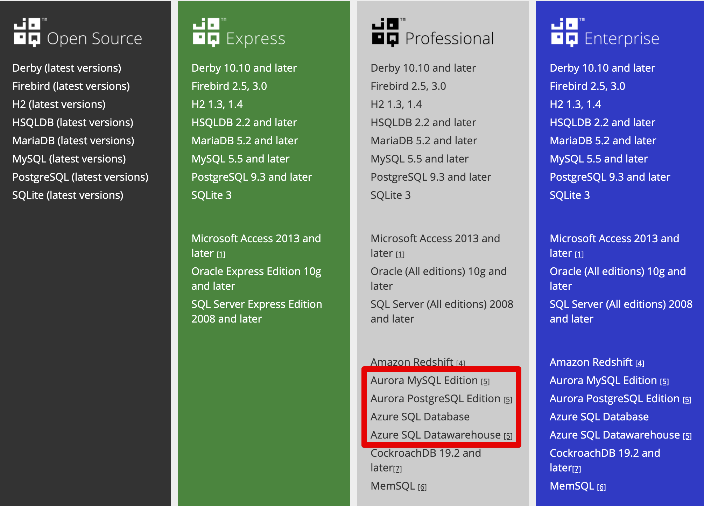
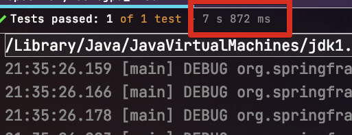
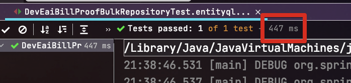

# (MySQL) Auto Increment에서 TypeSafe Bulk Insert 진행하기 (feat.EntityQL, JPA)

여러 글에서 언급하고 있지만, JPA환경에서 키 생성 전략을 Auto Increment로 할 경우 BulkInsert가 지원되지 않습니다.

* [Spring Batch Item Writer 성능 비교](https://jojoldu.tistory.com/507)
* [MySQL 환경의 스프링부트에 하이버네이트 배치 설정 해보기](https://woowabros.github.io/experience/2020/09/23/hibernate-batch.html)

그래서 수십만 ~ 수백만건의 Entity 를 insert 할 때는, 항상 `JdbcTemplate`를 이용하여 Insert합치기 구문을 이용한 BulkInsert 처리를 하는데요.  
  
이 방식은 기존 JPA와 Querydsl 을 이용한 Typesafe 방식을 전혀 활용하지 못해서 단점이 많아 항상 많은 고민을 하게 됩니다.  
  
그래서 이번 시간에서는 어떻게 하면 **Auto Increment에서 TypeSafe Bulk Insert**을 할 수 있는지 그 방안을 한번 이야기해볼까 합니다.

> 모든 내용은 **MySQL** 기반 하에 이야기 합니다.  
> 즉, 이외 DBMS 에서는 다를 수 있습니다.

## 1. (MySQL) JPA Bulk Insert 의 문제

먼저 JPA Bulk Insert의 문제에 대해서 처음 들어보신 분들을 위해 정리하자면 다음과 같습니다.

* BulkInsert란 Insert 쿼리를 한번에 처리하는 것을 의미합니다.
    * MySQL에서는 아래와 같이 Insert 합치기 옵션을 통하면 비약적인 성능 향상을 가집니다.

```sql
INSERT INTO person (name) VALUES
('name1'),
('name2'),
('name3');
```

* Insert 합치기를 하려면 JdbcUrl 옵션에 `rewriteBatchedStatements=true`이 필수로 설정되어 있으면 바로 적용이 가능합니다.
* 단, **Id 채번(생성) 전략이 auto_increment**일 경우 JPA를 통한 save는 **Insert 합치기가 적용되지 않습니다**.
    * `Table Sequence` 로 채번 전략을 선택할 경우 JPA로도 Insert 합치기가 가능합니다.
    * 하지만 운영 환경에서는 `Table Sequence` 사용이 쉽지 않습니다. 
        * 이미 auto_increment 로 수억~수십억건 쌓여있는 테이블에서 채번 전략을 변경/마이그레이션 하는 것은 굉장히 부담스러운 작업이며
        * 데드락 이슈 케이스들 ([HikariCP Dead lock에서 벗어나기](https://woowabros.github.io/experience/2020/02/06/hikaricp-avoid-dead-lock-2.html))
        * 동일하게 Bulk Insert가 지원되는 환경에서는 Auto Increment가 더 성능이 뛰어나기 때문입니다.

결론은 Auto_increment이면 JPA가 아닌 `JdbcTemplate`과 같은 네이티브 쿼리를 작성하는 경우에만 insert합치기를 통한 bulk insert가 지원됩니다.  
  
다만, `JdbcTemplate`와 같이 문자열 기반의 네이티브 쿼리 방식으로만 Bulk Insert 구현을 하기에는 부담스러운 점들은 다음과 같습니다.

* JdbcTemplate (+ MyBatis)와 같이 문자열 기반의 SQL 프레임워크는 IDE 자동 지원이 제한적.
* Entity (Table) 컬럼 추가/수정이 있을때마다 연관된 쿼리 문자열을 모두 찾아서 반영 필요. 
    * 컬럼이 수십개인 테이블 다수를 동시에 고쳐야할 경우를 생각해보면 끔찍합니다.
    * 잠재적 장애 발생 요인이며, 생산성 저하에 가장 큰 요인.

[JOOQ](https://www.jooq.org/)나 [Querydsl-SQL](https://github.com/querydsl/querydsl/tree/master/querydsl-sql) 같은 **네이티비 쿼리 기반의 Typesafe 도구**를 선택해야만 컴파일체크/타입지원/IDE 자동완성 등의 TypeSafe한 Bulk Insert가 가능하다는 결론이 나옵니다.

여기서 JOOQ의 경우 **오픈소스 라이센스로는 클라우드 DB를 지원하지 않습니다**.  



사실상 **DB에 관계없이 사용하려면 Querydsl-SQL**을 사용해야만 합니다.  

라이센스 문제나 그동안의 사용성 (JPA에서는 Querydsl-JPA를 대부분 사용하고 있으니) 으로 인해 Querydsl-SQL을 이용하고 싶지만, 실제 운영 레벨에서 사용하기에 단점이 꽤 많습니다.

* QClass 생성 과정이 복잡하고 과합니다.
    * JPA 기반이 아니라서 **어노테이션 기반이 아닌 실제 테이블을 Scan**해야만 합니다.
      * 애플리케이션이 실행되면 JPA 어노테이션 기반으로 자동으로 QClass가 생성되는 Querydsl-JPA 와 달리 SQL의 경우 
    * 즉, 로컬 혹은 베타 DB를 **미리** 실행하고, Gradle 설정에는 **해당 DB의 접속 정보를 등록**해서 Querydsl-SQL이 테이블들을 scan 할 수 있도록 설정 되어야만 Gradle Task를 수행해서 QClass를 생성할 수 있습니다.
      * 이건 JOOQ도 동일합니다.
* 이렇게 Gradle을 통해 DB를 접근하는 방식이 힘들어 한번 만들어진 QClass를 버전관리 하여 재생성을 최소화 하려고 하는데 이러면 완전 안티패턴입니다.
    * 제너레이트 클래스를 버저닝하게 되면 불필요한 변경사항을 계속 커밋 로그로 관리하게 됩니다.
    * 특히나 같은 Entity 클래스의 변경이 있다면 Conflict 코드를 수동으로 해소하기가 어렵습니다.
* 부가 설정이 너무 많이 필요합니다.
    * Querydsl의 버전 업데이트가 최근에는 자주 되지 못하는 것은 큰 단점중 하나입니다.

결과적으로 MySQL Auto Increment 환경에서 대용량 Insert 처리를 안적적으로 사용하기 위해서는 다음의 2가지가 필요하다는 것을 알 수 있습니다.

* Native SQL 문법 지원을 지원하는 Typesafe 개발
* 테이블 Scan이 아닌 JPA와 같은 **애플리케이션 코드 기반** 코드 Generate

자 그럼 이 문제를 어떻게 해결할 것인지 알아보겠습니다.

### 1-1. QueryDSL-EntityQL

위 문제는 JPA & MySQL를 사용하는 사람들이라면 모두다 경험하다보니 많은 분들이 이를 해결하기 위해 오픈소스를 만들었는데요.  
  
그 중에서 [QueryDSL-EntityQL](https://github.com/eXsio/querydsl-entityql) 가 있습니다.  
  
EntityQL은 **JPA의 어노테이션을 기반으로 Querydsl-SQL QClass를 생성**하는 역할을 합니다.
즉, 네이티브 쿼리를 사용할 수 있는 Querydsl-SQL을 쓰려면 SQL용 QClass가 필요한데, 이 SQL QClass 생성을 테이블 스캔 방식이 아닌 JPA 어노테이션 기반으로 할 수 있도록 중간 컨버터 역할을 하는 오픈소스입니다.


아직까지 대중화된 프로젝트는 아니지만, [Querydsl Github Issue](https://github.com/querydsl/querydsl/issues/2459#issuecomment-567652568)에서 어느정도의 호응이 있음을 볼 수 있습니다.  


## 2. 설치

일단 설치하기에 앞서 Gradle 환경에서 사용하기 위한 몇 가지 제약조건을 먼저 소개 드리겠습니다.

### 2-1. Gradle 로 사용시 제약조건

Gradle 기반 환경에서 EntityQL을 통해 Querydsl-SQL용 QClass를 생성한다면 크게 2가지 방법을 지원합니다.

1) 특정 패키지를 지정해서 해당 패키지 하위의 모든 Entity들을 자동으로 Generate
2) 개별 클래스 하나하나의 위치를 등록해서 수동으로 Generate

여기서 누가봐도 1번을 쓸 것 같지만, 저는 2번을 선택했는데요.  

* 특정 패키지를 지정해서 해당 패키지에 속해 있는 전체 클래스들을 대상으로 할 수는 있습니다.
* 다만, 이렇게 하려면 **해당 패키지에는 Entity 클래스들만 존재해야만 합니다**. (하위 패키지 포함)
* 지정된 패키지에 다른 클래스가 있으면 패키지 스캔이 실패합니다.
  * 즉, Entity와 함께 쌍으로 묶이는 기본(확장하지 않은) JpaRepository , Enum 등을 모두 최상위 패키지부터 다르게 두어야만 합니다.
* 이건 EntityQL 하나를 위해 시스템의 근간이 되는 도메인 Layer 분리를 해야되는 상황이라 저는 원하지 않는 방법입니다.
  * 그래서 Querydsl-SQL이 필요한 특정 Entity 클래스들만 지정해서 개별 지정해서 사용하는 방식을 선택했습니다.

또 다른 문제로 **멀티모듈에서만 사용이 가능**합니다.  
Gradle 플러그인을 통하지 않았기 때문인지, 직접 클래스 위치를 등록해서 사용하는 방식은 단일 모듈에서 사용할 수가 없습니다.  
  
다음과 같은 문제가 발생하기 때문인데요.  
EntityQL을 통해 생성된 (Querydsl-SQL) QClass를 사용하는 코드가 있으면 해당 QClass 삭제후 재생성을 진행할때 **컴파일 에러**가 발생합니다.  
왜냐하면 

### 2-2. Gradle 설정

```groovy
plugins {
    id 'pl.exsio.querydsl.entityql' version "0.0.12"
    id 'idea'
}

bootJar { enabled = false }
jar { enabled = true }

apply plugin: "io.spring.dependency-management"

dependencies {

    api("org.springframework.boot:spring-boot-starter-data-jpa")
    api("com.querydsl:querydsl-jpa")
    api("com.querydsl:querydsl-core")
    annotationProcessor "com.querydsl:querydsl-apt:${dependencyManagement.importedProperties['querydsl.version']}:jpa" // querydsl JPAAnnotationProcessor 사용 지정
    annotationProcessor "jakarta.persistence:jakarta.persistence-api:2.2.3"
    annotationProcessor "jakarta.annotation:jakarta.annotation-api:1.3.5"

    //DB
    implementation('com.h2database:h2')

    implementation("org.reflections:reflections:0.9.11") // entityql
    api("com.github.eXsio:querydsl-entityql:3.1.0") // entityql

    implementation("joda-time:joda-time:2.9.4") // querydsl-sql
    api("com.querydsl:querydsl-sql-spring:${dependencyManagement.importedProperties['querydsl.version']}") // querydsl-sql (Querydsl-JPA 버전과 통일)

}

// entityql start
def generatedSql='src/main/generated_sql'
def defaultPackage = 'com.jojoldu.blogcode.entityql.entity.domain.'
entityql {
    generators = [
            generator = {
                type = 'JPA'
                sourceClasses = [
                        defaultPackage+'academy.Academy',
                        defaultPackage+'student.Student',
                ]
                destinationPackage = defaultPackage+'sql'
                destinationPath = file(generatedSql).absolutePath
                filenamePattern = 'E%s.java'
            }
    ]
    sourceSets.main.java.srcDirs += [generatedSql]
    idea.module.generatedSourceDirs += file(generatedSql)
}

clean.doLast {
    file(generatedSql).deleteDir()
}

// entityql end

// querydsl 적용
def generated='src/main/generated'
sourceSets.main.java.srcDirs += [generated]

tasks.withType(JavaCompile) {
    options.annotationProcessorGeneratedSourcesDirectory = file(generated)
}

clean.doLast {
    file(generated).deleteDir()
}
```


```java
import com.querydsl.sql.H2Templates;
import com.querydsl.sql.MySQLTemplates;
import com.querydsl.sql.SQLQueryFactory;
import com.querydsl.sql.SQLTemplates;
import com.querydsl.sql.spring.SpringExceptionTranslator;
import com.querydsl.sql.types.DateTimeType;
import com.querydsl.sql.types.LocalDateType;
import lombok.RequiredArgsConstructor;
import lombok.extern.slf4j.Slf4j;
import org.springframework.context.annotation.Bean;
import org.springframework.context.annotation.Configuration;
import org.springframework.context.annotation.Profile;
import pl.exsio.querydsl.entityql.config.EntityQlQueryFactory;

import javax.sql.DataSource;

@Slf4j
@RequiredArgsConstructor
@Configuration
public class EntityQlConfiguration {

    @Bean
    @Profile("local")
    public SQLTemplates h2SqlTemplates() {
        return new H2Templates();
    }

    @Bean
    @Profile("!local")
    public SQLTemplates mySqlTemplates() {
        return new MySQLTemplates();
    }

    @Bean
    public SQLQueryFactory sqlQueryFactory(DataSource dataSource, SQLTemplates sqlTemplates) {
        com.querydsl.sql.Configuration configuration = new com.querydsl.sql.Configuration(sqlTemplates);
        configuration.setExceptionTranslator(new SpringExceptionTranslator());
        configuration.register(new DateTimeType());
        configuration.register(new LocalDateType());

        return new EntityQlQueryFactory(configuration, dataSource)
                .registerEnumsByName("com.jojoldu.blogcode.entityql.entity.domain.academy");
    }
}
```

```java
import com.querydsl.core.QueryException;
import com.querydsl.core.types.Path;
import com.querydsl.core.util.ReflectionUtils;
import com.querydsl.sql.ColumnMetadata;
import com.querydsl.sql.RelationalPath;
import com.querydsl.sql.dml.Mapper;
import com.querydsl.sql.types.Null;

import javax.persistence.Column;
import javax.persistence.Embedded;
import javax.persistence.JoinColumn;
import java.lang.reflect.Field;
import java.util.HashMap;
import java.util.Map;

/**
 * Created by jojoldu@gmail.com on 19/07/2020
 * Blog : http://jojoldu.tistory.com
 * Github : http://github.com/jojoldu
 */
public class EntityMapper implements Mapper<Object> {
    public static final EntityMapper DEFAULT = new EntityMapper(false);

    public static final EntityMapper WITH_NULL_BINDINGS = new EntityMapper(true);

    private final boolean withNullBindings;

    public EntityMapper(boolean withNullBindings) {
        this.withNullBindings = withNullBindings;
    }

    @SuppressWarnings({ "rawtypes", "unchecked" })
    @Override
    public Map<Path<?>, Object> createMap(RelationalPath<?> path, Object object) {
        try {
            Map<String, Path<?>> columnToPath = new HashMap<>();
            for (Path<?> column : path.getColumns()) {
                columnToPath.put(ColumnMetadata.getName(column), column);
            }
            Map<Path<?>, Object> values = new HashMap<>();
            for (Field field : ReflectionUtils.getFields(object.getClass())) {
                putByEmbedded(object, columnToPath, values, field);
                putByColumn(object, columnToPath, values, field);
                putByJoinColumn(object, columnToPath, values, field);
            }
            return values;
        } catch (IllegalAccessException e) {
            throw new QueryException(e);
        }
    }

    void putByEmbedded(Object object, Map<String, Path<?>> columnToPath, Map<Path<?>, Object> values, Field field) throws IllegalAccessException {
        Embedded ann = field.getAnnotation(Embedded.class);
        if (ann != null) {
            field.setAccessible(true);
            Object embeddedObject = field.get(object);
            if (embeddedObject != null) {
                for (Field embeddedField : ReflectionUtils.getFields(embeddedObject.getClass())) {
                    putByColumn(embeddedObject, columnToPath, values, embeddedField);
                }
            }
        }
    }

    void putByColumn(Object object, Map<String, Path<?>> columnToPath, Map<Path<?>, Object> values, Field field) throws IllegalAccessException {
        Column ann = field.getAnnotation(Column.class);
        if (ann != null) {
            field.setAccessible(true);
            Object propertyValue = field.get(object);
            String columnName = ann.name();
            if (propertyValue != null) {
                if (columnToPath.containsKey(columnName)) {
                    values.put(columnToPath.get(columnName), propertyValue);
                }
            } else if (withNullBindings) {
                values.put(columnToPath.get(columnName), Null.DEFAULT);
            }
        }
    }

    void putByJoinColumn(Object object, Map<String, Path<?>> columnToPath, Map<Path<?>, Object> values, Field field) throws IllegalAccessException {
        JoinColumn ann = field.getAnnotation(JoinColumn.class);
        if (ann != null) {
            field.setAccessible(true);
            Object joinObject = field.get(object);
            String columnName = ann.name();
            String joinColumnName = ann.referencedColumnName();
            if (joinObject != null) {
                if (columnToPath.containsKey(columnName)) {
                    Object joinColumnValue = getJoinColumnValue(joinObject, joinColumnName);
                    if(joinColumnValue != null) {
                        values.put(columnToPath.get(columnName), joinColumnValue);
                    }
                }
            } else if (withNullBindings) {
                values.put(columnToPath.get(columnName), Null.DEFAULT);
            }
        }
    }

    private Object getJoinColumnValue(Object joinObject, String joinColumnName) throws IllegalAccessException {
        for (Field field : ReflectionUtils.getFields(joinObject.getClass())){
            Column ann = field.getAnnotation(Column.class);
            if(ann != null && ann.name().equals(joinColumnName)) {
                field.setAccessible(true);
                return field.get(joinObject);
            }
        }
        return null;
    }
}
```

## 예제 코드


### 성능 테스트


**7.8초**



**0.44초**

## 제한 사항

아래는 공식적으로 EntityQL에서 지원하지 않는 기능입니다.

* 엔티티 @Table에는 테이블 이름과 (선택적으로) 스키마 이름이 포함 된 유효한 주석 이 있어야합니다.

* 만 포함하는 필드 @Column, @JoinColumn또는 @JoinColumns주석 DB 메타 데이터 소스로 EntityQL에 볼 수 있습니다

* JPA 관계를 처리 할 때 역 조인 열이 생성됩니다. 양방향 및 단방향 @OneToOne이며 @OneToMany 단순 및 복합 키 모두에 대해 완벽하게 지원됩니다.

* 쿼리에서 자바 열거 형을 사용하려면, 열거 클래스는 QueryDSL의가에 등록해야 Configuration::register 사용 EnumType. 또는 제공된 EntityQlQueryFactory. 원하는 패키지의 모든 열거 형을 등록합니다.

* UUID를 사용하려면 UtilUUIDTypeQueryDSL 에 등록해야합니다.Configuration::register

* 부울을 사용하려면 BooleanTypeQueryDSL 에 등록해야합니다.Configuration::register

* 복합 기본 키는로 Serializable @Entity주석이 추가 된 여러 필드 가있는 형태로만 지원됩니다 @Id. 포함 된 클래스 및 ID는 지원되지 않습니다.

* 복합 외래 키는 @JoinColumns주석을 통해 지원됩니다 .

* 유일하게 지원되지 않는 JPA 관계이다 @ManyToMany와 함께 @JoinTable. 그 이유는 자동 생성 된 조인 테이블에는 물리적 Entity 클래스가없고 내가 피하고 싶은 많은 마법 없이는 모델을 생성 할 가능성이 없기 때문입니다. @ManyToMany매핑 과 함께 EntityQL을 사용하려는 경우 @Immutable @Entity에서 구성된 테이블과 일치 하는를 만들 수 있습니다. @JoinTable예를 들면 다음과 같습니다.

## 이슈 케이스


```java
Caused by: java.lang.NoSuchMethodError: com.google.common.collect.Sets$SetView.iterator()Lcom/google/common/collect/UnmodifiableIterator;
```

이럴 경우 `reflections:0.9.11` 에서 필요한 Guava의 버전이 `20.0` 인데, 현재 프로젝트의 다른 의존성 때문에 Guava가 다른 버전으로 의존하고 있을 경우에 발생한다. 
이럴 경우 아래와 같이 강제로 Guava 버전을 고정한다.

```groovy
configurations {
    all {
        resolutionStrategy {

            // 특정 모듈의 버전을 강제 지정(최상위건 이행적 의존성이건 무관함)
            force  'com.google.guava:guava:20.0'
        }
    }
}
```
