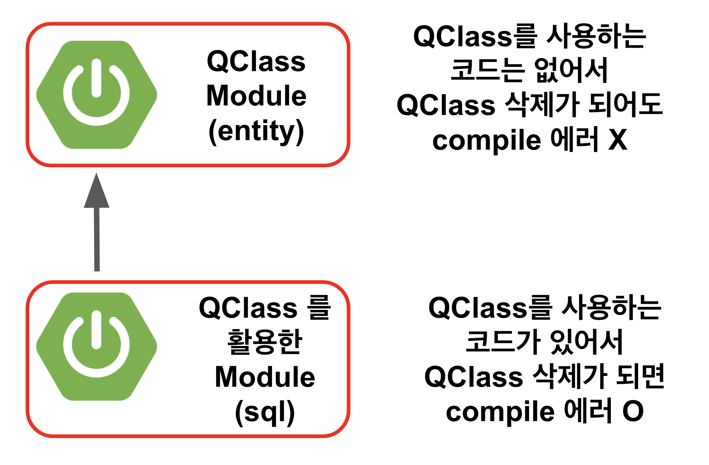
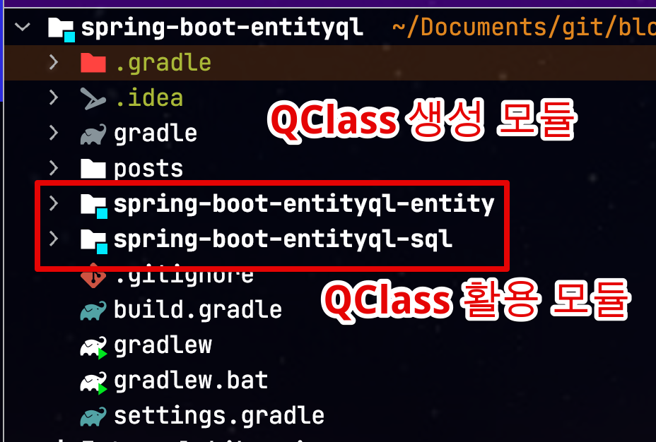
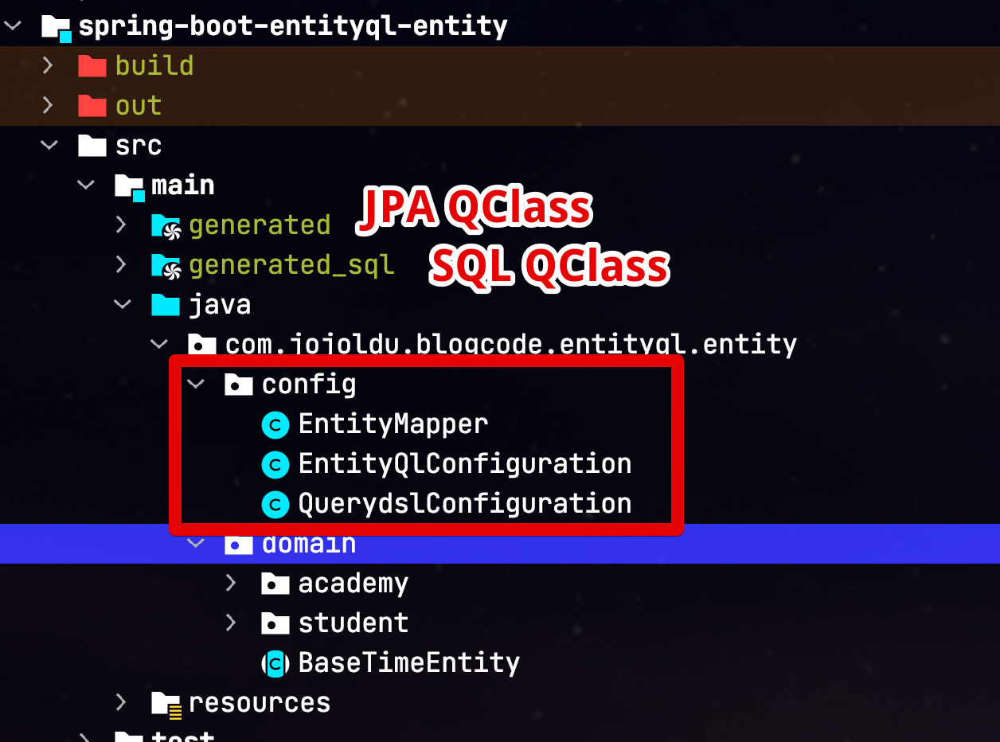
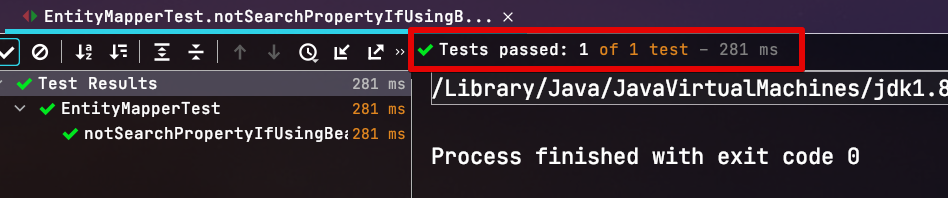
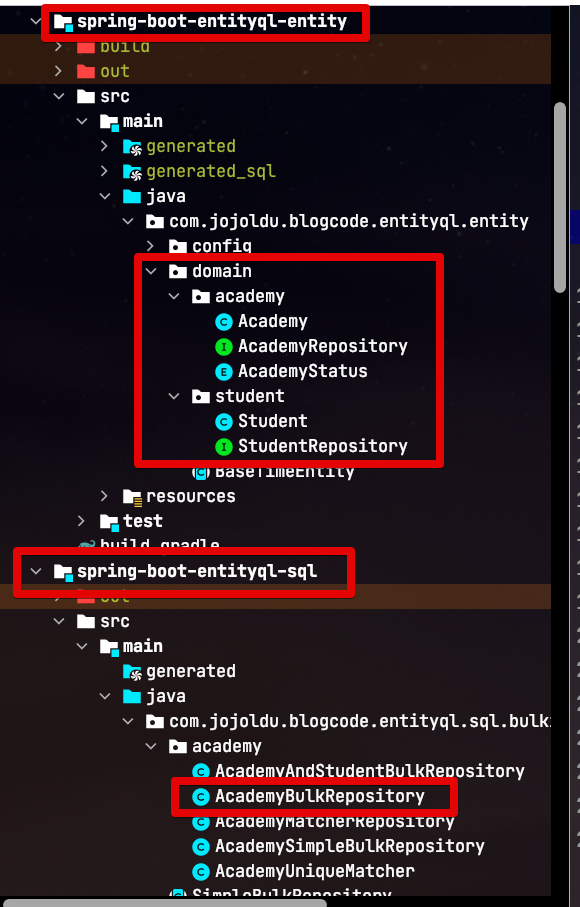

# (MySQL) Auto Increment에서 TypeSafe Bulk Insert 진행하기 (feat.EntityQL, JPA)

여러 글에서 언급하고 있지만, JPA환경에서 키 생성 전략을 Auto Increment로 할 경우 BulkInsert가 지원되지 않습니다.

* [Spring Batch Item Writer 성능 비교](https://jojoldu.tistory.com/507)
* [MySQL 환경의 스프링부트에 하이버네이트 배치 설정 해보기](https://woowabros.github.io/experience/2020/09/23/hibernate-batch.html)

그래서 수십만 ~ 수백만건의 Entity 를 insert 할 때는, 항상 `JdbcTemplate`를 이용하여 Insert합치기 구문을 이용한 BulkInsert 처리를 하는데요.  
  
이 방식은 기존 JPA와 Querydsl 을 이용한 Typesafe 방식을 전혀 활용하지 못해서 단점이 많아 항상 많은 고민을 하게 됩니다.  
  
그래서 이번 시간에서는 어떻게 하면 **Auto Increment에서 TypeSafe Bulk Insert**을 할 수 있는지 그 방안을 한번 이야기해볼까 합니다.

> 모든 내용은 **MySQL** 기반 하에 이야기 합니다.  
> 즉, 이외 DBMS 에서는 다를 수 있습니다.

## 1. (MySQL) JPA Bulk Insert 의 문제

먼저 JPA Bulk Insert의 문제에 대해서 처음 들어보신 분들을 위해 정리하자면 다음과 같습니다.

* BulkInsert란 Insert 쿼리를 한번에 처리하는 것을 의미합니다.
    * MySQL에서는 아래와 같이 Insert 합치기 옵션을 통하면 비약적인 성능 향상을 가집니다.

```sql
INSERT INTO person (name) VALUES
('name1'),
('name2'),
('name3');
```

* Insert 합치기를 하려면 JdbcUrl 옵션에 `rewriteBatchedStatements=true`이 필수로 설정되어 있으면 바로 적용이 가능합니다.
* 단, **Id 채번(생성) 전략이 auto_increment**일 경우 JPA를 통한 save는 **Insert 합치기가 적용되지 않습니다**.
    * `Table Sequence` 로 채번 전략을 선택할 경우 JPA로도 Insert 합치기가 가능합니다.
    * 하지만 운영 환경에서는 `Table Sequence` 사용이 쉽지 않습니다. 
        * 이미 auto_increment 로 수억~수십억건 쌓여있는 테이블에서 채번 전략을 변경/마이그레이션 하는 것은 굉장히 부담스러운 작업이며
        * 데드락 이슈 케이스들 ([HikariCP Dead lock에서 벗어나기](https://woowabros.github.io/experience/2020/02/06/hikaricp-avoid-dead-lock-2.html))
        * 동일하게 Bulk Insert가 지원되는 환경에서는 Auto Increment가 더 성능이 뛰어나기 때문입니다.

결론은 Auto_increment이면 JPA가 아닌 `JdbcTemplate`과 같은 네이티브 쿼리를 작성하는 경우에만 insert합치기를 통한 bulk insert가 지원됩니다.  
  
다만, `JdbcTemplate`와 같이 문자열 기반의 네이티브 쿼리 방식으로만 Bulk Insert 구현을 하기에는 부담스러운 점들은 다음과 같습니다.

* JdbcTemplate (+ MyBatis)와 같이 문자열 기반의 SQL 프레임워크는 IDE 자동 지원이 제한적.
* Entity (Table) 컬럼 추가/수정이 있을때마다 연관된 쿼리 문자열을 모두 찾아서 반영 필요. 
    * 컬럼이 수십개인 테이블 다수를 동시에 고쳐야할 경우를 생각해보면 끔찍합니다.
    * 잠재적 장애 발생 요인이며, 생산성 저하에 가장 큰 요인.

[JOOQ](https://www.jooq.org/)나 [Querydsl-SQL](https://github.com/querydsl/querydsl/tree/master/querydsl-sql) 같은 **네이티비 쿼리 기반의 Typesafe 도구**를 선택해야만 컴파일체크/타입지원/IDE 자동완성 등의 TypeSafe한 Bulk Insert가 가능하다는 결론이 나옵니다.

여기서 JOOQ의 경우 **오픈소스 라이센스로는 클라우드 DB를 지원하지 않습니다**.  


사실상 **DB에 관계없이 사용하려면 Querydsl-SQL**을 사용해야만 합니다.  

라이센스 문제나 그동안의 사용성 (JPA에서는 Querydsl-JPA를 대부분 사용하고 있으니) 으로 인해 Querydsl-SQL을 이용하고 싶지만, 실제 운영 레벨에서 사용하기에 단점이 꽤 많습니다.

* QClass 생성 과정이 복잡하고 과합니다.
    * JPA 기반이 아니라서 **어노테이션 기반이 아닌 실제 테이블을 Scan**해야만 합니다.
      * 애플리케이션이 실행되면 JPA 어노테이션 기반으로 자동으로 QClass가 생성되는 Querydsl-JPA 와 달리 SQL의 경우 
    * 즉, 로컬 혹은 베타 DB를 **미리** 실행하고, Gradle 설정에는 **해당 DB의 접속 정보를 등록**해서 Querydsl-SQL이 테이블들을 scan 할 수 있도록 설정 되어야만 Gradle Task를 수행해서 QClass를 생성할 수 있습니다.
      * 이건 마찬가지로 테이블 Scan 방식을 사용하는 **JOOQ도 똑같은 단점**입니다.
* 이렇게 Gradle을 통해 DB를 접근하는 방식이 힘들어 한번 만들어진 QClass를 버전관리 하여 재생성을 최소화 하려고 하는데 이러면 완전 안티패턴입니다.
    * 제너레이트 클래스를 버저닝하게 되면 불필요한 변경사항을 계속 커밋 로그로 관리하게 됩니다.
    * 특히나 같은 Entity 클래스의 변경이 있다면 Conflict 코드를 수동으로 해소하기가 어렵습니다.
* 부가 설정이 너무 많이 필요합니다.
    * Querydsl의 버전 업데이트가 최근에는 자주 되지 못하는 것은 큰 단점중 하나입니다.

결과적으로 MySQL Auto Increment 환경에서 대용량 Insert 처리를 안적적으로 사용하기 위해서는 다음의 2가지가 필요하다는 것을 알 수 있습니다.

* Native SQL 문법 지원을 지원하는 Typesafe 개발
* 테이블 Scan이 아닌 JPA와 같은 **애플리케이션 코드 기반** 코드 Generate

자 그럼 이 문제를 어떻게 해결할 것인지 알아보겠습니다.

### 1-1. QueryDSL-EntityQL

위 문제는 JPA & MySQL를 사용하는 사람들이라면 모두다 경험하다보니 많은 분들이 이를 해결하기 위해 오픈소스를 만들었는데요.  
  
그 중에서 [QueryDSL-EntityQL](https://github.com/eXsio/querydsl-entityql) 가 있습니다.  
  
EntityQL은 **JPA의 어노테이션을 기반으로 Querydsl-SQL QClass를 생성**하는 역할을 합니다.
즉, 네이티브 쿼리를 사용할 수 있는 Querydsl-SQL을 쓰려면 SQL용 QClass가 필요한데, 이 SQL QClass 생성을 테이블 스캔 방식이 아닌 JPA 어노테이션 기반으로 할 수 있도록 중간 컨버터 역할을 하는 오픈소스입니다.


아직까지 대중화된 프로젝트는 아니지만, [Querydsl Github Issue](https://github.com/querydsl/querydsl/issues/2459#issuecomment-567652568)에서 어느정도의 호응이 있음을 볼 수 있습니다.  


## 2. 적용

일단 설치하기에 앞서 Gradle 환경에서 사용하기 위한 몇 가지 제약조건을 먼저 소개 드리겠습니다.

### 2-1. Gradle 로 사용시 제약조건

Gradle 기반 환경에서 EntityQL을 통해 Querydsl-SQL용 QClass를 생성한다면 크게 2가지 방법을 지원합니다.

#### 수동 Generate

1) 특정 패키지를 지정해서 해당 패키지 하위의 모든 Entity들을 자동으로 Generate
2) **개별 클래스 하나하나의 위치를 등록해서 수동**으로 Generate

여기서 누가봐도 1번을 쓸 것 같지만, 저는 2번을 선택했는데요.  

* 특정 패키지를 지정해서 해당 패키지에 속해 있는 전체 클래스들을 대상으로 할 수는 있습니다.
* 다만, 이렇게 하려면 **해당 패키지에는 Entity 클래스들만 존재해야만 합니다**. (하위 패키지 포함)
* 지정된 패키지에 다른 클래스가 있으면 패키지 스캔이 실패합니다.
  * 즉, Entity와 함께 쌍으로 묶이는 기본(확장하지 않은) JpaRepository , Enum 등을 모두 최상위 패키지부터 다르게 두어야만 합니다.
* 이건 EntityQL 하나를 위해 시스템의 근간이 되는 도메인 Layer 분리를 해야되는 상황이라 저는 원하지 않는 방법입니다.
  * 그래서 Querydsl-SQL이 필요한 특정 Entity 클래스들만 지정해서 개별 지정해서 사용하는 방식을 선택했습니다.

#### 멀티모듈 강제화

위 1번 문제로 인해서 수동으로 생성이 필요할 경우 **멀티모듈에서만 사용이 가능**하고, 단일 모듈에서는 불가능 하다는 것입니다.  
이는 앞서 Gradle 플러그인을 통하지 않았기 때문인데, 직접 클래스 위치를 등록해서 사용하는 방식은 단일 모듈에서 사용할 수가 없습니다.  
  
이유는 다음과 같습니다.  
(EntityQL을 통해 생성된) Querydsl-SQL QClass를 사용하는 코드가 있으면 해당 QClass 삭제후 재생성을 진행할때 **컴파일 에러**가 발생합니다.  
당연하게도 프로젝트 내에 사용되던 클래스가 없어지니 이후 compile이 모두 다 실패할 수 밖에 없습니다.  
  
즉, QClass를 생성하는 `generateModel` Task는 `compileJava` Task를 우선 수행하는데, 이 `compileJava` Task가 실패하여 `generateModel` 가 수행되지 못하고, 결국엔 QClass 생성이 못하게 됩니다.  



그래서 멀티모듈로 구성하여, **실제 QClass 생성 모듈과 사용 모듈을 분리** 해서 QClass 생성 모듈을 통해 Generate 될때 컴파일 에러가 발생하지 않도록 해야 합니다.  
  
자 그럼 본격적으로 설정을 해보겠습니다.

### 2-2. Gradle 설정

먼저 프로젝트의 전체 구조를 보겠습니다.

> 전체 코드는 [Github](https://github.com/jojoldu/blog-code/tree/master/spring-boot-entityql)에 있으니 참고하시면 됩니다.  
> 모든 코드는 실제 현업에서 사용할 수 있도록 Querydsl-JPA 설정과 함께 진행됩니다.  
> Querydsl-JPA 설정을 해보신적 없다면 [이전 포스팅](https://jojoldu.tistory.com/372)을 참고합니다.



위 모듈들을 하나씩 설정해보겠습니다.

#### 2-2-1. entity 모듈

먼저 entity 모듈입니다.  
  
build.gradle의 설정 먼저 해보겠습니다.

> Gradle 6 기준입니다.

**entity 모듈 - build.gradle**

```groovy
plugins {
    ...
    id 'pl.exsio.querydsl.entityql' version "0.0.12"
}

...
apply plugin: "io.spring.dependency-management"

dependencies {
    ...
    implementation("org.reflections:reflections:0.9.11") // entityql
    api("com.github.eXsio:querydsl-entityql:3.1.0") // entityql

    implementation("joda-time:joda-time:2.9.4") // querydsl-sql 
    api("com.querydsl:querydsl-sql-spring:${dependencyManagement.importedProperties['querydsl.version']}") // querydsl-sql (Querydsl-JPA 버전과 통일)

}

// entityql start
def generatedSql='src/main/generated_sql' // (1)
def defaultPackage = 'com.jojoldu.blogcode.entityql.entity.domain.'
entityql {
    generators = [
            generator = {
                type = 'JPA'
                sourceClasses = [
                        defaultPackage+'academy.Academy', // (2)
                        defaultPackage+'student.Student',
                ]
                destinationPackage = defaultPackage+'sql' // (3)
                destinationPath = file(generatedSql).absolutePath
                filenamePattern = 'E%s.java' // (4)
            }
    ]
    sourceSets.main.java.srcDirs += [generatedSql] // (5)
    idea.module.generatedSourceDirs += file(generatedSql) // (6)
}

clean.doLast { // (7)
    file(generatedSql).deleteDir()
}
```

(1) `generatedSql`

* `'src/main/generated_sql'` 가 이후 설정들에서 모두 사용되기 때문에 변수로 만들어서 재사용합니다.
* Querydsl-JPA가 일반적으로 `'src/main/generated` 에서 생성되니 Querydsl-SQL은 다른 디렉토리로 지정합니다.

(2) `sourceClasses = [defaultPackage+'academy.Academy'..`

* 2-1 에서 이야기한것 처럼 직접 Scan 대상이 되는 클래스들의 위치를 지정합니다.
* Entity 클래스들이 모두 `defaultPackage` 하위에 있어 변수지정을 해서 재사용하도록 합니다.

(3) `destinationPackage`

* SQL QClass가 생성될 패키지명을 등록합니다.
* EntityQL의 수동 scan 방식으로는 **클래스별 개별 패키지 지정이 안됩니다**.
* 그래서 QClass 생성시 모두 같은 패키지에 위치하게 됩니다.

(4) `filenamePattern`

* Querydsl-JPA의 QClass 들을 보면 모두 앞에 `Q`가 붙어 있습니다. 
* 대상이 되는 Entity 클래스와 이름이 충돌나지 않도록 하기 위함인데요.
* 마찬가지로 SQL QClass 역시 맨 앞에 별도 문자를 붙일 수가 있습니다.
* 저 같은 경우 `E` 를 사용했는데 `S` 등으로 사용해도 됩니다.
* 대신 `Q` 를 붙일 경우 Querydsl-JPA로 생성된 QClass 이름과 충돌날 수 있으니 피하시는걸 추천드립니다.

(5) `sourceSets.main.java.srcDirs`

* 프로젝트에서 generate된 디렉토리를 소스 디렉토리로 인식할 수 있도록 지정합니다. 

(6) `idea.module.generatedSourceDirs`

* IntelliJ IDEA가 generate된 디렉토리를 소스 디렉토리로 인식할 수 있도록 지정합니다.
* 이 설정이 없을 경우 매번 해당 디렉토리를 IDEA가 인식할 수 있도록 수동 작업을 해야하는데, 이를 방지해줍니다.

(7) `clean.doLast`

* Gradle `clean` 수행시 SQL QClass 생성 디렉토리도 함께 삭제되도록 설정합니다.

이렇게 해서 전체 코드는 다음과 같습니다.

```groovy
plugins {
    id 'pl.exsio.querydsl.entityql' version "0.0.12"
    id 'idea'
}

bootJar { enabled = false }
jar { enabled = true }

apply plugin: "io.spring.dependency-management"

dependencies {

    api("org.springframework.boot:spring-boot-starter-data-jpa")
    api("com.querydsl:querydsl-jpa")
    api("com.querydsl:querydsl-core")
    annotationProcessor "com.querydsl:querydsl-apt:${dependencyManagement.importedProperties['querydsl.version']}:jpa" // querydsl JPAAnnotationProcessor 사용 지정
    annotationProcessor "jakarta.persistence:jakarta.persistence-api:2.2.3"
    annotationProcessor "jakarta.annotation:jakarta.annotation-api:1.3.5"

    //DB
    implementation('com.h2database:h2')

    implementation("org.reflections:reflections:0.9.11") // entityql
    api("com.github.eXsio:querydsl-entityql:3.1.0") // entityql

    implementation("joda-time:joda-time:2.9.4") // querydsl-sql
    api("com.querydsl:querydsl-sql-spring:${dependencyManagement.importedProperties['querydsl.version']}") // querydsl-sql (Querydsl-JPA 버전과 통일)

}

// entityql start
def generatedSql='src/main/generated_sql'
def defaultPackage = 'com.jojoldu.blogcode.entityql.entity.domain.'
entityql {
    generators = [
            generator = {
                type = 'JPA'
                sourceClasses = [
                        defaultPackage+'academy.Academy',
                        defaultPackage+'student.Student',
                ]
                destinationPackage = defaultPackage+'sql'
                destinationPath = file(generatedSql).absolutePath
                filenamePattern = 'E%s.java'
            }
    ]
    sourceSets.main.java.srcDirs += [generatedSql]
    idea.module.generatedSourceDirs += file(generatedSql)
}

clean.doLast {
    file(generatedSql).deleteDir()
}

// entityql end

// querydsl 적용
def generated='src/main/generated'
sourceSets.main.java.srcDirs += [generated]

tasks.withType(JavaCompile) {
    options.annotationProcessorGeneratedSourcesDirectory = file(generated)
}

clean.doLast {
    file(generated).deleteDir()
}
```

위와 같이 설정할 경우 이후 **완전히 설정이 끝나고 QClass 생성하면** 아래와 같이 generate 디렉토리들이 생성됩니다.

> 현재는 안됩니다.  
> Java 설정이 별도로 필요합니다.



사진에 있던것 처럼 별도 Config 클래스들을 설정해보겠습니다.

> QuerydslConfiguration은 Querydsl-JPA를 위한 것이니 이 글에서는 설정하지 않습니다.

**entity 모듈 - EntityQlConfiguration**

```java
import com.querydsl.sql.H2Templates;
import com.querydsl.sql.MySQLTemplates;
import com.querydsl.sql.SQLQueryFactory;
import com.querydsl.sql.SQLTemplates;
import com.querydsl.sql.spring.SpringExceptionTranslator;
import com.querydsl.sql.types.DateTimeType;
import com.querydsl.sql.types.LocalDateType;
import lombok.RequiredArgsConstructor;
import lombok.extern.slf4j.Slf4j;
import org.springframework.context.annotation.Bean;
import org.springframework.context.annotation.Configuration;
import org.springframework.context.annotation.Profile;
import pl.exsio.querydsl.entityql.config.EntityQlQueryFactory;

import javax.sql.DataSource;

@Slf4j
@RequiredArgsConstructor
@Configuration
public class EntityQlConfiguration {

    @Bean
    @Profile("local") // (1)
    public SQLTemplates h2SqlTemplates() {
        return new H2Templates();
    }

    @Bean
    @Profile("!local") // (2)
    public SQLTemplates mySqlTemplates() {
        return new MySQLTemplates();
    }

    @Bean
    public SQLQueryFactory sqlQueryFactory(DataSource dataSource, SQLTemplates sqlTemplates) {
        com.querydsl.sql.Configuration configuration = new com.querydsl.sql.Configuration(sqlTemplates);
        configuration.setExceptionTranslator(new SpringExceptionTranslator());
        configuration.register(new DateTimeType());
        configuration.register(new LocalDateType());

        return new EntityQlQueryFactory(configuration, dataSource)
                .registerEnumsByName("com.jojoldu.blogcode.entityql.entity.domain.academy"); // (3)
    }
}
```


(1) `h2SqlTemplates`

* Querydsl-SQL에서 필요한 SqlTemplate을 등록합니다.
* 현재 제 환경에서는 Local에서는 H2 DB를 사용하고, 그 외 환경에서는 MySQL을 사용하니 이 둘을 분리하여 등록합니다.

(2) `mySqlTemplates`

* Local 환경 외에 사용할 MySQL용 SqlTemplate을 등록합니다.

(3) `registerEnumsByName`

* EntityQL은 Enum 인식을 위해서 별도로 해당 **Enum들이 위치한 패키지**를 등록 해야 합니다.
* 도메인별로 사용하는 Enum 패키지들이 별도로 있다면 해당 패키지들을 모두 등록해야합니다.

마지막으로 설정할 것은 `EntityMapper` 입니다.  
Querydsl-SQL에서는 공식적으로 인스턴스의 필드와 테이블의 컬럼을 매핑하기 위해서 2가지를 지원합니다.

* Map을 이용한 직접 등록
* 오브젝트 단위의 매핑을 위한 `BeanMapper`

당연히 오브젝트 단위의 코드 작성할 일이 많기 때문에 `BeanMapper` 을 사용해야하는데, 생각과는 다르게 작동하는 것을 알 수 있습니다.

```java
@Test
void notSearchPropertyIfUsingBeanMapper() throws Exception {
    String phoneNumber = "010-xxxx-xxxx";
    Academy obj = Academy.builder().phoneNumber(phoneNumber).build();

    BeanMapper mapper = BeanMapper.DEFAULT;
    Map<Path<?>, Object> result = mapper.createMap(EAcademy.qAcademy, obj);

    assertThat(result.containsValue(phoneNumber)).isFalse();
}
```

위 테스트 코드는 `phoneNumber` 가 오브젝트에 등록되어있음에도 테스트가 통과합니다.  
(`.isFalse()` 가 있어서 `phoneNumber`가 SQL 쿼리로 잘 생성되었다면 **테스트는 실패**해야만 하는데도 말이죠.) 



실제 Javadoc을 보면 다음과 같이 **필드명과 컬럼명이 일치해야만 되는 것을 확인할 수 있습니다**.

```bash
Creates the mapping by inspecting object via bean inspection.
Given bean doesn't need to have @Column metadata, but the fields need to have the same name as in the given relational path.
```

번역하면 다음과 같습니다.

```bash
Bean 검사를 통해 객체를 검사하여 매핑을 생성합니다. 
주어진 bean은 @Column 메타 데이터를 가질 필요가 없지만 필드는 주어진 관계형 경로에서와 같은 이름을 가져야합니다.
```

하지만 JPA를 이용한 매핑에서는 일반적으로는 카멜케이스 (자바 오브젝트 필드)- 언더스코어(테이블 컬럼) 매핑이기 때문에 **카멜케이스 필드들은 테이블 쿼리에 포함되지 않게 됩니다**.  
(예를 들어 `phoneNo : phone_no` 로 된 경우가 됩니다.)  
  
그래서 이를 해결하기 위해 JPA의 `@Column`에 선언된 `name` 필드와 자바 오브젝트 필드를 매핑시킬 수 있는 **별도의 Mapper**를 만들어서 사용합니다.

**entity 모듈 - EntityMapper**

```java
import com.querydsl.core.QueryException;
import com.querydsl.core.types.Path;
import com.querydsl.core.util.ReflectionUtils;
import com.querydsl.sql.ColumnMetadata;
import com.querydsl.sql.RelationalPath;
import com.querydsl.sql.dml.Mapper;
import com.querydsl.sql.types.Null;

import javax.persistence.Column;
import javax.persistence.Embedded;
import javax.persistence.JoinColumn;
import java.lang.reflect.Field;
import java.util.HashMap;
import java.util.Map;

/**
 * Created by jojoldu@gmail.com on 19/07/2020
 * Blog : http://jojoldu.tistory.com
 * Github : http://github.com/jojoldu
 */
public class EntityMapper implements Mapper<Object> {
    public static final EntityMapper DEFAULT = new EntityMapper(false);

    public static final EntityMapper WITH_NULL_BINDINGS = new EntityMapper(true);

    private final boolean withNullBindings;

    public EntityMapper(boolean withNullBindings) {
        this.withNullBindings = withNullBindings;
    }

    @SuppressWarnings({ "rawtypes", "unchecked" })
    @Override
    public Map<Path<?>, Object> createMap(RelationalPath<?> path, Object object) {
        try {
            Map<String, Path<?>> columnToPath = new HashMap<>();
            for (Path<?> column : path.getColumns()) {
                columnToPath.put(ColumnMetadata.getName(column), column);
            }
            Map<Path<?>, Object> values = new HashMap<>();
            for (Field field : ReflectionUtils.getFields(object.getClass())) {
                putByEmbedded(object, columnToPath, values, field);
                putByColumn(object, columnToPath, values, field);
                putByJoinColumn(object, columnToPath, values, field);
            }
            return values;
        } catch (IllegalAccessException e) {
            throw new QueryException(e);
        }
    }

    // @Embedded 로 지정된 오브젝트들의 필드들을 테이블 컬럼으로 매핑한다.
    void putByEmbedded(Object object, Map<String, Path<?>> columnToPath, Map<Path<?>, Object> values, Field field) throws IllegalAccessException {
        Embedded ann = field.getAnnotation(Embedded.class);
        if (ann != null) {
            field.setAccessible(true);
            Object embeddedObject = field.get(object);
            if (embeddedObject != null) {
                for (Field embeddedField : ReflectionUtils.getFields(embeddedObject.getClass())) {
                    putByColumn(embeddedObject, columnToPath, values, embeddedField);
                }
            }
        }
    }

    // @Column (name) 값을 매핑할 수 있도록 한다.
    void putByColumn(Object object, Map<String, Path<?>> columnToPath, Map<Path<?>, Object> values, Field field) throws IllegalAccessException {
        Column ann = field.getAnnotation(Column.class);
        if (ann != null) {
            field.setAccessible(true);
            Object propertyValue = field.get(object);
            String columnName = ann.name();
            if (propertyValue != null) {
                if (columnToPath.containsKey(columnName)) {
                    values.put(columnToPath.get(columnName), propertyValue);
                }
            } else if (withNullBindings) {
                values.put(columnToPath.get(columnName), Null.DEFAULT);
            }
        }
    }

    // @JoinColumn 이 있을 경우 참조하는 오브젝트의 Key를 사용할 수 있도록 지정한다.
    void putByJoinColumn(Object object, Map<String, Path<?>> columnToPath, Map<Path<?>, Object> values, Field field) throws IllegalAccessException {
        JoinColumn ann = field.getAnnotation(JoinColumn.class);
        if (ann != null) {
            field.setAccessible(true);
            Object joinObject = field.get(object);
            String columnName = ann.name();
            String joinColumnName = ann.referencedColumnName();
            if (joinObject != null) {
                if (columnToPath.containsKey(columnName)) {
                    Object joinColumnValue = getJoinColumnValue(joinObject, joinColumnName);
                    if(joinColumnValue != null) {
                        values.put(columnToPath.get(columnName), joinColumnValue);
                    }
                }
            } else if (withNullBindings) {
                values.put(columnToPath.get(columnName), Null.DEFAULT);
            }
        }
    }

    private Object getJoinColumnValue(Object joinObject, String joinColumnName) throws IllegalAccessException {
        for (Field field : ReflectionUtils.getFields(joinObject.getClass())){
            Column ann = field.getAnnotation(Column.class);
            if(ann != null && ann.name().equals(joinColumnName)) {
                field.setAccessible(true);
                return field.get(joinObject);
            }
        }
        return null;
    }
}
```

위 EntityMapper를 통해 다음의 Scan 규칙을 가지게 됩니다.

* `@Column(name=)` 에 지정된 `name` 이 테이블의 컬럼이 됩니다.
  * 선언된 어노테이션의 필드와 테이블의 컬럼이 매핑됩니다.
* `@JoinColumn(name=, referencedColumnName=)` 으로 선언해서 사용합니다.
  * `name`, `referencedColumnName` 은 **필수로 지정**되야 합니다.
  * `name`은 테이블의 컬럼명이 됩니다.
  * `referencedColumnName`은 **연관된 오브젝트의 어느 필드를 JoinKey로 사용할 지** 지정합니다.
* `@Embedded` 로 선언된 오브젝트의 경우 다시 해당 오브젝트의 `@Column(name=)`, `@JoinColumn` 를 탐색하여 테이블의 컬럼으로 등록됩니다.

여기까지 하셨으면 EntityQL에 대한 설정은 끝났습니다.  
이제 EntityQL 스캔이 가능하도록 Entity 설정을 해보겠습니다.

### 2-3. Entity 적용

Entity 적용시에는 아래 유의사항들을 유의해주셔야 합니다.

* 스캔대상으로 지정된 테이블 (`build.gradle`) 은 모두 `@Table`에 `name`이 선언되어있어야 합니다.
* `@Column` 의 `name`이 모두 지정되어 있어야 합니다.
* Index, Unique Key 선언문에서는 모두 `@Column(name)` 에 지정된 값을 써야합니다.
  * ex) `@Index(name = "idx_academy_1", columnList = "phone_number")`
* `@JoinColumn` 에는 `name` 과 `referencedColumnName` 이 모두 선언되어 있어야 합니다. 
  * ex) `@JoinColumn(name = "academy_id", referencedColumnName = "id"`

이렇게 Entity마다 해줘야할 설정들이 너무 많아서 저는 **BulkInsert가 필요한 Entity만** Scan 대상에 포함시킵니다.  
  
> EntityQL은 Bulk Insert 뿐만 아니라 JPQL로 표현하지 못하는 네이티브 쿼리를 Querydsl-SQL 용으로 전환하기 위한 용도입니다.  
> 그래서 Bulk Insert만을 위해 이렇게 까지 해야하나? 라는 생각 보다는, 다른 네이티브 쿼리까지 호환하기 위해 이렇게 하는구나 로 보시는게 맞습니다.

여기서는 1개의 Entity를 선언해서 사용해보겠습니다.

**Academy**

```java
@Getter
@NoArgsConstructor
@Entity
@Table(name = "academy",
        indexes = {
        @Index(name = "idx_academy_1", columnList = "phone_number")
})
public class Academy extends BaseTimeEntity {

    @Id
    @GeneratedValue(strategy = GenerationType.IDENTITY)
    @Column(name = "id")
    private Long id;

    @Column(name = "match_key")
    private String matchKey;

    @Column(name = "name")
    private String name;

    @Column(name = "address")
    private String address;

    @Column(name = "phone_number")
    private String phoneNumber;

    @Column(name = "status")
    @Enumerated(EnumType.STRING)
    private AcademyStatus status;

    @OneToMany(cascade = CascadeType.ALL, mappedBy = "academy")
    private List<Student> students = new ArrayList<>();

    @Builder
    public Academy(String matchKey, String name, String address, String phoneNumber, AcademyStatus status) {
        this.matchKey = matchKey;
        this.name = name;
        this.address = address;
        this.phoneNumber = phoneNumber;
        this.status = status;
    }

    public Academy(String name, String address, String phoneNumber, AcademyStatus status) {
        this.name = name;
        this.address = address;
        this.phoneNumber = phoneNumber;
        this.status = status;
    }

    public void addStudent(List<Student> students) {
        for (Student student : students) {
            addStudent(student);
        }
    }

    public void addStudent(Student student) {
        this.students.add(student);
        student.setAcademy(this);
    }

    public void setMatchKey(String matchKey) {
        this.matchKey = matchKey;
    }
}
```

> 이번 포스팅에선 단일 Entity의 Bulk Insert만 보여드리고, 다음 포스팅에서 1:N 관계의 Bulk Insert를 보여드리겠습니다.
  
그럼 이제 EntityQL을 이용한 Repository 코드를 만들어보겠습니다.

#### AcademyBulkRepository

지금까지 core 모듈에서 모든 작업들을 진행해왔는데요.  
이제 sql 모듈에서 Bulk Repository를 진행해보겠습니다.

> 앞서 이야기한대로 QClass 생성되는 모듈과 QClass를 사용하는 Repository가 생성되는 모듈은 분리해야됩니다.
> QClass를 생성하는 `generateModel` Task는 `compileJava` Task를 우선 수행하는데, 이 `compileJava` Task가 실패하여 `generateModel` 가 수행되지 못하고, 결국엔 QClass 생성이 못하게 되기 때문입니다.

자 그럼 실제로 한번 Academy 를 Bulk Insert 할 수 있는 Repository를 생성해보겠습니다.

```java
import com.google.common.collect.Lists;
...
import com.querydsl.sql.SQLQueryFactory;
import com.querydsl.sql.dml.SQLInsertClause;
import lombok.RequiredArgsConstructor;
import lombok.extern.slf4j.Slf4j;
import org.springframework.stereotype.Repository;
import org.springframework.transaction.annotation.Transactional;

import java.time.LocalDateTime;
import java.util.List;

@Slf4j
@RequiredArgsConstructor
@Repository
@Transactional
public class AcademyBulkRepository {
    private static final Integer DEFAULT_CHUNK_SIZE = 1_000;

    private final SQLQueryFactory sqlQueryFactory;

    public void saveAll(List<Academy> entities) {
        saveAll(entities, DEFAULT_CHUNK_SIZE);
    }

    public void saveAll(List<Academy> entities, int chunkSize) {
        SQLInsertClause insert = sqlQueryFactory.insert(EAcademy.qAcademy); // (1)
        // MySQL의 max_allowed_packet을 고려하여 1천건씩 끊어서 처리한다.
        List<List<Academy>> subSets = Lists.partition(entities, chunkSize);

        int index=1;
        for (List<Academy> subSet : subSets) {
            LocalDateTime now = LocalDateTime.now();
            for (Academy entity : subSet) {
                entity.setCurrentTime(now); // audit가 지원 안되니 직접 구현한다.
                insert.populate(entity, EntityMapper.DEFAULT).addBatch(); // (2)
            }
            insert.execute(); // (3)
            insert.clear(); // (4) clear하지 않으면 앞의 데이터가 그대로 저장되어있다.
            log.info("Academy {}번째 처리 - {}건", index++, subSet.size());
        }
    }
}
```

(1) `sqlQueryFactory.insert(EAcademy.qAcademy)`

(2) `insert.populate(entity, EntityMapper.DEFAULT).addBatch()`

(3) `insert.execute()`

(4) `insert.clear()`


이렇게 생성되고 나서 마지막은 결국 다음과 같습니다.



## 테스트

### EntityMapper 테스트


### Bulk Insert 성능 테스트

> 성능 테스트시 주의할 점은 H2에서가 아닌 **MySQL**에서 테스트를 해봐야 합니다.  
> 


**7.8초**


**0.44초**

## 제한 사항

아래는 공식적으로 **EntityQL에서 지원하지 않는 기능**입니다.  

> 좀 더 자세한 내용은 [공식 저장소](https://github.com/eXsio/querydsl-entityql#Limits)를 참고해주세요.

여러 제약이 있지만, 그 중에 꼭 알고 가셔야할 것은 다음과 같습니다.

* `@ManyToMany`를 지원하지 않습니다.
* `@JoinTable`를 지원하지 않습니다.

이유는 이 두 어노테이션은 **중간 조인 테이블을 선언해서 사용하지 않기** 때문입니다.  
즉, 프로젝트 코드 상에서 중간 조인 테이블과 매핑될 Entity 클래스 (물리적 Entity 클래스) 가 없고, JPA의 마법같은 코드의 힘을 빌리지 않고서는 **Querydsl-SQL 모델을 생성할 방법이 없기** 때문입니다.  
  
그래서 `@ManyToMany`와 `@JoinTable` 은 EntityQL이 지원하지 않으니, 이 점 유의해서 `@OneToOne`, `@ManyToOne`, `@OneToMany` 에서만 Bulk Insert를 적용하시면 됩니다.

> 위 2개의 경우에는 `JdbcTemplate`으로 직접 구현하시면 됩니다.

## 이슈 케이스

설정을 하다보면 다음과 같은 이슈가 발생할 수 있습니다.

```java
Caused by: java.lang.NoSuchMethodError: com.google.common.collect.Sets$SetView.iterator()Lcom/google/common/collect/UnmodifiableIterator;
```

이럴 경우 `reflections:0.9.11` 에서 필요한 Guava의 버전이 `20.0` 인데, 현재 프로젝트의 다른 의존성 때문에 Guava가 다른 버전으로 의존하고 있을 경우에 발생합니다.  

이럴 경우 아래와 같이 강제로 **Guava 버전을 고정**하시면 됩니다.

```groovy
configurations {
    all {
        resolutionStrategy {

            // 특정 모듈의 버전을 강제 지정(최상위건 이행적 의존성이건 무관함)
            force  'com.google.guava:guava:20.0'
        }
    }
}
```
