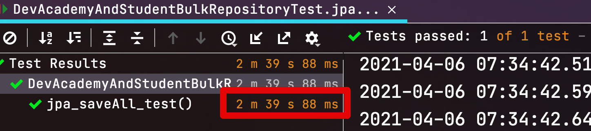
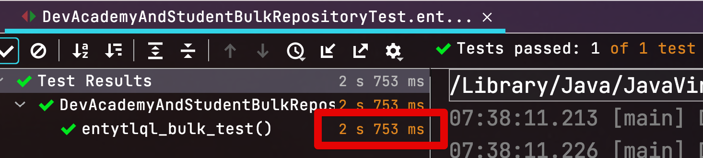

# EntityQL로 OneToMany (1:N) Bulk Insert 구현하기

[지난 시간](https://jojoldu.tistory.com/558)에는 EntityQL 환경을 적용해보았습니다.  
  
간단한 예제로 **단일 Entity**의 Bulk Insert를 보여드렸는데요.  
이번 시간에는 **OneToMany** 환경에서 어떻게 Bulk Insert를 구현할지 알아보겠습니다.

## 1. 해결책

EntityQL이 전환해주는 Querydsl-SQL은 JPA 기반이 아닙니다.  
  
그래서 OneToMany와 같은 연관관계 Insert/Update 등은 **JdbcTemplate**처럼 직접 구현을 해야하는데요.  
  
> 원래 JdbcTemplate으로 작성하던 코드를 단순히 정적 타입 개발이 가능하도록 지원할 뿐인것 이제는 다들 아시죠?

그래서 꼭 Querydsl-SQL이 아니더라도, JdbcTemplate로 구현한다 하여도, OneToMany 를 BulkInsert를 하려면 다음의 과정들로 해야만 합니다.  

(1) 부모 Entity (one) 을 모아 bulk insert
(2) (1)의 insert 결과로 채번 (`auto increment`) 된 id들을 리턴 받는다.
(3) 해당 id를 기반으로 자식 Entity (toMany)를 생성하여 bulk insert한다.

여기서 두번째 내용인 `(1)의 insert 결과로 채번 된 id들을 리턴 받는다` 가 핵심인데요.  
이는 JDBC 스펙에 있는 `generatedKeys()` 를 통해 전달 받을 수 있습니다.  
  
간단하게 코드로 구현하면 다음과 같습니다.

```java
String QUERY = "insert into persons (name) values (?)";
try (PreparedStatement ps = connection.prepareStatement(QUERY, Statement.RETURN_GENERATED_KEYS)) { // ((1)
    for (i in 1..10) {
      ps.setString(1, "이름");
      ps.addBatch();
    }
    ps.executeBatch();

    // omitted
} catch (SQLException e) {
    // handle the database related exception appropriately
}

try (ResultSet keys = statement.getGeneratedKeys()) { // ((2)
  if(keys.next()) {
      list.add(keys.getLong((1));
  }
  ...
}

```

> 위 코드는 [baeldung](https://www.baeldung.com/jdbc-returning-generated-keys) 의 코드를 일부 사용하였습니다.

((1) `Statement.RETURN_GENERATED_KEYS`

* PrepareStatement를 생성할 때 파라미터 `Statement.RETURN_GENERATED_KEYS` 을 추가
* 이렇게 추가하면 `ps.executeBatch()`를 실행한 이후에 `getGeneratedKeys()` 메서드를 통해서 insert 대상들의 채번된 키값을 확인할 수 있습니다.
* 단, JDBC 스펙에서는 `getGeneratedKeys()`와 `executeBatch()`를 **같이 사용하는 것이 필수 구현 사항이 아니기 때문에** 특정 DB나 구 버전에서는 지원하지 않습니다.
  * 다행히 MySQL의 JDBC 드라이버는 지원 합니다.
  * MSSQL의 JDBC 드라이버는 지원하지 않습니다.

((2) `statement.getGeneratedKeys()`

* 방금 batch insert가 된 값들의 채번 (`auto increment`) 된 Key들을 리턴 받을 수 있습니다.
* JDBC의 `getGeneratedKeys()` 를 Querydsl-SQL에서는 `executeWithKeys` 메소드로 사용할 수 있습니다.
* **JdbcTemplate에는 이 메소드가 구현되어 있지 않습니다**


[SimpleJdbcInsert](https://www.baeldung.com/spring-jdbc-jdbctemplate#1-simplejdbcinsert) 에서 `executeAndReturnKey()` 와 `executeBatch()`를 지원해서 oneToMany bulk insert를 구현할 수 있지않을까 했지만 **사용하지 못했습니다.**  
SimpleJdbcInsert 의 `executeBatch` 가 **return 타입에 특정 컬럼 지정이 안됩니다**.  
return 타입으로 int[]만 가능하여 반영된 row 수만 받을 수 있습니다.  
반대로 `executeAndReturnKey` 는 **단일 row만 가능**하여 결과적으로는 위와 같은 기능을 구현할 수는 없었습니다.  

자 그럼 EntityQL로 생성된 Querydsl-SQL 코드들을 어떻게 활용하여 OneToMany Bulk Insert를 할지 자세히 코드로 확인해보겠습니다.

## 2. 구현

### 2-1. 구현 방식

위에서 잡은 컨셉을 다시 한번 돌아보겠습니다.

(1) 부모 Entity (one) 을 모아 bulk insert
(2) (1)의 insert 결과로 채번 (`auto increment`) 된 id들을 리턴 받는다.
(3) 해당 id를 기반으로 자식 Entity (toMany)를 생성하여 bulk insert한다.

여기서 핵심은 (1)과 (2)인데요.  
(1)을 통해 Bulk Insert된 부모들의 ID를 다시 return 받아도 **어느 자식들과 매핑해야하는지 알 수는 없습니다**.  
그래서 (1) 을 통해 부모 Entity들을 Bulk Insert 하기전에 **고유의 Key** 발급을 해서, 해당 Key 기반으로 Return 된 부모 PK값과 자식 Entity들을 매핑할 필요가 있습니다.  
  
이 과정을 상세하게 다음과 같이 진행합니다.

(1) 부모 Entity를 save하기 전에 **UUID를 발급**해서 임시 컬럼에 저장한다.

* 물론 부모 Entity에 UUID를 담을 컬럼이 추가되어 있어야만 합니다.
* UUID는 1천건 생성시 0.046초 정도의 수행시간이 소요됩니다.
  * 즉, UUID 생성으로 인해 성능 저하는 거의 없습니다.

(2) 별도의 컬렉션에 UUID를 가진 부모 Entity들 (자식 Entity들 포함)을 저장한다.

* 이렇게 컬렉션에 UUID를 가진 부모 Entity들에는 **자식 Entity들을 갖고 있어야만** 합니다.
* 이후 UUID 기반으로 (1)에서 저장된 부모 Entity들과 (2) 에서 컬렉션에 저장된 부모 Entity들을 매칭시킵니다.

(3) 부모 Entity만 먼저 BulkInsert 한다.

(4) BulkInsert하고 나온 부모의 PK 를 통해 **PK와 UUID 값을 별도로 조회**한다.

* `getGeneratedKeys()` 메소드는 **PK값만 return** 하기 때문에 (5) 의 매칭을 위해서는 **PK와 UUID**를 같이 조회하여 둘의 연결을 확인합니다.

(5) 조회된 UUID를 컬렉션에 미리 담아둔 부모의 UUID와 매칭해서 자식/부가정보등 다른 Entity를 찾는다

(6) 매칭 결과로 찾아낸 자식/부가정보에 부모 PK값을 담아서 bulk insert한다.

전체 시나리오를 봤으니 이걸 기반으로 코드를 한번 구현해보겠습니다.  

### 2-2. 구현 코드

위 6단계의 시나리오를 위해 총 3개의 파일이 필요합니다.

* AcademyAndStudentBulkRepository
  * OneToMany Bulk Insert를 수행할 Repository 입니다.
  * Bulk Insert 전체 Flow를 담당합니다.
  * 실제 운영에서는 `AcademyBulkRepository` 로 이름을 짓고 사용합니다.
  * 현재는 포스팅을 위해 단일 Entity용 Bulk repository 로 해당 이름을 사용했기 때문에 임시로 지은 이름입니다.
* AcademyMatcherRepository
  * Bulk Insert 되고 return 된 Academy.id를 통해 Academy.UUID를 조회합니다.
* AcademyUniqueMatcher
  * AcademyMatcherRepository를 통해 조회된 Academy.UUID 를 통해 Academy와 Student 간 연관관계를 맺어줍니다.

**AcademyAndStudentBulkRepository**

```java
@Slf4j
@RequiredArgsConstructor
@Repository
@Transactional // 조회는 사용하지 않는다.
public class AcademyAndStudentBulkRepository {
    private static final Integer DEFAULT_CHUNK_SIZE = 1_000; // MySQL 설정에 따라 조정한다.

    private final AcademyMatcherRepository academyMatcherRepository;
    private final SQLQueryFactory sqlQueryFactory;

    public void saveAll(List<Academy> entities) {
        saveAll(entities, DEFAULT_CHUNK_SIZE);
    }

    public void saveAll(List<Academy> entities, int chunkSize) {
        AcademyUniqueMatcher matcher = new AcademyUniqueMatcher(entities);
        List<List<Academy>> subSets = Lists.partition(matcher.getAcademies(), chunkSize);

        int index=1;
        for (List<Academy> subSet : subSets) { // 10만건 save가 필요하면 1천건씩 나눠서 bulk insert

            LocalDateTime now = LocalDateTime.now(); // 1천건 단위로 audit time 갱신
            List<Academy> savedItems = insertAcademies(subSet, now);
            insertStudents(matcher, savedItems, now);
            log.info("{}번째 처리 - {}건", index++, subSet.size());
        }
    }

    // id가 발급된 Academy
    public List<Academy> insertAcademies(List<Academy> academies, LocalDateTime now) {
        SQLInsertClause insert = sqlQueryFactory.insert(EAcademy.qAcademy);

        for (Academy academy : academies) {
            academy.setCurrentTime(now);
            insert.populate(academy, EntityMapper.DEFAULT).addBatch();
        }

        // executeWithKeys: BulkInsert한 결과 중 단일 컬럼에 한해서 반환해준다.
        List<Long> ids = insert.executeWithKeys(EAcademy.qAcademy.id);

        return academyMatcherRepository.findAllByIds(ids);
    }

    void insertStudents(AcademyUniqueMatcher matcher, List<Academy> idAcademies, LocalDateTime now) {
        SQLInsertClause insert = sqlQueryFactory.insert(EStudent.qStudent);

        for (Academy idAcademy : idAcademies) {
            for (Student student : matcher.get(idAcademy, now)) {
                insert.populate(student, EntityMapper.DEFAULT).addBatch();
            }
        }

        // count가 없을때 insert가 실행되면 values가 없는 쿼리가 수행되어 Exception 발생으로 트랜잭션 롤백 된다.
        if(!insert.isEmpty()) {
            insert.execute();
            insert.clear();
        }
    }
}
```

주의하실 점은 `insertStudents` 메소드의 `if(!insert.isEmpty())` 입니다.  
이게 없으면, **student가 없는 경우** `insert into values` 만 쿼리가 수행되어 **Exception**이 발생합니다.  
그래서 별도의 Exception이 발생하지 않도록 **values에 1개이상이 들어가있는지** 확인하는 로직 (`!insert.isEmpty()`) 을 넣어서 실행합니다.  
  
전체 로직은 기존의 BulkRepository와 크게 다르진 않지만, 아래 2개의 클래스를 통해서 **자동생성된 PK를 가진 부모와 자식들간의 관계를 맺는**코드가 추가되었습니다.  

**AcademyUniqueMatcher**

```java
@Getter
public class AcademyUniqueMatcher {

    private final Map<String, Academy> map = new LinkedHashMap<>();

    public AcademyUniqueMatcher(List<Academy> items) {
        for (Academy academy : items) {
            String matchKey = UUID.randomUUID().toString();
            academy.setMatchKey(matchKey);
            map.put(matchKey, academy);
        }
    }

    public List<Academy> getAcademies() {
        return new ArrayList<>(map.values());
    }

    public List<Student> get(Academy idAcademy, LocalDateTime now) {
        Academy academy = map.get(idAcademy.getMatchKey());

        if(academy == null) {
            return new ArrayList<>();
        }

        return academy.getStudents().stream()
                .map(student -> student.setBulkInsert(idAcademy, now))
                .collect(Collectors.toList());
    }
}
```

Matcher는 아래의 역할들을 합니다.

* `academy.setMatchKey(matchKey)`: 각각의 Academy에 `UUID` 를 등록하여 **Insert시에 UUID도 함께 저장**할 수 있도록 합니다.  
* `get`: matchKey를 기반으로 Matcher 클래스에 보관되어 있는 **Student**를 반환합니다.

**AcademyMatcherRepository**

```java
@RequiredArgsConstructor
@Transactional(readOnly = true)
@Repository
public class AcademyMatcherRepository {

    private final JPAQueryFactory queryFactory;

    public List<Academy> findAllByIds(List<Long> ids) {
        if(CollectionUtils.isEmpty(ids)) {
            throw new IllegalArgumentException("조회할 id가 없습니다.");
        }

        return queryFactory
                .select(fields(Academy.class, // 이렇게 할 경우 Entity가 아닌 Dto로 조회됨
                        academy.id,
                        academy.matchKey
                ))
                .from(academy)
                .where(academy.id.in(ids))
                .fetch();
    }
}
```

* Entity 클래스를 선언은 했지만, 위와 같이 특정 필드만 선언하게 되면 **Dto처럼** 조회가 됩니다.
  * 즉, 1차캐시, `oneToOne` Eager Loading 같이 JPA Entity로서의 기능이 적용되지 않습니다.
* 상황에 맞게 ID와 MatchKey만 가진 Dto를 만드셔도 됩니다.
  * 저는 굳이 Dto를 만들 필요가 없어 Entity 클래스를 그대로 사용했습니다.

여기까지 구현이 모두 되었으니, 이제 각각의 클래스에 대한 단위 테스트와 성능 테스트를 진행해보겠습니다.

## 3. 테스트

기능별 테스트와 실제 성능 테스트로 나눠서 진행해보겠습니다.

### 3-1. 단위 테스트

가장 먼저 단순한 Matcher 부터 테스트해보겠습니다.

```java
class AcademyUniqueMatcherTest {

    @Test
    void Academy마다_유니크키가_생성된다() throws Exception {
        //given
        int size = 1_000;
        List<Academy> academies = IntStream.rangeClosed(1, size)
                .mapToObj(i -> new Academy())
                .collect(Collectors.toList());

        //when
        AcademyUniqueMatcher matcher = new AcademyUniqueMatcher(academies);

        //then
        assertThat(matcher.getMap()).hasSize(size);
        assertThat(matcher.getAcademies().get(0)).isNotNull();
    }

    @Test
    void academyId로_student를_찾는다() throws Exception {
        //given
        List<Academy> academies = IntStream.rangeClosed(1, 100)
                .boxed()
                .map(i -> new Academy(String.valueOf(i), "address"+i, "010-0000-0000", AcademyStatus.ON, new Student("student"+i, i)))
                .collect(Collectors.toList());

        AcademyUniqueMatcher matcher = new AcademyUniqueMatcher(academies);

        for (Academy academy : academies) {
            List<Student> students = matcher.get(academy, LocalDateTime.now());
            assertThat(students.size()).isEqualTo(1);

            Student student = students.get(0);
            assertThat(student.getAcademy().getName()).isEqualTo(academy.getName());
            assertThat(student.getAcademyNo()).isEqualTo(Integer.parseInt(academy.getName()));
        }
    }
}

```

Repository의 경우에는 H2 DB와 SQL를 직접 수행해야하니, 간편하게 스프링부트 테스트로 진행합니다.

```java
@ExtendWith(SpringExtension.class)
@SpringBootTest
public class AcademyMatcherRepositoryTest {

    @Autowired
    private AcademyRepository academyRepository;

    @Autowired
    private AcademyMatcherRepository academyMatcherRepository;

    @AfterEach
    void after() {
        academyRepository.deleteAll();
    }

    @Test
    void Entity가_아닌_Dto로_조회된다() throws Exception {
        //given
        String matchKey = "matchKey";
        Academy saved = academyRepository.save(new Academy(matchKey, "name", "address", "010-0000-0000", AcademyStatus.ON));
        Long savedId = saved.getId();

        //when
        List<Academy> result = academyMatcherRepository.findAllByIds(Arrays.asList(savedId));

        //then
        assertThat(result.get(0).getId()).isEqualTo(savedId);
        assertThat(result.get(0).getMatchKey()).isEqualTo(matchKey);
        assertThat(result.get(0).getName()).isNull();
    }
}
```

마지막으로 BulkRepository의 단위 테스트들을 진행해보겠습니다.

```java
@SpringBootTest
class AcademyAndStudentBulkRepositoryTest {

    @Autowired
    private AcademyAndStudentBulkRepository academyAndStudentBulkRepository;

    @Autowired
    private AcademyRepository academyRepository;

    @Autowired
    private StudentRepository studentRepository;

    @AfterEach
    void after() {
        academyRepository.deleteAll();
    }

    @Test
    void oneToMany_단건_insert() throws Exception {
        //given
        String name = "1";
        Academy academy = new Academy(name, "address", "010-0000-0000", AcademyStatus.ON, new Student(name, 1));

        //when
        academyAndStudentBulkRepository.saveAll(Arrays.asList(academy));

        //then
        List<Academy> academies = academyRepository.findAll();
        List<Student> students = studentRepository.findAll();

        assertThat(academies).hasSize(1);
        assertThat(students).hasSize(1);

        Academy savedAcademy = academies.get(0);
        Student savedStudent = students.get(0);
        assertThat(savedAcademy.getName()).isEqualTo(name);
        assertThat(savedStudent.getName()).isEqualTo(name);
    }

    @Test
    void EmptyList_에러가_발생하지않는다() throws Exception {
        //when
        academyAndStudentBulkRepository.saveAll(new ArrayList<>());

        //then
        List<Academy> academies = academyRepository.findAll();
        List<Student> students = studentRepository.findAll();

        assertThat(academies).hasSize(0);
        assertThat(students).hasSize(0);
    }

    @Test
    void academy만있고_student는없어도_정상등록된다() throws Exception {
        //given
        String name = "1";
        Academy academy = new Academy(name, "address", "010-0000-0000", AcademyStatus.ON);

        //when
        academyAndStudentBulkRepository.saveAll(Arrays.asList(academy));

        //then
        List<Academy> academies = academyRepository.findAll();
        List<Student> students = studentRepository.findAll();

        assertThat(academies).hasSize(1);
        assertThat(students).isEmpty();

        Academy savedAcademy = academies.get(0);
        assertThat(savedAcademy.getName()).isEqualTo(name);
    }

    @Test
    void oneToMany가_모두_insert된다() throws Exception {
        //given
        //when
        academyAndStudentBulkRepository.saveAll(IntStream.rangeClosed(1, 10)
                .boxed()
                .map(i -> new Academy(String.valueOf(i), "address"+i, "010-0000-0000", AcademyStatus.ON, new Student(String.valueOf(i), i)))
                .collect(Collectors.toList()));

        //then
        List<Academy> academies = academyRepository.findAll();
        List<Student> students = studentRepository.findAll();

        assertThat(academies).hasSize(10);
        assertThat(students).hasSize(10);

        for (int i = 0, academiesSize = academies.size(); i < academiesSize; i++) {
            Academy academy = academies.get(i);
            Student student = students.get(i);
            assertThat(academy.getName()).isEqualTo(student.getName());
        }
    }
}
```

각 케이스에 대해서 모두 통과해야만, 정상적으로 oneToMany 테스트가 통과된 것이니, 꼭 참고합니다.

### 3-2. 성능 테스트

마지막으로 성능 테스트를 진행해보겠습니다.  
성능 테스트의 대상이 되는 RDS는 다음의 사양을 가집니다.

* AWS Aurora MySQL 5.7 r5.large

성능 테스트용 코드는 다음과 같습니다.

```java
@SpringBootTest
@ActiveProfiles("dev")
class DevAcademyAndStudentBulkRepositoryTest {

    @Autowired
    private AcademyAndStudentBulkRepository academyAndStudentBulkRepository;

    @Autowired
    private AcademyRepository academyRepository;

    List<Academy> academies;

    @BeforeEach
    void setUp() {
        academies = IntStream.rangeClosed(1, 10_000)
                .boxed()
                .map(i -> new Academy("name"+i, "address"+i, "010-0000-0000", AcademyStatus.ON, new Student("student"+i, i)))
                .collect(Collectors.toList());
    }

    @AfterEach
    void after() {
        academies = null;
    }

    @Test
    void jpa_saveAll_test() throws Exception {
        academyRepository.saveAll(academies);
    }

    @Test
    void entytlql_bulk_test() throws Exception {
        academyAndStudentBulkRepository.saveAll(academies);
    }
}
```

1만개의 Academy와 1만개의 Student를 BulkInsert 하는 테스트입니다.  
  
먼저 JpaRepository로 테스트를 해보면?



**2분 39초**입니다.  
  
반면에 EntityQL을 이용한 BulkRepository를 이용한다면?



**2.7초**로, JpaRepository에 비해 **수십배**빠른 성능을 보여줍니다.  
실제로 10만건으로 데이터를 더 늘릴 경우 **수백배의 차이까지도 발생**합니다.  
  
과한 설정을 한 보람이 있죠?

## 4. ManyToMany

oneToMany 방식을 더 풀어서 ManyToMany도 마찬가지로 구현할수도 있겠지만, 코드 복잡도가 너무 높아집니다.  
**중간 매핑 테이블까지** BulkInsert 대상으로 만들어서 처리해야하는데, 

(1) 처음 부모 Entity BulkInsert
(2) BulkInsert된 부모 Entity Key조회
(3) 부모에 포함되어 있는 자식 Entity BulkInsert
(4) BulkInsert된 자식 Entity Key조회
(5) 2와 4에서 조회된 Key들을 서로 매칭 (멀티쓰레드상에서 키 매칭에 문제가 없어야 함) 
(6) 부모와 자식간 **매핑 테이블** BulkInsert
(7) ManyToMany 관계는 모두 1~6과정을 다시 한번 진행
  
코드 복잡도가 너무 높아서, ManyToMany 관계에서는 JpaRepository를 통해 Save하고, 단일 Entity / ManyToOne / OneToMany 에서는 EntityQL의 BulkRepository를 선택하게 되었습니다.  
  
> 약간 개선한다면, 부모 Many 쪽은 JPA SaveAll하고, 생성된 Entity를 통해 나머지 하위 ToMany쪽은 BulkInsert하는 방식으로 하면 기존 대비해서는 **수행 시간이 절반이하**로 줄어들 수 있을것 같습니다.

## 5. 마무리

EntityQL을 통한 JPA + AutoIncrement 환경에서의 Bulk Insert를 진행해보았습니다.  
OneToMany 환경에서는 위와 같이 설정이 추가로 더 많이 필요하게되어, **저희팀 역시 모든 Entity에 사용하진 않습니다**.  
하루 발생되는 데이터가 수백만건 정도 되는 데이터에 한해서만 적용하고 있으니, 이 점 역시 꼭 인지하시길 바랍니다.
