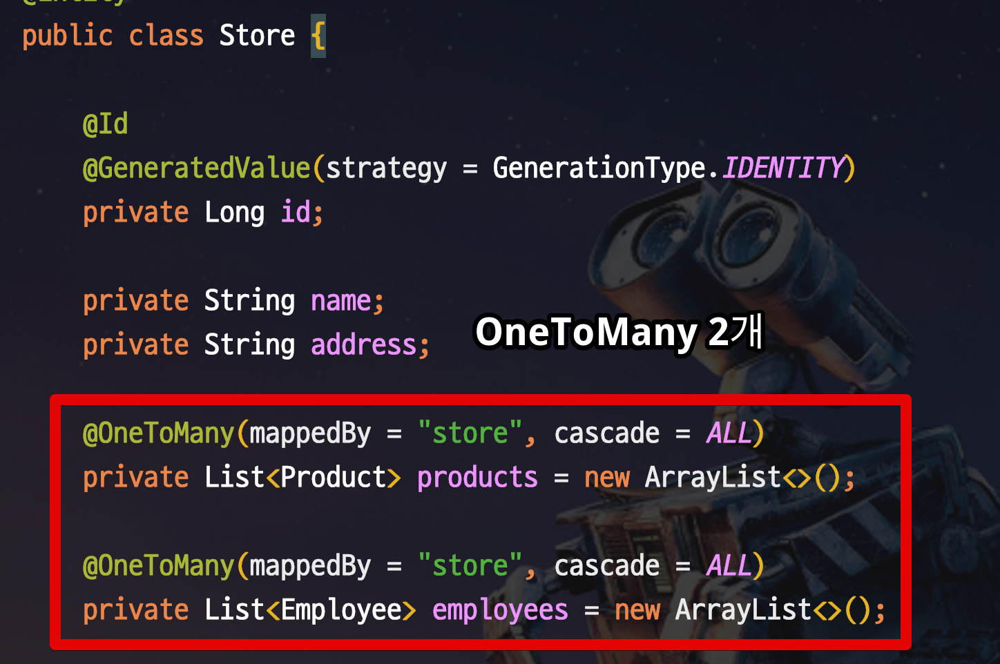
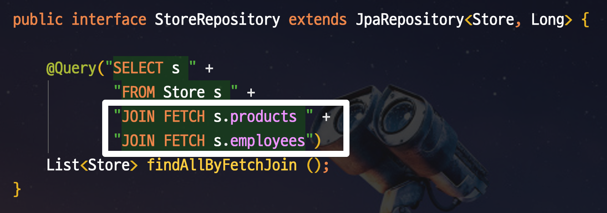
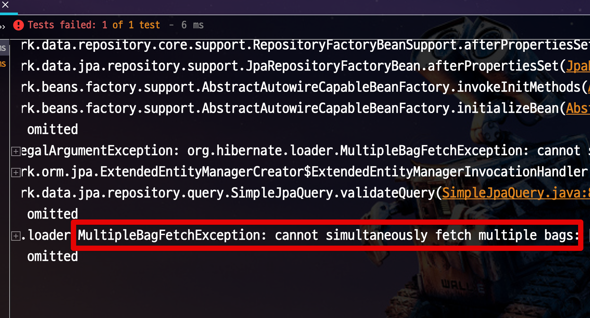
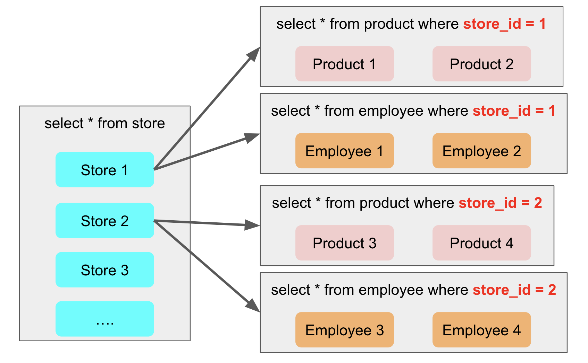
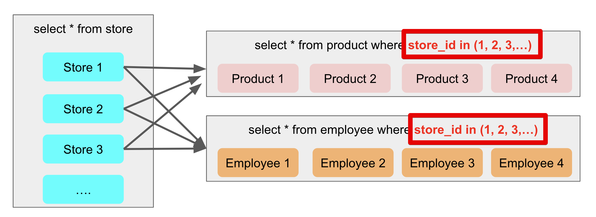
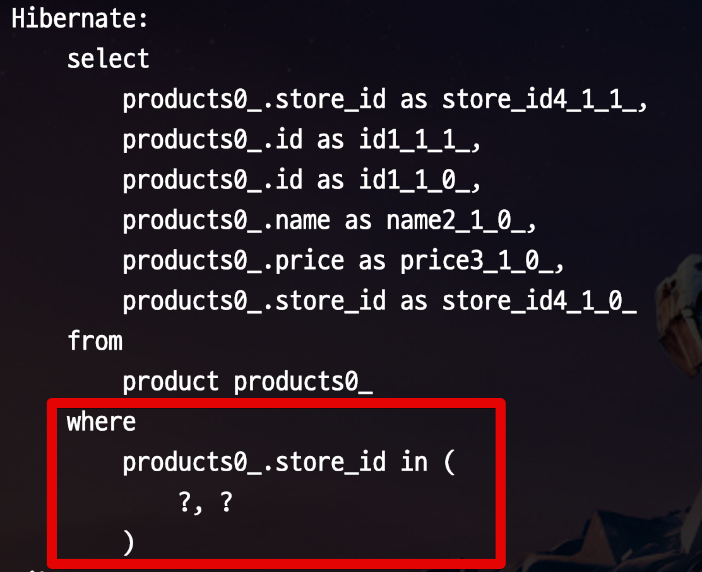
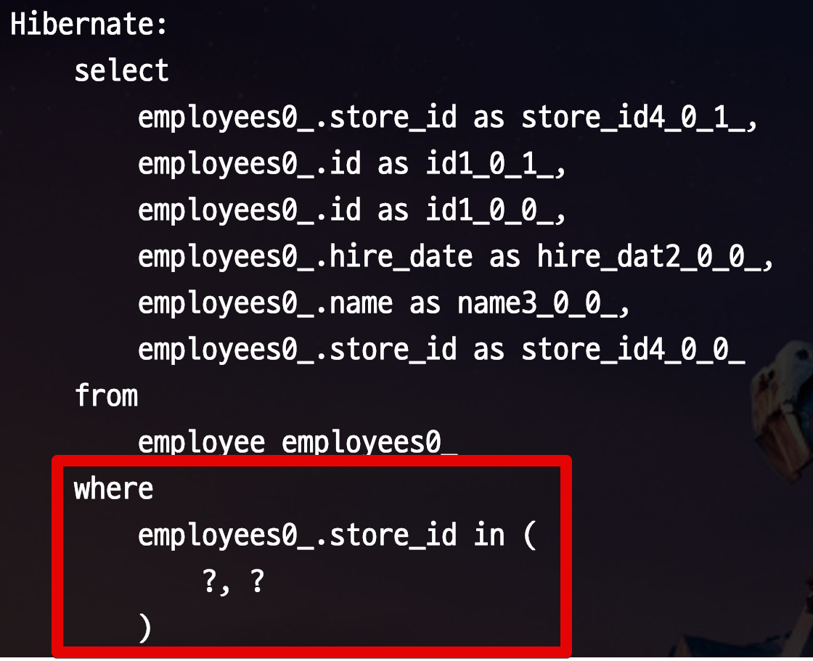
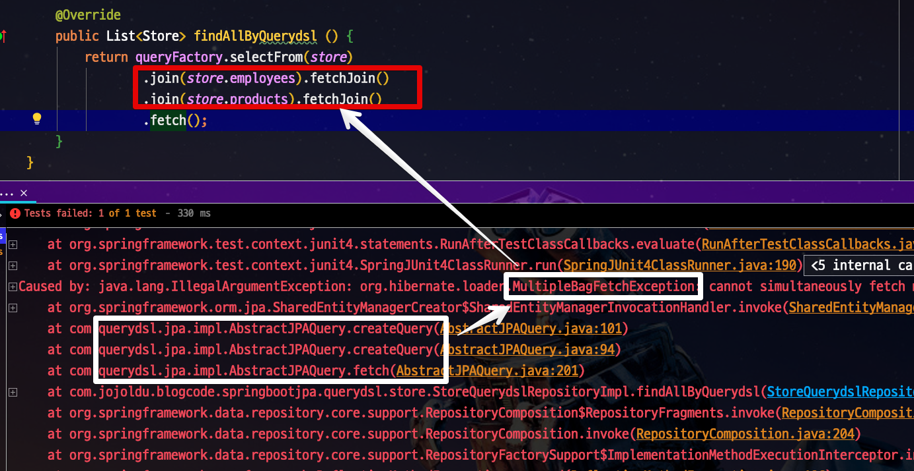

# MultipleBagFetchException 발생시 해결방법

JPA의 N+1 문제에 대한 해결책으로 Fetch Join을 사용하다보면 자주 만나는 문제가 있습니다.  
바로 ```MultipleBagFetchException``` 입니다.  
이 문제는 **2개 이상의 OneToMany 자식 테이블에 Fetch Join을 선언했을때** 발생합니다.  
  
> ```OneToOne```, ```ManyToOne```과 같이 **단일 관계의 자식 테이블**에는 Fetch Join을 써도 됩니다

이 문제에 대한 해결책으로 보통 2가지를 언급하는데요.  

* 자식 테이블 하나에만 Fetch Join을 걸고 나머진 Lazy Loading로
* 모든 자식 테이블을 다 Lazy Loading으로
  
이럴 경우 성능상 이슈가 아무래도 해결되는게 아니다 보니, 좀 더 좋은 방법을 소개드리겠습니다.

> 모든 코드는 [Github](https://github.com/jojoldu/blog-code/tree/master/spring-boot-jpa)에 있습니다.

## 1. 문제 상황

OneToMany 관계의 엔티티들이 있습니다.  



그리고 Store 엔티티의 자식들 (Product / Employee) 을 모두 가져와야하는 서비스 메소드가 있습니다.  

```java
@Slf4j
@RequiredArgsConstructor
@Service
public class StoreService {

    private final StoreQuerydslRepository storeQuerydslRepository;

    // Lazy Loading 발동을 위해 get필드 사용
    @Transactional(readOnly = true)
    public long find() {
        List<Store> stores = storeQuerydslRepository.findAll();
        long productSum = stores.stream()
                .map(Store::getProducts)
                .flatMap(Collection::stream)
                .mapToLong(Product::getPrice)
                .sum();

        stores.stream()
                .map(Store::getEmployees)
                .flatMap(Collection::stream)
                .map(Employee::getName)
                .collect(Collectors.toList());

        return productSum;
    }
}
```

기능은 단순합니다.  

* 전체 Store를 가져온다
* 각 Store의 Product와 Employee를 가져와 계산한다.

빠르게 검증하기 위해 테스트 코드를 작성해서 실행해봅니다.

```java
@RunWith(SpringRunner.class)
@SpringBootTest
public class NoUseBatchSizeStoreServiceTest {
    @Autowired StoreRepository storeRepository;

    @Autowired StoreService storeService;

    @After
    public void tearDown() throws Exception {
        storeRepository.deleteAll();
    }

    @Test
    public void NO_Repository_의_BatchSize () throws Exception {
        Store store1 = new Store("서점", "서울시 강남구");
        store1.addProduct(new Product("책1_1", 10000L));
        store1.addProduct(new Product("책1_2", 20000L));
        store1.addEmployee(new Employee("직원1", LocalDate.now()));
        store1.addEmployee(new Employee("직원2", LocalDate.now()));
        storeRepository.save(store1);

        Store store2 = new Store("서점2", "서울시 강남구");
        store2.addProduct(new Product("책2_1", 10000L));
        store2.addProduct(new Product("책2_2", 20000L));
        store2.addEmployee(new Employee("직원2_1", LocalDate.now()));
        store2.addEmployee(new Employee("직원2_2", LocalDate.now()));
        storeRepository.save(store2);

        long size = storeService.find();

        assertThat(size).isEqualTo(60000L);
    }
}
```

이 테스트 코드를 실행해서 발생한 쿼리들을 보면 다음과 같습니다.

```sql
Hibernate:  # 1) Store 전체 쿼리 
    select
        store0_.id as id1_2_,
        store0_.address as address2_2_,
        store0_.name as name3_2_ 
    from
        store store0_

Hibernate: # 2) Store 1번의 Product 자식들 조회 쿼리
    select
        products0_.store_id as store_id4_1_0_,
        products0_.id as id1_1_0_,
        products0_.id as id1_1_1_,
        products0_.name as name2_1_1_,
        products0_.price as price3_1_1_,
        products0_.store_id as store_id4_1_1_ 
    from
        product products0_ 
    where
        products0_.store_id=?

Hibernate: # 3) Store 2번의 Product 자식들 조회 쿼리
    select
        products0_.store_id as store_id4_1_0_,
        products0_.id as id1_1_0_,
        products0_.id as id1_1_1_,
        products0_.name as name2_1_1_,
        products0_.price as price3_1_1_,
        products0_.store_id as store_id4_1_1_ 
    from
        product products0_ 
    where
        products0_.store_id=?

Hibernate: # 4) Store 1번의 Employee 자식들 조회 쿼리
    select
        employees0_.store_id as store_id4_0_0_,
        employees0_.id as id1_0_0_,
        employees0_.id as id1_0_1_,
        employees0_.hire_date as hire_dat2_0_1_,
        employees0_.name as name3_0_1_,
        employees0_.store_id as store_id4_0_1_ 
    from
        employee employees0_ 
    where
        employees0_.store_id=?

Hibernate: # 5) Store 2번의 Employee 자식들 조회 쿼리
    select
        employees0_.store_id as store_id4_0_0_,
        employees0_.id as id1_0_0_,
        employees0_.id as id1_0_1_,
        employees0_.hire_date as hire_dat2_0_1_,
        employees0_.name as name3_0_1_,
        employees0_.store_id as store_id4_0_1_ 
    from
        employee employees0_ 
    where
        employees0_.store_id=?
```

총 **5번의 쿼리**가 수행되었습니다.  

* Store 조회 쿼리 실행 (id 1,2 인 엔티티 반환) - 1번 수행
* 1번 Store의 Product 조회 / Employee 조회 각각 발생 - 2번, 3번 수행
* 2번 Store의 Product 조회 / Employee 조회 각각 발생 - 4번, 5번 수행

**조회된 부모의 수만큼 자식 테이블의 쿼리가 추가 발생**하는 현상을 JPA의 N+1 문제라고 합니다.

> 좀 더 자세한 내용이 궁금하신 분들은 [이전 글](https://jojoldu.tistory.com/165)을 참고해보세요.

이 문제를 해결하기 위해 Product / Employee 조회에 **Fetch Join**을 적용합니다.



```java
public interface StoreRepository extends JpaRepository<Store, Long> {

    @Query("SELECT s " +
            "FROM Store s " +
            "JOIN FETCH s.products " +
            "JOIN FETCH s.employees")
    List<Store> findAllByFetchJoin ();
}
```

하지만 이렇게 **1:N 관계의 자식 테이블 여러곳에** Fetch Join을 사용하면 아래와 같이 에러가 발생합니다.



JPA에서 Fetch Join의 조건은 다음과 같습니다.

* **ToOne은 몇개든** 사용 가능합니다
* **ToMany는 1개만** 가능합니다.

어떻게 하면 ```MultipleBagFetchException``` 에러 없이 N+1 문제를 최대한 회피할 수 있을까요?  

## 2. 해결책 Hibernate default_batch_fetch_size
 
해결책은 하이버네이트의 ```default_batch_fetch_size``` 옵션에 있습니다.  
  
다시 한번 JPA의 N+1 문제를 바라보겠습니다.  



N+1 문제란 결국 **부모 엔티티와 연관 관계가 있는 자식 엔티티들의 조회 쿼리**가 문제입니다.  
  
부모 엔티티의 Key 하나하나를 자식 엔티티 조회로 사용하기 때문인데요.  
**1개씩 사용되는 조건문을 in절로 묶어서 조회**하면 어떨까요?  


바로 이 개념으로 사용되는 것이 바로 ```hibernate.default_batch_fetch_size``` 옵션입니다.  
  
해당 옵션은 **지정된 수만큼 in절에 부모 Key를 사용**하게 해줍니다.  
  
즉, 1000개를 옵션값으로 지정하면 1000개 단위로 in절에 부모 Key가 넘어가서 자식 엔티티들이 조회되는 것이죠.  
단순하게 생각해도 **쿼리 수행수가 1/1000**이 되는거겠죠?  
  
바로 테스트 코드로 검증해보겠습니다.

```java
@RunWith(SpringRunner.class)
@SpringBootTest
@TestPropertySource(properties = "spring.jpa.properties.hibernate.default_batch_fetch_size=1000") // 옵션 적용
public class UseBatchSizeStoreServiceTest {
    @Autowired StoreRepository storeRepository;

    @Autowired StoreService storeService;

    @After
    public void tearDown() throws Exception {
        storeRepository.deleteAll();
    }

    @Test
    public void USE_Repository_의_BatchSize () throws Exception {
        Store store1 = new Store("서점", "서울시 강남구");
        store1.addProduct(new Product("책1_1", 10000L));
        store1.addProduct(new Product("책1_2", 20000L));
        store1.addEmployee(new Employee("직원1", LocalDate.now()));
        store1.addEmployee(new Employee("직원2", LocalDate.now()));
        storeRepository.save(store1);

        Store store2 = new Store("서점2", "서울시 강남구");
        store2.addProduct(new Product("책2_1", 10000L));
        store2.addProduct(new Product("책2_2", 20000L));
        store2.addEmployee(new Employee("직원2_1", LocalDate.now()));
        store2.addEmployee(new Employee("직원2_2", LocalDate.now()));
        storeRepository.save(store2);

        long size = storeService.find();

        assertThat(size).isEqualTo(60000L);
    }
}
```

* ```@TestPropertySource```를 이용해 ```hibernate.default_batch_fetch_size```을 **이 테스트에만 적용**되도록 하였습니다.

이 테스트를 수행해보시면 다음과 같은 쿼리를 볼 수 있습니다.

```sql
Hibernate: # 1) Store 전체 쿼리 
    select
        store0_.id as id1_2_,
        store0_.address as address2_2_,
        store0_.name as name3_2_ 
    from
        store store0_
Hibernate: # 2) Store 1, 2번의 Product 자식들 조회 쿼리
    select
        products0_.store_id as store_id4_1_1_,
        products0_.id as id1_1_1_,
        products0_.id as id1_1_0_,
        products0_.name as name2_1_0_,
        products0_.price as price3_1_0_,
        products0_.store_id as store_id4_1_0_ 
    from
        product products0_ 
    where
        products0_.store_id in (
            ?, ?
        )
Hibernate: # 3) Store 1, 2번의 Employee 자식들 조회 쿼리
    select
        employees0_.store_id as store_id4_0_1_,
        employees0_.id as id1_0_1_,
        employees0_.id as id1_0_0_,
        employees0_.hire_date as hire_dat2_0_0_,
        employees0_.name as name3_0_0_,
        employees0_.store_id as store_id4_0_0_ 
    from
        employee employees0_ 
    where
        employees0_.store_id in (
            ?, ?
        )
```

보시는것처럼 그동안 ```where store_id = ?``` 였던 조회 쿼리가 ```where store_id in (?, ?, ..)``` 으로 변경 된 것을 볼 수 있습니다.





총 5번이 수행되던 쿼리가 **총 3번의 쿼리 수행**으로 개선되었습니다.  
  
5번과 3번이라고 하면 체감이 안되실텐데요.  
이 개선은 **Store의 결과가 많으면 많을수록** 쿼리 수행 횟수가 획기적으로 개선됩니다.  
  
만약 **1만개의 Store** (부모 엔티티)가 조회된다면

* 옵션 미적용시 
  * 총 **20,001번**의 쿼리가 수행됩니다.
    * Store 조회 쿼리 1번
    * 각 Store의 Product 조회 쿼리가 10,000번
    * 각 Store의 Employeee 조회 쿼리가 10,000번
* 옵션 적용시 (1000개)
  * 총 **21번**의 쿼리가 수행됩니다.
    * Store 조회 쿼리 1번
    * 각 Store의 Product 조회 쿼리가 10번 (10,000 / 1,000)  
    * 각 Store의 Employee 조회 쿼리가 10번 (10,000 / 1,000)

**최대 1,000 분의 1로 쿼리수를 줄일 수 있습니다**.  

> Tip)
> 보통 옵션값을 1,000 이상 주지는 않습니다.
> in절 파라미터로 1,000 개 이상을 주었을때 너무 많은 in절 파라미터로 인해 문제가 발생할수도 있기 때문입니다.
  

지금 옵션은 1000으로 두었기 때문에 Store가 **1000개를 넘지 않으면 단일 쿼리로 수행** 된다는 장점도 있습니다.  

> Tip)
> 같은 방법으로 **Fetch 적용시 발생하는 페이징 문제도 동일하게 해결됩니다**.
> 1:N 관계에서의 페이징 문제는 Join으로 인해 1에 대한 페이징이 정상작동 하지 않기 때문입니다.

### 스프링부트 옵션

스프링 부트에 해당 옵션 적용시 아래와 같이 적용할 수 있습니다.  
  
**application.yml**

```yaml
spring:
  jpa:
    properties:
      hibernate.default_batch_fetch_size: 1000
```

**application.properties**

```yaml
spring.jpa.properties.hibernate.default_batch_fetch_size=1000
```

이렇게 설정하시면 **해당 프로젝트 전체 설정**으로 옵션이 적용됩니다.

## 번외 1) Querdsl은 Multi Fetch Join이 가능했던것 같은데요?

이 질문을 자주 받았는데요.  
**Querydsl이라고해서 용빼는 재주가 있는게 아닙니다**.  
결국 Querydsl 역시 JPQL 로 변환 작업에서 동일하게 문제가 발생합니다.  
JPA에서 안되는게 Querydsl에 될수는 없습니다.  
  
다시 한번 Querydsl의 코드를 확인해보세요.  
아래와 같이 자식 엔티티와의 관계가 **OneToOne, ManyToOne** 이지 않나요?

```java
return queryFactory
        .selectFrom(txItem)
        .join(txItem.customer, customer).fetchJoin() // @ManyToOne
        .join(txItem.txDetails, txDetail).fetchJoin() // @OneToMany
        .where(
                txItem.settleCode.in(request.getSettleCodes()),
                txItem.txDate.eq(txDate),
                customer.bizNo.in(request.getBizNos()))
        .fetch();
```

다시 언급드리지만, Fetch Join은 **ToOne은 여러개 적용이 가능**하지만, **ToMany와 같이 1:N 의 N에 대해서는 여러개 사용할 수 없습니다**.  
Querydsl 역시 **N 관계의 자식들에 대해서는 멀티 페치 조인이 안됩니다**.  



본인의 Querydsl 코드에 여러개 Fetch Join 이 있다면 그건 ```ToOne```에 걸려있는게 여러개일겁니다.

## 번외 2) 그럼 이제 Fetch Join 빼도 되나요?

아뇨 그렇진 않습니다.  
default_batch_fetch_size 옵션으로 인해 **최소한의 성능 보장**이 된 것이지, 이게 **최선은 아닙니다**.  
  
Fetch Join을 이용해 최대한의 성능 튜닝을 진행하고,  
Fetch Join으로 해결이 안되는 조회 쿼리에 대해서는 default_batch_fetch_size 옵션으로 최소한의 성능을 보장해준다고 보시면 됩니다.  
  
즉, 결론을 내리자면

* ```hibernate.default_batch_fetch_size```를 **글로벌 설정**으로 사용해 N+1 문제를 최대한 ```in``` 쿼리로 기본적인 성능을 보장하게 한다.
* ```@OneToOne```, ```@ManyToOne```과 같이 1 관계의 자식 엔티티에 대해서는 **모두 Fetch Join**을 적용하여 한방 쿼리를 수행한다.
* ```@OneToMany```, ```@ManyToMany```와 같이 N 관계의 자식 엔티티에 관해서는 **가장 데이터가 많은 자식쪽에 Fetch Join**을 사용한다.
  * Fetch Join이 없는 자식 엔티티에 관해서는 위에서 선언한 ```hibernate.default_batch_fetch_size``` 적용으로 100~1000개의 ```in``` 쿼리로 성능을 보장한다.


