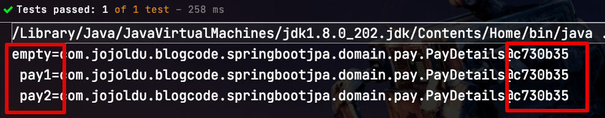
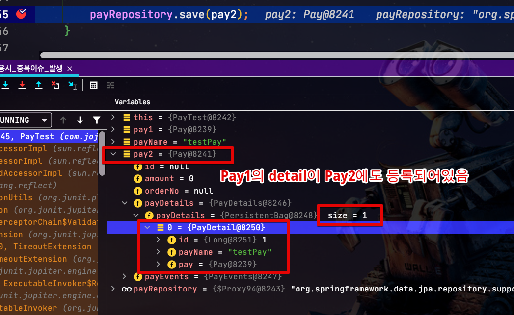

# JPA 사용시 @Embedded 주의사항

간혹 JPA의 `@Embedded` 를 잘못사용하는 경우를 보게 됩니다.  
  
이번 시간에는 `@Embedded` 를 사용하면서 주의해야할 점을 알아보겠습니다.

> 꼭 `@Embedded` 만의 문제는 아니며, **Entity 내부에 객체형 필드가 선언**되어 있으면 주의할 필요가 있습니다.

## 문제 상황

예를 들어서 다음과 같은 Entity 가 있습니다.

```java
@Getter
@NoArgsConstructor
@Entity
public class Pay {

    @Id
    @GeneratedValue(strategy = GenerationType.IDENTITY)
    private Long id;

    private long amount;
    private String orderNo;

    @Embedded
    private PayDetails payDetails = PayDetails.EMPTY; // (1)

    @Embedded
    private PayEvents payEvents = new PayEvents(); // (2)
```

내부에는 일급 컬렉션 객체로 2개의 `@Embedded` 객체들이 있는데요.  

(1) payDetails 는 Entity가 생성되면 즉시 기본 객체가 생성될 수 있도록 기본 값을 할당했습니다.  
다만, **new 키워드를 매번** 사용하기 귀찮아서 **전역 변수**인 `PayDetails.EMPTY;` 를 사용하도록 하였습니다.

(2) payEvents는 기존처럼 `new PayEvents`를 통해서 Entity가 생성되면 즉시 기본 객체가 생성될 수 있도록 사용했습니다.  

  
  
각각의 Embedded 클래스와 전역 변수는 다음과 같이 작업되어있습니다.  
  
**PayDetails**

```java
@Getter
@NoArgsConstructor
@Embeddable
public class PayDetails {
    public static final PayDetails EMPTY = new PayDetails(); // 전역 변수

    @OneToMany(cascade = CascadeType.ALL, mappedBy = "pay")
    private List<PayDetail> payDetails = new ArrayList<>();
```

**PayEvents**

```java
@Getter
@NoArgsConstructor
@Embeddable
public class PayEvents {
    @OneToMany(cascade = CascadeType.ALL, mappedBy = "pay")
    private List<PayEvent> payEvents = new ArrayList<>();
```

자 2개의 `@Embedded` 어노테이션이 선언되어있는데요.  
이 중 어떤게 문제일지 한번 보겠습니다.

## 테스트

먼저 간단하게 JPA 컨텍스트 없이, Dto만으로 테스트를 해보겠습니다.

### Dto Test

아래와 같이 Pay 클래스만 **2번 생성** 해보겠습니다.  
그리고 각각 독립된 객체인 pay1과 pay2의 **PayDetails**를 검사해볼텐데요.  
테스트 코드를 보면 "**새롭게 만든** pay1과 pay2의 **PayDetails은 같다**"를 검증합니다.

```java
@Test
void PayDetails_test() throws Exception {
    //given
    Pay pay1 = new Pay();
    Pay pay2 = new Pay();

    //then
    System.out.printf("empty=%s\n pay1=%s\n pay2=%s\n", PayDetails.EMPTY, pay1.getPayDetails(), pay2.getPayDetails());
    assertThat(pay1.getPayDetails()).isEqualTo(pay2.getPayDetails());
}
```

Java의 객체에 대해 조금이라도 아시는 분들은 왜 **독립된 객체인 pay1과 pay2의 PayDetails가 같은지** 알 수 있습니다.  
이유는 모든 Pay의 PayDetails는 `PayDetails.EMPTY` 를 참조하기 때문입니다.  



이는 2가지 때문인데요.

1) `PayDetails.EMPTY` 는 전역 변수로 (`static`) 선언되어 **애플리케이션 실행시 딱 한번 생성**되고, 이후로는 이를 계속 재사용합니다.
2) `Pay` Entity의 멤버 변수인 `payDetails`는 `PayDetails.EMPTY` 를 객체를 참조 (`payDetails = PayDetails.EMPTY`) 받습니다.

즉, 아래와 같이 `=`로 **참조만 전달한 것 뿐**이지 **객체 복사가 된 건 아닙니다**.  
  
그래서 생성되는 **모든 Pay들**은 `PayDetails.EMPTY`를 참조하는 `payDetails` 을 갖고 있게 됩니다.  
  
이렇게 되면 실제 운영 환경에선 어떤 이슈가 될까요?  
A Pay가 payDetail a를 `add` 하고나면, 새롭게 추가되는 B Pay는 payDetail을 생성하지 않더라도 **payDetail a를 갖게 됩니다**.  
모든 Pay는 **똑같은 PayDetails를 참조하기 때문**입니다.  
  
> 배포등으로 인해서 스프링 애플리케이션이 재실행되면 당연히 `PayDetails.EMPTY` 가 다시 생성되니 이전에 `add` 된 details들은 모두 없어질겁니다.  
> 그래서 **Embedded를 쓰는 Entity의 코드가 작동되었다가 안되었다 하면** 이런 이유일 수도 있습니다


좀 더 간단하게 객체 전달에 대해서 테스트 해본다면 다음과 같이 해볼 수 있습니다.

```java
@Test
void passByReference() throws Exception {
    //given
    PayDetails details1 = PayDetails.EMPTY;
    PayDetails details2 = PayDetails.EMPTY;

    //then
    System.out.printf("empty=%s\n details1=%s\n details2=%s\n", PayDetails.EMPTY, details1, details2);
    assertThat(details1).isEqualTo(details2);
}
```

위 코드의 예상결과는 너무 당연하게도 `PayDetails.EMPTY`, `details1` 과 `details2` 는 같은 객체라는 것이겠죠?

```java
empty=com.jojoldu.blogcode.springbootjpa.domain.pay.PayDetails@c730b35
 details1=com.jojoldu.blogcode.springbootjpa.domain.pay.PayDetails@c730b35
 details2=com.jojoldu.blogcode.springbootjpa.domain.pay.PayDetails@c730b35
```

이어서 진행해보면 다음의 테스트 결과가 어떨지 미리 예상해봅니다.

```java
@Test
void passByReference2() throws Exception {
    //given
    PayDetails details1 = new PayDetails();
    PayDetails details2 = details1;

    //then
    System.out.printf("empty=%s\n details1=%s\n details2=%s\n", PayDetails.EMPTY, details1, details2);
    assertThat(details1).isEqualTo(details2);
}
```

details1의 참조가 details2로 전달만 된 것이기 때문에 **details1과 details2는 같은 객체**입니다.

```java
empty=com.jojoldu.blogcode.springbootjpa.domain.pay.PayDetails@c730b35
 details1=com.jojoldu.blogcode.springbootjpa.domain.pay.PayDetails@206a70ef
 details2=com.jojoldu.blogcode.springbootjpa.domain.pay.PayDetails@206a70ef
```

### Jpa Test

실제 JPA 환경에서 수행한다면 영속성 컨텍스트 문제가 발생하는 것을 볼 수 있습니다.

```java
    @Test
    void 동일Embedded사용시_중복이슈_발생() throws Exception {
        // given
        Pay pay1 = new Pay();

        String payName = "testPay";
        pay1.addPayDetail(new PayDetail(payName));

        payRepository.save(pay1);

        //when
        Pay pay2 = new Pay();

        payRepository.save(pay2); // 아무것도 없는 pay2를 save시 에러 발생
    }
```

```java
org.hibernate.PersistentObjectException: detached entity passed to persist: com.jojoldu.blogcode.springbootjpa.domain.pay.PayDetail
```

이유는 당연하게도 영속성 컨텍스트에 아직 등록되어있지 않은, pay2에 **pay1로 인해 등록된 payDetails가 포함**되어 있기 때문입니다.



## 해결책

해결책은 간단 합니다.  
굳이 전역 상수화 시키지 말고, `PayEvents` 처럼 `new` 키워드로 **매번 생성하는 코드**를 작성하시면 됩니다.  
  
```java
@Embedded
private PayEvents payEvents = new PayEvents();
```

사실 이런 문제는 JPA 이전에 Java의 기본기를 전혀 모르기 때문에 발생한다고 보는데요.  
  
만약 위 문제가 되는 코드처럼 사용을 했다면, **프레임워크를 이용한 CRUD에만** 너무 집중하는건 아닌지 고민해볼 필요가 있을것 같습니다.