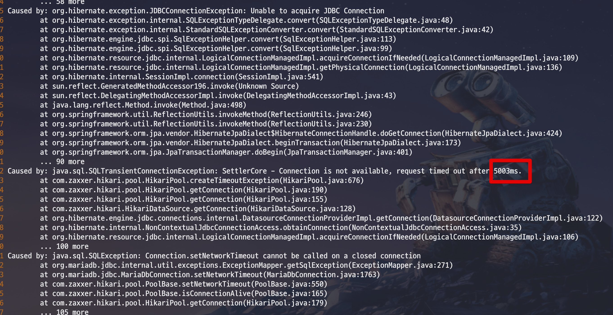

# HikariCP에서 validationTimeout이 connectionTimeout보다 클 경우

* connectTimeout: 1000
* socketTimeout: 600000
* idleTimeout: 300000      #5m
* maxLifetime: 590000     #9m 50s
  * (MySQL) wait_timeout:  
* connectionTimeout: 3000 # 3s

maxLifetime과 wait_timeout 시간에 무관하게 이슈 발생

This property controls the maximum amount of time that a connection will be tested for aliveness. This value must be less than the connectionTimeout. Lowest acceptable validation timeout is 250 ms. Default: 5000