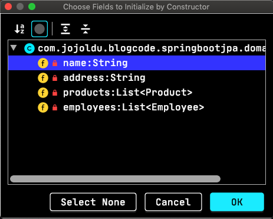
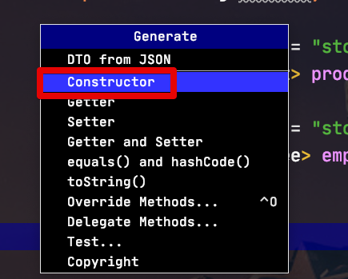
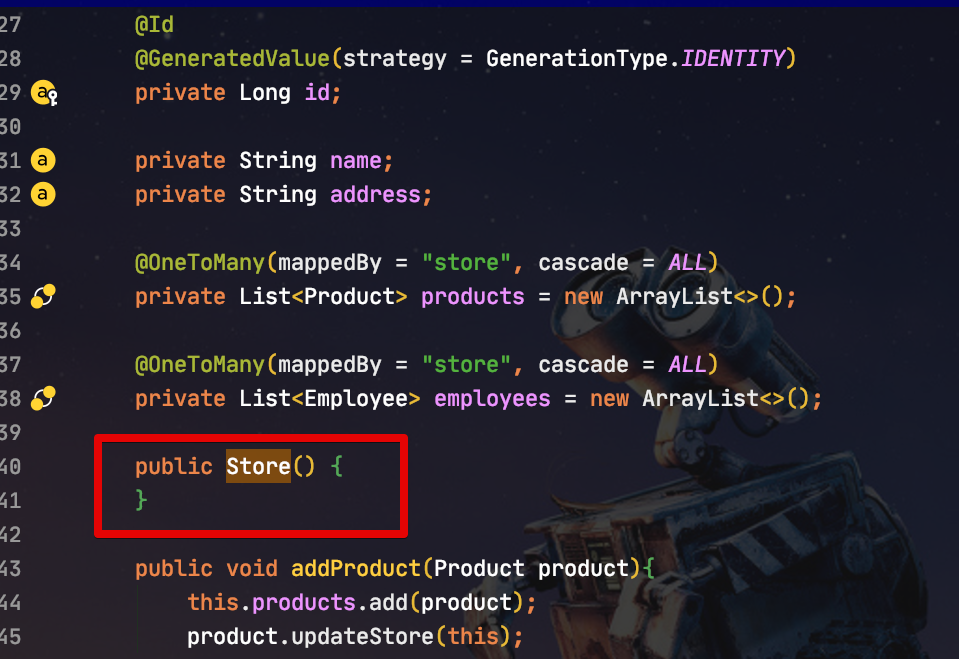
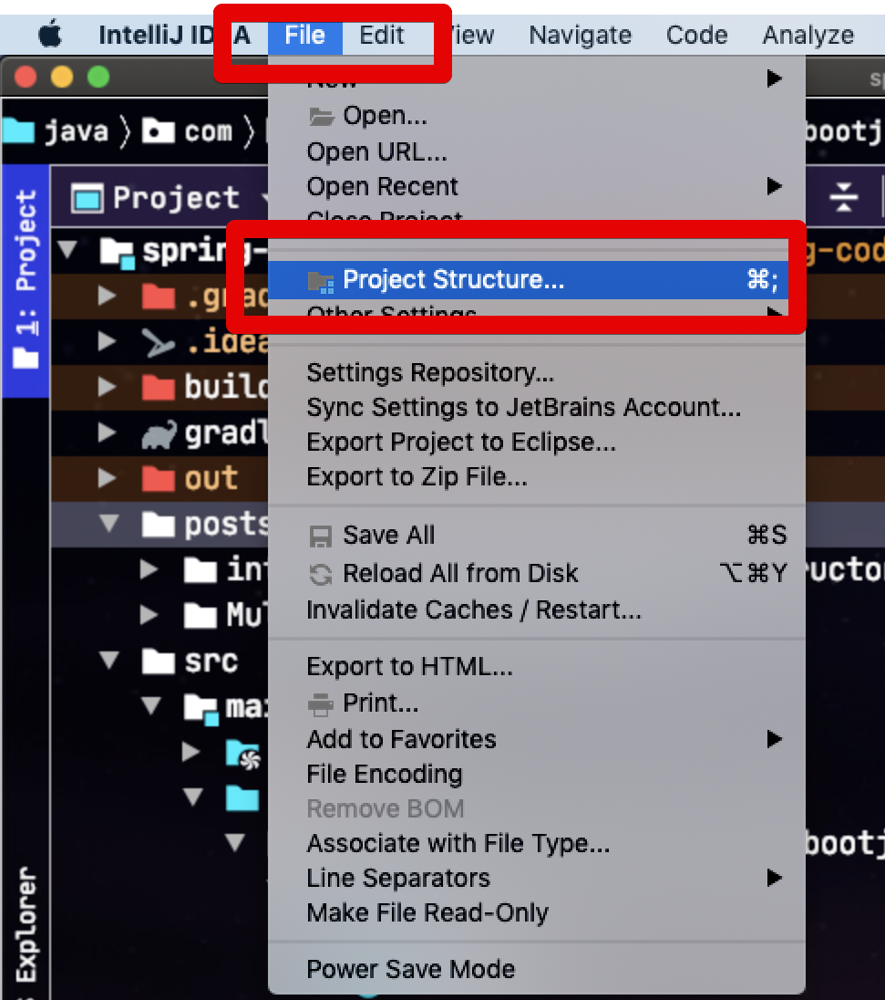
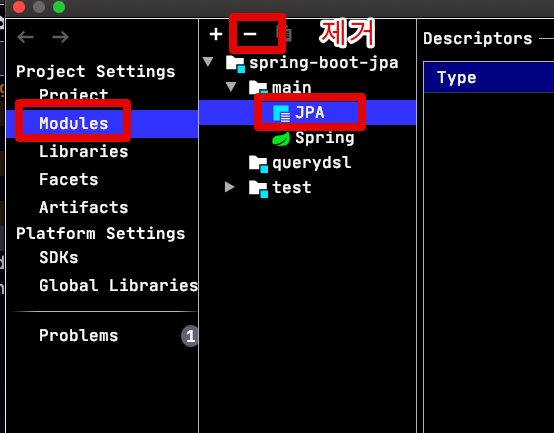
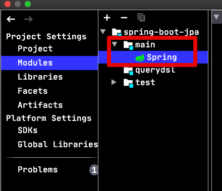
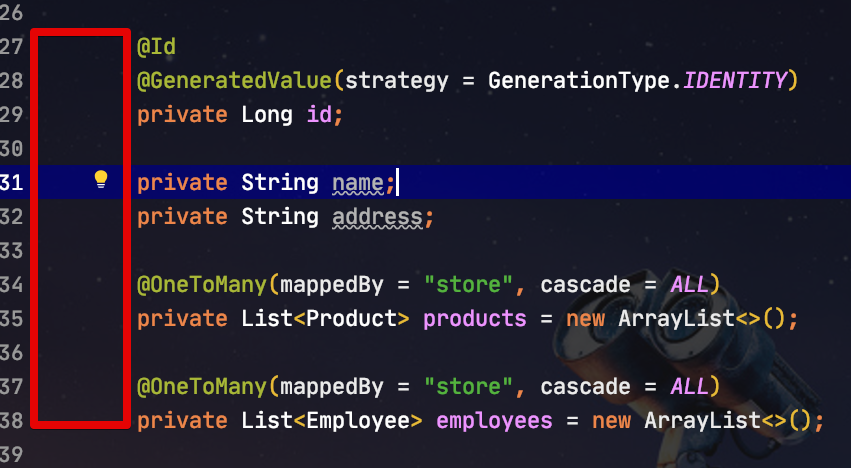

# IntelliJ 2019.3 부터 발생하는 @Entity 선언시 기본 생성자만 Generate 에 노출되는 이슈

IntelliJ 2019.3 부터 ```javax.persistence.Entity``` 어노테이션이 선언된 클래스에서는 **기본생성자만 자동생성** 되는 이슈가 발견되었습니다.  
즉, 아래와 같이 선언된 클래스는


Generate 옵션에서 생성자 (Constructor) 를 선택하면 아래와 같이 필드를 선택해서 생성자가 만들어지지 않고



무조건 **기본 생성자만** 생성 됩니다.



**다른 옵션을 선택할 수가 없습니다**.

  
  
관련해서 이미 Youtrack에는 이슈가 올라왔는데, 아직 해결이 안된 상태입니다.

> [GenerateConstructor: Constructor Already Exists error. Can not create customize constructor](https://youtrack.jetbrains.com/issue/IDEA-228014)

그래서 버그 픽스가 되기전까지 임시방편으로 해결할 수 있는 방법을 소개 드립니다.  
    
## 해결책

결국 해당 이슈가 IntelliJ가 JPA 기능을 서포트하는 곳에서 이슈가 나는 것인데요.  
그래서 해당 서포트 기능을 OFF 하면 일단은 정상적으로 작동합니다.  
  
File -> Project Structure 로 이동합니다.



그리고 Project Settings -> Modules로 이동하신뒤 **@Entity를 사용하는 모듈**에 포함된 **JPA 옵션을 제거**합니다.

> 해당 옵션은 JPA를 사용하는 모듈에는 자동 추가됩니다.



제거 하시면 아래와 같이 JPA 옵션이 없어진 것을 확인할 수 있습니다.



JPA 서포트를 제거했으니 해당 Entity에서는 더이상 JPA 필드와 관련된 아이콘들이 등장하지 않게 됩니다.



> 즉, IntelliJ에서 사전에 양방향 관계에서 매핑되지 않은게 있을 경우 Warning 표기를 해주는 등의 체크가 안됨을 의미합니다. 

그리고 다시 Constructor 생성을 진행해보면?


정상적으로 필드들을 선택해서 생성자를 만들수 있습니다.


일단 저는 신규 프로젝트 진행중이라 Entity 생성할일이 빈번하여, 해당 옵션을 제거하는게 더 낫다는 판단하에 제거하여 사용중입니다.  
혹시나 같은 이슈가 있으신 분들은 비교해보시고 옵션을 제거할지/유지할지 선택하시면 될것 같습니다.

> 어서 빨리 이슈가 해결되길 바래야죠 ㅠ