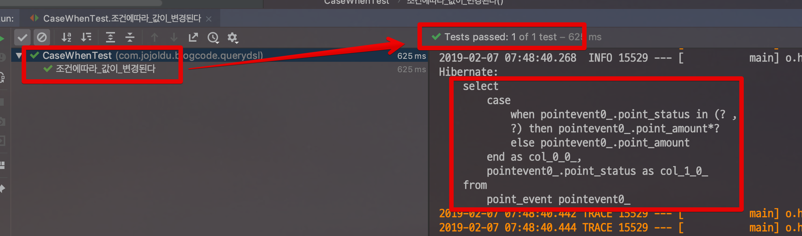

# [Querydsl] Case When 사용하기

안녕하세요? 이번 시간엔 spring-boot-querydsl 예제를 진행해보려고 합니다.  
모든 코드는 [Github](https://github.com/jojoldu/blog-code/tree/master/spring-boot-querydsl)에 있기 때문에 함께 보시면 더 이해하기 쉬우실 것 같습니다.  
(공부한 내용을 정리하는 [Github](https://github.com/jojoldu/blog-code)와 세미나+책 후기를 정리하는 [Github](https://github.com/jojoldu/review), 이 모든 내용을 담고 있는 [블로그](http://jojoldu.tistory.com/)가 있습니다. )<br/>

## 본문

MyBatis로 사용하던 쿼리를 Querydsl로 전환하는 과정에서 만나는 여러 문제중 Case When도 있습니다.  

물론 **Case When은 안티 패턴**이라 생각합니다.
좋은 구조라면 어플리케이션에서 비지니스 로직을 처리해야하기 때문에 이왕 마이그레이션 한다면 이런 로직 역시 어플리케이션으로 옮기시는걸 추천합니다.  
  
하지만, 그 방법이 어렵다면 Querydsl에서 Case When을 쓰셔야겠죠?  
Querydsl에서 Case When은 아래와 같이 쓸수 있습니다.

```java
@RequiredArgsConstructor
public class PointEventRepositoryImpl implements PointEventRepositoryCustom {

    private final JPAQueryFactory queryFactory;

    @Override
    public List<PointCalculateAmount> calculateAmounts() {
        return queryFactory
                .select(Projections.fields(PointCalculateAmount.class,
                        new CaseBuilder()
                                .when(pointEvent.pointStatus.in(PointStatus.USE, PointStatus.USE_CANCEL))
                                .then(pointEvent.pointAmount.multiply(-1))
                                .otherwise(pointEvent.pointAmount).as("pointAmount"),
                        pointEvent.pointStatus
                ))
                .from(pointEvent)
                .fetch();
    }
}
```

* ```CaseBuilder```를 통해 CaseWhen 문법 시작
* ```when```: 조건문
* ```then```: ```when```절이 ```true```일 경우 실행
* ```otherwise```: ```when```절이 ```false```일 경우 실행
* ```otherwise```가 끝나면 결과 물에 대한 alias(```as```) 적용
    * 일반적으로는 Entity의 필드명이 자동으로 as 적용됨
    * 하지만 ```CaseBuilder```를 통해 계산한 결과물은 필드명이 없음
    * alias 하지 않으면 결과물 필드가 어떤 필드로 가야할지 명시되지 않아 **오류가 발생**
  
이제 이 코드가 정상적으로 작동하는지도 한번 테스트 해보겠습니다.  
테스트 코드는 아래와 같습니다.

```java
@RunWith(SpringRunner.class)
@SpringBootTest
public class CaseWhenTest {

    @Autowired
    private PointEventRepository pointEventRepository;

    @After
    public void tearDown() throws Exception {
        pointEventRepository.deleteAll();
    }

    @Test
    public void 조건에따라_값이_변경된다() {
        //given
        long usePointAmount = 500;
        long useCancelPointAmount = -900;
        pointEventRepository.saveAll(
                Arrays.asList(
                        new PointEvent(PointStatus.EARN, 100),
                        new PointEvent(PointStatus.USE, usePointAmount),
                        new PointEvent(PointStatus.USE_CANCEL, useCancelPointAmount)
                ));
        //when
        List<PointCalculateAmount> result = pointEventRepository.calculateAmounts();
        result.sort(Comparator.comparingLong(PointCalculateAmount::getPointAmount));

        //then
        assertThat(result.get(0).getPointStatus(), is(PointStatus.USE));
        assertThat(result.get(0).getPointAmount(), is(-usePointAmount)); // 500원이 -500원으로

        assertThat(result.get(1).getPointStatus(), is(PointStatus.EARN));
        assertThat(result.get(1).getPointAmount(), is(100L));

        assertThat(result.get(2).getPointStatus(), is(PointStatus.USE_CANCEL));
        assertThat(result.get(2).getPointAmount(), is(-useCancelPointAmount)); // -900 원이 900원으로

    }
}
```

이 코드를 수행해보면 아래와 같이 정상적으로 쿼리가 생성되고 실행되는 것을 확인할 수 있습니다.

