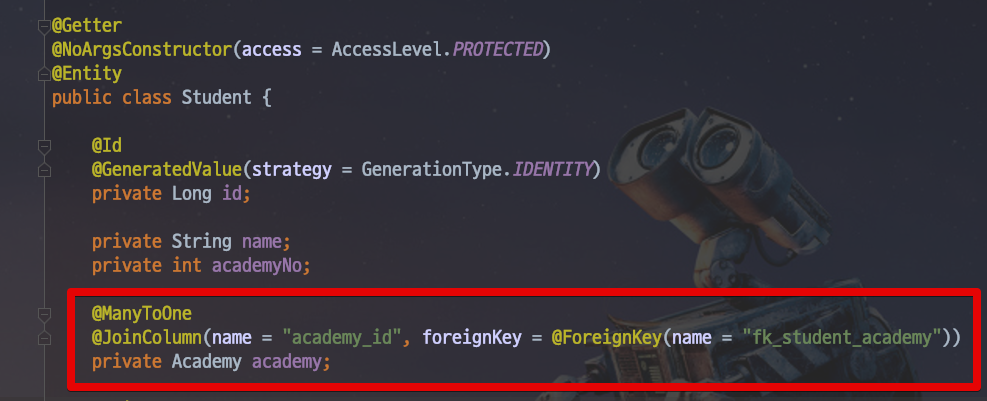
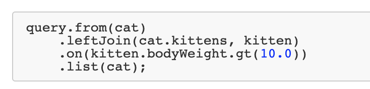
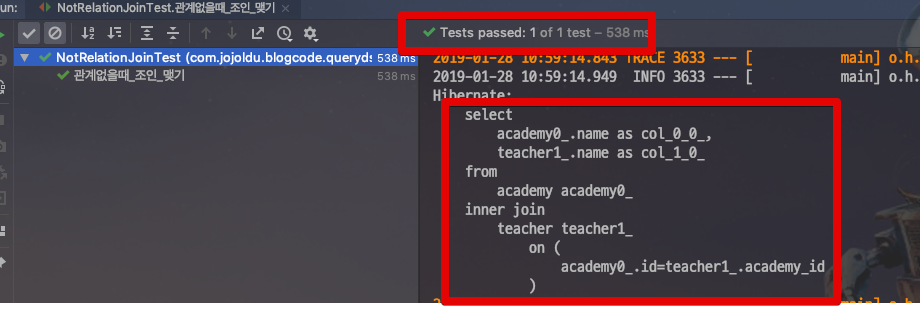

# [Querydsl] 연관관계 없이 Join 조회하기

안녕하세요? 이번 시간엔 Querydsl에서 연관관계 없이 Join 조회하기 예제를 진행해보려고 합니다.  
모든 코드는 [Github](https://github.com/jojoldu/blog-code/tree/master/spring-boot-querydsl)에 있기 때문에 함께 보시면 더 이해하기 쉬우실 것 같습니다.  
(공부한 내용을 정리하는 [Github](https://github.com/jojoldu/blog-code)와 세미나+책 후기를 정리하는 [Github](https://github.com/jojoldu/review), 이 모든 내용을 담고 있는 [블로그](http://jojoldu.tistory.com/)가 있습니다. )<br/>
 

## 본문

많은 분들이 Querydsl 대신에 Jooq를 사용하는 이유로 Querydsl은 **연관 관계(```relationship```) 없이는 조인을 맺지 못하기** 때문이라고 합니다.  
  
연관 관계란 아래와 같이 관계가 맺어져있는 것을 얘기합니다.  



실제로 Querydsl의 **예전 버전들에서는 지원이 안됐습니다**.  
(정확히 몇 버전부터인지는 잊어먹어서 ㅠㅠ)  
  
하지만 요즘 버전들에서는 **연관 관계 없이 조인이 되는 기능을 지원**합니다.  
  
아래와 같이 ```join(엔티티).on(키.eq(키))``` 로 SQL과 유사한 형태로 작성이 가능합니다.  


```java
    @Override
    public List<AcademyTeacher> findAllAcademyTeacher() {
        return queryFactory
                .select(Projections.fields(AcademyTeacher.class,
                        academy.name.as("academyName"),
                        teacher.name.as("teacherName")
                ))
                .from(academy)
                .join(teacher).on(academy.id.eq(teacher.academyId))
                .fetch();
    }
```

어렵지 않죠?  
이외에도 아래와 같이 동적인 조건을 넣어서도 조인이 가능합니다.


  
자 그럼 위 코드가 정상적으로 작동하는지 테스트에서 확인해보면!

```java
@Test
    public void 관계없을때_조인_맺기() {
        //given
        String academyName = "name";
        academyRepository.saveAll(Arrays.asList(
                new Academy(academyName, "", ""),
                new Academy("not target", "", "")
        ));

        String teacherName = "teacher";
        teacherRepository.save(new Teacher(teacherName, "Java", 1L));

        //when
        List<AcademyTeacher> academyTeachers = academyRepository.findAllAcademyTeacher();

        //then
        assertThat(academyTeachers.size(), is(1));
        assertThat(academyTeachers.get(0).getAcademyName(), is(academyName));
        assertThat(academyTeachers.get(0).getTeacherName(), is(teacherName));
    }
```

아래와 같이 정상적으로 작동하는 것을 확인할 수 있습니다.



이젠 연관 관계가 없어 Querydsl를 사용하지 않을 이유가 없겠죠?