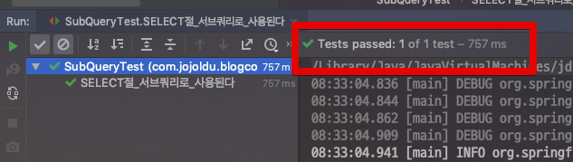

# Querydsl Sub query (서브쿼리)

안녕하세요!  
이번 시간에는 Querydsl에서의 Subquery 기본 가이드를 진행합니다.  
  
개인적으로 ORM을 사용하며, 객체지향적으로 엔티티가 구성되어있으면 서브쿼리가 필요한 일은 거의 없다고 생각하는데요.  
  
혹시나 필요한 분들이 계시면 도움이 되셨으면 합니다.  
  
그럼 시작합니다!

> 모든 코드는 [Github](https://github.com/jojoldu/blog-code/tree/master/spring-boot-querydsl)에 있으니 참고하세요 :)

## 1. select Sub Query

첫번째는 ```select```절의 서브쿼리입니다.  
도메인에 대한 설명보다는 Querydsl 코드가 좀 더 도움이 되실것 같아 코드로 바로 설명드리겠습니다.

> Spring Data Jpa에서 Querydsl 적용을 어떻게 하는지는 [이전 포스팅](https://jojoldu.tistory.com/372)을 참고해보세요 :)

Querydsl의 코드는 아래와 같습니다.  
여기서 주의깊게 봐야할 코드는 ```ExpressionUtils.as()``` 입니다.

```java
@Override
    public List<StudentCount> findAllStudentCount() {
        return queryFactory
                .select(Projections.fields(StudentCount.class,
                        academy.name.as("academyName"),
                        ExpressionUtils.as(
                                JPAExpressions.select(count(student.id))
                                        .from(student)
                                        .where(student.academy.eq(academy)),
                                "studentCount")
                ))
                .from(academy)
                .fetch();
    }
```

ExpressionUtils은 **Querydsl 내부에서 새로운 Expression**을 사용할 수 있도록 지원합니다.  
여기서 **as를 통해 서브쿼리의 결과물을 alias** 시킵니다.  
  
실제로 아래와 같이 테스트 코드를 작성해서

```java
@RunWith(SpringRunner.class)
@SpringBootTest
public class SubQueryTest {

    @Autowired
    private AcademyRepository academyRepository;

    @Autowired
    private StudentRepository studentRepository;

    @After
    public void tearDown() throws Exception {
        studentRepository.deleteAll();
        academyRepository.deleteAll();
    }

    @Test
    public void SELECT절_서브쿼리로_사용된다() {
        //given
        String academyName1 = "name1";
        Academy academy1 = Academy.builder()
                .address("address1")
                .name(academyName1)
                .build();

        academy1.addStudent(Arrays.asList(
                new Student("student1", 1),
                new Student("student2", 2)
        ));

        String academyName2 = "name2";
        Academy academy2 = Academy.builder()
                .address("address2")
                .name(academyName2)
                .build();

        academy2.addStudent(Arrays.asList(
                new Student("student3", 3),
                new Student("student4", 4),
                new Student("student5", 5)
        ));

        academyRepository.saveAll(Arrays.asList(academy1, academy2));

        //when
        List<StudentCount> result = academyRepository.findAllStudentCount();

        //then
        assertThat(result.get(0).getAcademyName(), is(academyName1));
        assertThat(result.get(1).getAcademyName(), is(academyName2));
    }
}
```

그리고 테스트를 수행해보면!



아주 잘 수행되는 것을 확인할 수 있습니다.  
select절의 서브쿼리가 잘 된거겠죠?

## 2. where Sub Query

두번째로는 ```where```절의 서브쿼리입니다.  
상당히 자주 쓰는 방식이라고 생각합니다.  

> 실제로 레거시 코드를 까보면 쿼리매퍼들 (MyBatis 등) 에서 정말 많이들 사용하고 계셨더라구요

사용하는 방법은 다음과 같습니다.

```java
    @Override
    public List<Academy> findAllByStudentId(long studentId) {
        return queryFactory
                .selectFrom(academy)
                .where(academy.id.in(
                        JPAExpressions
                                .select(student.academy.id)
                                .from(student)
                                .where(student.id.eq(studentId))))
                .fetch();
    }
```

앞서 ```select```와 달리 

```java
@Test
    public void WHERE절_서브쿼리로_사용된다() {
        //given
        String academyName1 = "name1";
        Academy academy1 = Academy.builder()
                .address("address1")
                .name(academyName1)
                .build();

        academy1.addStudent(Arrays.asList(
                new Student("student1", 1),
                new Student("student2", 2)
        ));

        String academyName2 = "name2";
        Academy academy2 = Academy.builder()
                .address("address2")
                .name(academyName2)
                .build();

        academy2.addStudent(Arrays.asList(
                new Student("student3", 3),
                new Student("student4", 4),
                new Student("student5", 5)
        ));

        academyRepository.saveAll(Arrays.asList(academy1, academy2));

        //when
        List<Academy> result = academyRepository.findAllByStudentId(3);

        //then
        assertThat(result.size(), is(1));
        assertThat(result.get(0).getName(), is(academyName2));
    }
```


## Tip

개인적으로 Subquery는 쿼리에서의 **안티패턴**이라고 생각합니다.  
레거시 시스템을 (ex: mybatis 혹은 프로시져) Querydsl로 마이그레이션 해야하고, 개발일정이 너무나 빠듯하다면 한번 고려해봐도 될것 같습니다.  
  
하지만 개인적으로는 Subquery가 필요하다면

* Join으로 해결할순 없는지
* 어플리케이션에서 처리할순 없는지
* 쿼리를 나눠서 실행할순 없는지

등을 고려해봅니다.  
  
실제 성능상으로도 Subquery가 대부분의 경우에 더 느리니 한번 고려해보시길 추천합니다.  

## 참고

Querydsl은 **From절에서의 Subquery를 지원하지 않습니다**.

* [참고](https://github.com/querydsl/querydsl/issues/2185)