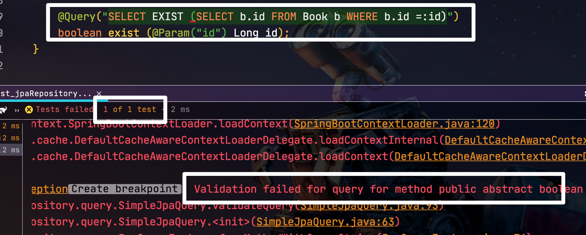
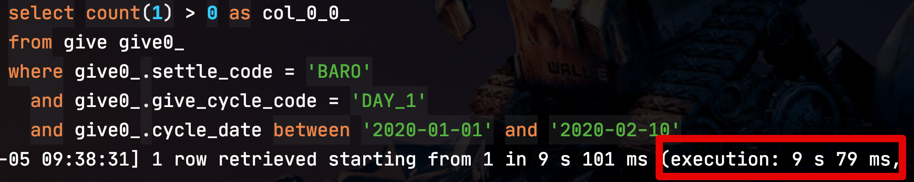
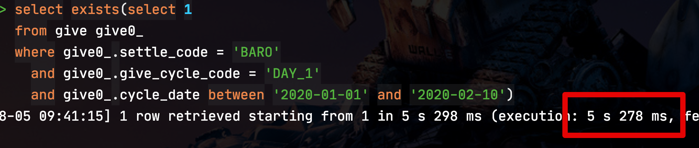
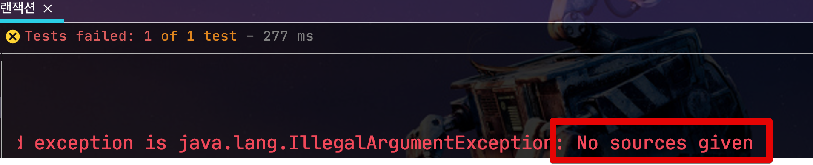
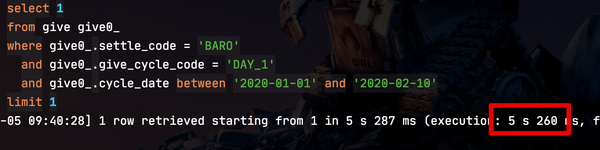

# JPA Exist 쿼리 성능 개선

Spring Data Jpa를 사용하다보면 해당 조건의 데이터가 존재하는지 확인 하기 위해 ```exists``` 쿼리가 필요할때가 많습니다.  
  
간단한 쿼리의 경우엔 아래와 같이 메소드로 쿼리를 만들어서 사용하는데요.  

```java
boolean existsByName(String name);
```

조금이라도 복잡하게 되면 메소드명으로만 쿼리를 표현하기는 어렵습니다.  

> 조건문이 3개 이상이거나, 필드명이 너무 길거나 조건문 자체가 복잡하는 등등
  
그래서 이런 경우엔 보통 ```@Query``` 를 사용하는데요.  
  
다만 이럴 경우 JPQL에서 **select의 exists 를 지원하지 않습니다**.  (```select exists``` 문법)

> 단, where의 exists는 지원합니다.



그래서 ```exists``` 를 우회하기 위해 아래와 같이 **count** 쿼리를 사용합니다. 

```java
@Query("SELECT COUNT(o.id) > 0 " +
        "FROM Order o " +
        "WHERE o.txDate =:txDate")
    boolean exists(@Param("txDate") LocalDate txDate);
```

이 방식은 성능상 이슈가 있는데요.  
하나씩 어떤 이슈가 있는지 확인해보겠습니다.

## 1. count vs exists

SQL로 직접 ```count``` 와 ```exists```로 성능 비교를 해보시면 큰 차이를 느끼실 수 있는데요.  
  
5600만건 정도 쌓여있는 테이블을 기준으로 ```count```와 ```exists```를 수행해보면 다음의 성능 차이를 확인할 수 있습니다.

**count**



* 9.079초

**exists**



* 5.278초

거의 2배에 가까운 성능 차이를 확인할 수 있습니다.  
데이터가 더 늘어서 1억건이 넘는다면 차이는 더 벌어지겠죠?  
  
왜 이렇게 성능 차이가 날까요?  
이는 ```exists```는 **첫번째 결과에서 바로** ```true``` 를 리턴하면 되지만, ```count```의 경우엔 결국 **총 몇건인지 확인하기 위해** 전체를 확인해봐야하기 때문에 성능 차이는 당연할 수 밖에 없습니다.

> 참고: [JOOQ 블로그 - Avoid Using COUNT() in SQL When You Could Use EXISTS()](https://blog.jooq.org/2016/09/14/avoid-using-count-in-sql-when-you-could-use-exists/)

위 결과로 ```count``` 의 성능 이슈를 확인 하였습니다.  
여기서 ```@Query```에서 ```exists```를 사용할 수 없으니 Querydsl로 대체할 수 있는지 확인해보겠습니다.

### Querydsl에서 exists?

자 그럼 아래 ```exists``` 쿼리를 

```sql
select exists (select 1
                from book
                where id = :id
)
```

Querydsl로 표현해보겠습니다.

```java
public Boolean exist(Long bookId) {

    return queryFactory.select(queryFactory
            .selectOne()
            .from(book)
            .where(book.id.eq(bookId))
            .fetchAll().exists())
            .fetchOne();

}
```

컴파일 에러는 안나지만 실제로 수행 해보시면 Querydsl에서는 **from절 없이는 쿼리를 생성할 수 없습니다**.  



from 절을 붙이게 되면 기존의 exists 로 개선 효과를 전혀 볼 수 없으니 다른 방법으로 우회가 필요합니다.

## 2. limit 1 로 개선하기

exists가 count보다 성능이 좋은 이유가 결국 **전체를 조회하지 않고 첫번째 결과만 확인**하기 때문입니다.  
  
그래서 이걸 직접 구현해서 해결하겠습니다.  
즉, ```limit 1```로 1개만 조회하고 이게 있는지 없는지로 판단하는 것입니다.  
  
Querydsl로 표현하면 아래처럼 됩니다.

```java
public Boolean exist(Long bookId) {
    Integer fetchOne = queryFactory
            .selectOne()
            .from(book)
            .where(book.id.eq(bookId))
            .fetchFirst(); // limit 1

    return fetchOne > 0; // 1개가 있는지 없는지 판단
}
```

> ```fetchFirst()``` 는 내부적으로 ```limit(1).fetchOne()``` 로 되어있습니다.

처음 성능 테스트했던 테이블에 그대로 위 쿼리를 사용해보면?



exists와 동일한 성능 효과를 볼 수 있습니다.  
  
즉, **exists 가 필요한 경우엔 limit 1**로 대체가 가능합니다.

### 추가

메소드 쿼리의 ```exists```는 위와 같이 limit으로 쿼리 최적화를 내부적으로 하고 있습니다.  


간단한 조건의 exists가 필요하면 메소드 쿼리로 구현해도 된다는 것을 알 수 있습니다.

## 3. 정리

* ```count```는 ```exists```에 비해 성능상 이슈가 있다.
  * 그러나 ```@Query```와 Querydsl에서는 ```select exists```를 사용할 수가 없다.
* 그래서 ```select exists```를 ```limit 1``` 로 대체해서 사용한다.
* 단, JpaRepository의 메소드 쿼리에선 내부적으로 ```limit 1```를 사용하고 있어서 성능상 이슈가 없다.