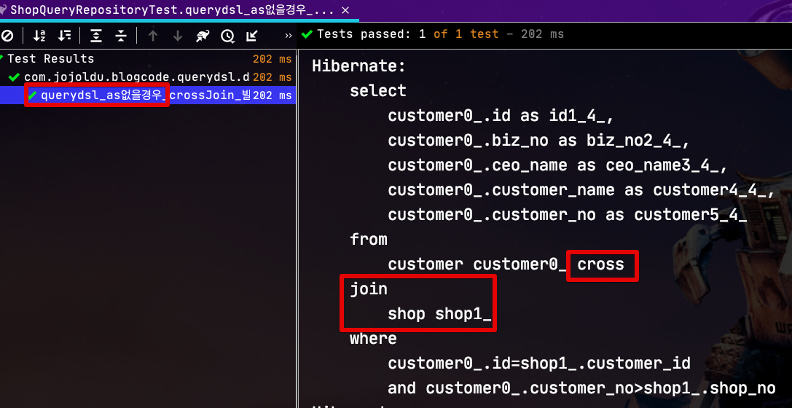
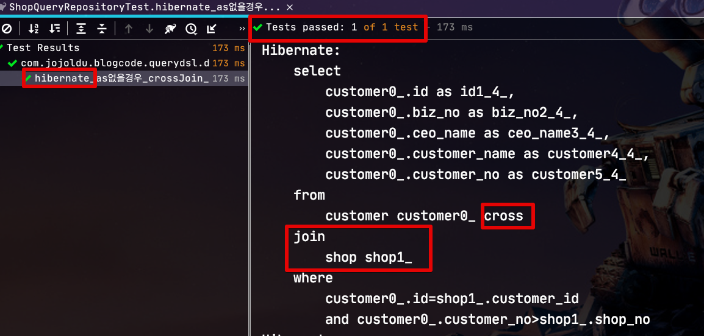
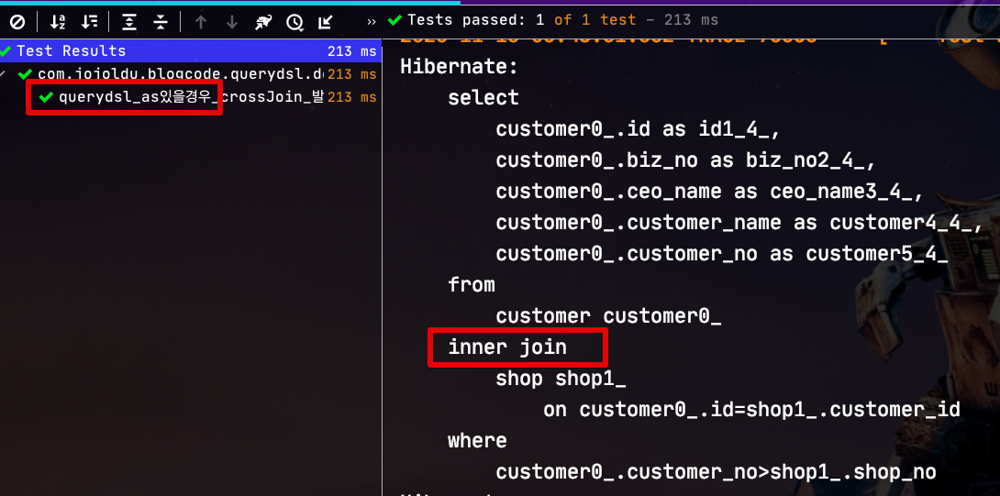
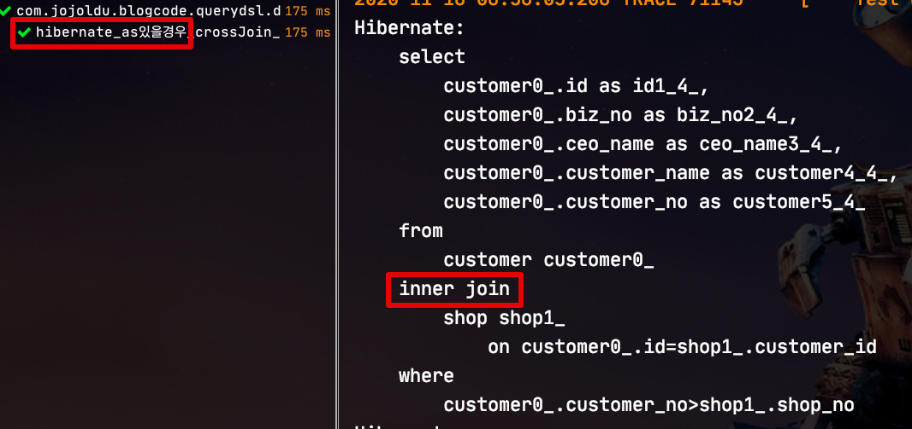
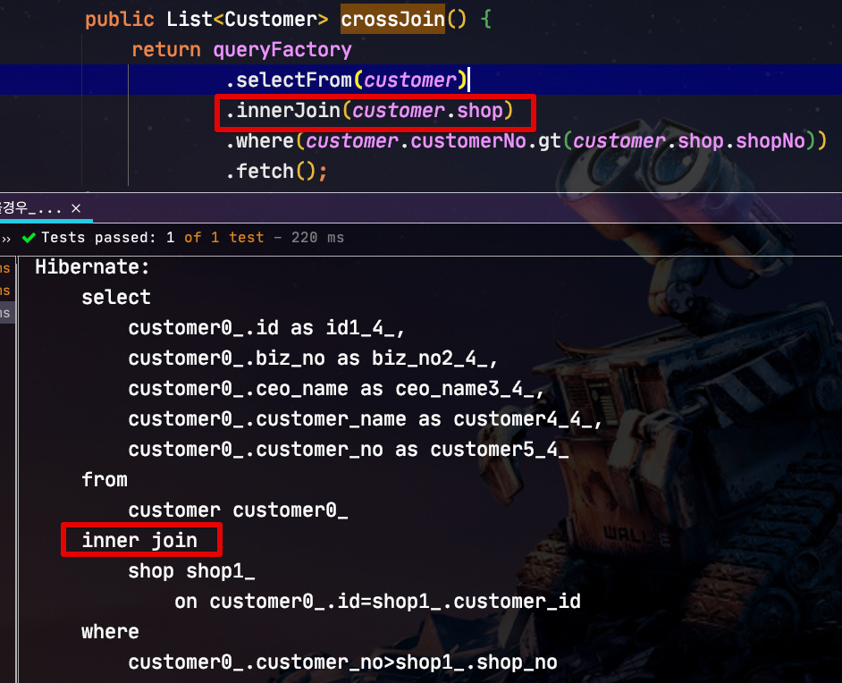

# Querydsl (JPA) 에서 Cross Join 주의

JPA 기반의 환경에서 Querydsl를 사용하다보면 ```@OneToOne``` 관계에서 Join 쿼리 작성시 주의하지 않으면 **Cross Join**이 발생할 수 있습니다.  
  
> [CrossJoin](https://www.sqlshack.com/sql-cross-join-with-examples/) 이란 집합에서 나올 수 있는 모든 경우를 이야기 합니다.  
> 예로 A 집합 {a, b}, B 집합 {1,2,3}이며 이들의 CrossJoin은 AxB로 다음과 같습니다.  
> {(a, 1), (a, 2), (a, 3), (b, 1), (b, 2), (b, 3)}  
> 당연히 일반적인 Join보다 성능상 이슈가 발생하게 됩니다.

이번 시간에는 어떤 경우에 이런 Cross Join이 발생하는지, 어떻게 해결할 수 있는지 확인해보겠습니다.

> 모든 코드는 [Github](https://github.com/jojoldu/blog-code/tree/master/spring-boot-querydsl/src/main/java/com/jojoldu/blogcode/querydsl/domain/ad)에 있습니다.

## 1. 테스트 환경

테스트 환경은 다음과 같습니다.

* Spring Boot Data JPA 2.3.2
* Querydsl 4.3.1

테스트할 Entity는 다음과 같습니다.  
  
**Customer**

```java
@Entity
@Getter
@NoArgsConstructor
public class Customer {

    @Id
    @GeneratedValue(strategy = GenerationType.IDENTITY)
    private Long id;

    private String customerNo;  //거래처번호(업주번호)
    private String customerName; //거래처명(상호)
    private String bizNo; //사업자번호
    private String ceoName; //대표자명

    @OneToOne(mappedBy = "customer")
    private Shop shop;
}
```

**Shop**

```java
@Entity
@Getter
@NoArgsConstructor
public class Shop {

    @Id
    @GeneratedValue(strategy = GenerationType.IDENTITY)
    private Long id;

    private String shopNo;
    private String shopName;

    @OneToOne
    @JoinColumn(name = "customer_id")
    private Customer customer;
}
```

Customer와 Shop은 **OneToOne** 관계이며, FK는 Shop이 가지고 있습니다.  
  
자 그럼 실제 테스트를 진행해보겠습니다.

## 2. 테스트

Querydsl 코드는 다음과 같습니다.

```java
public List<Customer> crossJoin() {
    return queryFactory
            .selectFrom(customer)
            .where(customer.customerNo.gt(customer.shop.shopNo))
            .fetch();
}
```

주의 깊게 보셔야할 점은 **별도의 join절이 선언되어 있지 않고** where문에서 바로 연관관계 (```customer.shop.shopNo```) 를 사용한다는 점인데요.  
이렇게 작성할 경우 Cross Join이 발생합니다.  



이는 바로 Querydsl-JPA에서 사용하는 JPQL의 내부 구현체 (Hibernate) 가 가진 특징때문인데요.  
Hibernate의 경우 암묵적인 조인은 Cross Join을 사용하는 경향이 있습니다.  
그래서 실제로 위 코드는 Querydsl 뿐만 아니라 **Spring Data JPA**에서도 동일하게 재현 됩니다.

```java
public interface CustomerRepository extends JpaRepository<Customer, Long> {
    @Query("SELECT c " +
            "FROM Customer c " +
            "WHERE c.customerNo > c.shop.shopNo")
    List<Customer> crossJoin();
}
```



> 비슷하게 이미 [Github Issue](https://github.com/querydsl/querydsl/issues/2182#issuecomment-707867112) 에도 올라와 있으니 참고해보셔도 좋습니다.

## 3. 해결책

해결책은 간단합니다.  
암묵적 Join에서 **명시적 Join**으로 변경하는 것인데요.  
  
**Querydsl**

```java
public List<Customer> notCrossJoin() {
    return queryFactory
            .selectFrom(customer)
            .innerJoin(customer.shop, shop) // 명시적 Join
            .where(customer.customerNo.gt(shop.shopNo))
            .fetch();
}
```

보시는것처럼 ``` .innerJoin(customer.shop, shop)``` 을 추가하여 명시적으로 Join문을 선언하시면 원하는 대로 Join이 발생합니다.



동일하게 Spring Data JPA 에서도 명시적으로 Join문을 사용하시면 됩니다.

**Spring Data JPA**

```java
@Query("SELECT c " +
        "FROM Customer c " +
        "JOIN c.shop s " + // 명시적 Join
        "WHERE c.customerNo > s.shopNo")
List<Customer> notCrossJoin();
```



## 4. 참고

보시는 분들 중에 ```alias```가 굳이 필요한가? 라고 의문이 있으실수 있는데요.  
즉, ```.innerJoin(customer.shop, shop)``` 대신에 ```.innerJoin(customer.shop)```만 선언해도 되는게 아닐까 하는 의문입니다.  
  
최근 Hibernate에서는 재현되지 않지만, (구) 버전에서는 아래와 같이 **as를 선언하지 않은 경우**에는 무조건 Cross Join이 발생합니다.

```java
.selectFrom(customer)
.innerJoin(customer.shop) // as 없는 Join
.where(customer.customerNo.gt(customer.shop.shopNo)) // as 없는 Join
.fetch()
```

하지만 최근 버전에서는 해당 문제가 해결되었습니다.



다만, **버전에 관계 없이** 명시적으로 Join을 사용하시려면 편하게 ```as```를 선언하시는게 좋기 때문에 항상 추천합니다.