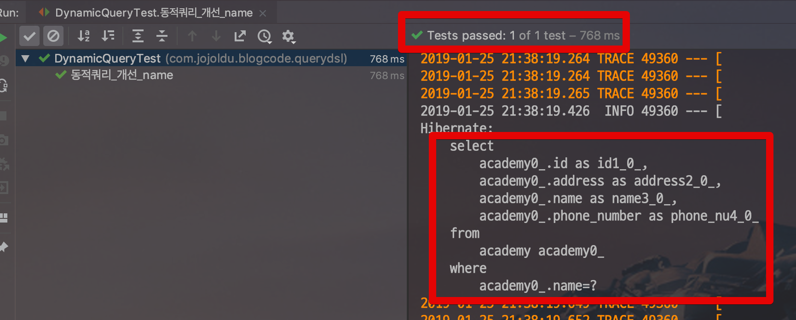

# Querydsl 다이나믹 쿼리 사용하기

안녕하세요!  
이번 시간에는 Querydsl에서의 다이나믹 쿼리를 어떻게 작성하면 좋을지에 대해 진행합니다.  
처음 Querydsl을 쓰시는 분들이 가장 많이 실수하는 부분이니 
  
그럼 시작합니다!

> 모든 코드는 [Github](https://github.com/jojoldu/blog-code/tree/master/spring-boot-querydsl)에 있으니 참고하세요 :)

## 1. 문제 상황

예를 들어 **상황에 따라 조건문이 생성** 되어야 한다고 보겠습니다.  

* name이 오면 ```where name = name```
* address가 오면 ```where address = address```
* phoneNumber가 오면 ```where phoneNumber = phoneNumber```
* 2개 이상이 오면 모두 포함 ```where name = name and address = address and phoneNumber = phoneNumber```

즉, 파리미터가 어떻게 오는지에 따라 ```where```의 조건이 변경되는 것입니다.  
  
이를 해결하기 위한 방법으로 ```BooleanBuilder```를 사용하는 걸 자주 봅니다.  

사용한 코드는 아래와 같습니다.

```java
    @Override
    public List<Academy> findDynamicQuery(String name, String address, String phoneNumber) {

        BooleanBuilder builder = new BooleanBuilder();

        if (!StringUtils.isEmpty(name)) {
            builder.and(academy.name.eq(name));
        }
        if (!StringUtils.isEmpty(address)) {
            builder.and(academy.address.eq(address));
        }
        if (!StringUtils.isEmpty(phoneNumber)) {
            builder.and(academy.phoneNumber.eq(phoneNumber));
        }

        return queryFactory
                .selectFrom(academy)
                .where(builder)
                .fetch();
    }
```

예전 iBatis나 myBatis에서 사용하던것과 유사하죠?  
if문으로 필요한 부분만을 ```BooleanBuilder```에 추가하면서 쿼리를 만들었습니다.
  
이 방식의 문제점은 무엇일까요?
where문의 조건을 한눈에 보기 어렵습니다.  
즉, 전혀 **쿼리 형태를 예측하기가 어렵다**는 것입니다.  
지금은 단순한 쿼리이지만, 조금만 조건이 까다로워지면 추측하기도 힘든 쿼리가 될 것입니다.  


## 2. 해결

Querydsl의 ```where```에 조건문을 쓰되 파라미터가 비어있다면, 조건절에서 생략되길 바랍니다.  
Querydsl에서는 이럴땔 대비해서 ```BooleanExpression```을 준비했습니다.  
  
BooleanExpression은 ```where```에서 사용할 수 있는 값인데, 이 값은 ```,```를 ```and```조건으로 사용합니다.  
여기에 Querydsl의 ```where```는 **null이 파라미터로 올 경우 조건문에서 제외**합니다.  
2가지 속성을 이용해서 아래와 같이 코드를 작성할 수 있습니다.

```java
@Override
    public List<Academy> findDynamicQueryAdvance(String name, String address, String phoneNumber) {
        return queryFactory
                .selectFrom(academy)
                .where(eqName(name),
                        eqAddress(address),
                        eqPhoneNumber(phoneNumber))
                .fetch();
    }

    private BooleanExpression eqName(String name) {
        if (StringUtils.isEmpty(name)) {
            return null;
        }
        return academy.name.eq(name);
    }

    private BooleanExpression eqAddress(String address) {
        if (StringUtils.isEmpty(address)) {
            return null;
        }
        return academy.address.eq(address);
    }

    private BooleanExpression eqPhoneNumber(String phoneNumber) {
        if (StringUtils.isEmpty(phoneNumber)) {
            return null;
        }
        return academy.phoneNumber.eq(phoneNumber);
    }
```

BooleanExpression을 리턴하는데, 각 메소드에서 **조건이 맞지 않으면 ```null```을 리턴**합니다.  
null을 리턴하니 ```where```에서는 상황에 따라 조건문을 생성하게 됩니다.  
  
첫번째 코드에 비해 굉장히 명확하게 쿼리가 예측 가능하죠?  
  
실제로 잘 작동하는지 테스트 코드로 검증을 해보겠습니다.  
첫번째로 단일 조건만 생성해봅니다.

```java
@Test
    public void 동적쿼리_개선_name() {
        //given
        String targetName = "name";
        academyRepository.saveAll(Arrays.asList(
                new Academy(targetName, targetName, ""),
                new Academy("not target", "", "")
        ));

        //when
        List<Academy> academies = academyRepository.findDynamicQueryAdvance(targetName, "", "");

        //then
        assertThat(academies.size(), is(1));
        assertThat(academies.get(0).getAddress(), is(targetName));
    }
```

위 테스트 코드를 실행해보시면!



1개의 조건 (```where academy.name=?```) 만 적용되어 실행된 것을 확인할 수 있습니다.  
  
만약 여러개의 조건이 들어온다면 어떻게 될까요!?  
아래와 같이 테스트 코드를 하나더 추가해서 확인해봅니다.

```java
    @Test
    public void 동적쿼리_개선_전체() {
        //given
        String targetName = "name";
        String targetAddress = "address";
        String targetPhoneNumber = "phoneNumber";
        academyRepository.saveAll(Arrays.asList(
                new Academy(targetName, targetAddress, targetPhoneNumber),
                new Academy("", "not target", "")
        ));

        //when
        List<Academy> academies = academyRepository.findDynamicQuery(targetName, targetAddress, targetPhoneNumber);

        //then
        assertThat(academies.size(), is(1));
        assertThat(academies.get(0).getAddress(), is(targetAddress));
    }
```

이 코드 역시 결과를 보면!


3개의 조건이 모두 적용되어 있는 것을 확인할 수 있습니다.
