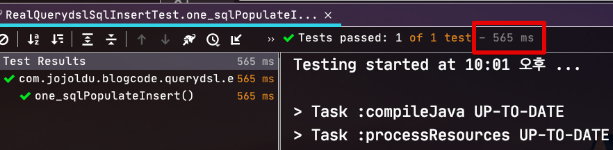
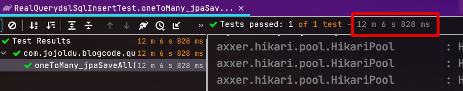
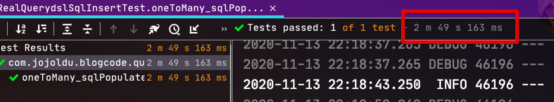

# EntityQL로 Bulk Insert 처리하기


## 단일 Entity Bulk Insert

**JPA**

1000개씩 * 10번 

```java
@Test
void one_jpaSaveAll() throws Exception {
    //when
    for (int i = 1; i <= 10; i++) {
        List<Academy> academies = new ArrayList<>();

        for (int j = 1; j <= 1_000; j++) {
            academies.add(new Academy("address", "name"));
        }

        // 1000개씩 save (Academy 1개당 Student 10개)
        academyRepository.saveAll(academies);
        log.info(i+"번째 saveAll");
    }
}
```


**Entity QL**

1000개씩 * 10번 

```java
@Test
void one_sqlPopulateInsert() throws Exception {
    for (int i = 1; i <= 10; i++) {
        SQLInsertClause insert = sqlQueryFactory.insert(qAcademy);
        for (int j = 1; j <= 1_000; j++) {
            insert.populate(new Academy("address", "name"),EntityMapper.DEFAULT).addBatch();
        }
        insert.execute();
        log.info(i+"번째 insert");
    }
}
```



## OneToMany Entity Bulk Insert

**JPA**

```java
@Test
void oneToMany_jpaSaveAll() throws Exception {
    //when
    for (int i = 1; i <= 10; i++) {
        List<Academy> academies = new ArrayList<>();

        for (int j = 1; j <= 1_000; j++) {
            Academy academy = new Academy("address", "name");
            academy.addStudent(IntStream.rangeClosed(1, 10)
                    .mapToObj(v -> new Student("student", v))
                    .collect(Collectors.toList())
            );
            academies.add(academy);
        }

        // 1000개씩 save (Academy 1개당 Student 10개)
        academyRepository.saveAll(academies);
        log.info(i+"번째 saveAll");
    }
}
```



**Entity QL**

```java
@Test
void oneToMany_sqlPopulateInsert() throws Exception {
    for (int i = 1; i <= 10; i++) {
        SQLInsertClause insert = sqlQueryFactory.insert(qStudent);
        for (int j = 1; j <= 1_000; j++) {
            Academy academy = academyRepository.save(new Academy("address", "name"));
            IntStream.rangeClosed(1, 10)
                    .forEach(n ->
                            insert.populate(new Student("student", n, academy), EntityMapper.DEFAULT)
                                    .addBatch()
                    );
        }
        insert.execute();
        log.info(i+"번째 insert");
    }
}
```

