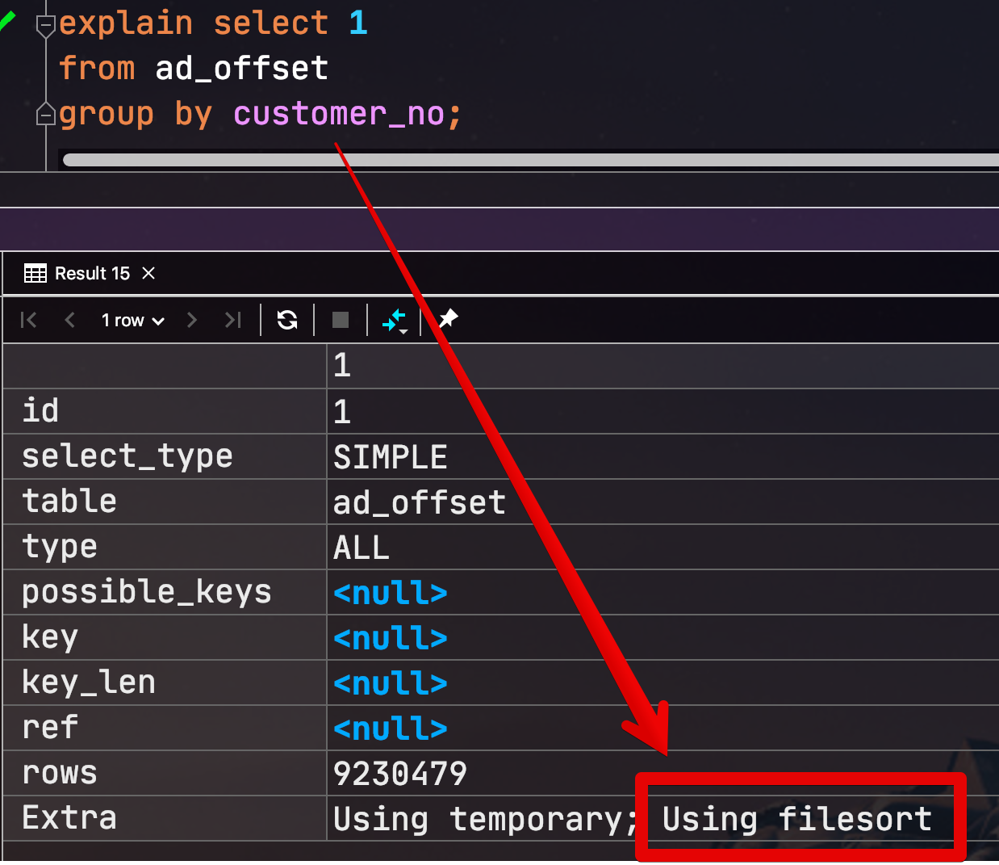
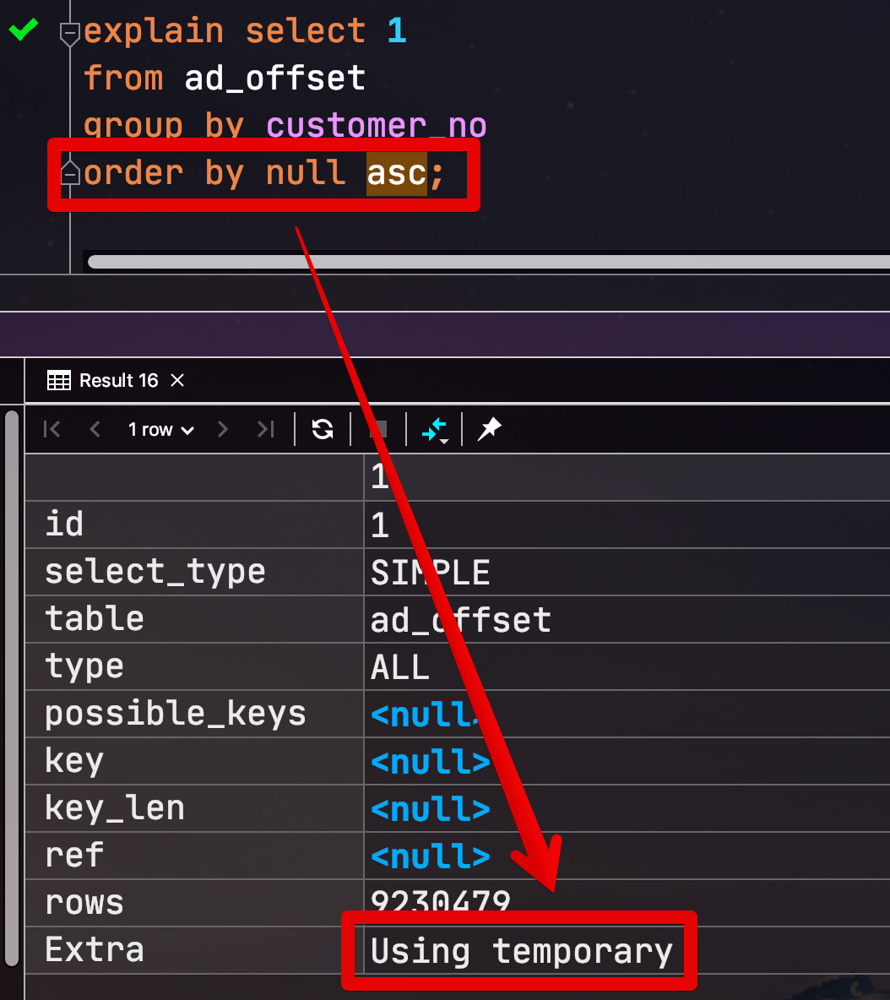
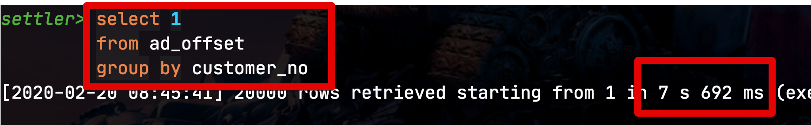
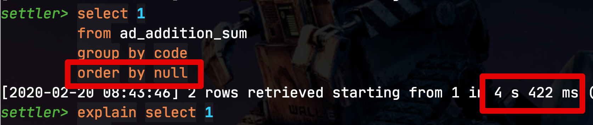
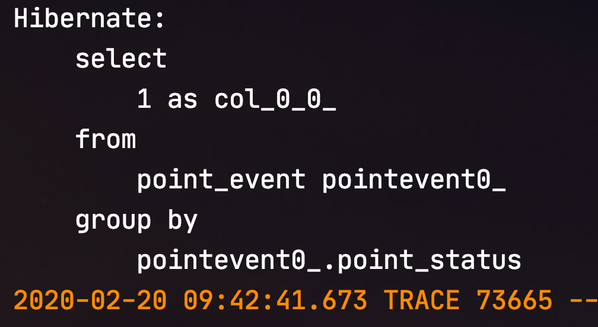
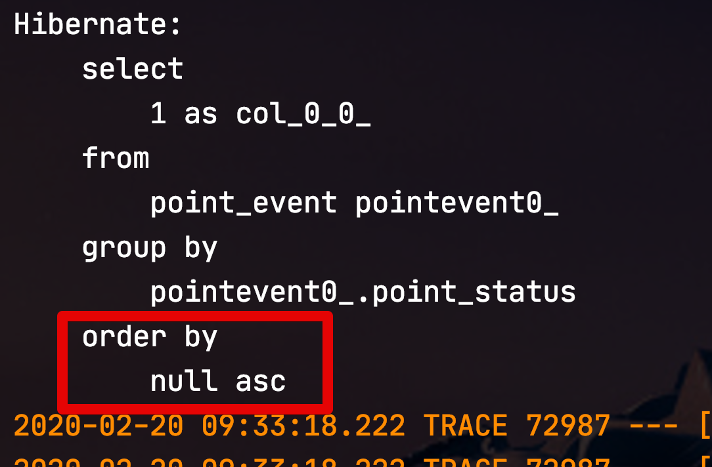

# Querydsl 에서 Group by 최적화하기 (feat. MySQL)


## 1. MySQL에선 Group by를 하면 정렬도 수행된다고?

일반적으로 MySQL 에서 Group By를 실행하면 **file sort**가 필수로 들어갑니다.  



**별도의 Order by가 쿼리에 포함되지 않았음에도** file sort가 발생하는 것이죠.  
Group by 실행시 해당 컬럼들을 기준으로 정렬이 되니 좋아보일수 있겠지만, **의도치 않게 성능 저하**가 발생하는 이유가 되기도 합니다.  

> 물론 **인덱스에 있는 컬럼**들로 Group by를 한다면 큰 문제가 되지 않습니다.  
> 인덱스로 인해서 이미 [컬럼들이 정렬](https://jojoldu.tistory.com/476)된 상태이기 때문입니다.

**정렬이 필요 없는** Group by 된 결과가 필요한 경우엔 굳이 정렬할 필요가 없겠죠?  
이 문제를 해결하는 방법이 바로 ```order by null``` 입니다.  
  
아래와 같이 ```order by null``` 을 넣으실 경우 **Group by 수행시 정렬을 하지 않습니다**.



그럼 이렇게 정렬을 제거한 경우 성능 차이는 얼마나 날까요?  
(1300만건의 데이터를 가지고 테스트해보았습니다.)  



(```order by null``` 없는 경우)  



(```order by null``` 추가된 경우)

**인덱스가 없는 컬럼으로 수행시** 약 **2배의 성능** 향상이 있었습니다.  

> 인덱스가 있는 컬럼으로 수행하면 둘의 차이는 아주 미비합니다.

Group by 최적화를 위해 ```order by null``` 가 필요하다는 것에는 이제 공감이 되실것 같습니다.  
자 그럼 이제 Querydsl에서는 어떻게 하면 될까요?

## Querydsl에도 order by null!

Querydsl 에서는 ```order by null``` 구문에 대해서 지원하지 않는데요.  

> 제가 못찾은걸수도 있습니다.  
> 혹시 찾게 되시면 제보 부탁드려요!  
> (```NullHandling.Default``` 은 ```order by null```과 무관한 옵션입니다.)


그래서 이를 위해 별도의 Order 클래스를 생성하겠습니다.

```java
import com.querydsl.core.types.NullExpression;
import com.querydsl.core.types.Order;
import com.querydsl.core.types.OrderSpecifier;

public class OrderByNull extends OrderSpecifier {
    public static final OrderByNull DEFAULT = new OrderByNull();

    private OrderByNull() {
        super(Order.ASC, NullExpression.DEFAULT, NullHandling.Default);
    }
}
```

* ```NullExpression.DEFAULT```
  * ```null```을 그냥 넣게 되면 Querydsl의 정렬을 담당하는 ```OrderSpecifier``` 에서 제대로 처리하지 못합니다.
  * Querydsl에서는 공식적으로 null에 대해 ```NullExpression.DEFAULT``` 클래스로 사용하길 권장하니 이를 활용합니다.

이렇게 만든 ```OrderByNull``` 클래스를 ```.orderBy``` 에 추가해서 사용하시면 됩니다.  
  
즉, 아래의 코드가 있다면

```java
public List<Integer> getGroupOne() {
    return queryFactory.select(Expressions.ONE)
            .from(pointEvent)
            .groupBy(pointEvent.pointStatus)
            .fetch();
}
```

이렇게 변경하시면 됩니다.

```java
public List<Integer> getGroupOne() {
    return queryFactory.select(Expressions.ONE)
            .from(pointEvent)
            .groupBy(pointEvent.pointStatus)
            .orderBy(OrderByNull.DEFAULT) // order by null
            .fetch();
}
```

실제로 ```OrderByNull``` 를 사용하면 ```order by null``` 이 발생하는지 테스트 코드로 확인해보겠습니다.  
테스트 코드는 아래와 같습니다.

```java
@Test
public void pointStatus기준으로_groupBy_결과건수_반환한다() {
    //given
    long usePointAmount = 500;
    long useCancelPointAmount = -900;
    pointEventRepository.saveAll(
            Arrays.asList(
                    new PointEvent(PointStatus.EARN, 100),
                    new PointEvent(PointStatus.USE, usePointAmount),
                    new PointEvent(PointStatus.USE_CANCEL, useCancelPointAmount)
            ));
    //when
    List<Integer> result = pointEventRepository.getGroupOne();

    //then
    assertThat(result.size(), is(3));
}
```

먼저 ```OrderByNull``` 이 없는 채로 테스트 해봅니다.



group by만 추가된 쿼리가 발생했습니다.  
  
바로 ```OrderByNull``` 를 추가해서 테스트를 돌려보겠습니다.  
그럼!



이렇게 ```order by null``` 쿼리가 잘 추가되었음을 알수 있습니다.

## 정리

정리하면 다음과 같습니다.

* MySQL에서는 ```Group By``` 실행시 정렬 쿼리 (```file sort```)가 자동 발생한다
  * 대량의 데이터가 있는 테이블에서 실행할 경우 유의미한 성능 저하가 발생한다.
  * 인덱스에 포함된 컬럼으로 Group by 실행시에는 인덱스가 이미 컬럼순으로 정렬되어있어서 성능 저하가 거의 없다.
* 이 정렬을 제거하기 위해서는  ```order by null``` 구문을 넣으면 된다.
* Querydsl에서는 해당 옵션이 없으니 별도의 커스텀 Order 클래스 ```OrderByNull```를 만들어 사용한다.