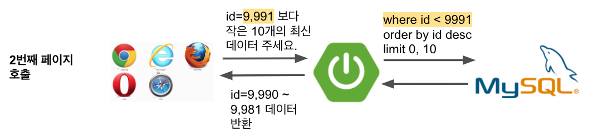
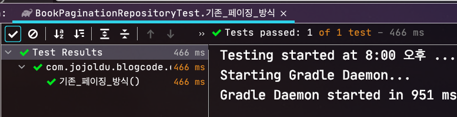
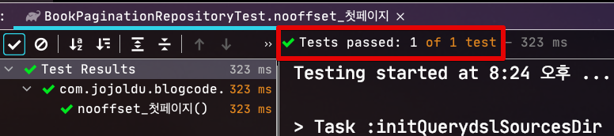
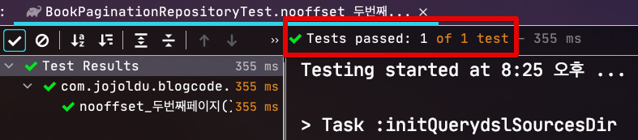

# 1. 페이징 성능 개선하기 - No Offset 사용하기

일반적인 웹 서비스에서 페이징은 아주 흔하게 사용되는 기능입니다.  
그래서 웹 백엔드 개발자분들은 기본적인 구현 방법을 다들 필수로 익히시는데요.  
다만, 그렇게 기초적인 페이징 구현 방식은 서비스가 커짐에 따라 큰 장애를 유발할 수 있는데요.  
서비스 초기에는 수천 ~ 수십만건정도로 데이터가 적어서 큰 문제가 없지만, 점차 적재된 데이터가 많아짐에 따라 페이징 기능이 수십초 ~ 수분까지 조회가 느려지는걸 경험하게 됩니다.  
  
특히 1억건이 넘는 테이블에서의 페이징은 단순히 인덱스만 태운다고해서 성능 문제가 해결되진 않습니다.  
  
그래서 이번 시간에는 일반적인 페이징 기능에서 성능을 개선하는 방법을 알아보겠습니다.  
당연하겠지만, **인덱스를 이용한 쿼리 튜닝이 되어있다**는 가정하에 진행됩니다.  
조회 쿼리의 **인덱스 사용조차 안되고 있으면 그게 최우선** 되어야합니다.

> ps 1. 페이징을 어떻게 구현하느냐에 대해서는 이미 알고 계시다는 가정하에 진행하겠습니다.  
> ps 2. 사내 기술 블로그에 기고한 [Spring Batch와 Querydsl](https://woowabros.github.io/experience/2020/02/05/springbatch-querydsl.html)와 연결됩니다.

JpaRepository를 통해서고 구현할 수 있겠지만, 이런 복잡한 쿼리에서는 [Querydsl](https://jojoldu.tistory.com/372) 혹은 Jooq와 같이 조회용 EntityFramework가 훨씬 더 유용하기 때문에 여기서는 모든 예제를 Querydsl로 진행하겠습니다.

## 1. No Offset 으로 구조 변경하기

가장 먼저 진행해볼 방법은 기존 페이징 방식에서 No Offset으로 구조를 변경하는 것입니다.  
No Offset 이란 용어가 조금 생소하실텐데요.  
  
기존의 페이징 방식이 아래와 같이 **페이지 번호** (```offset```) 와 **페이지 사이즈** (```limit```) 를 기반으로 한다면


No Offset은 아래와 같이 **페이지 번호 (offset)가 없는** 더보기 (More) 방식을 이야기 합니다.


페이스북과 같은 대량의 데이터를 다루는 **SNS의 게시글 조회 오픈 API**를 사용해보신 분들은 그와 **비슷**하다고 보시면 됩니다.  
(내부 구조를 모르기 때문에 **동일하다고 확답을 드릴순 없습니다**.)


어떤 형태인지 이해가 되신다면, **그럼 왜 이 방식이 더 빠른것인지** 궁금하실텐데요.  
한번 자세히 알아보겠습니다.

### 1-1. No Offset은 왜 빠른가?

기존에 사용 하는 페이징 쿼리는 일반적으로 다음과 같은 형태입니다.

```sql
SELECT *
FROM items
WHERE 조건문
ORDER BY id DESC
OFFSET 페이지번호
LIMIT 페이지사이즈
```

> **최신 -> 과거순**으로 조회된다는 가정하에 ```desc```가 붙었습니다.  
> 모든 예제는 최신 -> 과거순으로 가정하고 진행합니다.

이와 같은 형태의 페이징 쿼리가 뒤로갈수록 느린 이유는 결국 **앞에서 읽었던 행을 다시 읽어야 하기 때문**인데요.


예를 들어 ```offset 10000, limit 20``` 이라 하면 최종적으로 **10,020개의 행을 읽어야 합니다**.  (10,000부터 20개를 읽어야하니)  
  
그리고 이 중 앞의 10,000 개 행을 버리게 됩니다.  
(실제 필요한건 마지막 20개뿐이니)  
  
뒤로 갈수록 **버리지만 읽어야 할 행의 개수가 많아** 점점 뒤로 갈수록 느려지는 것입니다.  
  
No Offset 방식은 바로 이 부분에서 **조회 시작 부분을 인덱스로 빠르게 찾아** 매번 첫 페이지만 읽도록 하는 방식입니다.  
(클러스터 인덱스인 PK를 조회 시작 부분 조건문으로 사용했기 때문에 빠르게 조회됩니다.)

```sql
SELECT *
FROM items
WHERE 조건문
AND id < 마지막조회ID # 직전 조회 결과의 마지막 id
ORDER BY id DESC
LIMIT 페이지사이즈
```

> 클러스터 인덱스에 대해 잘 모르신다면 꼭 [이전에 작성된 포스팅](https://jojoldu.tistory.com/476)을 읽어보시길 추천드립니다.

이전에 조회된 결과를 한번에 건너뛸수 있게 마지막 조회 결과의 ID를 조건문에 사용하는 것으로 이는 **매번 이전 페이지 전체를 건너 뛸 수 있음**을 의미합니다.  
  
즉, 아무리 페이지가 뒤로 가더라도 **처음 페이지를 읽은 것과 동일한 성능**을 가지게 됩니다.

> 좀 더 상세한 내용은 [fetch-next-page](https://use-the-index-luke.com/sql/partial-results/fetch-next-page) 를 참고해주세요.

### 1-2. 구현 코드

이제 실제로 해당 페이징 기능을 구현해 볼 차례인데요.  
먼저 기존의 페이징 코드를 보겠습니다.  
  
**기존의 페이징 코드**

> 사용되는 ```book``` 엔티티의 인덱스는 ```idx_book_1(name)``` 입니다.  

```java
public List<BookPaginationDto> paginationLegacy(String name, int pageNo, int pageSize) {
    return queryFactory
            .select(Projections.fields(BookPaginationDto.class,
                    book.id.as("bookId"),
                    book.name,
                    book.bookNo))
            .from(book)
            .where(
                    book.name.like(name + "%")
            )
            .orderBy(book.id.desc()) // 최신순으로
            .limit(pageSize) // 지정된 사이즈만큼
            .offset(pageNo * pageSize) // 지정된 페이지 위치에서 
            .fetch(); // 조회
}
```

* offset은 pageNo가 사용되는 것이 아니라 **몇번째 row부터 시작할지**를 나타냅니다.
  * 즉, ```offset 10000, limit 20``` 으로 지정해야 10,000부터 20개의 데이터를 조회할 수 있습니다.
* pageNo는 0부터 시작된다고 가정한 상태입니다.
  * 1부터 시작하실 분들은 ```(pageNo - 1) * pageSize``` 을 사용하시면 됩니다.


꼭 Querydsl이 아니더라도 MyBatis 등을 이용해 SQL을 직접 작성하셔도 거의 비슷한 형태로 작성되기 때문에 큰 차이는 없습니다.  
  
자 그럼 위 페이징 코드를 NoOffset으로 변환해보겠습니다.  
먼저 NoOffset 페이징을 API로 구현된다면 다음과 같은 형태가 된다고 보시면 됩니다.




위 이미지를 Querydsl로 표현하면 다음과 같이 됩니다.  
  
**NoOffset 코드1**

```java
public List<BookPaginationDto> paginationNoOffsetBuilder(Long bookId, String name, int pageSize) {

    // 1. id < 파라미터를 첫 페이지에선 사용하지 않기 위한 동적 쿼리 
    BooleanBuilder dynamicLtId = new BooleanBuilder();

    if (bookId != null) {
        dynamicLtId.and(book.id.lt(bookId));
    }

    return queryFactory
            .select(Projections.fields(BookPaginationDto.class,
                    book.id.as("bookId"),
                    book.name,
                    book.bookNo))
            .from(book)
            .where(dynamicLtId // 동적 쿼리
                    .and(book.name.like(name + "%")))
            .orderBy(book.id.desc())
            .limit(pageSize)
            .fetch();
}
```

여기서 첫 페이지와 그 이후의 페이지를 조회할때 사용되는 쿼리가 달라 동적쿼리가 필요한데요.  
(첫 페이지를 조회할때는 기준이 되는 id 값을 알 수 없기 때문입니다.)  
  
그래서 아래와 같은 코드가 사용되었습니다.

```java
// 1. id < 파라미터를 첫 페이지에선 사용하지 않기 위한 동적 쿼리 
BooleanBuilder dynamicLtId = new BooleanBuilder();

if (bookId != null) {
    dynamicLtId.and(book.id.lt(bookId));
}
```

* 첫 페이지를 조회할때는 ```book.id.lt(bookId)``` 가 조건문에 없어야 하며
* 두번째 페이지부터는 ```book.id.lt(bookId)```가 조건문에 들어가야 합니다.

위처럼 구현하게 되면 아무래도 Querydsl로 생성되는 쿼리가 한 눈에 보이진 않습니다.  
그래서 이를 좀 더 한 눈에 볼 수 있도록 개선합니다.

**NoOffset 코드2**

```java
public List<BookPaginationDto> paginationNoOffset(Long bookId, String name, int pageSize) {

    return queryFactory
            .select(Projections.fields(BookPaginationDto.class,
                    book.id.as("bookId"),
                    book.name,
                    book.bookNo))
            .from(book)
            .where(
                    ltBookId(bookId),
                    book.name.like(name + "%")
            )
            .orderBy(book.id.desc())
            .limit(pageSize)
            .fetch();
}

private BooleanExpression ltBookId(Long bookId) {
    if (bookId == null) {
        return null; // BooleanExpression 자리에 null이 반환되면 조건문에서 자동으로 제거된다
    }

    return book.id.lt(bookId);
}
```

> Querydsl의 동적 쿼리 사용법에 대해 좀 더 자세히 알고 싶으신 분들은 [이전에 작성된 포스팅](https://jojoldu.tistory.com/394)을 참고해주세요.

자 그럼 해당 No Offset 페이징 코드가 잘 작동되는지 검증해보겠습니다.

### 1-3. 테스트 코드로 기능 검증

먼저 검증해볼 것은 기존의 페이징 기능입니다.

```java
@Test
void 기존_페이징_방식() throws Exception {
    //given
    String prefixName = "a";

    for (int i = 1; i <= 30; i++) {
        bookRepository.save(Book.builder()
                .name(prefixName +i)
                .bookNo(i)
                .build());
    }

    //when
    List<BookPaginationDto> books = bookPaginationRepository.paginationLegacy(prefixName, 1, 10); // pageNo는 0부터 시작이라 1이면 두번째 페이지 조회

    //then
    assertThat(books).hasSize(10);
    assertThat(books.get(0).getName()).isEqualTo("a20");
    assertThat(books.get(9).getName()).isEqualTo("a11");
}
```



```java
@Test
void nooffset_첫페이지() throws Exception {
    //given
    String prefixName = "a";

    for (int i = 1; i <= 30; i++) {
        bookRepository.save(Book.builder()
                .name(prefixName +i)
                .bookNo(i)
                .build());
    }

    //when
    List<BookPaginationDto> books = bookPaginationRepository.paginationNoOffset(null, prefixName, 10);

    //then
    assertThat(books).hasSize(10);
    assertThat(books.get(0).getName()).isEqualTo("a30");
    assertThat(books.get(9).getName()).isEqualTo("a21");
}
```



```java
@Test
void nooffset_두번째페이지() throws Exception {
    //given
    String prefixName = "a";

    for (int i = 1; i <= 30; i++) {
        bookRepository.save(Book.builder()
                .name(prefixName +i)
                .bookNo(i)
                .build());
    }

    //when
    List<BookPaginationDto> books = bookPaginationRepository.paginationNoOffset(21L, prefixName, 10);

    //then
    assertThat(books).hasSize(10);
    assertThat(books.get(0).getName()).isEqualTo("a20");
    assertThat(books.get(9).getName()).isEqualTo("a11");
}
```
arn:aws:sqs:ap-northeast-2:265344680944:settler-bizmoney-payment


### 1-4. 성능 비교

### 1-5. 단점

* where 기준 Key가 중복이 있을 경우
  * 이를 테면 ```group by``` 등으로 시작점으로 잡을 Key가 중복이 될 경우 정확한 결과를 반환할 수 없어서 사용할 수가 없습니다. 
* 회사 혹은 서비스 정책상 (or UX 관점에서) More 버튼형태로는 안된다고 하면 답이 없습니다.
  