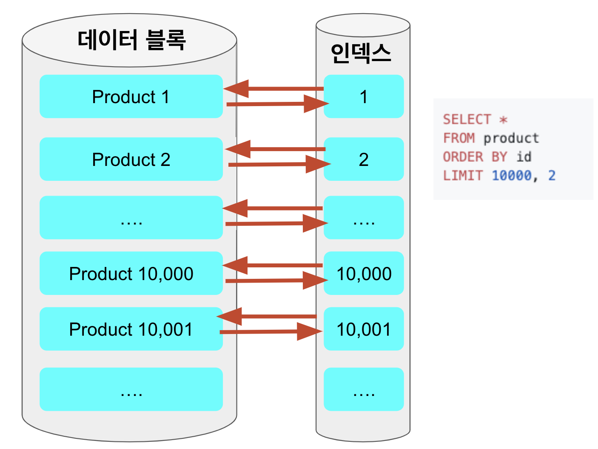

# 2. 페이징 성능 개선하기 - 커버링 인덱스 사용하기


## 2. 커버링 인덱스 사용하기

1번처럼 No Offset 방식으로 개선할 수 있다면 정말 좋겠지만, 회사 정책상 or 서비스 기획상 무조건 페이징 번호가 있어야 하는 방식이라면 사용할 순 없겠죠?  
  
이럴 경우엔 커버링 인덱스로 성능을 개선할 수 있습니다.  
  
커버링 인덱스란 **쿼리를 충족시키는 데 필요한 모든 데이터를 갖고 있는 인덱스**를 이야기합니다.  
즉, ```select, where, order by, limit, group by``` 등에서 사용되는 모든 컬럼이 **한개의 Index**안에 다 포함된 경우인데요.  
  
예를 들어 아래와 같은 페이징 쿼리를

```sql
SELECT *
FROM items
WHERE 조건문
ORDER BY id DESC
OFFSET 페이지번호
LIMIT 페이지사이즈
```

아래처럼 처리한 코드를 의미합니다.

```sql
SELECT  *
FROM  items as i
JOIN (SELECT id
        FROM items
        WHERE 조건문
        ORDER BY id DESC
        OFFSET 페이지번호
        LIMIT 페이지사이즈) as temp on temp.id = i.id
```

여기서 커버링 인덱스가 사용된 부분이 ```JOIN```에 사용된 아래 쿼리입니다.

```sql
SELECT id
FROM items
WHERE 조건문
ORDER BY id DESC
OFFSET 페이지번호
LIMIT 페이지사이즈
```

이렇게 커버링인덱스로 빠르게 걸러낸 row의 pk를 통해 실제 필요한 10개의 row를 빠르게 조회해오는 방법입니다.  
  

### 2-1. 커버링 인덱스는 왜 빠른가?

일반적으로 인덱스를 이용해 조회되는 쿼리에서 가장 큰 성능 저하를 일으키는 부분은 인덱스를 검색하고 **대상이 되는 row의 나머지 컬럼값을 데이터 블록에서 읽을 때** 입니다.  
  
기존의 쿼리는 ```order by, offset ~ limit``` 을 수행할때도 데이터 블록으로 접근을 하게 됩니다.



반대로 커버링 인덱스 방식을 이용하면, ```where, order by, offset ~ limit``` 을 인덱스 검색으로 빠르게 처리하고, 실제 **해당하는 row에 대해서만 데이터 블록에 접근**하기 때문에 성능의 이점을 얻게 됩니다.


> 이에 대한 상세한 내용은 이전에 작성된 포스팅 [커버링 인덱스 시리즈](https://jojoldu.tistory.com/476)를 참고해보시면 좋습니다.

즉, 기존의 페이징 코드에서는 **select에서 사용된 bookNo**가 인덱스 (```idx_book_1(name)```)에 포함이 안되어있어 커버링 인덱스가 될 수가 없습니다.

> id도 인덱스에 없지 않나요? 라고 질문하신다면 위에서도 언급하고 있지만 클러스터 인덱스(PK)인 id는 [모든 인덱스에 자동 포함](https://jojoldu.tistory.com/476)됩니다.

```java
public List<BookPaginationDto> paginationLegacy(String name, int pageNo, int pageSize) {
    return queryFactory
            .select(Projections.fields(BookPaginationDto.class,
                    book.id.as("bookId"),
                    book.name,
                    book.bookNo))
            .from(book)
            .where(
                    book.name.like("%" + name + "%")
            )
            .orderBy(book.id.desc())
            .limit(pageSize)
            .offset(pageNo * pageSize)
            .fetch();
}
```
### 2-2. 구현 코드


### 2-3. 성능 비교

### 2-4. 단점