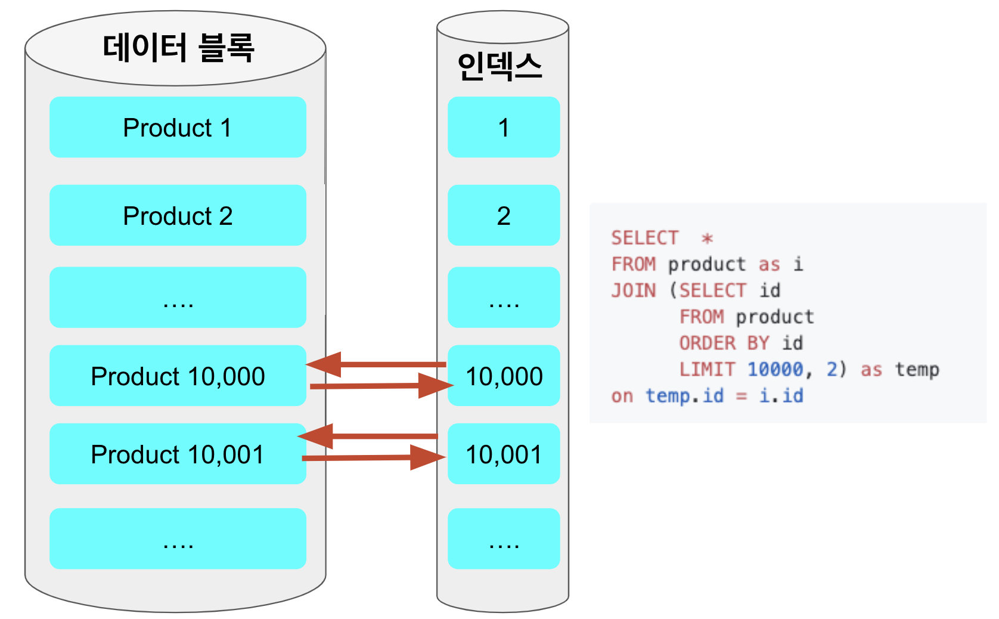
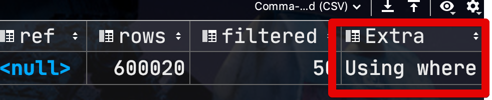
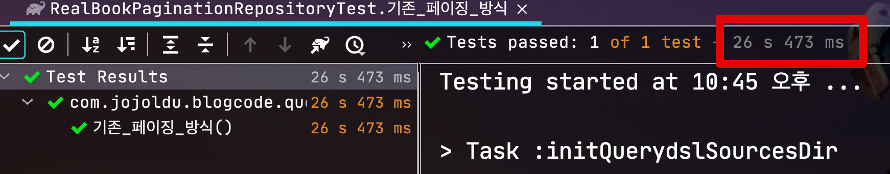
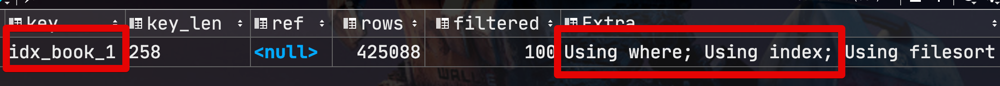
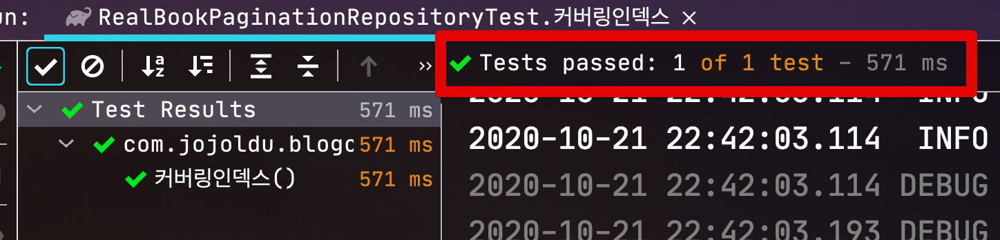
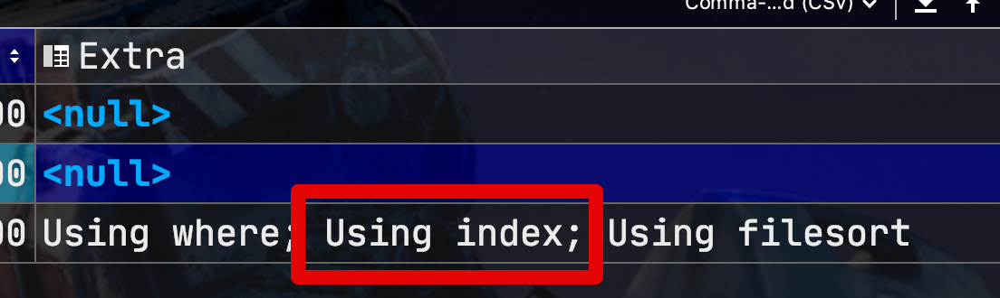
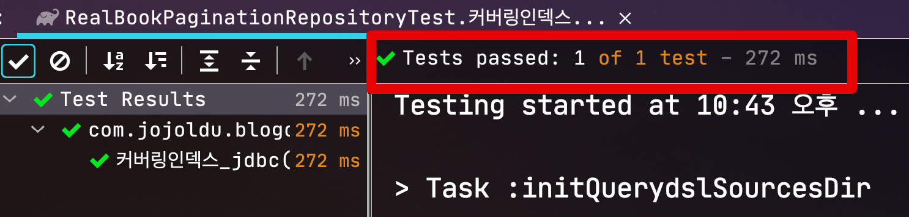

# 2. 페이징 성능 개선하기 - 커버링 인덱스 사용하기

## 2. 커버링 인덱스 사용하기

앞서 [1번글](https://jojoldu.tistory.com/528) 처럼 No Offset 방식으로 개선할 수 있다면 정말 좋겠지만, NoOffset 페이징을 사용할 수 없는 상황이라면 **커버링 인덱스**로 성능을 개선할 수 있습니다.  
  
커버링 인덱스란 **쿼리를 충족시키는 데 필요한 모든 데이터를 갖고 있는 인덱스**를 이야기합니다.  
  
즉, ```select, where, order by, limit, group by``` 등에서 **사용되는 모든 컬럼이 Index 컬럼**안에 다 포함된 경우인데요.  
  
여기서 하나의 의문이 드는 것은 ```select```절까지 포함하게 되면 너무 많은 컬럼이 인덱스에 포함되지 않겠냐는 것인데요.  
그래서 실제로 커버링 인덱스를 태우는 부분은 **select를 제외한 나머지**만 우선으로 수행합니다.  
  
예를 들어 아래와 같은 페이징 쿼리를

```sql
SELECT *
FROM items
WHERE 조건문
ORDER BY id DESC
OFFSET 페이지번호
LIMIT 페이지사이즈
```

아래처럼 처리한 코드를 이야기합니다.

```sql
SELECT  *
FROM  items as i
JOIN (SELECT id
        FROM items
        WHERE 조건문
        ORDER BY id DESC
        OFFSET 페이지번호
        LIMIT 페이지사이즈) as temp on temp.id = i.id
```

위 쿼리에서 커버링 인덱스가 사용된 부분이 ```JOIN```에 있는 쿼리입니다.  
(아래 쿼리입니다.)

```sql
SELECT id
FROM items
WHERE 조건문
ORDER BY id DESC
OFFSET 페이지번호
LIMIT 페이지사이즈
```

select절을 비롯해 order by, where 등 쿼리 내 모든 항목이 **인덱스 컬럼으로만** 이루어지게 하여 **인덱스 내부에서 쿼리가 완성**될 수 있도록 하는 방식인데요.  
이렇게 커버링 인덱스로 빠르게 걸러낸 row의 id를 통해 **실제 select 절의 항목들을 빠르게 조회**해오는 방법입니다.  
  
### 2-1. 커버링 인덱스는 왜 빠른가?

일반적으로 인덱스를 이용해 조회되는 쿼리에서 가장 큰 성능 저하를 일으키는 부분은 인덱스를 검색하고 **대상이 되는 row의 나머지 컬럼값을 데이터 블록에서 읽을 때** 입니다.  
  
> 페이징 쿼리와 무관하게 **인덱스를 탔음에도 느린 쿼리**의 경우 이 select절 항목 때문입니다.  

이를테면 커버링 인덱스를 태우지 않은 일반적인 조회 쿼리는 ```order by, offset ~ limit``` 을 수행할때도 데이터 블록으로 접근을 하게 됩니다.


반대로 커버링 인덱스 방식을 이용하면, ```where, order by, offset ~ limit``` 을 **인덱스 검색**으로 빠르게 처리하고, 이미 **다 걸러진 10개의 row에 대해서만** 데이터 블록에 접근하기 때문에 성능의 이점을 얻게 됩니다.



> ```select, where, order by, group by, having``` 등에 사용되는 컬럼에 대한 커버링 인덱스의 적용 방식은 이전에 작성된 커버링 인덱스 시리즈를 참고하시면 좋습니다.
> [1. 커버링 인덱스 (기본 지식 / WHERE / GROUP BY)](https://jojoldu.tistory.com/476)  
> [2. 커버링 인덱스 (WHERE + ORDER BY / GROUP BY + ORDER BY )](https://jojoldu.tistory.com/481)

예를 들어 앞서 1번에서 사용된 기존의 페이징 쿼리는

```sql
select id, book_no, book_type, name
from book
where name like '200%'
order by id desc
limit 10 offset 10000;
```

select에서 사용된 **book_no, book_type**이 인덱스 (```idx_book_1(name)```)에 포함되지 않기 때문에 커버링 인덱스가 될 수가 없습니다.

> id도 인덱스에 없지 않나요? 라고 질문하신다면 앞 글에서도 언급하고 있지만 클러스터 인덱스(PK)인 id는 [모든 인덱스에 자동 포함](https://jojoldu.tistory.com/476)됩니다.

그래서 쿼리에서 오래걸리는 페이징 작업까지는 커버링 인덱스로 빠르게 처리후, 마지막 필요한 컬럼들만 별도로 가져오는 형태를 사용합니다.

### 2-2. 구현 코드

자 그럼 이제 한번 실제로 코드를 구현해볼텐데요.  
이는 2가지 버전으로 보여드리겠습니다.  

#### Querydsl-JPA

먼저 querydsl-jpa에서 커버링 인덱스를 사용해야 한다면 **2개의 쿼리로 분리**해서 진행할 수 밖에 없습니다.  
이유는 Querydsl-jpa에서는 **from절의 서브쿼리를 지원하지 않기 때문**인데요.  

> [JPQL자체에서 지원하지 않습니다.](https://github.com/querydsl/querydsl/issues/2185)

그래서 이를 우회할 수 있는 방법으로 소개드립니다.

* 커버링 인덱스를 활용해 조회 대상의 PK를 조회
* 해당 PK로 필요한 컬럼항목들 조회

Querydsl-jpa로 구현하면 다음과 같습니다.

```java
public List<BookPaginationDto> paginationCoveringIndex(String name, int pageNo, int pageSize) {
        // 1) 커버링 인덱스로 대상 조회
        List<Long> ids = queryFactory
                .select(book.id)
                .from(book)
                .where(book.name.like(name + "%"))
                .orderBy(book.id.desc())
                .limit(pageSize)
                .offset(pageNo * pageSize)
                .fetch();

        // 1-1) 대상이 없을 경우 추가 쿼리 수행 할 필요 없이 바로 반환
        if (CollectionUtils.isEmpty(ids)) {
            return new ArrayList<>();
        }

        // 2)
        return queryFactory
                .select(Projections.fields(BookPaginationDto.class,
                        book.id.as("bookId"),
                        book.name,
                        book.bookNo,
                        book.bookType))
                .from(book)
                .where(book.id.in(ids))
                .orderBy(book.id.desc())
                .fetch(); // where in id만 있어 결과 정렬이 보장되지 않는다.
}
```

(1) ```select```에는 ```id```만 포함하여 커버링 인덱스를 활용해 빠르게 조회

(1-1) 조회 결과 id가 없으면 빈값 반환

* querydsl 특성상 ```in```에 Empty List가 들어가게 되면 오류가 발생 하는 것을 방지
* 불필요하게 추가 쿼리 발생하는 것을 방지
 
(2) 1의 결과로 발생한 id로 실제 select절 조회

* ```where id in ()``` 밖에 없기 때문에 정렬 된 상태로 조회 되지 않으므로 ```.orderBy(book.id.desc())```를 추가

아무래도 한번의 쿼리로 해결하지 못하다보니 조금 번잡한 느낌은 듭니다.

#### JdbcTemplate

두번째로 jdbcTemplate을 이용하여 문자열 쿼리를 직접 사용하는 방식인데요.  
이렇게 진행하시게 되면 querydsl-jpa를 쓸때처럼 쿼리르 분리할 필요 없이, 커버링 인덱스를 ```from```절에 그대로 사용하시면 됩니다.

```java
public List<BookPaginationDto> paginationCoveringIndexSql(String name, int pageNo, int pageSize) {
String query =
        "SELECT i.id, book_no, book_type, name " +
        "FROM book as i " +
        "JOIN (SELECT id " +
        "       FROM book " +
        "       WHERE name LIKE '?%' " +
        "       ORDER BY id DESC " +
        "       LIMIT ? " +
        "       OFFSET ?) as temp on temp.id = i.id";

return jdbcTemplate
        .query(query, new BeanPropertyRowMapper<>(BookPaginationDto.class),
                name,
                pageSize,
                pageNo * pageSize);
}
```

> 다만 jdbcTemplate를 이용한 방식은 querydsl이 갖고 있는 컴파일체크/자동완성 등 장점이 완전히 사라지기 때문에 개인적으로 선호하진 않습니다.

### 2-3. 성능 비교

자 그럼 이렇게 개선된 방식으로는 성능이 얼마나 좋아질까요?  
실행 계획과 함께 비교해보겠습니다.
아래와 같은 환경에서 비교를 해봅니다.

* 테스트 DB
    * AWS RDS Aurora MySQL r5.large
* 테스트 테이블
    * 1억 row
    * 5개 컬럼

#### 기존 페이징

먼저 기존의 페이징방식입니다.

> 1편과 동일합니다.

```java
@Test
void 기존_페이징_방식() throws Exception {
        //given
        String name = "200";

        //when
        List<BookPaginationDto> books = bookPaginationRepository.paginationLegacy(name, 10_000, 10);

        //then
        assertThat(books).hasSize(10);
}
```





실제 수행 시간은 **26.47초** 입니다.

#### Querydsl 커버링 인덱스

2번째는 **커버링 인덱스로 pk조회 & 컬럼 조회**로 이루어지는 Querydsl 입니다.

```java
@Test
void 커버링인덱스() throws Exception {
        //given
        String name = "200";

        //when
        List<BookPaginationDto> books = bookPaginationRepository.paginationCoveringIndex(name, 1, 10);

        //then
        assertThat(books).hasSize(10);
}
```





앞서 기존 방식에 비해 말도 안되게 개선된 **0.57초** 입니다.

#### JdbcTemplate 커버링 인덱스

마지막으로 한번의 쿼리로 수행되는 JdbcTemplate 방식입니다.  

```java
@Test
void 커버링인덱스_jdbc() throws Exception {
        //given
        String name = "200";

        //when
        List<BookPaginationDto> books = bookPaginationRepository.paginationCoveringIndexSql(name, 1, 10);

        //then
        assertThat(books).hasSize(10);
}
```





마찬가지로 앞서 기존 방식에 비해 말도 안되게 개선된 **0.27초** 입니다.  
  
즉, Querydsl을 이용한 방식이나 JdbcTemplate을 이용한 방식 모두다 기존 페이징 방식에 비해 엄청나게 개선된 성능을 자랑하는 것을 확인할 수 있습니다.

### 2-4. 단점

커버링 인덱스 방식은 일반적인 페이징 방식에서는 거의 대부분 적용할 수 있는 효과적인 개선 방법인 것을 확인하였는데요.  
No Offset 방식처럼 UX의 변경 등이 필요하지도 않다보니 단점이 없어보이지만 실제로는 몇개의 단점이 있습니다.

* 너무 많은 인덱스가 필요하다
  * 결국 쿼리의 모든 항목이 인덱스에 포함되어야하기 때문에 느린 쿼리가 발생할때마다 인덱스가 신규 생성될 수도 있다.
* 인덱스 크기가 너무 커진다
  * 인덱스도 결국 데이터이기 때문에 너무 많은 항목이 들어가면 성능 상 이슈가 발생할 수 밖에 없는데, ```where```절에 필요한 컬럼외에도 ```order by, group by, having``` 등에 들어가는 컬럼들까지 인덱스에 들어가게 되면 인덱스 크기가 너무 비대해진다.
* 데이터 양이 많아지고, 페이지 번호가 뒤로 갈수록 NoOffset에 비해 느리다.
  * NoOffset과 동일한 데이터 조회시 커버링 인덱스 방식은 272ms, No Offset은 83ms
  * 테이블 사이즈가 계속 커지면 No Offset 방식에 비해서는 성능 차이가 발생

대부분의 페이징 쿼리는 No Offset과 커버링 인덱스로 최적화가 됩니다.  
여기서 추가적으로 개선할 방법이 없는지!  
다음 시간에 알아보겠습니다 :)