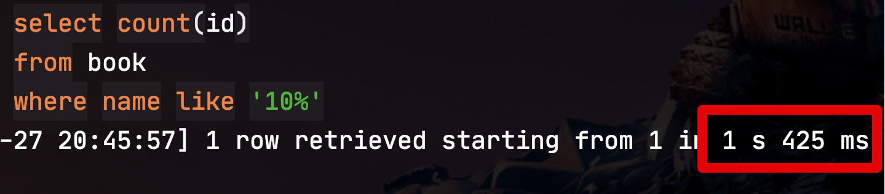

# 3. 페이징 성능 개선하기 - Count 쿼리 최소화하기 

## 3. Count 쿼리 최소화하기

앞서 포스팅에서 실질 페이징 쿼리 성능을 올리는 방법들을 소개 드렸는데요.

* [1. 페이징 성능 개선하기 - No Offset 사용하기](https://jojoldu.tistory.com/528)
* [2. 페이징 성능 개선하기 - 커버링 인덱스 사용하기](https://jojoldu.tistory.com/529)

페이징 기능을 구현하는데 있어, 페이징 쿼리 자체를 개선하는 것도 방법이지만 **그 외 다른 기능을 개선하는 방법**도 함께할 수 있습니다.  
  
여기서 말하는 그 외 기능은 바로 **count 쿼리**입니다.  
일반적인 페이징 기능에 있어 데이터 조회와 함께 매번 함께 수행되는 것이 바로 count 쿼리인데요.  
해당 조건으로 조회되는 총 건수를 알아야만 아래와 같이 pageNo들을 노출시킬 수 있기 때문입니다.  
(총 건수 / pageSize)


> 당연히 [No Offset](https://jojoldu.tistory.com/528)을 사용한다면 사용되지 않는 쿼리입니다.

여기서 count 쿼리에 대해 크게 생각하지 않으시는 분들도 계시는데요.  
(조회 건수에 따라 차이가 나지만) 실제 **데이터 조회만큼 오래 걸리기도** 합니다.  
  
이유는 총 몇건인지 확인하기 위해 **전체를 확인**해야하기 때문입니다.  
  
데이터 조회는 ```limit 10``` 등으로 지정된 사이즈만큼 읽고 나서는 더이상 읽지 않아도 되지만, ```count```는 끝까지 읽어서 몇 건인지 확인해야하기 때문에 페이징 쿼리의 성능 이슈 중 하나가 됩니다.  
  


(어떤 조회 환경에서는 **count 쿼리만 10초**가 걸리기도 합니다.)  
  


(이렇게 단순한 쿼리도 1억건 이상일 경우 1초 이상 수행되기도 합니다.)

그래서 이 문제를 개선할 수 있는 방법은 크게 2가지가 있습니다.  

1. 검색 버튼사용시 count 고정값 쓰기
2. 첫 페이지 조회 결과 cache 하기

하나씩 알아보겠습니다.  

### 3-1. 검색 버튼사용 count 고정값 쓰기

구글 검색을 이용해보신 분들은 간혹 경험하실텐데요.  
처음 검색 버튼을 클릭 했을때는 6페이지 혹은 10페이지로 보던 검색 결과가 


실제 페이지 버튼을 클릭해서 넘어가면 페이지 결과가 줄어드는 것을 볼 수 있는데요.


여기에서 컨셉을 참고할 수 있는데요.  
  
**굳이 사용율이 떨어지는 페이지 버튼을 위해 매번 전체 count 쿼리가 수행될 필요가 없다**를 적용해볼 수 있습니다.

> 실제로 구글의 검색 페이지 결과가 어떻게 구현되어있는지는 알 수 없기 때문에 **컨셉만 참고**했다는 것을 말씀드립니다.  
> 구글 같이 엄청나게 방대한 데이터를 적재해서 제공하는 서비스에서 이렇게 단순한 RDBMS 를 사용하진 않을테니 "구글이 이렇게 하더라" 라고 생각하시면 안됩니다.

즉, 다음과 같은 상황에서 이 방법을 고려해보시면 좋습니다.

* 대부분의 조회 요청이 **검색 버튼 클릭** (즉, 첫 조회)에서 발생하고
* 페이지 버튼을 통한 조회 요청이 소수일 경우

이럴 경우 검색 버튼 클릭에 한해서 **Page 수를 고정**하는 것 입니다.  
  
즉, 다음 페이지로 이동하기 위해 페이지 버튼을 클릭했을때만 실제 페이지 count 쿼리를 발생시켜 정확한 페이지수를 사용하고, 대부분의 요청이 발생하는 **첫 조회시에는 count 쿼리를 발생시키지 않는 것** 입니다.


```java
public Page<BookPaginationDto> paginationCount(Pageable pageable, String name) {
    JPQLQuery<BookPaginationDto> query = Objects.requireNonNull(getQuerydsl()).applyPagination(pageable,
            queryFactory
            .select(Projections.fields(BookPaginationDto.class,
                    book.id.as("bookId"),
                    book.name,
                    book.bookNo,
                    book.bookType
            ))
            .from(book)
            .where(
                    book.name.like(name + "%")
            )
            .orderBy(book.id.desc()));

    List<BookPaginationDto> items = query.fetch(); // 데이터 조회
    long totalCount = query.fetchCount(); // 전체 count
    return new PageImpl<>(items, pageable, totalCount);
}
```

#### 테스트코드

```java
@Test
void 검색버튼사용시_10개_페이지_건수가_리턴된다() throws Exception {
    PageRequest pageRequest = PageRequest.of(1, 10);
    boolean useSearchBtn = true;
    Page<BookPaginationDto> page = bookPaginationRepositorySupport.paginationCountSearchBtn(useSearchBtn, pageRequest, prefixName);

    //then
    assertThat(page.getTotalElements()).isEqualTo(100); // 10 (pageCount) * 10 (pageSize)
}
```

```java
@Test
void 페이지버튼사용시_실제_페이지_건수가_리턴된다() throws Exception {
    PageRequest pageRequest = PageRequest.of(1, 10);
    boolean useSearchBtn = false;
    Page<BookPaginationDto> page = bookPaginationRepositorySupport.paginationCountSearchBtn(useSearchBtn, pageRequest, prefixName);

    //then
    assertThat(page.getTotalElements()).isEqualTo(30);
}
```

### 3-2. 첫 페이지 조회 결과 cache 하기

* 검색버튼을 이용한 조회와 페이지 버튼을 이용한 조회 요청이 골고루 분포된 경우
* 실시간으로 수정/삭제/추가되는 데이터가 아니라 마감된 데이터를 사용하는 경우

#### 구조


> [이미지 원작자](https://woowabros.github.io/experience/2020/03/02/pilot-project-wbluke.html)님께 사용을 허락 받고 사용하였습니다. :) (다시한번 감사드립니다!)


#### 테스트 코드

```java
@Test
void cache된_pageCount를_사용한다() throws Exception {
    PageRequest pageRequest = PageRequest.of(1, 10);
    Long cachedCount = 100L;
    Page<BookPaginationDto> page = bookPaginationRepositorySupport.paginationCountCache(cachedCount, pageRequest, prefixName);

    //then
    assertThat(page.getTotalElements()).isEqualTo(cachedCount);
}
```

```java
@Test
void cache가_없으면_실제값을_사용한다() throws Exception {
    PageRequest pageRequest = PageRequest.of(1, 10);
    Long cachedCount = null;
    Page<BookPaginationDto> page = bookPaginationRepositorySupport.paginationCountCache(cachedCount, pageRequest, prefixName);

    //then
    assertThat(page.getTotalElements()).isEqualTo(30);
}
```

### 3-3. 단점

* 실시간으로 데이터 수정이 필요해 페이지 버튼 반영이 필요한 경우 사용할 수 없습니다.
  * 결국 새로고침 (or 버튼 클릭을 통한 페이지 이동) 하기 전까지는 페이지 버튼들이 계속 그대로 유지 되기 때문에 실시간성이 떨어집니다.
  * 마감된 데이터 혹은 실시간을 유지할 필요 없을 경우에만 사용할 수 있습니다.

