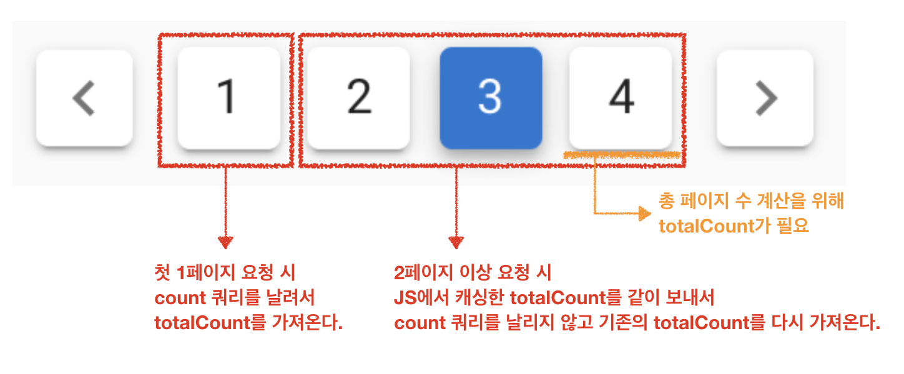

# 3. 페이징 성능 개선하기 - Count 쿼리 최소화하기 

## 3-2. 첫 페이지 조회 결과 cache 하기

> 모든 코드는 [Github](https://github.com/jojoldu/blog-code/blob/master/spring-boot-querydsl/src/main/java/com/jojoldu/blogcode/querydsl/domain/book/pagination/BookPaginationRepositorySupport.java)에 있습니다.


* 검색버튼을 이용한 조회와 페이지 버튼을 이용한 조회 요청이 골고루 분포된 경우
* 실시간으로 수정/삭제/추가되는 데이터가 아니라 마감된 데이터를 사용하는 경우

#### 구조



> [이미지 원작자](https://woowabros.github.io/experience/2020/03/02/pilot-project-wbluke.html)님께 사용을 허락 받고 사용하였습니다. :) (다시한번 감사드립니다!)


#### 테스트 코드

```java
@Test
void cache된_pageCount를_사용한다() throws Exception {
    PageRequest pageRequest = PageRequest.of(1, 10);
    Long cachedCount = 100L;
    Page<BookPaginationDto> page = bookPaginationRepositorySupport.paginationCountCache(cachedCount, pageRequest, prefixName);

    //then
    assertThat(page.getTotalElements()).isEqualTo(cachedCount);
}
```

```java
@Test
void cache가_없으면_실제값을_사용한다() throws Exception {
    PageRequest pageRequest = PageRequest.of(1, 10);
    Long cachedCount = null;
    Page<BookPaginationDto> page = bookPaginationRepositorySupport.paginationCountCache(cachedCount, pageRequest, prefixName);

    //then
    assertThat(page.getTotalElements()).isEqualTo(30);
}
```

### 3-3. 단점

* 실시간으로 데이터 수정이 필요해 페이지 버튼 반영이 필요한 경우 사용할 수 없습니다.
  * 결국 새로고침 (or 버튼 클릭을 통한 페이지 이동) 하기 전까지는 페이지 버튼들이 계속 그대로 유지 되기 때문에 실시간성이 떨어집니다.
  * 마감된 데이터 혹은 실시간을 유지할 필요 없을 경우에만 사용할 수 있습니다.

